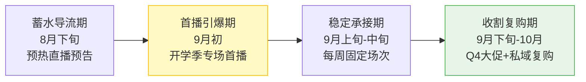
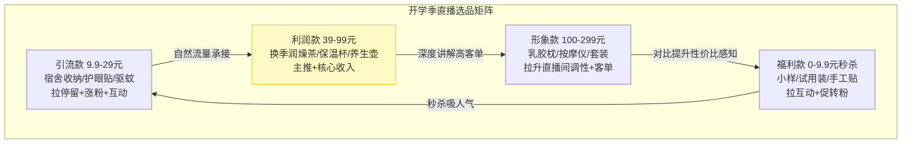
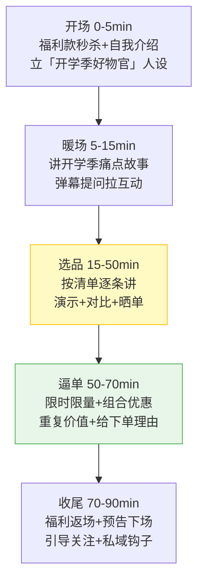
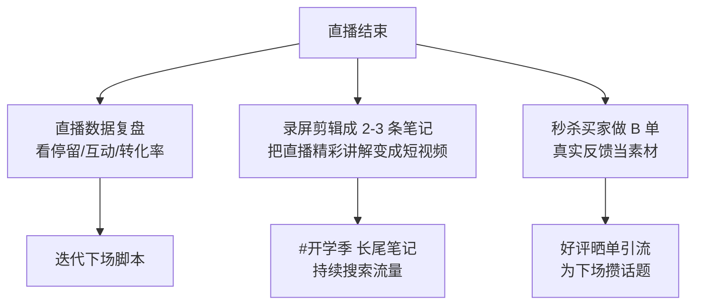
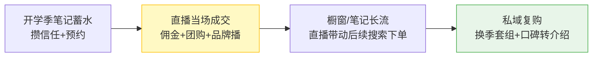

# Day37: 开学季直播带货实战——把9月第二波流量当着用户的面变现

> 📅 学习日期：2026-08-04
> 🔗 关联笔记：[[00-目录]] | 上一篇：[[Day36-开学季选题库与内容排期]] | 下一篇：Day38
> 🎯 适用场景：「反生活」好物养生账号在9月开学季，把暑期沉淀的粉丝信任和开学季选题库的流量，用一场场直播「当着用户的面」当场变现——不用等笔记慢慢爬坡，直播是「播种后立刻收割」最快的现金入口
> 📚 学习来源：Day25小红书直播带货实战（承接人货场框架） × 开学季选题库（承接[[Day36-开学季选题库与内容排期]]） × 蒲公英/佣金带货（承接[[Day29-小红书蒲公英平台与品牌合作变现]]） × 好物推荐爆款公式（承接[[Day32-好物推荐内容爆款公式与转化设计]]） × 私域沉淀（承接[[Day35-暑期复盘与开学季衔接]]）

---

## 1. 一句话总结

**开学季直播带货 = 把开学季选题库里已经验证过的「痛点清单」，用「直播+挂链接」的形式当着粉丝的面一次性变现——笔记负责在信息流里「种草和攒信任」，直播负责把信任「掰开揉碎喂到嘴边、当场下单」，两者的关系是「笔记蓄水、直播放水、橱窗长流、私域复购」。**

**核心认知：** 很多讲直播的课只讲「人货场」这套通用的东西（Day25 已经讲过），但真正拉开开学季差距的，是「**怎么把直播间跟开学季这个特定流量窗口狠狠绑在一起**」——宿舍、返校、换季、新生这几波人，情绪和购买欲都在 9 月集中爆发，但转瞬即逝。**笔记是「细水长流」，直播是「短跑冲刺」：开学季一到，算法给账号曝光和直播推荐都在加码，这时候谁先开播、谁把开学季痛点讲得越准、谁的下单路径越短，谁就先一步把钱拿到手。** 反生活好物的养生品类客单不算低、信任要求高，「直播吵架式促销」反而不行，要靠「开学季的话题场景 + 真诚讲解 + 稳稳的下单钩子」来成交。

---

## 2. 核心框架

### 2.1 开学季直播带货「四段作战模型」

不是「开播就卖货」，而是按开学季时间轴上粉丝所处阶段递进：



| 阶段 | 时间 | 直播目标 | 核心动作 |
|:----:|:----:|:--------|:--------|
| 蓄水导流 | 8月下旬 | 预约开播、养账号权重 | 笔记预告「哪天晚上首播 + 开学季福利」，引导收藏/预约 |
| 首播引爆 | 9月初 | 单场冲出单量 | 开学季宿舍/换季/新生专场，福利款拉热度 |
| 稳定承接 | 9月上中旬 | 形成固定观看习惯 | 每周固定「周四晚养生+周日好物」，做常青直播间 |
| 收割复购 | 9月下旬 | 拉升客单、做私域 | 换季养护套组、把买家沉淀进私域复购 |

### 2.2 开学季直播选品「四象限」模型（承接 Day25）

Day25 讲过引流款/利润款/形象款/福利款，这里把它套到开学季场景：



> **给「反生活」的关键**：开学季这波人的核心痛点是「**宿舍幸福感**」「**换季不生病**」「**新生避坑省预算**」。选品就围绕这三条痛点线展开，别贪多——一场直播就「一条清单线 + 3-5 个重点款」，讲透比铺开强。

### 2.3 开学季直播「脚本 → 转化」五步漏斗

每场直播 60-90 分钟，照这个节奏走，避免「对着空气讲」：



---

## 3. 可落地方法

### 3.1 【反生活可直接用】首播前 7 天「蓄水导流预案」

**核心原则：首播成败 60% 取决于开播前的预约量和预告铺垫，而不是直播当天。** 小红书对「有预约、有预热」的直播间会给更多推荐位。

| 倒计时 | 动作 | 工具/方法 |
|:----:|------|----------|
| D-7 | 发布「开学季首播预告」笔记，写明时间/主题/福利 | 沿用[[Day36-开学季选题库与内容排期]]里的选题 + [[Day33-视觉体系设计]]封面 |
| D-5 | 评论区/私域预告「首播 3 重福利」 | 承接[[Day26-自媒体评论区运营与用户互动增长策略]] |
| D-3 | 发布「开学季好物清单抢先看」预告片，引导到主页预约 | 一鱼多吃：把清单笔记改造成预告 |
| D-1 | 私域发开播提醒 + 固定时间「明晚 8 点」 | 承接[[Day35-暑期复盘与开学季衔接]]的私域沉淀 |
| D-0 | 开播前 1 小时连发 2 条「马上开播」动态引流 | 手动或半自动 |

### 3.2 【反生活可直接用】开学季首播「90 分钟脚本模板」

把它当「提词清单」，照着走即可：

```
【开场 0-5min】
  大家好，我是反生活，今天是你开学季的「宿舍好物+换季养生急救站」
  先上福利款秒杀：XXX（9.9元），前20名下单再送小样
  ✅ 目的：用福利款让弹幕先炸起来，留住人

【暖场 5-15min】
  提问：刚回宿舍，最想解决的一个问题是什么？（收纳/鼻塞/熬夜/起痘）
  挑 2-3 条弹幕回复，引出今天要讲的开学季三条痛点线
  ✅ 目的：摸清直播间人群，为选品讲解做铺垫

【选品 15-50min 核心段】
  按清单线逐条讲：宿舍幸福感 → 换季不生病 → 新生避坑省预算
  每款：①解决的痛点 ②怎么用 ③为什么选它 ④价格/优惠
  现场演示（试喝/试用/对比），贵重款晒质检/成分/用户反馈
  ✅ 目的：把「讲品」变成「解决问题」，建立信任

【逼单 50-70min】
  组合优惠：宿舍三件套 + 换季茶 = 省 X 元，限今天
  倒计时：还剩 X 单/ X 分钟，拍完下架
  重复一句价值锚点：「这波开学季价格，之后大概率没有」
  ✅ 目的：给「想买但犹豫」的人一个即时下单理由

【收尾 70-90min】
  福利返场：再上 1 次引流款 + 感谢弹幕抽 1 位免单
  预告下场：「下周四晚 8 点，讲换季养生全套方案」
  引导：点关注 + 进粉丝群/私域领「开学季清单 PDF」
  ✅ 目的：留存转化到下一场 + 沉淀私域，形成复购循环
```

### 3.3 【反生活可直接用】三句话逼单话术库（开学季场景）

直播转化的钥匙是话术，尤其是「给当下一个下单理由」：

| 场景 | 话术 |
|:----|:-----|
| 犹豫「再想想」 | 「开学季这波是平台给的团购价，过了这村，宿舍里可就买不到这价了」 |
| 觉得贵 | 「一次工位/宿舍的舍得，换来整个换季不往医院跑，这笔账不亏」 |
| 怕买错 | 「今天下单明天宿舍就能用上，不合适 7 天无理由，你把心放宽」 |
| 想等下次 | 「首播福利只此一场，下次直播就是这个开学季尾单了」 |

### 3.4 【反生活可直接用】直播后 24 小时「冷热复用」

直播不是播完就完，48 小时内把直播素材二次变现：



> **关键认知**：直播录屏剪出来的笔记，比很多拍的笔记转化还高——因为里面有真实的讲解和真实的商品展示，正是[[Day32-好物推荐内容爆款公式与转化设计]]里说的「真实感」是转化密码。

---

## 4. 变现路径

### 4.1 开学季直播如何变成钱（四层变现漏斗）



- **第 1 层·当场成交**：直播间里挂的佣金链接 + 小红书团购/秒杀，是直播的「直接现金」
- **第 2 层·直播放大**：一次直播 = 上百条笔记的转化效率，粉丝当场下单、当场体验
- **第 3 层·长尾**：直播讲解被录屏剪成笔记 → 持续带上链接，笔记长流 + 搜索流量
- **第 4 层·私域复购**：直播观众沉淀进粉丝群 → 换季套组、口碑转介绍、下场直播预告直达

### 4.2 开学季直播收入预估（承接 Day31/Day34 爬坡模型）

| 阶段 | 时间 | 粉丝区间 | 单场 GMV | 月收入预估 | 关键动作 |
|:----:|:----:|:--------:|:--------:|:----------:|----------|
| 首播期 | 9月初 | 1500-2500 | ¥500-1500 | ¥1000-3000 | 首播福利款拉人气，佣金为主 |
| 稳定期 | 9月上中旬 | 2500-4000 | ¥1000-3000 | ¥3000-8000 | 每周2场，利润款+组合，品牌播洽谈 |
| 收割期 | 9月下旬 | 4000-6000 | ¥2000-5000 | ¥8000-15000 | 换季养护套组+Q4蓄势+私域复购 |

> **给「反生活」的核心提示**：直播的收入是「阶梯跃升」而非「匀速增长」——首播可能只有几百块，但只要你把固定场次跑顺，第二三周会明显翻倍。**别因为首播没爆就放弃，直播拼的是「稳定开播的复利」，开学季窗口足够让你把场次和话术都磨熟。**

### 4.3 「直播 + 私域」把一次性买家变成反复复购的忠实粉

开学季直播最大的价值不只是当场那笔钱，而是把「买了一单的粉丝」沉淀成「换季都要来找你」的老粉：

```
首播下单的粉丝
  ↓ 引导进粉丝群/私域（领开学季清单PDF）
  ↓ 换季提醒/新产品预告直接触达
  ↓ 下场直播专场预告 → 回来复购
  ↓ 满意 → 转介绍家人同事 → 口碑裂变
```

---

## 5. 行动清单

### ✅ 行动①：排定开学季首播场次与前 7 天预告节奏（今天做）

**步骤1（10分钟）：** 在 9 月初（承接[[Day36-开学季选题库与内容排期]]的冲量期）圈定首播日期，建议选周四或周日晚 8 点（照顾学生党和打工人的空闲时间）。

**步骤2（10分钟）：** 拉出首播前的 7 天预告节奏（对齐 3.1 节倒计时表），把「预告笔记/私域提醒/主页预约」都排进日历。

**步骤3（5分钟）：** 把开学季三条痛点线（宿舍幸福感/换季不生病/新生避坑省预算）配上各自的引流款、利润款、形象款、福利款，落成选品清单。

> **产出：** ✅ 一张「首播作战日历」+ 一张「开学季选品四象限表」，开播前心里有底不慌。

### ✅ 行动②：套用 90 分钟首播脚本，把三条痛点线各讲透一款（今天做）

**步骤1（15分钟）：** 打开 3.2 节的脚本模板，把每段的「具体品 + 具体话术」填进去，替换成自己的真实选品。

**步骤2（15分钟）：** 给利润款写「价值锚点话术」（对齐 3.3 逼单话术库），准备现场演示说辞（试用/对比/晒成分）。

**步骤3（10分钟）：** 提前把脚本打印或贴在显眼处，并熟悉 4 款商品的优惠和秒杀规则，避免直播时卡壳。

> **产出：** ✅ 一份可以直接照着播的「开学季首播 90 分钟提词脚本」。

### ✅ 行动③：亲手开一场「测试直播」，把流程跑通一遍（本周内做）

**步骤1（10分钟）：** 在真正首播前，先开一场 15-20 分钟的「测试直播」——不挂货或只挂 1 个品，重点是跑通「开播→出链接→挂商品→切换讲解→收尾」的完整操作（对齐[[Day25-小红书直播带货实战]]的设备与操作细节）。

**步骤2（10分钟）：** 测灯光、麦克风、网络、摄像头角度，确认画面和声音没问题。

**步骤3（5分钟）：** 记录测试场被挡住/不顺手的地方，在正式首播前修好——直播最忌的就是「正式场才发现设备没调好」。

> **产出：** ✅ 一趟跑通的完整直播流程 + 一份「设备避坑清单」，让首播当天零事故。

---

## 📊 今日学习总结

| 维度 | 内容 |
|:----:|------|
| 核心认知 | 笔记蓄水、直播放水——开学季直播是把选题库攒的流量当场变现的短跑冲刺，靠稳定开播的复利跃升收入 |
| 核心框架 | 蓄水/首播/稳定/收割四段模型 + 开学季选品四象限 + 90分钟脚本五步漏斗 + 直播后24小时冷热复用 |
| 关键技能 | 首播前7天蓄水预案、90分钟提词脚本、三句话逼单话术库、直播后录屏二次变现 |
| 变现路径 | 当场成交→直播放大→笔记长流→私域复购，9月开学季单场GMV从千元级冲到万元级 |
| 今日行动 | ① 排首播场次+预告节奏 ② 套脚本把三条痛点线各讲透一款 ③ 开一场测试直播跑通流程 |

> 下一篇预告：**Day38: 开学季直播复盘与私域复购引擎——把开学季直播买的粉丝，变成反复复购的忠实老客户**，让「反生活」直播间从单场收割升级成可持续的复购机器。
