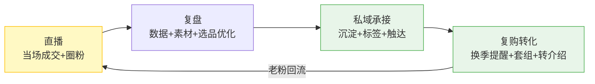
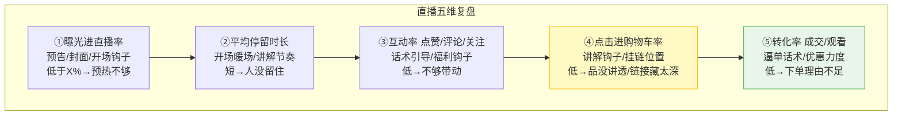
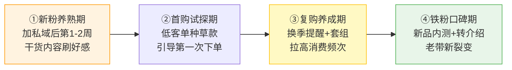
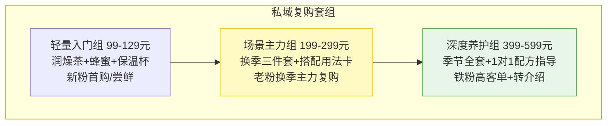
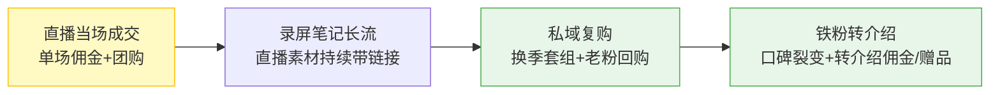

# Day38: 直播复盘与私域复购引擎——把开学季直播买的粉丝，变成反复复购的忠实老客户

> 📅 学习日期：2026-08-05
> 🔗 关联笔记：[[00-目录]] | 上一篇：[[Day37-开学季直播带货实战]] | 下一篇：Day39
> 🎯 适用场景：「反生活」好物养生账号在开学季直播跑通之后，真正拉开收入差距的不是「怎么把一场直播卖爆」，而是「怎么把每一场直播买过的粉丝，沉淀成换季、过节、日常都会反复回来找你的老客户」——直播只是「一次性收割」，复购引擎才是「月月都在转的钱袋子」
> 📚 学习来源：Day37开学季直播带货实战（承接直播全流程框架） × Day22私域成交与复购体系设计（承接复购底层逻辑） × Day35暑期复盘与开学季衔接（承接私域沉淀动作） × Day31自媒体账号冷启动（承接账号爬坡模型） × Day24内容数据分析与迭代优化（承接复盘方法论）

---

## 1. 一句话总结

**直播复购引擎 = 「复盘」把每一场直播的流量漏斗越磨越优化，「私域」把直播战场攒下的每一单粉丝都圈进可反复触达的池子里，「复购」用「换季提醒 + 套组推荐 + 口碑转介绍」让一个花过钱的老粉在一年里反复给账号贡献收入——直播负责「首次成交」，私域负责「持续成交」，两者咬合，收入才能从「单场脉冲」升级成「月度现金流」。**

**核心认知：** 大多数人卖货把「直播成交」当终点，但老黄要做到的是把它当「起点」。一次直播如果只换来一单生意，粉丝买完就走、再也联系不上，那这场直播的成本（选品、脚本、设备、时间）摊到单笔上就非常贵；**但如果你把下单的粉丝都沉淀进私域，一个老粉一年买 4-6 次，单场直播的「终身价值」就能放大 5-10 倍。** 复购引擎的底层是「信任的复利」——粉丝在直播间信了你一次，只要后续「不打扰但总有用」地用内容和服务"喂"着他，他下次买同类东西第一反应就是找你。**直播卖的是「货」，私域养的是「关系」，复购赚的是「关系带来的持续现金」。** 对客单价不低、信任要求高的养生好物品类来说，复购比拉新划算得多——留住一个老客户比新获一个客户便宜 5 倍、利润高 3 倍。

---

## 2. 核心框架

### 2.1 直播复购引擎「三环咬合模型」

直播、复盘、私域不是三件事，而是一个循环咬合的机器——复盘让直播优化，直播把粉丝送进私域，私域把老粉喂回直播：



| 环 | 核心任务 | 关键成果 |
|:--:|:--------|:--------|
| 直播吸粉 | 当场成交 + 设计私域钩子 | 一单 + 一个可触达的粉丝 |
| 复盘优化 | 数据复盘 → 优化下场 | 场场变强、不留废场 |
| 私域承接 | 沉淀 + 标签 + 高频低干扰触达 | 粉丝被「养熟」 |
| 复购转化 | 换季提醒 + 套组 + 转介绍 | 老粉反复掏钱 + 拉新人 |

### 2.2 直播「五维数据复盘模型」（承接 Day24/Day37）

复盘不是看「卖了多少钱」，而是看「钱是从哪个漏斗环节漏掉的」。每一场直播后 30 分钟，把五维数据拉出来逐一对照：



> **给「反生活」的关键**：别五个数字都想抓，**一场直播只挑「掉得最厉害的那一环」死磕**。比如停留短就改开场钩子，转化低就重写逼单话术。五个环一起优化等于什么都没优化。

### 2.3 私域复购「养鱼四段模型」（承接 Day22）

把私域粉丝按「成交 + 活跃」分成四段，用不同的触达方式，避免「一上来就硬推广告」把人吓跑：



---

## 3. 可落地方法

### 3.1 【反生活可直接用】直播后 30 分钟「冷热双复盘清单」

直播一结束，别急着开心或懊恼，先趁热把这场直播的「价值榨干」：

| 复盘维度 | 看什么 | 改进动作 |
|:--------|:------|:--------|
| 热数据 | 即时看：曝光进直播率 / 停留 / 互动 / 转化 | 找出最弱一环，写进下场脚本 |
| 冷数据 | 第二天看：录屏回看、弹幕、退货率 | 抓「讲品漏洞 + 话术卡点」 |
| 素材复用 | 把高能讲解片段的录屏剪成 2-3 条笔记 | 一二鱼多吃，承接[[Day37-开学季直播带货实战]]的冷热复用 |
| 粉丝沉淀 | 把当场下单的粉丝逐个备注好 | 打标签、拉群、准备回访话术 |

### 3.2 【反生活可直接用】私域「不打广告先养熟」的 7 天互动剧本

**核心原则：加进私域的头 7 天，只给干货、不硬卖——先把「熟悉的养生顾问」人设立住，第 8 天才开始引导复购。** 这是 Day22 私域成交的精髓，也是养生品类最需要的信任建设。

```mermaid
flowchart TD
    D1[Day1 打招呼+自我介绍<br/>发「换季养护清单PDF」] --> D2[Day2 发一条场景化内容<br/>"入秋宿舍/工位最实用一件物"]
    D2 --> D3[Day3-5 每两天发一条干货<br/>养生小知识/避坑/测评] 
    D3 --> D4[Day6 互动式提问<br/>"你最想解决哪个换季问题？"]
    D4 --> D5[Day7 针对性推荐<br/>延用Day37直播间同款/套组<br/>给私域专属价]

    style D1 fill:#fff3e0,stroke:#ff9800
    style D5 fill:#e8f5e9,stroke:#4caf50
```

### 3.3 【反生活可直接用】换季「复购触发器」文案库

复购不是天天催，而是踩准「换季/突发」这些刚需点，给一个「你现在就需要」的触发理由：

| 触发场景 | 触达文案（私域/朋友圈） |
|:--------|:----------------------|
| 换季提醒 | 「最近天凉/转燥，群里好多姐妹在问润燥茶，今天把直播间那一款又上架了，老粉价来了」 |
| 复购预警 | 「上次那套养生壶+茶组，很多老粉说刚好用完，这波补货到了」 |
| 季节话题 | 「入秋第一件事：别急着补，先把『润燥理气』的底子打好」 |
| 老粉专属 | 「直播间没抢到的，私域给老粉留了一批，先到先得」 |
| 转介绍 | 「最近 3 位新朋友是你推荐来的，送你一张专属优惠券，谢谢你帮我种草」 |

### 3.4 【反生活可直接用】私域复购「套组捆绑」三档设计

复购诀窍是「让老粉一次买更多、买得更省」——把单件升级成「一套解决一个场景」的套组，客单价和复购频率一起上来：



---

## 4. 变现路径

### 4.1 直播复购如何变成「月度现金流」（四层收入叠加）

直播一次性收割只是第一层，复购引擎让收入从「脉冲」变「月供」：



- **第 1 层·直播当场**：每场直播的直接佣金 + 团购，是「基础流水」
- **第 2 层·内容长流**：直播录屏剪辑的笔记，在换季/开学季话题下持续搜索流量带链接
- **第 3 层·私域复购**：老粉换季、补货、过节反复回购，是「最稳的现金流」
- **第 4 层·口碑裂变**：满意的铁粉转介绍家人同事，转介绍收入近乎零获客成本

### 4.2 复购引擎收入预估（拉高 LTV 的放大模型）

| 指标 | 没有复购 | 有复购引擎 | 放大倍数 |
|:----:|:--------:|:----------:|:--------:|
| 单个粉丝年消费 | 1 次 ¥50 | 4-6 次 ¥500-800 | **5-10倍** |
| 获客成本 | 直播/笔记拉新贵 | 老粉转介绍近乎为 0 | **降5倍** |
| 复购毛利率 | 与拉新同 | 老粉信任、客单更高 | **高3倍** |
| 月度收入 | 跟着直播场次脉冲 | 直播+私域叠加平稳 | **持续稳定** |

> **给「反生活」的核心提示**：复购引擎的公式是 **「留存 × 复购频率 × 客单价」**。你不用追求每场直播都爆，只需要「每场都把粉丝圈进私域 + 每年让每个老粉多买两次 + 客单价从单件升到套组」——三个数字各提 30%，总收入就能翻 2.2 倍。**复购拼的是「慢功夫的复利」，比天天追爆款更稳、更赚钱。**

### 4.3 「直播 → 私域 → 复购」的转化闭环（让每一场直播都不白播）

```text
直播间下单的粉丝
  ↓ 引导加私域（领换季清单PDF/老粉价/抽奖）
  ↓ 打标签（买的品类/价格带/复购情况）
  ↓ 7天养熟（干货→互动→针对性推荐）
  ↓ 换季/补货触发器 → 复购
  ↓ 满意 → 转介绍 → 新粉进私域 → 再复购
```

---

## 5. 行动清单

### ✅ 行动①：建立「直播五维复盘模板」并做一次冷回看（今天做）

**步骤1（10分钟）：** 打开 2.2 节的五维复盘模型，建一个「每场直播复盘表」模板，把 曝光进直播率 / 停留 / 互动 / 购物车点击 / 转化率 五个字段列进去。

**步骤2（15分钟）：** 调出最近一场直播的回放（或数据面板），把这五维数据填进去，找出「掉得最厉害的那一环」。

**步骤3（5分钟）：** 针对最弱一环，写 1 条具体的改进动作（如「停留短 → 开场前 10 秒加一个痛点钩子」）记到下场脚本的提词里。

> **产出：** ✅ 一张可复用的「直播五维复盘表」+ 一个已定位的改进点。

### ✅ 行动②：搭好私域「7 天养熟 + 标签」基础（今天做）

**步骤1（10分钟）：** 按 3.2 节把「换季养护清单 PDF」准备好（不用太长，能当钩子即可），作为加私域的见面礼。

**步骤2（15分钟）：** 规划好私域粉丝的标签体系（品类 / 客单价 / 复购次数 / 换季关注点），把现有已加私域的粉丝补上标签。

**步骤3（5分钟）：** 写一条「加我领清单」的引流钩子文案，作为之后每场直播收尾的固定动作（承接[[Day37-开学季直播带货实战]]收尾段的私域钩子）。

> **产出：** ✅ 一套「见面礼 + 标签体系 + 引流钩子」，私域承接流程跑通。

### ✅ 行动③：排出「换季复购日历」并写好 3 条触发器文案（本周内做）

**步骤1（10分钟）：** 结合时间轴排一个「复购触发日历」——把未来 3 个月的换季节点、补货点、节气、大促都标出来，标注「哪天该给老粉发什么」。

**步骤2（15分钟）：** 按 3.3 节文案库，针对最近的一个换季节点，实际写好 3 条不同版本（温情版/干货版/老粉专属版）的触达文案。

**步骤3（5分钟）：** 设计一套「换季套组」的定价（对齐 3.4 三档套组），把轻量/场景/深度三档的品和价格先草拟出来。

> **产出：** ✅ 一张「换季复购日历」+ 3 条写好的触达文案 + 一套三档套组方案。

---

## 📊 今日学习总结

| 维度 | 内容 |
|:----:|------|
| 核心认知 | 直播卖「货」、私域养「关系」、复购赚「关系的现金」——收入从单场脉冲升级成月度现金流 |
| 核心框架 | 直播/复盘/私域/复购三环咬合模型 + 直播五维数据复盘 + 私域养鱼四段 + 复购三档套组 |
| 关键技能 | 30分钟冷热复盘、7天养熟剧本、换季复购触发器文案库、复购套组捆绑设计 |
| 变现路径 | 直播当场→内容长流→私域复购→口碑裂变，留存×复购频次×客单提升带来5-10倍LTV放大 |
| 今日行动 | ① 建五维复盘表并冷回看 ② 搭私域7天养熟+标签 ③ 排换季复购日历+写触发器文案 |

> 下一篇预告：**Day39: 直播话术与氛围制造实战——从开口留人到关播成交的每一句话术设计**，让「反生活」直播间的每一句话都踩在转化的节拍上。
