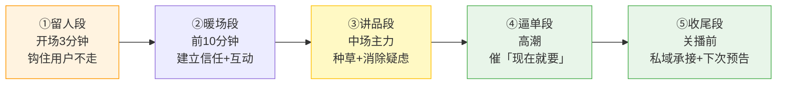
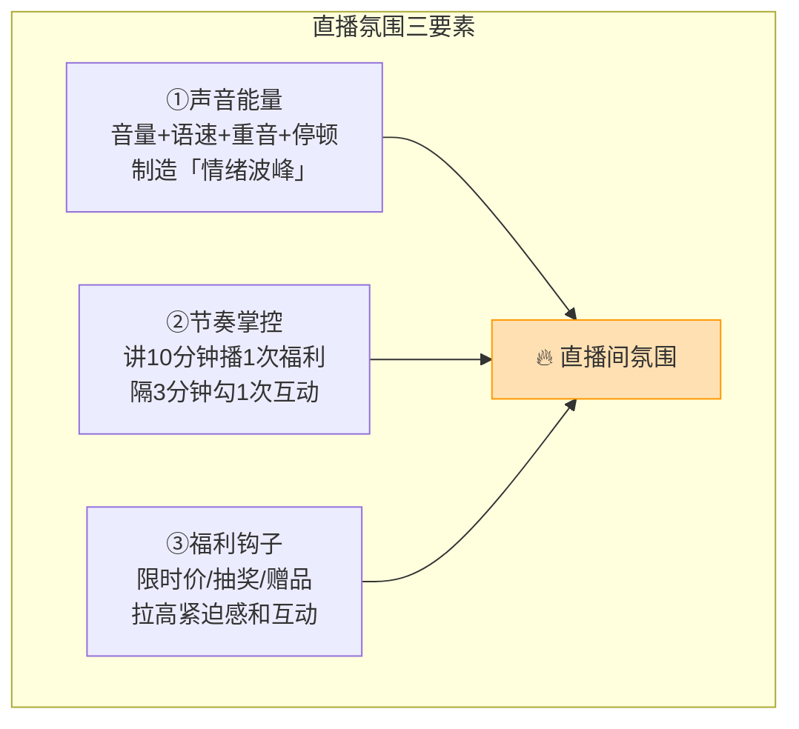
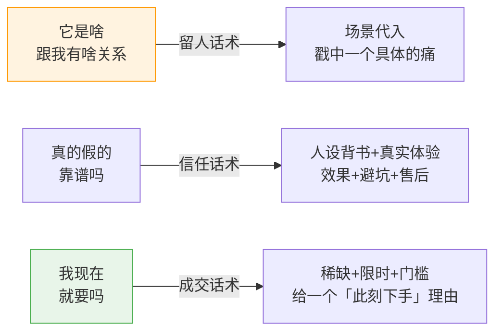

# Day39: 直播话术与氛围制造实战——从开口留人到关播成交的每一句话术设计

> 📅 学习日期：2026-08-19
> 🔗 关联笔记：[[00-目录]] | 上一篇：[[Day38-直播复盘与私域复购引擎]] | 下一篇：Day40
> 🎯 适用场景：「反生活」好物养生账号的直播间已经能开、也能卖货（承接 Day37/38），但「怎么把场观留下来、把气氛high起来、把话说到人心坎里让ta掏钱」还是靠感觉——这一篇不是讲「直播大道理」，而是把直播从头到尾拆成「一句一句怎么讲」，让老黄照着一句话一句话地套就能把转化率往上拉。直播的差距，藏在「留不留得住人」和「说不说得到点子上」里
> 📚 学习来源：Day37开学季直播带货实战（承接直播全流程框架） × Day38直播复盘与私域复购引擎（承接复盘与私域承接） × Day26评论区运营（承接互动话术） × Day27转化文案写作（承接成交文案killer） × Day19用户心理与行为设计（承接用户心理底层）

---

## 1. 一句话总结

**直播话术的本质，是「用一句话解决用户的每一个心理阻力」——用户不留下，是因为没被钩住；用户不互动，是因为没被带动；用户不买，是因为没被「现在就要」的理由说服。把直播话术按「留人 → 暖场 → 讲品 → 逼单 → 收尾」五段拆开，每段配一套固定话术模板 + 氛围制造技巧，老黄只要能「照着讲」，场观留存和转化率就能比靠感觉播稳一大截。**

**核心认知：** 很多人以为直播卖货靠的是「产品和运气」，但真正的差别在「话术密度」——**同一场直播，会讲的人能把 100 人留住 50 个、把 50 个里转化 5 个；不会讲的人 100 人进来 3 秒就全走光。** 话术不是「背台词」，而是「针对每一秒用户心里的疑问，预先垫好那句让他安心的回答」。用户直播间里最常见的三个心结——「这是啥跟我有关吗」（留人）、「真的假的靠谱吗」（信任）、「我现在就要吗」（成交）——每一句话术其实都在回答其中一个。老黄的养生好物卖得不便宜、信任要求高，用户心里的疑问比卖快消品更多，所以话术尤为重要：**直播是「一小时的说服现场」，话术就是你手里唯一的武器。**

---

## 2. 核心框架

### 2.1 直播话术「五段火力模型」

一场直播不是「一直讲产品」，而是「五个有明确任务的段落」拼起来——每段解决一件用户心理上过不去的事，段与段之间用「氛围钩子」衔接，让用户舍不得走：



| 段落 | 核心任务 | 解决的用户心理 | 氛围指标 |
|:----:|:--------|:--------------|:--------:|
| 留人段 | 3 秒内勾起兴趣 | 「这跟我有啥关系」 | 停留时长 |
| 暖场段 | 立人设 + 拉互动 | 「你是谁、靠谱吗」 | 互动率 |
| 讲品段 | 讲清 + 种草 + 答疑 | 「东西真好还是吹的」 | 购物车点击 |
| 逼单段 | 稀缺 + 限时 + 名额 | 「我为啥现在买」 | 转化率 |
| 收尾段 | 私域承接 + 预告 | 「我下次还来不来」 | 加私域率 |

### 2.2 直播「氛围三要素引擎」

氛围不是玄学，是三个可以「手动开关」的变量——**声音、节奏、福利**。老黄不用天生能说会道，把这三个变量「调大」，气氛自然就热起来：



> **给「反生活」的关键**：氛围不是「喊得大声」就行，而是「有起伏」。**一句话讲平了等于白讲——把关键句（人名、功效、价格、限量）用「重音 + 停顿」突出来**，用户才会听进去。练习方法是录音回放：如果一段话听不出哪个词该被记住，说明这句没过脑。

### 2.3 直播话术「三问对答库」（承接 Day19 用户心理）

用户所有的不买，都来自三个底层疑问。老黄提前把每一个问号的「标准答案」备好，直播时就不会卡壳：



---

## 3. 可落地方法

### 3.1 【反生活可直接用】留人段「开口三连钩」话术模板

开场前 3 分钟决定用户留不留。不要「大家好我是主播」开场（没人关心你是谁），直接用「三连钩」把用户钉住：

| 钩子类型 | 模板句式 | 「反生活」示例 |
|:--------|:--------|:--------------|
| 痛点钩 | 「你有没有遇到过……特别是换季的时候……」 | 「最近一换季，有没有姐妹一到下午就容易困、皮肤还干，怎么补都补不进去？」 |
| 承诺钩 | 「今天这场直播，我要送给你/帮你解决……关注我就告诉你」 | 「今天这场，我把我秋冬内调外养的那套『省心清单』全部讲出来，除了直播间你哪都听不到」 |
| 福利钩 | 「刚进来的朋友不用走，马上有福利/抽奖」 | 「刚进来的先别划走，5分钟后就发第一波秋季润燥小福利，先点点关注不然等下找不到」 |

> 三连钩的节奏：**开头 3 秒先甩痛点钩（最扎心），10 秒内接承诺钩（给留下来的理由），1 分钟内上福利钩（给留下的即时好处）。** 三个钩子排着来，用户还没反应过来「划走」就已经留了 1 分钟。

### 3.2 【反生活可直接用】暖场段「信任 + 互动」双线话术

前 10 分钟别急着卖货，先用「人设故事」建立信任（承接 Day09 个人IP），再用「互动钩子」把气氛拉起来：

```mermaid
flowchart TD
    A[自我介绍：一句带过<br/>\"我是老H，做养生好物测评的"] --> B[人设故事：为什么做这个<br/>自身/家人受益的真实经历]
    B --> C[专业背书：我挑品的标准<br/>成分/产地/见效逻辑] --> D[互动钩子①：扣1<br/>\"换季容易干的扣1\"]
    D --> E[互动钩子②：提问<br/>你最关心秋冬哪个问题？] --> F[预告：等一下讲的第一件品<br/>吊胃口]

    style B fill:#fff3e0,stroke:#ff9800
    style F fill:#e8f5e9,stroke:#4caf50
```

> **给「反生活」的互动话术**：互动不用花哨，就两招——**① 扣数字**（「觉得秋冬干燥的扣1」「最近睡不好的扣2」），让用户手指一动；**② 抛开放式一问**（「你最想先解决哪个问题」），把用户的答案变成接下来的讲品顺序，用户会因为「被回应」而更投入。**用户一旦在你直播间打了字，离开的沉没成本就高了——互动是「留住人」的最强钩子。**

### 3.3 【反生活可直接用】讲品段「黄金三步」种草话术

讲一件产品，别「报参数」，用「黄金三步」让用户「看见自己的使用场景」：

| 步骤 | 话术任务 | 「反生活」示例（以润燥茶为例） |
|:----:|:--------|:------------------------------|
| ①场景代入 | 讲一个用户会遇到的场景 | 「你有没有下午对着电脑，到三四点就口干舌燥、脑子发懵的时候？」 |
| ②效果可视化 | 讲用完的「结果」而非「成分」 | 「不是那种苦中药，是淡淡草本香，下午囤一壶，润润的喝一下午，人没那么燥了」 |
| ③痛点消除 | 主动讲「谁不适合 / 注意什么」 | 「要提醒的是，特别寒凉的体质先少喝，咱们群里姐妹都是按体质来」 |

> **给「反生活」的黄金记忆点**：第③步「主动埋雷」是养生品类最拉信任的一招——**主动讲缺点和注意事项，反而让用户觉得你实在、不吹牛，成交率不降反升**（承接 Day32 好物推荐内容与 Day27 信任建立逻辑）。

### 3.4 【反生活可直接用】逼单段「限时+稀缺+门槛」三重催促

讲完品不是终点，要「把犹豫变下单」——用「现在就要买的理由」逼单（承接 Day19 用户心理的损失厌恶）：

```mermaid
flowchart TD
    S[讲完品 → 进入逼单] --> A[限时<br/>\"今晚12点前下单价\\/仅限今天\"]
    A --> B[稀缺<br/>\"这批就XX份\\/卖完这波等补货\"]
    B --> C[门槛<br/>\"下单的顺带送\\/老粉加购赠品\"]
    C --> D[只剩3个名额倒计时<br/>持续口播库存收紧]

    style C fill:#fff9c4,stroke:#ffc107
    style D fill:#e8f5e9,stroke:#4caf50
```

> 逼单别「一直催」，而是要「给台阶」：**「不着急的朋友也可以先加购物车，但今天就今天价，明天可能就恢复原价了」**——用给台阶的方式，反而让犹豫的人松口。**逼单的本质不是硬逼，是帮用户「找一个现在下单的合理理由」。**

### 3.5 【反生活可直接用】收尾段「私域承接 + 下次预告」

关播前别让粉丝「散场」，用「承接 + 钩子」把直播的流量变现到私域（承接 Day38 私域复购引擎）：

- **私域钩子**：把直播录屏高能片段、秋冬养护清单做成「加微信免费领」，收尾反复口播
- **下次预告**：「下周三同一时间，我会讲讲秋冬怎么内调，老粉到时候有专属优惠」——给下次直播留个念想
- **感谢与身份**：「今天下单的姐妹都是咱们的老朋友，收货后有不懂的随时来找我」——强化「社群归属感」，把粉丝往私域认领

---

## 4. 变现路径

### 4.1 话术升级如何直接换算成「多赚的钱」

话术不是「锦上添花」，而是直接作用在转化漏斗的每一环上，每一环提升都能换算成收入（承接 Day24 数据复盘）：

```text
场均观看 1000 人
    × 留存率 20% → 40%（留人段话术）   → 留住 400 人
    × 互动率 10%  → 20%（暖场段话术）   → 高活跃买家浓度
    × 转化率 2%   → 4%（讲品+逼单话术） → 16 单 / 场
    × 客单价 ¥50 → ¥80（套组话术）       → ¥1280 / 场
```

- 只需把 **留存、转化、客单** 三个数字各拉高一倍，单场收入就从原来的几百元跳到 1200+ 元
- 每周播 2 场，月直播流水就能到 **¥10,000+**（还没算私域复购的叠加）

### 4.2 从「单场话术」到「可复制的成交系统」

话术最值钱的地方，是它能「沉淀成模板」反复用——一旦五段话术跑顺，就是老黄一条可复制、可外包、可教给助播的流水线：

| 话术资产 | 复利价值 | 变现作用 |
|:--------|:--------|:--------|
| 五段话术模板 | 每场直播直接用，越改越顺 | 降本（不用每次想破头） |
| 三问对答库 | 新主播照着答，不卡壳 | 可带新人 / 规模化开小号 |
| 讲品脚本库 | 复用所有品类的讲法 | 提升选品类目扩展效率 |
| 逼单 + 收尾模板 | 承接私域，转化复购 | 直播 → 私域 → 复购闭环 |

> **给「反生活」的核心提示**：直播话术是一次投入、长期复用的「资产」。**老黄接下来最该做的，是花几场直播把五段话术「跑顺、记下来、改到顺手」，把它沉淀成一份自己的直播间sop**——这比每次临场发挥要靠谱得多，也是把「主播」从「一个人」变成「一套系统」的关键一跃。

---

## 5. 行动清单

### ✅ 行动①：写一份自己的「五段直播话术脚本」（今天做）

**步骤1（20分钟）：** 按 3.1–3.5 五个段落，把「反生活」下一场直播从头到尾写成一份完整话术脚本——每段写清楚「开场句→主体→收尾句」。

**步骤2（10分钟）：** 对照 2.2 节氛围三要素，在脚本里标出「该放重音、该停顿、该上福利钩子」的位置。

**步骤3（5分钟）：** 把脚本里的口语词念两遍，删掉「然后」「就是说」这些口头禅，改成干净利落的表达。

> **产出：** ✅ 一份对着就能开播的「反生活直播话术脚本」。
>
> 建议下一步可学习：**Day40: 直播助播与场控配合实战——一个人怎么撑起一场不留冷场的直播**

### ✅ 行动②：搭好「三问对答库」并补 5 条高赞回答（今天做）

**步骤1（10分钟）：** 按 2.3 节「它是啥 / 真的假的 / 我现在要吗」三个疑问，搭一张「问答总表」。

**步骤2（20分钟）：** 针对「反生活」最常卖的 2–3 款好物，提前写好每个疑问的 2 条标准回答（尤其「谁不适合」这类主动埋雷的回答，最能拉信任）。

**步骤3（5分钟）：** 把 3.4 节逼单段那套「限时+稀缺+门槛」话术，套用成「反生活」自己的版本，写进对答库。

> **产出：** ✅ 一张开播就不会卡壳的「对答库」表格。

### ✅ 行动③：录 10 分钟试播并做「氛围回听自检」（本周内做）

**步骤1（10分钟）：** 用手机对着镜头（或开一场小范围试播），按脚本讲 10 分钟，全程录音。

**步骤2（10分钟）：** 回听录音，对照「声音起伏、语速节奏、有没有口头禅、重音到不到位」四条逐条打分。

**步骤3（5分钟）：** 把最弱的两处记下来，写成「下一场改进卡」贴到手边。

> **产出：** ✅ 一次亲身的试播 + 一张「话术/氛围自检改进卡」。

---

## 📊 今日学习总结

| 维度 | 内容 |
|:----:|------|
| 核心认知 | 直播话术=回答用户「每秒钟心里的疑问」；三个心结：留人/信任/成交，句句话术都在解一道题 |
| 核心框架 | 五段火力（留人/暖场/讲品/逼单/收尾）+ 氛围三要素（声音/节奏/福利）+ 三问对答库 |
| 关键技能 | 开口三连钩、信任+互动暖场、讲品黄金三步、限时+稀缺+门槛逼单、私域承接收尾 |
| 变现路径 | 留存×互动×转化×客单各拉一倍 → 单场流水破千；话术沉淀成 SOP → 系统可复制可外包 |
| 今日行动 | ① 写五段直播话术脚本 ② 搭三问对答库+补5条高赞回答 ③ 试播10分钟并做氛围回听自检 |

> 下一篇预告：**Day40: 直播助播与场控配合实战——一个人怎么撑起一场不留冷场的直播**，帮「反生活」从「单兵作战」走向「一个人也像一支团队」的标准开播流程。
