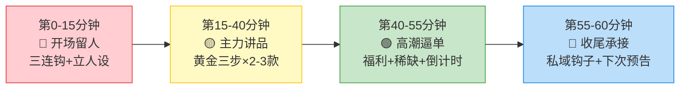
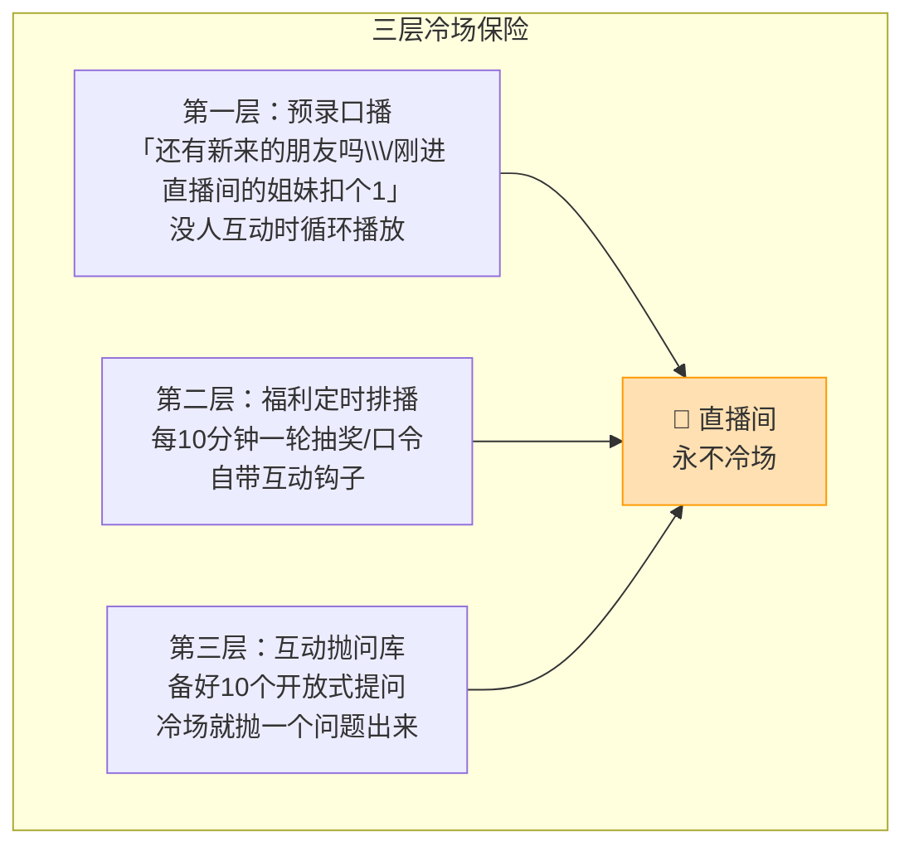
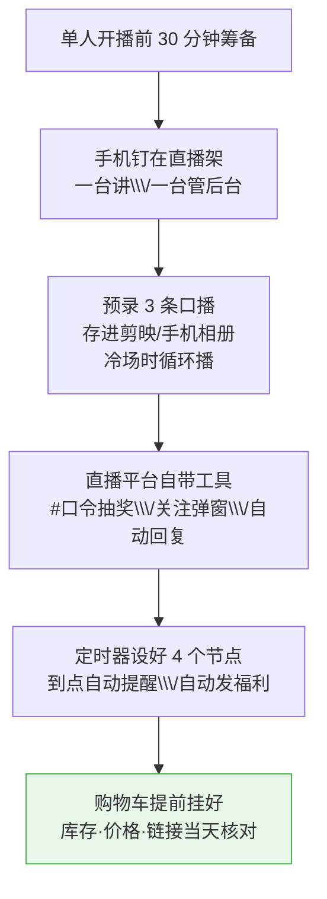

# Day40: 直播助播与场控配合实战——一个人怎么撑起一场不留冷场的直播

> 📅 学习日期：2026-08-21
> 🔗 关联笔记：[[00-目录]] | 上一篇：[[Day39-直播话术与氛围制造实战]] | 下一篇：Day41
> 🎯 适用场景：「反生活」好物养生账号的主播是「一个人」（老黄自己），但又想同时干好「讲品、控场、看数据、上链接、回评论、发福利、催单」这一堆事——这一篇不教你「雇一个助播」，而是教你「一个人怎么用『分身法』把助播和场控的活儿全部拆给『工具 + 流程 + 话术』，让一场直播从头到尾不掉链子、不冷场」。直播单兵作战的差距，不在「会不会讲」，而在「一个人能不能同时管好台前和幕后」
> 📚 学习来源：Day39直播话术与氛围制造实战（承接话术五段框架） × Day37直播带货实战（承接人货场与变现漏斗） × Day25小红书直播带货实战（承接直播基础） × Day38直播复盘与私域复购引擎（承接复盘承接） × Day24内容数据分析（承接数据实时监控）

---

## 1. 一句话总结

**直播助播与场控的本质，不是「请个人帮你」，而是「把一场直播从头到尾拆成『讲品、控场、数据、链接、互动、福利、收尾』七个死角色，然后老黄用『一台手机多开 + 三张流程卡 + 一套自动话术』把自己变成『一支队伍』」——一个人播得稳的核心，不是「能者多劳硬扛」，而是「把重复性的事交给工具和模板、把精力只留给人和货」。**

**核心认知：** 很多做直播的担心「一个人忙不过来」，于是要么雇助播（成本高），要么硬着头皮分心（结果讲着品盯着评论，两头都干不好，场观流失）。但真正的解法是「**角色必须分工，人不一定**」——助播能干的「上链接、发福利、读评论、报库存、抡氛围」，其中有 80% 是「机械动作」，完全可以先用「流程卡 + 快捷键 + 预录口播 + 定时器」替代；真正要老黄亲自干的，只有「讲品」和「关键时刻的情感反应」这 20%。**一个人直播最容易崩的不是口才，而是「节奏崩了没人托底」——弹幕没人回、福利没人发、链接忘了上、观众走了没人喊一声留人。** 所以这一篇的核心不是「教老黄更忙」，而是「教老黄把不变量变成模板、把变量留给人」，让一个人也像一支团队那样稳。

---

## 2. 核心框架

### 2.1 直播「单兵分身七角色」模型

一场直播的幕后，其实藏着七个「看不见的角色」。懂行的直播间为什么稳？因为每个角色都有人/有工具在盯着。老黄一个人要做的，不是一个人扛七个人，而是「**七件事，人干 2 件（讲品+应变），工具干 5 件（数据/链接/福利/话术/计时）**」：

```mermaid
flowchart LR
    subgraph 人干（老黄亲自）
        A[①主播<br/>讲品·讲故事·情感输出]
        B[⑥场控应变<br/>冷场救场·突发处理]
    end
    subgraph 工具/模板干（分身）
        C[②助播分工<br/>上链接·发福利·读评论]
        D[③数据监控<br/>在线数·转化·停留]
        E[④节奏计时<br/>每10分钟一次节点]
        F[⑤氛围托底<br/>预录口播·背景BGM·贴纸]
        G[⑦私域承接<br/>关注自动回复·链接跳转]
    end

    A -->|配合| C
    B -->|关键决策| D
    style A fill:#fff3e0,stroke:#ff9800
    style B fill:#e8f5e9,stroke:#4caf50
    style C fill:#fff9c4,stroke:#ffc107
```

| 角色 | 人/工具 | 核心任务 | 一句话要点 |
|:----:|:------:|:--------|:----------|
| 主播 | 老黄 | 讲品 + 情感输出 | 只干「只有人能干」的事 |
| 助播分工 | 工具+模板 | 上链接/发福利/念弹幕 | 把机械动作交给脚本 |
| 数据监控 | 工具（后台） | 在线/转化/停留实时 | 关键节点才看，别一直盯 |
| 节奏计时 | 定时器 | 每 10 分钟一个节点 | 到点就发福利/勾互动 |
| 氛围托底 | 预录口播+贴纸 | 没人说话时不冷场 | 用「气氛焊」避免尴尬 |
| 场控应变 | 老黄 | 冷场/突发/负面评论 | 只在「脱轨」时才出手 |
| 私域承接 | 自动工具 | 关注回复/加微信/进群 | 让每一个动作都沉淀私域 |

> **给「反生活」的关键**：直播间不是「人多就稳」，是「**节奏不漏就稳**」。老黄不需要真的雇助播，而是先把上面这张「七角色表」打印出来，开播前五分钟逐个核对「这事由谁办、怎么办」，开播后就能心无旁骛地讲品——因为你知道后台每一项都有工具在兜底。

### 2.2 直播「四段节奏节拍器」

一场 1 小时的直播，最怕的是「讲着讲着忘了时间、忘了发福利、忘了拉互动」，导致节奏平铺直叙、观众昏昏欲睡。解法是把一场直播切成四个「固定节拍」，用定时器到点自动提醒，每一个节拍干一件固定的事（承接 Day39 五段话术的时间轴）：



> **节拍器的关键**：不要「记在心里」，要「设成手机闹钟」——每到一个节点，定时器就弹一条短语（如「到点：该上福利了」「到点：该勾互动了」「到点：还剩10分钟收尾」），老黄照着做就行。**节奏是直播的骨架，定时器就是替老黄记住了这场直播该在哪一步迈腿的那个人。**

### 2.3 直播「不冷场氛围焊」三层保险

冷场（没人说话、没有互动）是单兵直播最致命的时刻，因为一冷观众就想划走。冷场要「防」，而不是「救」——提前用三层「气氛焊」把可能冷场的缺口焊死（承接 Day39 氛围三要素 + Day26 评论区互动）：



> **给「反生活」的核心思维**：冷场不是「直播中间才发生的事」，而是「开场前就注定」的事。老黄只要在开播前把 3 条预录口播、3 波定时福利、10 个互动提问都备好，那么直播过程中「没人说话」的空档，其实已经被这些「暗桩」填满了——**单兵直播的稳，来自「把意外做进预案里」。**

---

## 3. 可落地方法

### 3.1 【反生活可直接用】「一台手机 + 三张流程卡」的单兵开播筹备

一个人的直播要稳，功劳不在「开播时多能干」，而在「开播前多省事」。老黄开播前花 30 分钟做三张卡，直播中就有「定海神针」：

| 流程卡 | 内容 | 怎么用 |
|:------:|:-----|:------|
| 剧本卡 | 按 Day39 五段话术写好「开场→暖场→讲品→逼单→收尾」每一段要讲什么、每段几分钟 | 摆在手机旁，卡壳就低头看一眼 |
| 后台卡 | 记清楚「链接在哪上、福利怎么发、口令怎么设置、关注自动回复改在哪」的每一步 | 挂着后台页，操作时照着点 |
| 应急卡 | 提前写好「负面评论怎么回、库存没了怎么说、卡顿怎么说、小孩/快递/敲门怎么办」的救场话术 | 出意外就照着念，不慌 |

> **筹备的复利**：这三张卡写完一次，可以**反复复用**（换品只改讲品段）。老黄每场直播结束后花 10 分钟把「这场的意外 + 对应解法」补进应急卡，卡会越用越厚、开播会越开越稳——这就是 Day39 说的「把主播从一个人变成一套系统」的落地版。

### 3.2 【反生活可直接用】单兵「工具分工表」——把助播的活交给机器

助播 80% 的机械动作，老黄都可以用现有工具「自动挡」替代，开播时只需按一下：



| 助播的活 | 谁来干 | 反生活落地 |
|:--------|:------|:----------|
| 上链接 / 挂车 | 平台后台（提前挂） | 开播前挂好，讲到了就「点购物车引导」 |
| 发福利 / 抽奖 | 平台自动抽奖口令 | 提前设 3 轮口令抽奖，到点自动触发 |
| 念弹幕 / 复述评论 | 评论区置顶 + 老黄口播 | 挑 1-2 条高赞评论念，「刚才有姐妹问我……」 |
| 报库存 / 催单 | 剧本卡写好固定句 | 到逼单段照着念「还剩 5 份」 |
| 氛围 / 背景音 | 预录口播 + BGM | 冷场播预录口播，全程放轻音乐 |

> **给「反生活」的关键**：别小看这些「机械活儿」，它们正是「让人看起来专业」的底气。**老黄一个人播，只要把「挂车、抽奖、自动回复、定时器」四个开关用好，直播间给人的感觉就像背后有整个团队在转**——观众看不出来你是几个人，他们只感受到「场子热不热、节奏稳不稳」。

### 3.3 【反生活可直接用】冷场「三秒救场术」+ 互动「抛问库」

冷场不可怕，可怕的是「冷下来没人喊第一嗓子」。老黄记住这套「三秒救场」口诀，暖场和冷场都能随时自救：

| 场景 | 「反生活」救场话术 | 底层原理 |
|:----|:-----------------|:--------|
| 没人互动 | 「怎么我们今天这么安静，是不是都忙着养生去了？刚进来的姐妹，觉得冬天手脚冰凉的扣个1」 | 用「具体场景 + 扣数字」降低参与门槛 |
| 刚进来没人留 | 「刚进来的朋友别急着走，5分钟后我发一轮秋冬润燥小福利，先点点关注」 | 用「福利」给一个留下来的理由 |
| 讲品没人回应 | 「觉得这款适合你的先别走，我把它讲透，你可以先加购物车存着」 | 用「加法车」降低当场决策压力 |
| 评论区冷清 | 「刚才有姐妹私信问我XX，这个我顺便也讲一下」 | 主动引入一个「虚拟互动」，撑起氛围 |
| 临场卡壳 | 「稍等姐妹们，这罐我确认一下成分，讲错了我可担不起」 | 把「卡壳」包装成「负责任」，反而加分 |

> **配套的「抛问库」（承接 Day26）**：开播前备好 10 个开放式问题——比如「你们秋冬最烦的皮肤问题是什么？」「家里老人最需要调的是什么？」「你们是怎么熬夜的，几点睡？」。冷场就抛一个，把话筒交给观众，**用户只要开口回了话，离开的沉没成本就上来了，留下概率大增。**

### 3.4 【反生活可直接用】突发「四类应急」标准处置（场控的最后兜底）

一个人播最慌的是「突发」，但突发其实就那几类，提前写好处置方案，突发时就「有章可循」：

| 突发类型 | 标准处置 | 反生活参考话术 |
|:--------|:--------|:--------------|
| 负面评论 | 稳住情绪，不吵架、不拉黑，用「感谢反馈 + 客观解释」回应 | 「谢谢这位姐妹的提醒，咱们是纯素测评，这款我会再把注意事项说清楚」 |
| 产品没库存 | 不硬扛，诚实告知 + 引导加购/私域预约 | 「这款确实抢得快，库存卖完了，需要的姐妹加我私域，补货第一时间通知你们」 |
| 直播卡顿/掉线 | 快速重连，回来说句轻松话化解尴尬 | 「刚断了一下，抱歉让大家久等了，我们继续刚才那款」 |
| 突发打扰（敲门/快递） | 一句话交代，别让观众等得莫名其妙 | 「家里来了个快递，大家先看看购物车，我三十秒回来」 |

> **给「反生活」的核心**：场控不是「处理灾难的高手」，而是「把每一种可能发生的突发，提前写好标准答案的人」。老黄把这张表填满自己的场景，再遇到突发，只会觉得「哦，这个我预案里写过」，情绪稳住、场面就稳了。

---

## 4. 变现路径

### 4.1 单兵化如何直接换算成「多赚的钱」

单兵作战不是「将就」，而是「成本极低、起量更快的现金流」——它省下的不只是助播工资，更是「开播门槛」本身：

```text
传统模式（假设请 1 位助播）
    主播工资 + 助播工资 + 场控 → 开播成本高，不敢频繁播

单兵分身模式（老黄现在）
    主播=自己 0 成本
    助播/场控=工具+模板  ≈ 0 额外成本
    → 开播成本极低，想播就播，起量更快

单兵模式的核心优势：
    ✅ 用「工具+流程」省下的成本，全变成利润
    ✅ 没有「养人」压力，多播多赚，试错成本极低
    ✅ 一套 SOP 跑顺后，可复制给矩阵号（承接 Day05）
```

### 4.2 从「单兵直播」到「可复制直播系统」

单兵化的最大价值，是它把「直播」从「一次临时的劳动」变成了「一套可复制的系统」——这套系统一旦跑顺，就是老黄可以复制成第二条、第三条变现流水线的「印钞模板」：

| 单兵资产 | 复利价值 | 变现作用 |
|:--------|:--------|:--------|
| 三张流程卡 | 反复复用，越用越厚 | 降本（不用每次重写） |
| 冷场救场 + 抛问库 | 任何一场都能用 | 提升留存与互动，拉高转化 |
| 突发事件应急表 | 越填越全，越播越稳 | 降低翻车风险，保护账号权重 |
| 五段话术 + 四段节拍 | 沉淀成标准开播 SOP | 可复制给第二个号/助播 1 人顶 5 人 |

> **给「反生活」的核心提示**：老黄的目标不是「永远一个人扛」，而是「用一个人把模式跑通、跑顺、跑出数据」——**先证明「单兵直播」能稳定出单，再考虑是否复制**（复制成矩阵号，用同一套 SOP 交给别人干）。单兵是「跑通 0→1 的最低成本路径」，复制才是「1→10 的放大器」，别本末倒置。

---

## 5. 行动清单

### ✅ 行动①：写「反生活」自己的三张流程卡（今天做）

**步骤1（10分钟）：** 按 3.1 节，把「剧本卡」填成 60 分钟版本——五段话术每段几分钟、讲哪款品、什么时候发福利，写成一张时间轴表。

**步骤2（10分钟）：** 写「后台卡」——把「上链接、发抽奖、设口令、关注自动回复」每一步截图存档，标清按钮在哪。

**步骤3（10分钟）：** 写「应急卡」——填上 4 类突发（负面/缺货/卡顿/打扰）对应的 1 句救场话术。

> **产出：** ✅ 三张可以反复用的「开播定海神针」流程卡。

### ✅ 行动②：备齐「冷场保险 + 抛问库」两套暗桩（今天或明天做）

**步骤1（10分钟）：** 用手机录 3 条预录口播（「还有新来的朋友吗」「刚进来的扣个1」「5分钟后发福利」），存进手机相册备冷场循环播。

**步骤2（10分钟）：** 按 3.3 节，在手机上建一张「抛问库」清单，写 10 个适合「反生活」的开放式提问。

**步骤3（5分钟）：** 把「定时器」设成四个节点（15/40/55/60 分钟）的提醒，存好备用。

> **产出：** ✅ 一套「开了播就不会冷场」的暗桩组合。

### ✅ 行动③：开一场「单兵试播」并用「七角色自查表」复盘（本周内做）

**步骤1（20分钟）：** 挑一天开一场 30-60 分钟的试播，全程只按「三张卡 + 定时器」执行，一人搞定所有环节。

**步骤2（10分钟）：** 播完用 2.1 节「七角色表」逐项打钩——哪件事做到了、哪件漏了、哪个环节卡了。

**步骤3（5分钟）：** 把最弱的一环补进流程卡，写进「下一场改进卡」。

> **产出：** ✅ 一场亲身实践的单兵直播 + 一张「下一场改进卡」，把自己的直播间从「靠感觉」升级成「靠系统」。

---

## 📊 今日学习总结

| 维度 | 内容 |
|:----:|------|
| 核心认知 | 助播/场控的关键不是「请人」，而是「七件事人干2件、工具干5件」；一个人的直播稳，靠的是「把意外做进预案里」 |
| 核心框架 | 单兵分身七角色（主播/助播分工/数据/节奏/氛围/场控应变/私域）× 四段节奏节拍器 × 三层冷场保险 |
| 关键技能 | 三张流程卡、冷场三秒救场术、抛问库、应急四类标准处置、工具自动挡（挂车/抽奖/自动回复/定时器） |
| 变现路径 | 单兵0成本开播→想播就播起量快；SOP跑顺→可复制成矩阵号，从0到1再到10 |
| 今日行动 | ① 写三张流程卡 ② 备冷场保险+抛问库 ③ 开一场单兵试播并做七角色复盘 |

> 下一篇预告：**Day41: 直播选品与排品逻辑——把哪款放最前面、哪款用来引流、哪款来赚钱的排品实战**，帮「反生活」把直播间的「货」排成一套能最大化客单和转化的阵型。
