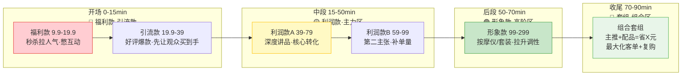
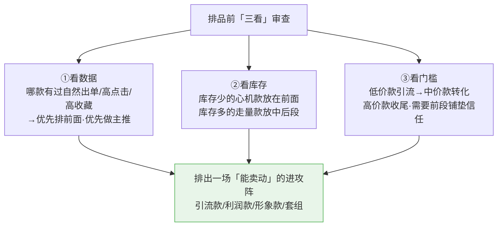
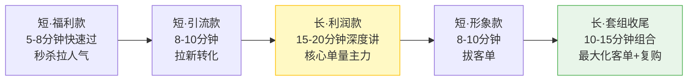
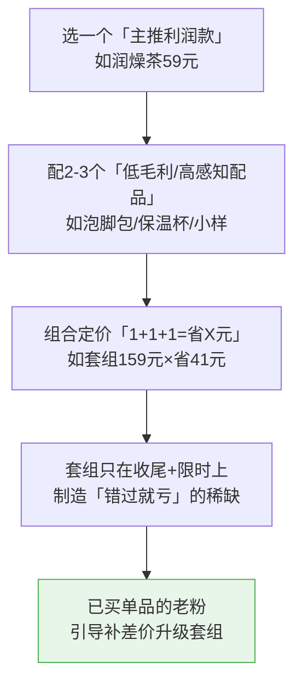

# Day41: 直播选品与排品逻辑——把哪款放最前面、哪款用来引流、哪款来赚钱的排品实战

> 📅 学习日期：2026-08-22
> 🔗 关联笔记：[[00-目录]] | 上一篇：[[Day40-直播助播与场控配合实战]] | 下一篇：Day42
> 🎯 适用场景：「反生活」好物养生账号能开播了、也懂节奏和冷场了，但「这一场到底卖哪 5 款品、谁放第一、谁放中间、谁放最后、谁拿去引流、谁真正赚钱」没想清楚——直播的品一旦排错，再好的话术和节奏也是白搭。这一篇不讲「卖什么好卖」（那是选品），而是讲「**把已经选好的品，排成能最大化停留、转化和客单的进攻阵型**」（这是排品），是单兵直播从「能播」升级到「播得赚钱」的关键一课
> 📚 学习来源：Day37 直播带货实战（承接人货场与选品四象限） × Day25 小红书直播带货（承接引流/利润/形象/福利款概念） × 承接 Day40 单兵分身与四段节奏（承接开播执行） × Day27 转化文案（承接讲品话术） × Day22 私域复购（承接高客单套组承接）

---

## 1. 一句话总结

**直播排品的本质，不是「把货一件一件轮流讲完」，而是「把一场直播当成一个进攻战役，先用福利款和引流款把人气和停留拉满，中段用利润款深度讲解把单量做厚，再用形象款把客单抬高，最后用组合套组把客单价和复购一口吃下」——排品的核心不是「卖哪款」，而是「用哪款负责拉人、哪款负责赚钱、哪款负责拔高客单」，让每一件品都在自己的位置上发挥最大作用。**

**核心认知：** 很多做直播的，手里握着 10-20 款品，要么「一股脑全挂上去，谁被点就从谁讲起」（观众晕、转化散），要么「闭着眼睛把利润最高的放最前面讲」（结果客单太高、刚开始就吓跑人，留不住）。但真正懂行的直播间，排品是有「兵法」的：**开场先用「高性价比福利款」留住刚进直播间的人，中段用「利润款」深度讲品做转化，后段用「高阶形象款」把有消费力的人往上抬，最后用「套组组合」把客单价抬到最高。** 反生活做的是养生好物这种「客单中高、信任要求高」的品类，尤其不能「一上来就讲贵的」，而要先「用便宜好用的品把人留住、用真诚讲解把人说服、再一步步把更有消费能力的人导到更高客单」——**排品就像写一首歌的编曲：前奏负责抓住耳朵，副歌负责让人记住，最后的高潮负责让人愿意付费。** 老黄要学的，就是给每一场直播排一个「有前奏、有副歌、有高潮」的进攻阵型。

---

## 2. 核心框架

### 2.1 直播排品「四象限进攻阵型」（承接 Day25/Day37 选品四象限）

选品决定「有哪些牌」，排品决定「这张牌什么时候打出去」。把 Day37 的「引流款/利润款/形象款/福利款」四象限，套到一场直播的时间轴上，就成了「四段进攻阵型」：



| 段位 | 时间 | 负责的款 | 核心任务 | 一句话要点 |
|:----:|:----:|:--------|:--------|:----------|
| 开场 | 0-15min | 福利款+引流款 | 留住刚进直播间的新人、拉停留 | 先用「便宜好买」让观众不划走 |
| 中段 | 15-50min | 利润款×2 | 深度讲品、做核心单量 | 主力款放中间，「讲透比铺开强」 |
| 后段 | 50-70min | 形象款 | 拔高客单、打调性 | 把有消费力的观众往上抬 |
| 收尾 | 70-90min | 组合套组 + 福利返场 | 抬客单、促复购、拉下一场 | 用「组合优惠」把客单做到最大 |

> **给「反生活」的关键**：排品的铁律是「**先易后难、先低价后高价**」——开场就上利润款/形象款，等于把刚进来还不信任你的观众直接劝退；反过来，先用福利款让人尝到甜头、产生「这家货不错」的信任，再一步步把更贵更好用的往上推，观众「留下来看完+下单」的概率会成倍提升。

### 2.2 排品「三看」决策法——看数据、看库存、看门槛

一场直播的品不是随便排的，排之前要用「三看」过一遍，保证排出来的是「能卖动」而不是「你想卖」：



> **给「反生活」的核心**：排品不是「我知道今天卖这 5 款就行」，而是「我清楚这 5 款为什么是这个顺序」。老黄每次排品前，把「每款的历史数据、手头库存、价格门槛」各过一遍，排出来的阵型才不是「拍脑袋」，而是「有据可依的进攻方案」。

### 2.3 「三短一长」排品法——让观众在直播间停留更久

直播算法和观众耐心都在惩罚「讲的太长」「品铺的太多」。一场直播 60-90 分钟，只适合「三短 + 一长」的排品，贪多必散：



> **给「反生活」的核心**：一场直播不是「把 10 款都讲一遍」，而是「**重点讲透 1-2 款利润款 + 1 个套组**，其余快节奏带过」。贪多导致每款都讲不深、观众没记住任何一款，反而转化最差。**「少而深」永远赢过「多而浅」。**

---

## 3. 可落地方法

### 3.1 【反生活可直接用】「排品九宫格」——开播前 30 分钟排出整场阵型

不用想得太复杂，老黄开播前用一张 3×3 九宫格把整场直播的品排好：

| 时段 | 第1款 | 第2款 | 角色定位 |
|:----:|:-----:|:-----:|:--------|
| 开场 0-15min | 福利款（秒杀） | 引流款（爆款） | 拉停留、攒信任 |
| 中段 15-50min | 利润款A（主推） | 利润款B（第二主张） | 核心单量来源 |
| 后段 50-70min | 形象款（高客单） | 组合套组 | 拔客单、促复购 |
| 收尾 70-90min | 福利返场 + 预告下场 | — | 拉数据、留人 |

**给「反生活」的具体填法（以好物养生为参考）：**
- 开场：9.9 的「秋季润燥茶试用包/小样」秒杀 → 28 元的「保温杯/艾草泡脚包」（好评爆款，先让人买到手）
- 中段：59 元的「换季润燥茶正式装」（主推，深度讲成分/效果）→ 79 元「养生壶/按摩小件」（第二主张）
- 后段：129 元的「肩颈按摩仪/乳胶枕」（形象款，把有消费力的人往上抬）→ 「全家养生套组」= 润燥茶+泡脚包+按摩仪，限时组合省 X 元
- 收尾：福利返场再上 1 次 9.9 秒杀 + 预告「下周 X 晚 8 点，讲换季养生全套方案」

> **筹备的复利**：这张九宫格写完一次，就能作为「排品模板」反复用——每次开播只需换掉具体的品、价格、套组逻辑，5 分钟就能排完一场。老黄把排好的阵型贴在三张流程卡（承接 [[Day40-直播助播与场控配合实战]]）旁边，开播照着走即可。

### 3.2 【反生活可直接用】「套组组合术」——把客单价从 59 提到 159 的关键招

散品单卖的客单是 59，但组合成「套组」卖，客单能拉到 159+，而且买家还觉得「赚到了」。这是排品里最能直接拉高收入的一招：



| 套组设计要点 | 怎么做 | 反生活例子 |
|:--------|:------|:----------|
| 主推选「利润款」 | 套组里必有一款高毛利主推 | 润燥茶（主）+ 泡脚包 + 按摩仪 |
| 配品选「高感知低毛利」 | 用「看得见的价值」撑起套组价格 | 保温杯、小样、棉柔巾 |
| 定价用「省X元」心理 | 别直接降价，用「原本分别买=200，套组只要159」 | 突出「立省41元」 |
| 制造稀缺 | 套组限时/限量，只在收尾上 | 「这个套组今天只上 5 组」 |
| 引导老粉升级 | 私域里推「单品→补差价升套组」 | 承接 [[Day22-私域成交与复购体系设计]] |

> **给「反生活」的核心**：套组是「客单翻倍 + 复购一次拿下」的最强工具。老黄只要每次把「一个利润款 + 两三个配品」绑成一个让人心动的组合，收尾段一上，整场直播的客单价就能轻松抬高一倍——**卖得少、客单高、还让粉丝觉得捡到宝**，才是排品的最高境界。

### 3.3 【反生活可直接用】「排品话术转场模板」——每换一款品不要硬讲

排品不只是「顺序」，还包括「怎么从这款自然转到下一款」（承接 [[Day27-自媒体转化文案写作]] 与 [[Day39-直播话术与氛围制造实战]]）：

| 转场场景 | 话术模板 | 反生活示例 |
|:--------|:--------|:----------|
| 引流款→利润款 | 「刚那款是帮大家尝鲜的，接下来这款才是今天真正的主角」 | 「泡脚包先让姐妹们暖暖身子，接下来这款润燥茶才是秋冬的重头戏」 |
| 利润款→形象款 | 「如果预算够、想再提升一个档次，这款更适合你」 | 「普通养生到位了，想要更省心舒服的，可以看看这个肩颈按摩仪」 |
| 单独款→套组 | 「单买要 200，今天一起拿只要 159，划算很多」 | 「这三样分开买 200 块，今天套组只要 159，送人也体面」 |
| 形象款→福利返场 | 「高端的讲完了，最后送一波刚开场那个 9.9 福利，别错过」 | 「好货讲完了，最后再上一轮开场 9.9 的润燥小样，抢完就下」 |

> **给「反生活」的关键**：排品排得再对，如果「换品像硬切」观众也会觉得突兀。用上面这些「转场钩子」把每一款品像「讲一个连续故事」一样串起来，观众会跟着你的节奏一步步走，从「先看看」到「买一款」再到「干脆上一套」。

### 3.4 【反生活可直接用】排品「查漏三问」——开播前最后自查

排完阵型，开播前用三个问题自查一遍，避免「排漏」翻车：

| 自查问题 | 为什么重要 | 不满意怎么办 |
|:--------|:----------|:----------|
| ①有没有能直接「拉新秒杀」的福利款做开场？ | 没福利款开场，新人没理由留下 | 补一个 9.9-19.9 的小样/试用装 |
| ②有没有一款「利润款」做全场主推？ | 没主推，全是引流款→赚不到钱 | 确定一场只重点推 1 款利润款 |
| ③有没有一个「套组」做收尾抬客单？ | 不排套组，客单上不去 | 把利润款+2个配品绑成套组 |

> **给「反生活」的核心**：排品最怕「排口脑门走完就开始」，结果开场没有福利款、中段没有主推、收尾没有套组，全场都在「平均用力」→ 毫无高潮。老黄开播前把这「三问」过一遍，缺哪个补哪个，整场的「高潮感」就出来了。

---

## 4. 变现路径

### 4.1 排品如何直接换算成「更高的客单 + 更多转化」

很多直播间「款很多、GMV 却不高」，关键不是货不好，而是「排品没有把客单做起来」。排品的本质是「用每一款品在自己的位置发力」，直接落到现在多赚多少钱里：

```text
不排品（想到哪讲到哪）
    全场平均用力 → 没有主推 → 利润款被一笔带过
    → 客单停留在引流款水平（19-39元）
    → 观众记不住任何一款 → 转化低、复购低

正确排品（进攻阵型）
    福利款拉停留 → 利润款做转化 → 形象款抬客单 → 套组一口吃下
    → 客单从 19-39 抬到 159-299 元
    → 观众记住「主推款 + 套组」→ 单量、客单、复购同步提升

排品对收入最直接的 3 个放大点：
    ✅ 引流款攒信任 → 转化率提升（同样的流量，卖得更多）
    ✅ 形象款+套组 → 客单价抬 2-3 倍（同样的单量，赚得更多）
    ✅ 套组引导老粉升级 → 复购率拉高（同样的粉丝，买得更多）
```

### 4.2 「排品升级」跟着账号阶段走（承接 Day31/Day37 爬坡模型）

排品不是一层不变，而是跟着「反生活」账号从 0 到月入 1 万的三阶段不断升级：

| 账号阶段 | 粉丝区间 | 排品重点 | 主攻客单区间 | 变现关键词 |
|:--------|:--------:|:--------|:--------:|:----------|
| 冷启动期 | 0-1500 | 福利款+引流款打头，先「让人买到手」攒信任 | 19-59 元 | 攒好评、起权重、拉转化 |
| 爬坡期 | 1500-4000 | 引入利润款主推 + 首组套组 | 59-159 元 | 利润款做厚、套组抬客单 |
| 放量期 | 4000-10000 | 形象款+高阶套组 + 品牌播养客单 | 129-299 元 | 复购、套装、更高佣金 |

> **给「反生活」的核心提示**：冷启动期**别急着上形象款和套组**，先让观众用 19-59 元「低成本尝到甜头」；等有了好评和信任，再一步步把利润款、套组、形象款引进来。**排品要和账号的信任阶段匹配——信任不够就抬客单，等于自断前路。**

### 4.3 「排品 × 私域」把一次直播变成持续复购的引擎

排品排得好，还能把「消费者」沉淀成「复购用户」，让一场直播的价值延展成一整条收入线：

```text
直播按阵型排品成交
  ↓ 套组下单的粉丝 → 引导进粉丝群/私域（承接 Day22/Day38）
  ↓ 私域里推「单品→补差价升级大套组」「换季新套组」
  ↓ 下场直播预告+专场套组 → 回来复购
  ↓ 满意 → 转介绍 → 私域持续养客，直播持续收割
```

> **给「反生活」的关键**：排品不只是「一场直播的事」，而是「一条复购链的起点」——用套组把粉丝的客单做高，用私域把粉丝的复购做起来，直播场的每一次高质量排品，都会在私域里慢慢「长」出持续的收入。

---

## 5. 行动清单

### ✅ 行动①：用「排品九宫格」排一场「反生活」完整直播（今天做）

**步骤1（10分钟）：** 打开 3.1 节九宫格，把「反生活」手头的好物养生品类（润燥茶/泡脚包/保温杯/按摩仪等）填进开场/中段/后段/收尾四个段位，每段安排 1-2 款品。

**步骤2（10分钟）：** 用 3.2 节「三看」决策法（看数据/看库存/看门槛）过一遍，确认每款品放在这个位置的理由成立，不成立的调整顺序。

**步骤3（5分钟）：** 把排好的阵型贴到三张流程卡（承接 [[Day40-直播助播与场控配合实战]]）旁边，作为本场开场即用的「排品作战图」。

> **产出：** ✅ 一张填满真实品项的「排品九宫格」，开播前 5 分钟就能照图排阵不慌。

### ✅ 行动②：设计一个「反生活」养生套组 + 配套转场话术（今天或明天做）

**步骤1（10分钟）：** 按 3.2 节，把一个「利润款主推」（如润燥茶）配 2-3 个高感知配品（泡脚包/保温杯/小样），定出套组价并算出「省 X 元」。

**步骤2（10分钟）：** 按 3.3 节给这个套组写 2 句话术：一句「单独买 vs 套组买」的对比钩子，一句「限时限量」的逼单话术。

**步骤3（5分钟）：** 给「引流款→利润款→形象款→套组」四个转场各写一句「转场钩子」话术（套用 3.3 模板）。

> **产出：** ✅ 一个能直接上的「养生套组」+ 一套贯穿全场的「转场话术」，让整场排品「行云流水」。

### ✅ 行动③：开一场「按阵型排品」的实播，用「查漏三问」复盘（本周内做）

**步骤1（15分钟）：** 挑一场直播，全程按九宫格阵型执行——开场福利款、中段利润款主推、后段形象款、收尾套组，一款不少。

**步骤2（10分钟）：** 播完用「查漏三问」复盘——福利款有没有留住人？利润款有没有讲透？套组有没有把客单抬起来？哪一段观众流失最明显？

**步骤3（5分钟）：** 把表现最好的段位和最弱的段位记进「下一场改进卡」，下轮排品据此微调（承接 [[Day24-内容数据分析与迭代优化]]）。

> **产出：** ✅ 一场「用阵型排品」的实播 + 一张「排品复盘改进卡」，让自己的直播间从「想到哪讲到哪」升级成「步步为营的进攻」。

---

## 📊 今日学习总结

| 维度 | 内容 |
|:----:|------|
| 核心认知 | 排品不是「卖哪款」，而是「用哪款负责拉人、哪款负责赚钱、哪款负责抬客单」；先易后难、先低价后高价，让每件品各司其职 |
| 核心框架 | 四象限进攻阵型（福利/引流→利润主推→形象→套组）× 三看决策法（数据/库存/门槛）× 三短一长排品法 |
| 关键技能 | 排品九宫格、套组组合术（客单翻倍）、转场话术、查漏三问自查 |
| 变现路径 | 正确排品把客单从19-39抬到159-299；跟着账号阶段从引流款→利润款→套组递进；排品×私域沉淀成持续复购 |
| 今日行动 | ① 用九宫格排一场完整直播 ② 设计养生套组+转场话术 ③ 按阵型实播并做查漏三问复盘 |

> 下一篇预告：**Day42: 直播实时数据调优——哪段留不住人、哪款没人买，当场看得懂、当场改得动**，让「反生活」把每一场直播都变成「越播越懂用户」的迭代实验。
