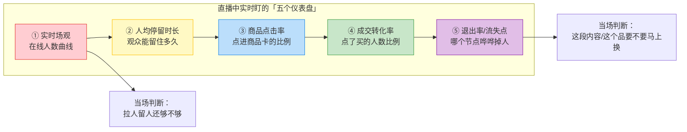
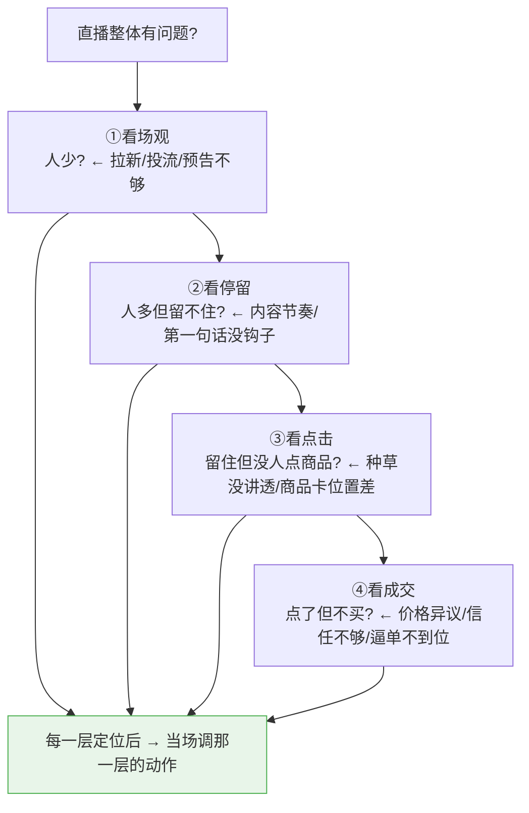
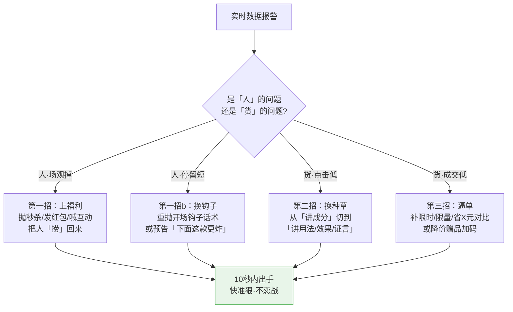

# Day42: 直播实时数据调优——哪段留不住人、哪款没人买，当场看得懂、当场改得动

> 📅 学习日期：2026-08-23
> 🔗 关联笔记：[[00-目录]] | 上一篇：[[Day41-直播选品与排品逻辑]] | 下一篇：Day43
> 🎯 适用场景：「反生活」好物养生账号会排品、会讲品、会带节奏了，但开了几场发现——有的段观众哗啦啦走、有的品挂半天没人拍，**下了播才知道问题，可这场的流量已经浪费了**。这一篇不讲「播完整理复盘」（那是下播后的事），而是讲「**正在直播的当下，怎么从实时数据里一眼看出问题、当场改**」，让每一场直播都变成「边播边优化、越播越懂用户」的活实验
> 📚 学习来源：Day41 直播排品（承接阵型与段位） × Day25 小红书直播带货（承接观看/停留/转化漏斗） × Day38 直播复盘（承接复盘指标） × Day24 内容数据分析（承接数据驱动迭代） × Day37 开学季直播带货（承接场观与GMV目标）

---

## 1. 一句话总结

**直播实时数据调优的本质，不是「播完看回放才知道哪段崩了」，而是「在直播进行中，用场观、停留、点击、出单、退出率这几个实时数字，随时判断『现在这段观众还在不在、这款品卖不卖得动』，然后当场把节奏、话术、品位、逼单强度调过来」——让数据和现场感双线并行，把每一次下播后的遗憾，提前到直播中就地解决。**

**核心认知：** 很多主播的痛点是「数据只会下了播看」，开播时忙着讲品、忙着互动，根本顾不上看数据——等播完打开后台，才发现「开场 10 分钟掉了一大批人」「主推款讲 20 分钟才出 2 单」「套组根本没人点」，但流量已经过去了，只能捶胸顿足。但真正会玩的主播，是「手里讲着品，眼角瞟着实时数据」：**看见进出率异常就马上调开场话术，看见某款点击高但转化低就立刻换逼单打法，看见停留掉就赶紧上福利救场。** 反生活做的是养生好物这种「客单中高、需要信任」的品类，更要「边播边看数据」——因为养生品的转化本来就慢，如果不知道观众在哪个节点犹豫，讲再多也是白搭。**实时数据的价值，不是「播完给你一张成绩单」，而是「播到一半告诉你哪里要踩刹车、哪里要加油门」。** 老黄要学的，就是把自己从「闷头播」练成「一边开车一边看仪表盘的老司机」——看得懂仪表、改得动方向，路才越开越顺。

---

## 2. 核心框架

### 2.1 直播「五个实时仪表盘」——下播前就看得懂的生死指标（承接 Day25/Day38）

直播中需要盯的实时数据不是越多越好，盯太多反而看不过来。真正决定一场直播生死的是「五个仪表盘」，每一个都对应「现在该不该改、怎么改」：



| 仪表盘 | 何时看 | 正常参考 | 异常信号 | 当场怎么改 |
|:----|:----:|:----:|:----|:----|
| 实时场观 | 全程持续看 | 开场拉升、整场波动 | 持续阴跌、突然跳水 | 上福利/抛钩子/拉互动救场 |
| 人均停留 | 每 5 分钟瞟一眼 | 60s+ 算及格 | 某段突然变短 | 那段内容拖沓，立刻快进 |
| 商品点击 | 讲到某款时看 | 点击率 3-5%+ | 讲了半天没人点 | 话术没钩子，换种草方式 |
| 成交转化 | 每款讲完看 | 点击→成交 3%+ | 点击高但成交低 | 价格/信任没到位，上逼单/补证言 |
| 退出率 | 全程看曲线 | 平缓 | 某节点垂直跳水 | 定位到那段，下轮/当场改 |

> **给「反生活」的关键**：别想「五个一起完美盯住」，新手先从「**①实时场观 + ⑤退出率**」两个最直观的入手（一眼就能看懂「人走没走、在哪走的」），等熟悉了再叠加点击率、转化率、停留这三个。**一次只重点盯 1-2 个仪表，比五块表全瞟却都不准强**——这也是 [[Day24-内容数据分析与迭代优化]]「少而准」精神的直播版。

### 2.2 「漏斗四看」实时诊断法——问题出在拉人、留人、点击还是下单

直播的转化是一个「漏斗」，每一层都在漏人。当数据不对时，先别慌，用「漏斗四看」一层层定位「到底漏在哪一层」，才能对症下药：



| 漏斗层 | 卡在这里说明 | 「反生活」最容易漏的一层 | 当场对策 |
|:----:|:----|:----|:----|
| 场观层 | 根本没人进 | 冷启动期流量少（正常） | 预告+投流+私域喊人（承接 Day25） |
| 停留层 | 进来就走 | 开场第一句话没钩住人 | 上福利款/抛互动问题留人 |
| 点击层 | 不点商品卡 | 养生品「讲成分」讲得太专业 | 讲「用了怎么样」而不是「含什么」 |
| 成交层 | 点了不买 | 客单中高需要信任，一次讲不透 | 补用户证言+逼单话术+限时优惠 |

> **给「反生活」的核心**：养生好物最容易漏的是「**成交层**」——因为客单中高、需要信任，观众「点了但不买」很常见。这时候**别急着降价，而是现场补「真实用户反馈 + 场景化使用示范」**，把「信不过」这道坎当场迈过去。

### 2.3 「三段快检」实时节奏调优法——开场、中段、收尾各有一套检查动作

不同段的实时调优重点完全不同，放进一场 60-90 分钟的直播里，就是「三段快检」：

```mermaid
flowchart LR
    subgraph 开场 [开场 0-15min<br/>🔴 拉人留人]
        A[场观没起?<br/>→ 抛福利/抛钩子/喊互动]<br/>[停留掉?<br/>→ 换开场钩子话术]
    end
    subgraph 中段 [中段 15-50min<br/>🟡 转化主力]
        B[主推款点击低?<br/>→ 换种草角度]<br/>[出了单但慢?<br/>→ 上逼单+补证言]
    end
    subgraph 收尾 [收尾 50-锁场<br/>🟢 抬客单冲GMV]
        C[要不要冲量?<br/>→ 上福利返场]<br/>[套组没人买?<br/>→ 补「省X元」对比+限时]
    end

    style A fill:#ffcdd2,stroke:#e53935
    style B fill:#fff9c4,stroke:#ffc107
    style C fill:#c8e6c9,stroke:#43a047
```

> **给「反生活」的关键**：开场最怕「场观起不来还硬讲」，中段最怕「主推款点击低却硬推」，收尾最怕「套组没人买还硬撑」。**三段的信号不同、对策不同，要学会「报错就改、别恋战」**——发现这段的数据不对，马上换打法，而不是一条道走到黑。

---

## 3. 可落地方法

### 3.1 【反生活可直接用】「竖排三格」实时看板——一张纸盯住三个关键数字

不用开一堆后台页面，老黄开播时在手机/平板旁放一张「竖排三格」实时看板，每 5 分钟自动更新一格：

| 时间点 | ①场观（在线） | ②主推款出单 | ③异常信号 |
|:----:|:----:|:----:|:----|
| 开场 0min | 记下初始在线 | — | — |
| +5min | 涨/跌？ | — | 掉人→立即救场 |
| +10min | 是否在拉升 | 首单出了没 | 点击低→换种草 |
| +20min | 是否稳住 | 累计 X 单 | 停留短→快进 |
| +40min | 是否到峰值 | 主推款转化率 | 换主推/加码 |
| 收尾 | 是否守住 | 总单量/客单 | 冲量/上套组 |

> **筹备的复利**：这张表开播前打印/画好，直播中每 5 分钟填一格，播完就是一张现成的「实时数据流水」——当场用来看趋势，下播还能直接喂给 [[Day38-直播复盘与私域复购引擎]] 做复盘，一举两得。老黄把这张表贴在排品九宫格（承接 [[Day41-直播选品与排品逻辑]]）旁边，开播一张排品、一张看数据，两不耽误。

### 3.2 【反生活可直接用】「当场救场三招」——实时数据报警时的即时动作

数据不对时不用慌，实时调优就三招，记住「快、准、狠」：



| 报警信号 | 当场救场动作 | 「反生活」话术示例 |
|:----|:----|:----|
| 场观持续阴跌 | 马上上 9.9 秒杀福利款 | 「刚进直播间的姐妹们，今天第一款福利——9.9 润燥小样，先到先得！」 |
| 主推款讲一半没人点 | 立刻换种草角度，讲「用后效果」 | 「不是我吹，好多老粉反馈喝完一周嗓子不干了，你信我试一次」 |
| 点击高但成交低 | 补限时 + 补证言逼单 | 「今天直播间专属价，比店铺便宜 20，错过就没了——刚才那位姐姐已经拍了」 |
| 套组没人买 | 重讲「省X元」对比 + 限时限量 | 「三样分开 200，今天套组只要 159，立省 41，只上 5 组，抢完就下」 |

> **给「反生活」的核心**：实时调优不是「临场随便改」，而是「**预先备好每类报警对应的救场话术**」，报警一响、直接套用——就像消防员平时就演练好每种火情怎么扑，起火时不用想就出手。老黄把上面这张「救场话术表」打印出来放旁边，就是自己的「直播灭火器」。

### 3.3 【反生活可直接用】「五分钟一瞟」的实时盯数节奏——不慌不忙、且播且看

实时调优最大的敌人不是「看不懂」，而是「盯不过来」。老黄用「五分钟一瞟」节奏，既不耽误讲品，又能及时发现问题：

| 节奏 | 动作 | 看什么 |
|:----:|:----|:----|
| 每 5 分钟 | 瞟一眼场观曲线 | 有没有突然跳水？整体涨还是跌？ |
| 每款开始讲时 | 看该款点击率 | 讲 3 分钟了点击涨不涨？ |
| 每款讲完时 | 看该款成交 | 出了几单？转化率够吗？ |
| 发现异常 | 停 10 秒判断 | 是「人」的问题还是「货」的问题？套救场话术 |
| 其他时间 | 专心讲品 | 别被数据绑架，数据是帮手不是主角 |

> **给「反生活」的关键**：实时调优的「度」很微妙——**数据是提醒你「该不该改」的信号，不是让你全程盯着放的直播**。老黄要练的是「该看时瞟一眼、看完立刻回到讲品」，用 90% 精力讲好货、10% 精力瞟数据，而不是反过来被数据牵着鼻子走。

### 3.4 【反生活可直接用】「下播 2 分钟快存」——把当场的改的记下来，下一场直接用

实时调优的成果，如果不趁热记下来就白改了。下播后 2 分钟内，把「这场改了哪几处、效果如何」快存成一条复盘卡：

| 快存项 | 写什么 | 「反生活」示例 |
|:----|:----|:----|
| 报警点 | 哪段数据报警了？ | 中段主推款点击低 |
| 当场动作 | 怎么救的？ | 换成讲「用后效果」+补证言逼单 |
| 效果 | 救过来了吗？ | 点击从 2% 涨到 6%，出了 5 单 |
| 沉淀规律 | 下场还能用吗？ | 养生品讲「效果」比讲「成分」有效 |

> **给「反生活」的关键**：这张「2 分钟快存卡」做到 10 场以上，就是老黄自己的「实操数据集」——哪些救法好用、哪些品类适用于哪种打法，一目了然。**实时调优的最高境界，是把「当场试出来的对」沉淀成「下一次开播的默认操作」**（承接 [[Day24-内容数据分析与迭代优化]] 的迭代闭环）。

---

## 4. 变现路径

### 4.1 实时调优如何直接换算成「更高的 GMV + 更少的流量浪费」

很多人觉得「实时调优是不起眼的杂活」，但它直接落在钱上——**每救回一段流失的观众、每把一个转化差的主推款调顺，都是在把已经到场的流量变现，而不是等流量走了才后悔**：

```text
不实时调优（闷头播、播完才看）
    开场掉了30%人 → 没救 → 整场少了一半能买的人
    主推款点击2% → 讲了20分钟 → 只出了2单
    套组没人买 → 硬撑到结束 → 客单停在59
    → 流量到了但没接住 → GMV被白白浪费

实时调优（边播边改）
    开场掉人 → 10秒上福利 → 捞回一部分
    主推款点击低 → 当场换种草 → 点击从2%涨到6%
    套组没人买 → 补省X元对比+限时 → 收尾冲到159客单
    → 每一波流量都被最大化 → GMV肉眼可见地涨

实时调优对收入最直接的 3 个放大点：
    ✅ 救回流失观众 → 同样的流量，成单的人更多
    ✅ 当场调顺转化差的品 → 同样的讲解，单量更高
    ✅ 收尾及时抬客单 → 同样的单量，客单更高
```

### 4.2 「实时调优」跟着账号阶段走（承接 Day31/Day37 爬坡模型）

实时调优不是千篇一律，而是跟着「反生活」账号从 0 到月入 1 万不断提档：

| 账号阶段 | 粉丝区间 | 优先盯的仪表 | 调优重点 | 变现关键词 |
|:--------|:--------:|:----|:----|:----------|
| 冷启动期 | 0-1500 | 场观+停留 | 先「留得住人」 | 捞人、攒信任、起权重 |
| 爬坡期 | 1500-4000 | +点击+转化 | 主推款转化调顺 | 单量、客单、效率 |
| 放量期 | 4000-10000 | 全五表 | 精细化+套组抬客单 | 复购、高客单、高效 |

> **给「反生活」的核心提示**：冷启动期**别急着盯成交转化率**（客流少、样本小，转化率没有参考意义），先把「场观和停留」这两个「留人」指标玩明白；等人多了，再去抠点击和成交这些「卖货」指标。**指标的优先级，要跟着账号的成长阶段走，别一口吃成胖子**（呼应 [[Day31-自媒体账号冷启动]] 的节奏感）。

### 4.3 「实时调优 × 下播复盘」——把一次直播变成一套迭代引擎

边播边改不是目的，把「当场试出来的对」沉淀成「下一场的默认操作」，才能让直播越做越顺、越赚越多：

```text
实时调优当场救下这场的GMV
  ↓ 下播2分钟快存（3.4节）记下报警点/当场动作/效果
  ↓ 用快手卡做周复盘（承接 Day38）找出高频报警点
  ↓ 把高频问题提前预防（如开播就把某养生款换成更易懂的种草话术）
  ↓ 下一场开播数据起点更高 → 同流量下GMV更高
  ↓ 持续迭代 → 「反生活」直播越播越懂用户、越播越赚钱
```

> **给「反生活」的关键**：实时调优是「现场的急救」，下播快存是「体检归档」，周复盘是「对症下药的预防」。**三步连起来，直播才能从「每次从头摸索」升级成「一场比一场更顺手、更赚钱」**——这，才是实时调优真正的变现复利。

---

## 5. 行动清单

### ✅ 行动①：做一张「竖向三格」实时看板 + 救场话术表（今天做）

**步骤1（10分钟）：** 按 3.1 节，手画/打印一张「竖向三格」实时看板（①场观 ②主推款出单 ③异常信号），每 5 分钟填一格。

**步骤2（10分钟）：** 按 3.2 节，给「反生活」写四类救场话术各 1-2 句（场观掉/停留短/点击低/成交低），存成「直播灭火器」对照表，打印贴在看板旁边。

**步骤3（5分钟）：** 把这张「看板+救场表」贴到排品九宫格（[[Day41-直播选品与排品逻辑]]）旁边，开播即用。

> **产出：** ✅ 一张实时看板 + 一张救场话术表，「反生活」下播就能边播边盯、报警即救。

### ✅ 行动②：挑「一分钟低点」练一次「当场救场」（今天或明天做）

**步骤1（10分钟）：** 开一场直播，重点盯「实时场观」曲线，一旦发现某分钟明显掉人，立即套用救场话术表里的「上福利」招式。

**步骤2（10分钟）：** 主推款讲到一半时，瞟一眼「点击率」——如果明显低，当场把「讲成分」切到「讲效果+证言」，观察点击是否回升。

**步骤3（5分钟）：** 下播后 2 分钟内，用 3.4 节「快存卡」记下这场改了几处、效果如何。

> **产出：** ✅ 一场「真的在现场动过手调」的实播 + 一条可复用的快存卡，第一次体验「边播边改」的威力。

### ✅ 行动③：攒够 10 张快存卡，做一次「高频报警点」周复盘（本周内做）

**步骤1（持续）：** 每场直播都用快存卡记下「报警点/当场动作/效果」，攒够 10 张。

**步骤2（15分钟）：** 打开这 10 张卡（可混合承接 [[Day38-直播复盘与私域复购引擎]]），找出「最高频的报警点」——是哪一类问题反复出现？（比如「主推款点击低」出现了 7 次）

**步骤3（10分钟）：** 针对最高频问题，提前写一套「预防方案」，下一场开播直接执行（比如把主推款开场就直接用「效果+证言」讲法，不等报警）。

> **产出：** ✅ 10 张快存卡 + 一张「高频报警点」清单 + 一套预防方案，「反生活」直播从「每次救火」升级成「提前防火」。

---

## 📊 今日学习总结

| 维度 | 内容 |
|:----:|------|
| 核心认知 | 实时数据不是「播完的成绩单」，而是「播到一半的仪表盘」——让每一场直播都变成「边播边改」的活实验，把下播后的遗憾提前到直播中就解决 |
| 核心框架 | 五个实时仪表盘（场观/停留/点击/成交/退出）× 漏斗四看诊断法（拉人→留人→点击→下单）× 三段快检节奏（开场/中段/收尾） |
| 关键技能 | 竖向三格看板、当场救场三招（福利捞人/换种草/逼单）、五分钟一瞟节奏、两分钟快存卡 |
| 变现路径 | 实时调优救回流失观众/调顺低效品/收尾抬客单 → GMV最大化；跟着账号阶段从留人→卖货递进；快存+复盘沉淀成迭代引擎 |
| 今日行动 | ① 做实时看板+救场话术表 ② 实播练一次「当场救场」 ③ 攒10张快存卡做高频报警周复盘 |

> 下一篇预告：**Day43: 直播连麦与人设立体化——把「卖货主播」升级成「有人格魅力的账号IP」**，让「反生活」从「会卖货」进一步到「让人记住、让人追着看」。
