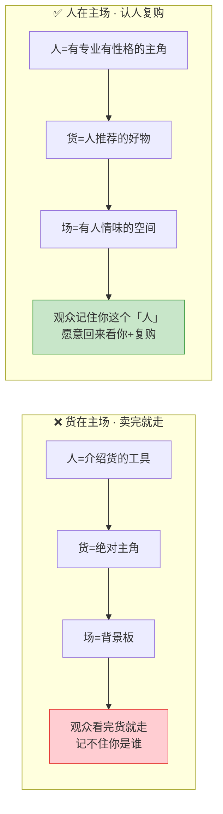
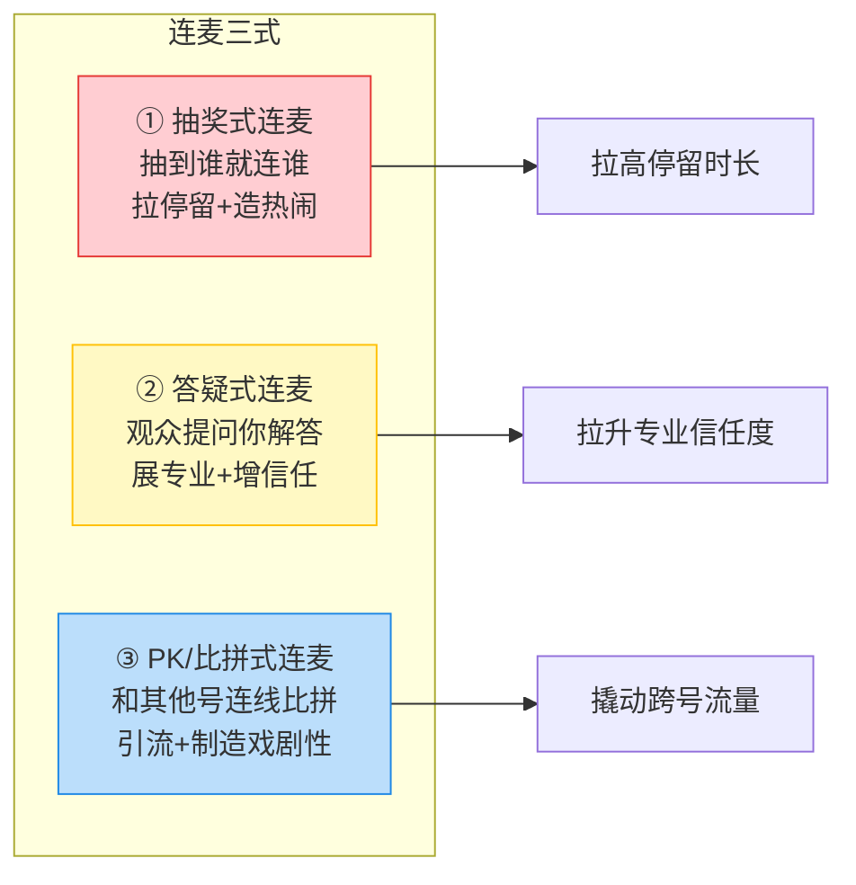
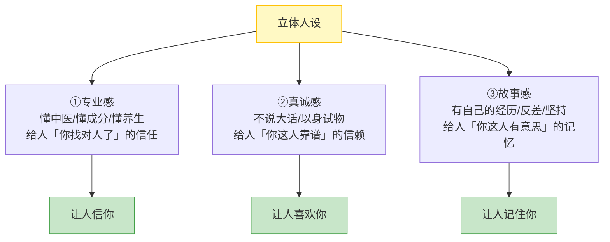
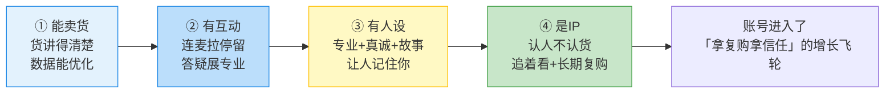
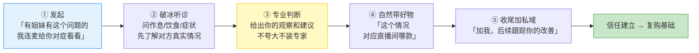

# Day43: 直播连麦与人设立体化——从「卖货主播」升级成「有人格魅力的账号IP」

> 📅 学习日期：2026-08-24
> 🔗 关联笔记：[[00-目录]] | 上一篇：[[Day42-直播实时数据调优]] | 下一篇：Day44
> 🎯 适用场景：「反生活」好物养生账号会排品、会讲品、会实时调数据了，但播了几场发现——**数据再好、转化再好，观众记住的是「这个直播间东西不错」，而不是「这个老黄这个人挺有意思」**。这一篇不讲「怎么卖更多货」（那是 Day39-42 的事），而是讲「**怎么通过连麦和个人人设，把『被数据验证的卖货号』升级成『有温度、有人格、让人追着看的账号IP』**」，让粉丝从「临时买东西」变成「认准老黄这个人长期复购」
> 📚 学习来源：Day42 直播实时数据（承接「会的已经会了，该进阶了」） × Day25 小红书直播带货（承接直播间场域） × Day09 个人IP打造（承接人设底层逻辑） × Day38 直播复盘（承接复购引擎） × Day22 私域复购（承接私域承接人设）

---

## 1. 一句话总结

**直播连麦与人设立体化的本质，是「把单打独斗的卖货吆喝，升级成有来有回、有人格、有故事的『人与人』的连接」——通过连麦制造真实互动、通过人设故事让观众记住你这个人，让「反生活」不再是一个「卖养生品的小黄」，而是一个「有专业、有性格、让人想持续关注、愿意反复回来买」的信任型IP。**

**核心认知：** 很多养生好物主播的痛点是——「货讲得挺好，数据也不错，但观众看完就划走，下次刷到还不认得是你」。为什么？因为直播间只有「货」没有「人」：没有连麦互动，观众觉得「跟我没关系」；没有人设故事，观众记不住「你是谁、你有什么特别」。真正让人记住的主播，靠的不是把一款品讲得天花乱坠，而是「**让观众在和你的互动里，感受到你这个人——你的专业、你的真诚、你的性格，甚至你的故事**」。老黄做的是养生好物这种「客单中高、极重信任」的品类，更是如此——因为**养生复购的核心是信任，而信任的核心是「认人」**：观众信的不是「这款栀子花茶好」，而是「老黄这个人靠谱，他推荐的我放心」。连麦是「让人看见你的互动方式」，人设是「让人记住你的内容底色」，两者合起来，才是一个「立体」的、能长期变现的账号。**老黄要学的，就是把自己从「幕后讲货的」练成「台前有人格魅力的老黄」——连麦时让人愿意留下来听，人设上让人离开直播间还想得起你。**

---

## 2. 核心框架

### 2.1 直播间「人货场」升级版——从「货在主场」到「人在主场」（承接 Day25）

传统直播是「人货场」——人（主播）、货（商品）、场（场景）。但大多数养生主播的直播间是「货在主场」：人只是介绍货的「工具」，场只是背景板，观众看完货就走。要让账号竖起来，得把这三者升级成「**人在主场**」：



| 维度 | 升级前（货在主场） | 升级后（人在主场） | 「反生活」怎么落地 |
|:----:|:----|:----|:----|
| 人 | 张口就是讲成分、讲功效 | 先立人设，再带出货「这是我喝了3个月的真实感受」 | 掌柜≠推销员，是「懂养生的老黄」 |
| 货 | 货是主角，人只是报参数 | 货是「人推荐的信物」，卖的是信任 | 每款品都绑一个「老黄自己的使用场景」 |
| 场 | 白墙+灯光+货架 | 有生活气息、有人味的空间 | 露出真实生活角落，不追求「无菌直播间」 |

> **给「反生活」的关键：** 你做的不是「百货直播间」而是「信任型养生直播间」，**观众买的不是那包花茶，是「老黄这个人推荐的东西我放心」**。所以直播间的第一主角，必须从「货」换成「人」——让观众先喜欢/信任「老黄」，再顺着他的推荐买货，复购才稳。

### 2.2 「连麦三式」——抽奖式、答疑式、PK式，打造真实互动场域

连麦是直播升级「货在主场」到「人在主场」最有效的一招。老黄一个新人最容易上手的「连麦三式」：



| 连麦类型 | 什么时候用 | 核心目的 | 「反生活」落地示例 |
|:----:|:----|:----|:----|
| 抽奖式 | 开场、流量低谷 | 拉停留、造热闹 | 「刷到直播间的姐妹点个关注，3分钟后抽一位连麦送润燥小样」 |
| 答疑式 | 讲品间隙、中段 | 展专业、增信任 | 「有姐妹问湿气重喝什么？我连麦问问你的情况，老黄给你对症推荐」 |
| PK式 | 流量低谷、转场 | 撬跨号流量 | 和同量级养生号连线，互相引流、制造看点 |

> **给「反生活」的关键：** **答疑式连麦是养生号最该练的**——因为养生品极重信任和专业度，观众「心里有疑问憋着不买」很常见，答疑式连麦就是「把观众的疑问当场问出来、当场解答掉」，一边展专业、一边把「信不过」这道坎迈过去（呼应 Day42 的「成交层」瓶颈）。抽奖式用来拉停留造热闹，PK式等账号起来后再玩。

### 2.3 「人设三柱」——专业感 × 真诚感 × 故事感，让人记得住你

连麦提供「互动」，人设提供「记忆点」。一个能被记住的养生号人设，需要三根柱子支撑：



| 人设柱 | 底层问题 | 「反生活」老黄怎么立 | 一句话模板 |
|:----:|:----|:----|:----|
| 专业感 | 凭什么都信你？ | 讲成分但不装专家，用「我查证过的」「老说法的现代解释」 | 「栀子花是中医里的清火好东西，我查阅过文献才敢推」 |
| 真诚感 | 你是不是坑我？ | 不吹牛、以身试物、说清利益关系 | 「这茶我自己喝了3个月，真实才敢推荐，赚的是佣金但绝不瞎吹」 |
| 故事感 | 你是谁、凭什么记你？ | 立「压力大的城市打工人逆袭养生」人设 | 「我之前是996的码农，熬出毛病才开始研究养生的——所以我才更懂手机党要什么」 |

> **给「反生活」的关键：** **养生号人设，真诚感 > 专业感 > 故事感**——因为养生是「健康」范畴，观众最怕被坑。老黄不需要成为医学专家，但「以身试物、不夸大功效、诚实交代利益关系」这三点做到位，信任就立住了一半。**先立「靠谱」，再谈「专业」，最后用「故事」让人记住你。**

### 2.4 「立体化升级」四步走——从「会卖货」到「账号IP」的进阶阶梯

把「连麦三式」和「人设三柱」合起来，就是账号从「卖货号」到「账号IP」的进阶路线：



> **给「反生活」的关键：** 这个进阶是「一层层垒上去」的，别跳。**老黄现在的阶段大概是「①能卖货 → ②有互动」之间**（Day39-42 已经把卖货练顺了），下一步就是把「连麦互动」加进直播间；等互动顺手了，再往里塞「人设故事」，一步步往「被记住、被信任、长期复购」的 IP 走。**急不得，但每一步都在往上垒。**

---

## 3. 可落地方法

### 3.1 【反生活可直接用】「连麦计划卡」——把连麦从「临场慌乱」变成「有脚本的互动」

很多新手不敢连麦，是怕「连上了不知道说什么、冷场」。老黄用一张「连麦计划卡」，让每次连麦都有脚本、不冷场：

| 连麦环节 | 说什么 | 「反生活」示例话术 |
|:----:|:----|:----|
| 开场接住 | 先夸、先接话题 | 「欢迎姐姐进来，今天状态挺好啊，最近睡得怎么样？」 |
| 抛问题破冰 | 问对方情况，别急着卖 | 「你是熬夜晚睡多，还是平时容易累？跟我说说你日常」 |
| 展专业 | 顺着对方情况给建议 | 「你这种就是典型的『熬夜虚火』，日常可以喝点菊花配枸杞」 |
| 带出货 | 自然过渡到相关好物 | 「正好直播间这款就是我给这种体质的人挑的，你先试试小样」 |
| 收尾挂住 | 留下次见面的钩子 | 「这样，你先加我，喝几天有用回来告诉我，我帮你看看效果」 |

> **给「反生活」的核心：** 连麦的黄金顺序是「**先倾听、再专业、后带货**」——**95% 时间在了解对方、给建议，最后 5% 才顺带带出相关好物**。这样既不生硬，又能让观众觉得「老黄是真的关心我，不只是想卖我东西」。这张卡打印出来放直播台前，每次连麦照着走，冷场概率直接减半。

### 3.2 【反生活可直接用】「人设小卡」——三句话立住「老黄是谁」，随时能讲

立人设不需要长篇大论，老黄把「老黄这个人」浓缩成「三句话」，直播中随时能自然而然地讲出来：

| 人设句 | 作用 | 「反生活」示例 |
|:----:|:----|:----|
| 一句话定位 | 让人秒懂你是谁 | 「我是从996熬出毛病、开始研究养生的老黄，专治『城市打工人』的各种亚健康」 |
| 一句话经历 | 制造故事反差 | 「我以前是程序员，咳血住院后痛定思痛研究中医，所以特别懂还在硬撑的你们」 |
| 一句话承诺 | 立真诚感边界 | 「我推荐的每样都是我自己吃/喝/用过的，赚佣金但绝不碰没把握的东西」 |

> **给「反生活」的关键：** 这三句话不是「开播背诵」，而是「**直播时见缝插针、自然而然地抖出来**」——讲品间隙带一句经历、答疑时带一句专业、结尾带一句承诺。**每次直播至少自然带出 1-2 次（开头立身份、中段展专业），让整场直播从「报参数」变成「老黄在跟你聊天带好物」。**

### 3.3 【反生活可直接用】「答疑式连麦脚本」——养生号最强的信任放大器

养生号最值钱的连麦是「答疑式」。老黄照着这套脚本，每场至少安排 1 次答疑连麦：



> **给「反生活」的核心：** 答疑连麦的价值不只是「当场卖那一单」，而是「**让直播间的所有观众连带信了你**」——你在连麦里表现出的专业和耐心，所有围观的人都在看、都在心里打分。**一场走心的答疑连麦，等于给全场做了一次「人设可信度」的免费广告**，比单独讲 10 款品的信任效益还大（呼应 Day22 私域成交的信任逻辑）。

### 3.4 【反生活可直接用】「开场立人设 3 分钟话术」——开播第一句就让观众记住你

真正让观众记住的，往往就是「开场那几句话」。老黄把「人设 + 钩子」压实进开场 3 分钟：

| 时间 | 动作 | 「反生活」话术示范 |
|:----:|:----|:----|
| 0-30s | 亮身份+亮开场钩子 | 「我是老黄，就是从996熬出毛病的那个老黄。今天直播间给各位熬夜打工人准备了节福利，先到先得」 |
| 30s-1min | 立反差故事 | 「你们以为我天生懂养生？错，我以前是写代码的，咳血住院才开始自救——所以我特别懂你们」 |
| 1-2min | 立今晚主题 | 「今晚不谈虚的，就聊『熬夜+湿气』这套城里人标配问题怎么调，顺便带几款我亲测的」 |
| 2-3min | 立互动钩子 | 「有这方面困扰的姐妹评论扣个1，3分钟后我抽一位连麦，现场给你对症看」 |

> **给「反生活」的关键：** 开场是最容易被划走的 30 秒，也是立人设性价比最高的时刻。**把「我是谁 + 我的故事 + 今晚能给你啥」压缩进前 3 分钟，让观众在划走前先对「老黄这个人」产生一点点好奇**——只要他犹豫了、停下来了，后面的内容才有机会。

---

## 4. 变现路径

### 4.1 人设立起来之后，复购和客单都会「肉眼可见」地变化

人设不是虚的，它直接换算成钱——**「认货不认人」的账号，观众只在刷到时才买；「认人不认货」的账号，观众会主动回来追着买**：

```text
卖货号（货在主场）：
    观众刷到 → 觉得货OK → 买一单 → 划走，下次可能忘了你
    → 复购率低、全靠自然流量撞运气、客单上不去（因为不信任高客单）

IP号（人在主场）：
    观众刷到 → 记住「老黄这个人」 → 买第一单 → 加了私域
    → 过几天想起「老黄推荐的那个」 → 主动回来复购
    → 复购率↑、私域承接↑、敢推高客单（因为信任你）→ GMV起飞

人设对收入的 3 个直接放大点：
    ✅ 复购：认人不认货 → 观众从「撞运气买」变成「认准你买」
    ✅ 客单：信任了 → 敢买中高客单的养生套组，而不是只敢试 9.9
    ✅ LTV：加私域 → 从「一锤子买卖」变成「可持续消费的用户」
```

> **给「反生活」的核心：** 养生好物是最典型的「**靠复购和客单赚钱**」的品类，而复购和客单都建立在「信任」上，信任建立在「认人」上。**老黄把直播从「卖货」升级到「卖人设+信任」，等于是给「反生活」装上了一台「复购+高客单」的发动机**——这是单纯优化转化率带不来的长期收益。

### 4.2 「连麦+人设」跟着账号阶段走（承接 Day31 爬坡模型）

连麦和人设不是一步到位，而是跟着「反生活」账号从 0 到月入 1 万逐步加码：

| 账号阶段 | 粉丝区间 | 优先升级什么 | 变现关键词 |
|:--------|:--------:|:----|:----------|
| 冷启动期 | 0-1500 | 先把「货讲好」，偶尔开 1 场答疑连麦试水 | 拉停留、攒信任 |
| 爬坡期 | 1500-4000 | 每场固定 1-2 场答疑连麦 + 开场立人设 | 复购、客单、信任 |
| 放量期 | 4000-10000 | 抽奖/PK式连麦 + 人设故事常态化 | 跨号引流、IP、LTV |

> **给「反生活」的关键提示：** 冷启动期**别急着搞花活**（太多连麦/刺激反而乱），先把「货讲顺 + 开场一句人设」稳住；等粉丝爬坡期，再重点上「**答疑式连麦**」做信任放大；真正起来以后，才玩「PK式连麦」撬跨号流量。**连麦和人设的强度，要跟着账号的信任基础走，别一口吃成胖子**（呼应 Day31 的节奏感 + Day42 别硬开的教训）。

### 4.3 「连麦 × 人设 × 私域」——把直播的信任，沉淀成私域长期复购

连麦和人设建立起来的信任，最终要通过私域承接变现（承接 Day22/Day38）：

```text
直播连麦建立信任
  ↓ 答疑连麦里观众觉得「老黄靠谱」
  ↓ 连麦收尾/开场钩子引导「加我微信/进群」（承接 Day22 私域）
  ↓ 私域里继续人设运营（朋友圈讲养生日常、群内答疑，承接 Day08 朋友圈营销）
  ↓ 私域复购 + 回直播间捧场（承接 Day38 复购引擎）
  ↓ 反哺直播间权重 → 更多自然流量 → 更多连麦机会
  ↓ 「人设信任」的飞轮越转越大 → 账号越做越值钱
```

> **给「反生活」的关键：** 连麦和人设建立的信任，如果只留在直播间就浪费了——**「信任」的最优变现路径是沉淀到私域做长期复购**。老黄把「直播连麦的答疑」和「私域的日常养生陪伴」打通，就能把「临时看直播的人」变成「长期信任你、反复消费的老客户」，这才是养生号真正的护城河。

---

## 5. 行动清单

### ✅ 行动①：写「人设小卡」三句话 + 开场 3 分钟话术（今天做）

**步骤1（10分钟）：** 按 3.2 节，写老黄的「一句话定位 / 一句话经历 / 一句话承诺」三句人设话术，打印出来贴直播台前。

**步骤2（15分钟）：** 按 3.4 节，写一套「开场立人设 3 分钟话术」，压缩进「亮身份→立反差→立主题→立钩子」四段，当场练习念 3 遍。

**步骤3（5分钟）：** 把这张「人设卡+开场话术」贴到实时看板（[[Day42-直播实时数据调优]]）旁边，开播即用。

> **产出：** ✅ 一张人设三句话卡 + 一套开场3分钟话术，「反生活」从「一开始就能被人记住」起手。

### ✅ 行动②：首场「答疑式连麦」实练（今天或明天做）

**步骤1（10分钟）：** 按 3.3 节，把「答疑式连麦脚本」五步（发起→破冰听诊→专业判断→自然带好物→收尾加私域）记熟。

**步骤2（10分钟）：** 开一场直播，中段安排 1 次答疑式连麦——主动抛「有熬夜/湿气困扰的姐妹扣1，抽一位现场对症看」，走完五步脚本。

**步骤3（5分钟）：** 下播后用 Day42 的「2分钟快存卡」，记下这次连麦「冷场吗 / 展专业了吗 / 有带出好物吗 / 效果如何」。

> **产出：** ✅ 第一场真正走完的答疑式连麦 + 一条快存卡，第一次体验「用连麦建立信任」的威力。

### ✅ 行动③：每场加一个「人设自然带出点」，攒 5 场做一次复盘（本周内做）

**步骤1（持续）：** 每场直播，刻意在「开场立身份 / 中段答疑展专业 / 结尾讲承诺」三个点里，至少自然带出 1 次「老黄的故事/专业/承诺」。

**步骤2（15分钟）：** 攒够 5 场后，打开 5 条快存卡，看「哪个人设点观众反应最好」（比如讲到自己咳血经历时停留是不是明显变长、答疑连麦时点关注的人多不多）。

**步骤3（10分钟）：** 把「反应最好的那个人设点」放大成固定开场段落，把「反应弱的人设点」改进或换掉，下一轮直播直接执行。

> **产出：** ✅ 5 场带有人设的直播 + 一张「人设点效果」复盘表 + 一套「反生活」最优人设话术，「反生活」从「偶尔提及」走向「人设常态化」。

---

## 📊 今日学习总结

| 维度 | 内容 |
|:----:|------|
| 核心认知 | 养生号卖的不是货，是「认人」的信任——从「卖货主播」（货在主场）升级到「账号IP」（人在主场），靠连麦制造互动、靠人设让人记住你，才能换来复购和高客单 |
| 核心框架 | 人货场升级版（人在主场）× 连麦三式（抽奖/答疑/PK）× 人设三柱（专业/真诚/故事）× 四步进阶（卖货→互动→人设→IP） |
| 关键技能 | 连麦计划卡、人设三句话小卡、答疑式连麦脚本、开场3分钟立人设话术 |
| 变现路径 | 人设立起来 → 复购↑客单↑LTV↑；跟着账号阶段从「拉信任」到「撬跨号流量」递进；连麦×人设×私域打通成信任飞轮 |
| 今日行动 | ① 写人设小卡+开场话术 ② 首场答疑式连麦实练 ③ 每场加人设点、攒5场复盘 |

> 下一篇预告：**Day44: 私域成交话术与逼单心理学——从「直播间跟进」到「私域一对一成交」的临门一脚**，让「反生活」把直播间和私域里谈下来的意向，真正变成落袋的订单。
