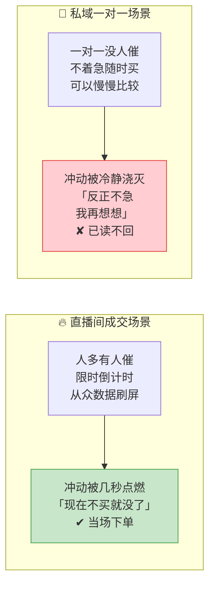
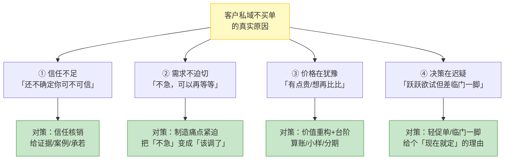
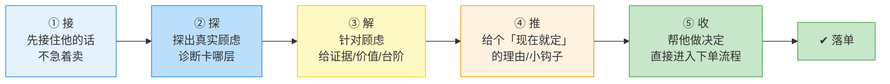

# Day44: 私域成交话术与逼单心理学——从「直播间跟进」到「私域一对一成交」的临门一脚

> 📅 学习日期：2026-08-28
> 🔗 关联笔记：[[00-目录]] | 上一篇：[[Day43-直播连麦与人设立体化]] | 下一篇：Day45
> 🎯 适用场景：「反生活」好物养生账号把直播间人设立体化、连麦答疑铺开了，意识到一个尴尬事实——**直播间里聊得热热闹闹，观众加了微信、进了群，但私域里就是不下单**。别人追着你问「这茶多少钱、怎么买」，你却在私聊里眼睁睁看着对方「已读不回」。这一篇不讲「怎么把流量做进来」（那是 Day44 之后的事），而是讲「**怎么把私域里已经有意向的客户，用一套会说话的话术 + 摸透人心的逼单心理学，落地成实实在在的订单**」——补上从「直播间跟进」到「私域成交」这条变现链路的**最后一米**
> 📚 学习来源：Day43 连麦人设（承接「私域里关系已经升温」）× Day22 私域成交与复购体系（承接私域整体承接）× Day38 直播复盘与复购引擎（承接复购逻辑）× Day08 朋友圈营销（承接私域内容场）× Day07 私域社群运营（承接社群场）× Day27 转化文案（承接文案底层）× Day19 用户心理与行为设计（承接心理底层）× Day04 私域引流转化（承接私域源头）

---

## 1. 一句话总结

**私域成交话术与逼单心理学的本质，是「读懂一个人『现在不买』的真实原因，然后用一套循序渐进的信任推进话术，帮他把『想买但没买的冲动』变成『当下就下单的决策』」——让「反生活」把私域里那些「聊得挺好、就是不掏钱」的意向客户，用会说话的话术和摸透人心的临门一脚，一个个稳稳落地成订单。**

**核心认知：** 很多养生好物卖家的私域痛点不是「没客户」，而是「客户都在、就是不买」——微信里躺着几百个加过的人，群里聊养生聊得热闹，可每次推品要么「已读不回」，要么「我再看看」「考虑考虑」然后没了下文。为什么？**因为私域成交和直播间成交是两套完全不同的逻辑**：直播间里靠「限时抢购 + 从众数据 + 主播情绪」在几秒钟内把冲动点燃；而私域一对一里，客户是「冷静的、一对一的、不着急的」——他没人催、没人抢、有的是时间慢慢想，这时候「冲动」根本烧不起来。所以很多人在直播间里讲成交讲得头头是道（Day39 直播话术），一转到私域就哑火——**因为他们还在用「直播间逼单」的打法，去面对一个「完全冷静的私域客户」**。老黄要学的，就是切换这套逻辑：**先搞懂他在私域里为什么迟迟不下单（信任没到位？价格在犹豫？需求不迫切？），再用「循序推进 + 适度紧迫 + 信任核销」的私域专属话术，一步步把他在私域里被冷静浇灭的那点购买冲动，重新点起来。** 逼单不是「催」，是「帮他做决定」——**私域成交的高手，不是销售，而是那个最懂「你为什么不买、怎么让你放心买」的人。**

---

## 2. 核心框架

### 2.1 私域成交 vs 直播间成交——为什么在直播间会买、到私域就犹豫

先看两种场景的底层差异，这决定了「逼单」必须换打法：



| 维度 | 直播间成交 | 私域一对一成交 |
|:----:|:----|:----|
| 决策氛围 | 限时、从众、抢购，冲动被放大 | 一对一、不着急，心理是「冷静防御」 |
| 对手 | 主播的情绪节奏 | 客户自己的「犹豫点」 |
| 逼单逻辑 | 「你快买，不然没了」 | 「你为什么不买，我帮你打消顾虑」 |
| 核心动作 | 制造稀缺 + 从众 | 挖掘顾虑 + 建立信任 + 促成决策 |

> **给「反生活」的关键：** 私域成交不能照搬直播间的「限时抢购」逼单（客户冷静期根本不吃这套，反而觉得你「太急、像推销」）。**私域里客户「已读不回」不是不想买，而是「现在还有顾虑、还缺一个买的理由」——你的任务不是催，是把他那个「没说的顾虑」挖出来、解决掉，再给他一个「现在就买」的台阶。**

### 2.2 「不买的四个真因」——先诊断客户为什么不下单，再对症下药

私域里客户迟迟不下单，看起来是「各种借口」，但剥开看无非四类真因。**逼单第一步不是张口就推，而是先判断「他卡在哪一层」：**



| 真因 | 典型话术（客户说的） | 真实心理 | 应对策略 |
|:----:|:----|:----|:----|
| ① 信任不足 | 「我自己再看看」「先去别家看看」 | 还没彻底信你这个人/这货 | 信任核销：给真实案例、试饮反馈、退货承若 |
| ② 需求不迫切 | 「不着急，家里还有」「过阵子吧」 | 觉得「调不调都一样」 | 制造痛点：把「亚健康会怎样」讲清楚，点他的恐惧 |
| ③ 价格犹豫 | 「有点贵啊」「能便宜点吗」 | 觉得不值这个价，或有更便宜的备选 | 价值重构：算「每天几毛钱换健康」，给台阶 |
| ④ 决策迟疑 | 「我再想想」「明天再说」 | 已基本想买，就差一个「现在就定」的推手 | 轻促单：给限时小福利、帮他「定下来」 |

> **给「反生活」的关键：** **逼单的第一性原理是先诊断、后开方。** 客户说「再想想」，你上来就「这东西真的很好，错过了后悔」——等于没听懂他卡在哪，反而像推销。**高手先接住他的话，再用一两句问话探出他真实卡在哪一层（「你主要是担心效果，还是觉得价格贵？我帮你看看」），对症下药，一次解决一层。** 诊断对了，逼单就是水到渠成；诊断错了，怎么说都是废话。

### 2.3 「私域逼单五行」——循序推进的成交话术结构

摸清了客户卡在哪一层，真正「逼单」的动作靠一套循序推进的话术结构。老黄直接用「逼单五行」——从破冰接住到临门一脚，五步走：



| 步骤 | 核心动作 | 目的 | 「反生活」示例话术 |
|:----:|:----|:----|:----|
| ① 接 | 先接住，共情，不急着卖 | 让对方卸下防御 | 「姐，我懂，买东西是得想清楚，不着急，你有啥顾虑跟我说说」 |
| ② 探 | 开放式问一句，挖真实原因 | 诊断卡哪层 | 「你是担心效果呢，还是觉得价格方面有点纠结？我好帮你参谋」 |
| ③ 解 | 针对顾虑给证据/价值/台阶 | 打消这一层顾虑 | 「这茶我自己喝了3个月，这是几个顾客的反馈；价格折算一天就几毛钱」 |
| ④ 推 | 给一个「现在就买」的钩子 | 制造适度紧迫 | 「今天下单我给你加赠一包测试装，就当交个朋友，今晚之前有效」 |
| ⑤ 收 | 直接给下单路径，帮他做决定 | 收单 | 「那我直接给你开单了哈，地址还是老样子？发你优惠链接」 |

> **给「反生活」的关键：** 逼单的高阶心法藏在「⑤收」里——**真正的高手从不同「你要不要买」，而是直接假设「你要买」，帮你把「怎么买」的流程走完**（「我直接给你开单了哈」）。给客户一个「顺坡下」的动作，比问「你要不要」少了那个「要不要拒绝我一次」的关卡。**记住：私域逼单是「帮客户做决定」，不是「逼客户下决心」。**

### 2.4 「适度紧迫」的边界——逼单不是施压，是给台阶

逼单最大的误区是「用力过猛」，把客户逼走。老黄划出「适度紧迫」的红线：

```text
❌ 错误的「死缠烂打」式逼单：
    「这茶真的超好，错过真的会后悔！」
    「你还要考虑多久？再不定就没了！」
    「你之前不是说考虑吗，考虑了没？」
    效果：客户觉得被骚扰、被推销 → 拉黑/屏蔽/已读不回

✅ 正确的「适度紧迫」式逼单：
    「姐，我看你是真喜欢这茶，今天下单我额外送你一包测试装，就当老黄交个朋友」
    「这款的测试装这周就发完了，你要的话我帮你预留一份」
    「不着急，你先考虑；有需要随时喊我，我一直在」
    效果：客户觉得你在帮他、他有掌控感 → 反而更容易下单
```

> **给「反生活」的关键：** **私域逼单的紧迫感，要「给台阶」而不是「给压力」。** 凡是让客户觉得「被逼着买」的话术，都在透支信任（呼应 Day43 的真诚感）；凡是让客户觉得「你在帮我省心、帮我抢到福利」的话术，都在加分。**逼单的内核是「我站在你这边帮你划算」，而不是「我在催你掏钱」。** 一句话分辨：让客户舒服地「顺坡买」，别让他别扭地「被逼买」。

---

## 3. 可落地方法

### 3.1 【反生活可直接用】「私域四问诊断话术」——一句话问出客户卡在哪

逼单第一步永远是把话接住、然后挖真因。老黄把这套「诊断四连问」背熟，遇到任何「再说/想想」的客户都能快速定位：

| 客户反应 | 接住的话 | 探测的问题 | 判断 |
|:----:|:----|:----|:----|
| 「我看看」 | 「应该的，买东西得看清楚」 | 「姐，这茶你主要顾虑是担心效果，还是口感方面？我帮你介绍」 | 信任/需求层 |
| 「有点贵」 | 「是，养生这块得花点心思」 | 「你平时喝的这个价位大概什么范围？我看看有没有更适合你的方案」 | 价格层 |
| 「再等等」 | 「不急，身体调整也讲个节奏」 | 「你现在是已经有湿气/睡眠困扰了，还是想先备着预防？」 | 需求迫切层 |
| 直接「已读不回」 | 隔天自然跟一条 | 「姐，昨天看你问完就没影了，是没考虑好还是有别的情况？不买也没事，我帮你把把关」 | 综合层 |

> **给「反生活」的核心：** 诊断的价值在于**不猜**——与其自己瞎猜客户为什么不买，不如用一句「开放式的问话」让他自己说出来。**客户嘴上说「我再看看」，心里往往已经有一个具体顾虑（怕没效果/觉得贵/不确定谁家的好）——你把这层问出来，逼单就成功了一半。** 哪怕他最后没买，这场对话也让他记住了「老黄是真心为我着想」的靠谱印象（埋下复购种子）。

### 3.2 【反生活可直接用】「信任核销三件套」——把「信不过」用证据碾平

私域里最大的拦路石是「信任不足」。老黄提前准备好「信任核销三件套」，客户一犹豫就能随手甩出来：

| 核销工具 | 怎么准备 | 「反生活」用法 |
|:----:|:----|:----|
| 真实反馈截图 | 平时主动收集顾客的使用反馈（文字/图片/对比） | 「姐你看，这位也是湿气重，喝了一个月觉得舌苔清爽了，这是她原话」 |
| 自己的亲测记录 | 自己服用的真实过程/前后对比/打卡 | 「这茶我自己连着喝了90天，这是我每天的记录，真实才敢推你」 |
| 兜底承诺 | 明确的售后保障（不满意可退/可换） | 「你先喝，真不合适，拆了也能找我，老黄给你兜底，不让你吃亏」 |

> **给「反生活」的核心：** 养生品客户最怕「被坑、无效、白花钱」——这三样恰恰都能用「信任核销三件套」提前堵住。**别等客户问「可信吗」才被动找证据，提前备好，聊到信任卡壳时随手发出去，比空口说「真的很好用」有说服力十倍。** 真实反馈、亲测记录、兜底承诺，三张牌轮着出，信任这道坎就过去了，下单自然不动声色。

### 3.3 【反生活可直接用】「算账逼单法」——把「贵」用数字重新讲成「划算」

价格犹豫是私域最常见的卡点，光说「不贵」没用，老黄用「算账法」把单价重构成「每天几毛钱」的小账：

```text
❌ 客户：「这个花茶套装 168 有点贵啊」

❌ 错误应对：直接降价或说「已经很便宜了」（掉了价值，伤信任）

✅ 算账法三步：
   ① 拆账：「姐你看，这一套 30 包，够你喝一个月」
   ② 换算：「168 ÷ 30 = 每天才 5 块 6，就是你一杯奶茶的钱」
   ③ 上价值：「每天一杯奶茶钱，换你自己一个月的清爽舒畅，哪个更值？」
   → 客户瞬间觉得「原来这么划算」，不纠结价格了
```

> **给「反生活」的关键：** **「贵」不是绝对值，是「值不值」的判断题。** 单独说「不贵」是空话；把总价拆成「每天/每次」的小账，客户的心理负担就大幅降低（呼应 Day19 用户心理的锚定效应）。**算账法再叠加上健康价值（一杯奶茶钱换健康），客户就从「纠结 168」变成「每天都划算」——价格这道坎，用数字和心理一起过掉。**

### 3.4 【反生活可直接用】「临门一脚五选一」——客户「就差下单」时，给他一个顺坡

当客户已经「跃跃欲试」就差下单时，别干等，老黄用一个「临门一脚」直接把他推过去：

| 逼单话术 | 适用情况 | 心理机制 |
|:----:|:----|:----|
| 「我直接给你开单了哈」 | 已明确想买 | 帮客户做决定（最直接的一脚） |
| 「给你预留一份，别犹豫太久」 | 在意稀缺的客户 | 给「抢到」的掌控感 |
| 「今天下单送你一包测试装」 | 需要小福利推一把 | 给「多赚了」的划算感 |
| 「你先买一包试试，好再回购」 | 怕一次投入太大的 | 降低决策门槛 |
| 「要不你先试这个 9.9 测试装？」 | 完全没把握的 | 用低价钩子先破冰、再养复购 |

> **给「反生活」的核心：** **临门一脚的技巧是「给动作，不给问句」**——与其问「你要买吗」（给对方一个拒绝的机会），不如直接给一个「购买的动作/路径」（让对方顺着做）。**「我直接给你开单了哈」比「你要不要买」的成交率高得多，因为前者默认「你要买」，后者默认「你可能不买」。** 老黄把五选一背熟，遇到「就差一脚」的客户，随手挑一个最合适的，把他顺顺当当扶进门。

---

## 4. 变现路径

### 4.1 私域逼单是「把存量意向变现」——比拉新便宜太多

很多人忽视私域逼单的价值，觉得「还不如去多拉几个新客」。但算一笔账就懂：

```text
拉新成本 vs 私域逼单成交：
    拉一个新客：要投流、要内容、要时间 → 获客成本高、周期长、有不确定性
    逼单一个存量意向：客户已经在私域里 → 只需一套话术推一把 → 几乎零成本、立刻见效

这就是为什么私域逼单的 ROI 极高：
    一个「加了微信意向明确」的客户，逼单成功 = 白赚一单（获客成本=0）
    10 个意向逼单成交 3 个 = 30% 转化，比分发涨粉变现快太多
```

> **给「反生活」的关键：** **私域里每个「聊过、问过、看过但没买」的人，都是一张「已经到手的彩票」。** 老黄与其一门心思扑在「抢新流量」（辛苦了却不一定转化），不如先把私域里这批「存量意向」用逼单话术一张张兑掉——**这是当前阶段性价比最高的变现动作：零获客成本，一通私聊就可能落地一单。**

### 4.2 「逼单 × 复购」——一单成交只是起点，算清 LTV 才算会卖

私域逼单不是「卖一单就走」，而是「用第一单撬动长期复购（呼应 Day38 复购引擎）」：

```text
私域逼单 → 成交第一单
    ↓ 成交后不是结束，是「关系深化」的开始
    ↓ 加服务：跟进使用、答疑、邀反馈（让客户觉得「买对了、还在被照顾」）
    ↓ 复购：喝完了自然找你回购（订阅式复购）+ 顺带推其他适合的品（交叉销售）
    ↓ 转介绍：满意的客户介绍朋友（老带新，私域裂变）
    ↓
一单成交 → 客户终身价值（LTV）被持续放大
    「一个是买1单168的客户」
    vs「一个是买10单+转介绍3个朋友的客户」
    → 逼单高手经营的是后者
```

| 阶段 | 动作 | 对「反生活」的收入影响 |
|:----:|:----|:----|
| 首单 | 逼单话术落地意向 | 拿到第一笔现金流 |
| 复购 | 跟进+答疑+邀反馈 | 建立订阅式复购，稳定月销 |
| 裂变 | 满意客户转介绍 | 零成本获客，滚雪球 |
| 全 LTV | 交叉销售 + 提客单 | 同一客户越做越值钱 |

> **给「反生活」的关键：** **逼单的终点不是「卖出这一单」，而是「开启和这个客户的一段长期关系」。** 第一单是「破冰」，真正赚钱的是后面源源不断的复购和转介绍。老黄把「逼单成交」当成「客户关系的起点」来做——成交后立刻安排跟进回访，让客户从「买了一次的老黄客户」变成「长期信任、反复回购、还帮忙介绍」的老黄铁粉，这才是私域变现的完整闭环。

### 4.3 「私域逼单 × 反生活」——从单个意向到一个可持续的私域成交漏斗

把逼单逻辑嵌入整个账号变现链路，就是「反生活」从流量到现金的完整闭环：

```text
公域流量（小红书/直播间）
  ↓ 加微信/进群（承接 Day04/Day22 私域引流）
  ↓ 私域内容场持续种草（Day08 朋友圈 + Day07 社群）
    ↓ 每天沉淀一批「看过、有意向但没买」的存量客户
  ↓ 私域逼单五步（接→探→解→推→收）逐个跟进变现
  ↓ 成交 → 跟进复购 → 转介绍裂变（Day38 复购引擎）
  ↓ 私域口碑反哺直播权重 → 更多自然流量 → 更多意向
  ↓ 「私域成交」飞轮越转越快 → 账号现金流越来越大
```

> **给「反生活」的关键：** **逼单不是孤立一招，而是整条「公域种草 → 私域承接 → 一对一成交 → 复购裂变」变现链路的「临门一脚」。** 前面的流量、内容、私域都铺好了，就差这「最后一米」把意向变成现金。老黄把这套逼单话术练熟，等于给「反生活」这条变现流水线，装上了最关键的「出货口」。

---

## 5. 行动清单

### ✅ 行动①：背熟「私域四问诊断话术」+ 分装「信任核销三件套」（今天做）

**步骤1（15分钟）：** 把 3.1 节的「私域四问诊断话术」抄到手机上（备忘录/便签），把「看看/贵/等/已读不回」四种客户反应的对应接话和探因，逐条背熟。

**步骤2（20分钟）：** 按 3.2 节准备「信任核销三件套」——从过去聊天里翻出至少 3 条真实顾客反馈截图、自己拍一张亲测记录、写好一段兜底承诺话术，全部归到一个手机相册/收藏夹，随时能甩。

> **产出：** ✅ 诊断话术背熟 + 信任核销三件套备好，「反生活」的私域逼单「弹药库」正式上线。

### ✅ 行动②：今天找 1-2 个「聊过没下单」的意向客户，实战走一遍逼单五行（今天做）

**步骤1（10分钟）：** 从微信里挑出 1-2 个「之前聊过养生、加了微信但从没成交」的意向客户。

**步骤2（15分钟）：** 按「逼单五行」（接→探→解→推→收）主动私聊跟进——先用「姐，最近看你关注养生这块，帮你把把关」开场，逐步走完五步。

**步骤3（5分钟）：** 记录这次对话「探到卡哪层 / 用了哪个解 / 成没成交」，存进实时数据看板（呼应 Day42 的数据记录习惯）。

> **产出：** ✅ 1-2 场真实私域逼单实战 + 一条成交复盘记录，第一次体验「把私聊的意向变成订单」的临门一脚。

### ✅ 行动③：把「算账法」和「临门一脚五选一」打印成小卡，贴到手机壳/工作台（本周内做）

**步骤1（10分钟）：** 把 3.3 的「算账逼单法」三步（拆账→换算→上价值）和 3.4 的「临门一脚五选一」整理成一张「逼单小卡」。

**步骤2（5分钟）：** 打印出来夹在手机壳后面 / 设置成手机备忘录置顶，每次私聊成交时随时查。

**步骤3（本周）：** 本周内至少用「算账法」处理 2 次客户的「贵」说，用「临门一脚」促成 2 次本会流失的成交，验证哪个最顺手。

> **产出：** ✅ 逼单小卡随身可查 + 一周内多个实战验证，「反生活」的私域逼单从「会背话术」走向「用得顺手」。

---

## 📊 今日学习总结

| 维度 | 内容 |
|:----:|------|
| 核心认知 | 私域成交 ≠ 直播成交——私域客户是冷静防御的，逼单不是「催」，是「找出他不买的真因、帮他打消顾虑、再给一个顺坡下单的台阶」，把私域里「聊得好就是不买」的存量意向稳稳落地成订单 |
| 核心框架 | 私域 vs 直播成交差异 × 不买的四真因（信任/需求/价格/决策）× 逼单五行（接→探→解→推→收）× 适度紧迫边界 |
| 关键技能 | 私域四问诊断话术、信任核销三件套、算账逼单法、临门一脚五选一 |
| 变现路径 | 存量意向变现ROI最高；成交是起点，用复购+转介绍放大LTV；嵌入「公域种草→私域承接→成交→裂变」完整漏斗 |
| 今日行动 | ① 备好诊断话术+信任核销件 ② 实战走一遍逼单五行 ③ 做讨账+临门一脚小卡并验证 |

> 下一篇预告：**Day45: 私域成交后的客户关系经营与复购唤醒——从「成交一单」到「养出一批终身客户」的长期经营**，让「反生活」把逼单成交的客户，真正变成持续复购、主动转介绍的老铁。
