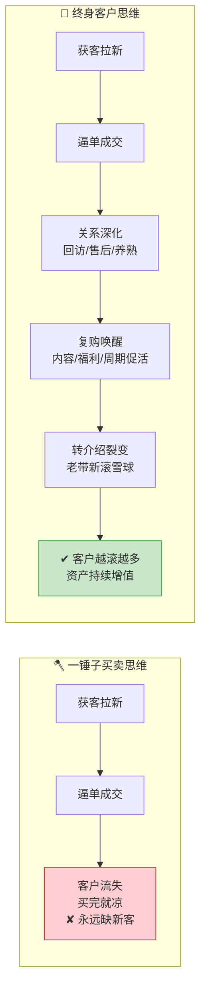
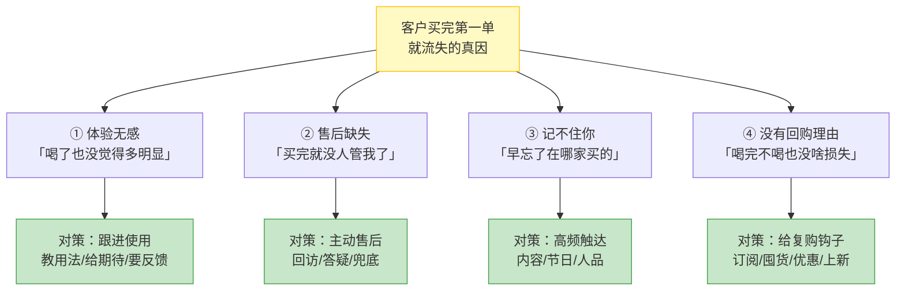
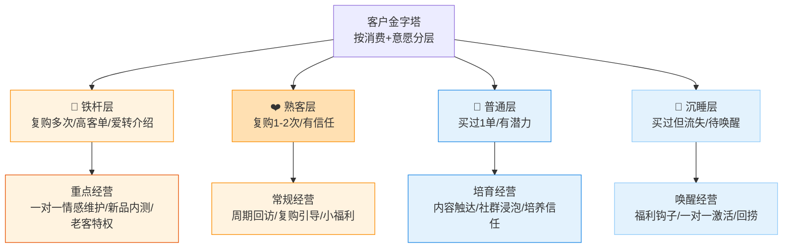
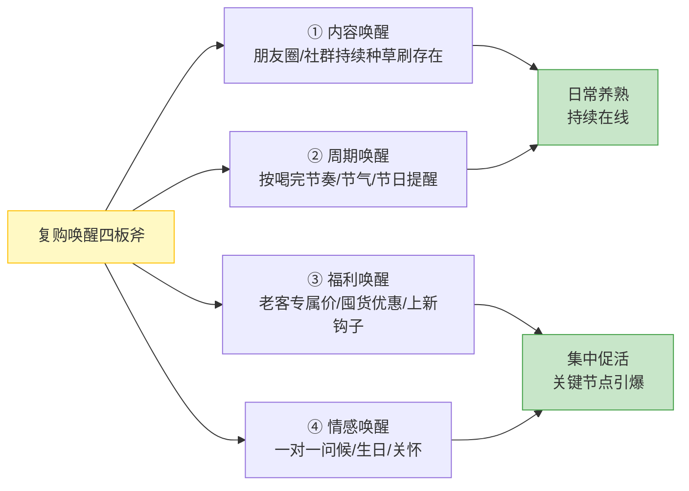

# Day45: 私域成交后的客户关系经营与复购唤醒——从「成交一单」到「养出一批终身客户」的长期经营

> 📅 学习日期：2026-08-30
> 🔗 关联笔记：[[00-目录]] | 上一篇：[[Day44-私域成交话术与逼单心理学]] | 下一篇：Day46
> 🎯 适用场景：「反生活」好物养生账号花大力气把私域逼单的话术练熟、把意向客户一个个落地成订单了，但很快发现一个扎心的现象——**成交完就凉了**：客户买了第一单，喝完了也不回来，发朋友圈推新品也不理你，之前聊得热乎的那些人，成交后反而慢慢失联了。这一篇不讲「怎么把第一单卖出去」（那是 Day44 的事），而是讲「**成交之后怎么办**」——怎么把「买过一次」的客户，养成「反复回购 + 主动转介绍 + 一有新品就来问」的终身客户，把一单生意变成一辈子的生意
> 📚 学习来源：Day44 私域逼单（承接「成交临门一脚」）× Day22 私域成交与复购体系（承接「复购系统」）× Day38 直播复盘与复购引擎（承接「复购机制」）× Day08 朋友圈营销（承接「私域内容场」）× Day07 私域社群运营（承接「社群场」）× Day19 用户心理与行为设计（承接「心理底层」）× Day04 私域引流转化（承接「客户源头」）× Day31 账号冷启动（承接「整体运营」）

---

## 1. 一句话总结

**私域成交后的客户关系经营与复购唤醒的本质，是「把『购买』这个一次性动作，变成一段可以持续兑现的『长期关系』」——让「反生活」用一套「成交即开始 + 分层养熟 + 周期唤醒 + 转介绍裂变」的客户经营体系，把那些「买过一次就凉」的客户，一个个养成「反复复购、主动转介绍、逢新品必问」的终身客户。**

**核心认知：** 很多养生好物卖家都有个共同的误区——**把「成交」当成终点**：逼单成功、客户付了钱，就以为「这单做完了」，然后扭头去开发下一个新客户。结果就是永远在「拉新 → 成交 → 拉新」的循环里打转，每个客户只贡献一单，累死累活却挣不到钱。为什么？**因为「成交」根本不是终点，恰恰是「客户关系的开始」**——你花那么大代价获客、逼单，换来的不应该是「一锤子买卖」，而是一个「已经被你验证过、愿意为你的产品掏过钱」的优质客户资产。可惜绝大多数卖家把这座金矿贱卖了：成交后客户没人管、没回访、没售后、没复购引导，于是那些「明明可以复购、转介绍、贡献长期价值」的客户，买完一单就流失了。**老黄要切换的，是把客户当「终身资产」经营的心智：成交后立刻安排「关系深化」，通过「分层」识别哪些是高价值客户、哪些待唤醒，用「内容触达 + 周期唤醒 + 福利钩子」把客户一次次唤回来，再靠「转介绍机制」让满意的客户帮你裂变出新客——客户经营的本质，是把「一单的利润」放大成「一辈子的利润」。** 不会经营客户的人，永远缺客户；会经营客户的人，客户越滚越多。

---

## 2. 核心框架

### 2.1 「成交即关系」——为什么成交后更重要，而不是更轻松

很多卖家「成交后失联」，根源是把成交当终点。先看清两种经营逻辑的天壤之别：



| 维度 | 一锤子买卖思维 | 终身客户思维 |
|:----:|:----|:----|
| 成交的意义 | 「卖掉一单，任务完成」 | 「开启一段长期关系」 |
| 成交后的动作 | 失联，去开发新客户 | 立刻回访、售后、养熟 |
| 客户价值 | 一单利润（18-168元） | 复购+转介绍+全LTV（成百上千） |
| 获客压力 | 永远在拉新，越做越累 | 老客养熟转介绍，越做越轻松 |

> **给「反生活」的关键：** **成交不是生意做完，是生意才算真正开始。** 那单成交里不只有「一单的利润」，还藏着「这个客户未来所有复购 + 所有转介绍」的终身价值——你不好好经营，就等于把这座金矿白白扔了回头再去挖新矿。**老黄要养成「成交即开始」的惯性：每成交一单，不是松口气去拉新，而是立刻进入「经营这个客户」的模式。** 一锤子卖货的人永远在「找下一个」，终身经营的人客户自己会「回来 + 带人来」。

### 2.2 「复购四道坎」——为什么客户买完第一单就不回头的真实原因

客户不回购，表面是「没需求了」，剥开看无非四道坎。**唤醒复购的第一步，是搞懂他为什么没回来：**



| 真因 | 客户心理 | 应对策略 | 「反生活」动作 |
|:----:|:----|:----|:----|
| ① 体验无感 | 「喝了没感觉，喝不喝都一样」 | 跟进使用，教方法、给期待 | 回访时教「正确的喝法/最佳搭配」，给足期待 |
| ② 售后缺失 | 「买了就没人管，感觉被抛弃」 | 主动售后，有人情味 | 主动回访「喝得怎么样/有啥问题随时找我」 |
| ③ 记不住你 | 「卖家那么多，忘了是你」 | 高频触达，刷存在感 | 朋友圈/社群持续内容触达，让人记住老黄 |
| ④ 没回购理由 | 「喝完不喝也没啥，不着急」 | 给复购钩子，制造回购动因 | 囤货装、订阅制、上新福利、老客专属价 |

> **给「反生活」的关键：** **客户不回购，八成不是「不需要」，而是「没被唤醒」。** 保健养生品尤其如此——它不是「用完立刻见底」的快消，而是「可喝可不喝」的改善品，客户买一次放到过期都可能不回购。**所以养生品卖家必须自己「造复购」，不能等客户自己想起来。** 老黄逐一对症：怕无效就教用法给期待、怕被抛弃就主动售后、怕被遗忘就高频触达、没有理由就想办法给个「回来买」的钩子——四道坎一坎坎过，复购自然发生。

### 2.3 「客户金字塔」——把客户分层，用不同的钱和力去经营

不是所有客户都值得花同样的精力。老黄用「金字塔分层」把客户分出轻重，资源花在刀刃上：



| 层级 | 特征 | 经营力度 | 目标 |
|:----:|:----|:----|:----|
| 👑 铁杆 | 复购多次、高客单、爱分享 | 一对一情感维护、VIP特权、新品内测 | 锁定，让他们帮你转介绍 |
| ❤️ 熟客 | 复购1-2次、有信任基础 | 周期回访、复购引导、小福利 | 升级成铁杆 |
| 🙂 普通 | 买过1单、有潜力 | 内容触达、社群浸泡、养信任 | 培养成熟客 |
| 🧊 沉睡 | 买过但流失、很久没理 | 福利钩子 + 一对一唤醒 | 激活回捞 |

> **给「反生活」的关键：** **养生好物尤其容易「买一单就沉」**——老黄最贵的资源是时间，不能对每个客户都一对一跪舔。**先用标签把客户分层（买过几单、多久没买、客单多少），然后把主要精力投给「熟客层」和「沉睡层」：** 熟客层一催就能复购，沉睡层一钩就能唤醒，两个都是「投入小、回报快」的金矿；铁杆层稳稳维护让他们主动转介绍；普通层慢慢用内容养着别放弃。**会经营客户的人，把80%的力气花在20%最值得的客户身上，颗粒归仓。**

### 2.4 「复购唤醒四板斧」——把沉睡客户一次次勾回来的四套打法

客户分层后，关键动作是「唤醒」。老黄用「复购唤醒四板斧」，针对不同状态客户轮流出招：



| 板斧 | 做什么 | 什么时候用 | 「反生活」示例 |
|:----:|:----|:----|:----|
| ① 内容唤醒 | 朋友圈/社群持续输出有用内容 | 日常持续 | 发「湿气重怎么调理」「这周喝啥茶」养习惯 |
| ② 周期唤醒 | 按「快喝完」节奏/节气/节日提醒 | 喝完时/换季/节日 | 「距上次买茶过去45天了，你的茶应该快喝完了吧」 |
| ③ 福利唤醒 | 老客专属价/囤货/上新钩子 | 活动节点/沉睡客户 | 「老客专属：这次回购立减30，只给你的价」 |
| ④ 情感唤醒 | 一对一问候/生日关怀/答谢 | 特殊节点 | 「姐，看你朋友圈说最近睡不好，老黄给你支个招」 |

> **给「反生活」的关键：** **复购唤醒不是「三天打鱼两天晒网」，而是「日常养熟 + 节点引爆」的组合拳。** 内容唤醒是「地基」，让客户天天在朋友圈/社群看到你、记住你（呼应对照 Day08 Day07）；周期唤醒是「精准提醒」，卡着客户「快用完了」的节奏提醒他该回购了；福利唤醒和情感唤醒是「引爆点」，在换季、节气、活动、特殊节点给一个「回来买/回来聊」的钩子。**四板斧轮着用，客户就永远「在你眼前」，复购就是水到渠成。**

---

## 3. 可落地方法

### 3.1 【反生活可直接用】「成交落地五件事」——每一单成交后必做的收尾动作

很多卖家成交后就失联，是因为「不知道成交后该做啥」。老黄把「成交后的动作」固化成标准「落地五件事」，每单必做：

| 步骤 | 动作 | 目的 | 「反生活」示例 |
|:----:|:----|:----|:----|
| ① 确认订单+感谢 | 成交后立即确认、道谢 | 给好第一印象 | 「姐，这单我帮你安排，今天就给你发出，谢谢你信任老黄」 |
| ② 教用法+给期待 | 发使用说明、教正确喝法 | 减少无效体验、埋复购因 | 「这茶建议每天1-2包饭后喝，坚持两周看舌苔变化」 |
| ③ 约定回访时间 | 提前约好回访节点 | 制造「有人管我」的安心 | 「姐，一周后我微信问问你喝着怎么样，有问题随时喊我」 |
| ④ 打标签分群 | 记下客户买到啥/偏好/客单 | 为后续分层唤醒打基础 | 存备注：李姐-湿气茶168×1-8/30购 |
| ⑤ 邀请进圈 | 引导进社群/关注朋友圈 | 进私域内容场持续触达 | 「姐，拉你进我们的养生群，平时有调理知识都发群里」 |

> **给「反生活」的核心：** **成交是经营客户的起点，这五件事就是「关系深化」的出厂动作。** 前两步让客户「买得放心、喝得有效」，第③步制造「有人管」的售后感（堵住「售后缺失」这道坎），第④步为分层打标签，第⑤步把客户圈进持续触达的池子。**看着琐碎，但五件事做全套，客户记住你的概率和精神感知完全不同——成交后那「多做的五分钟」，是拉开你和普通卖家差距的关键。**

### 3.2 【反生活可直接用】「复购续订卡」——用「快用完」节奏精准唤醒回购

养生品的复购最容易卡在「不知道客户快喝完了」。老黄用一张「复购续订卡」，精准卡住每一单的回购时机：

```text
【复购续订卡】——算出每单「该提醒回购」的日期
  湿气茶（30包/月）：买后第 25 天 提醒回购
  睡眠茶（20包/月）：买后第 22 天 提醒回购
  花茶套装（30包/月）：买后第 28 天 提醒回购
  …每类产品定一个「回购提醒日」，记到表格/备忘录里

  到日期的回购话术：
  「姐，你这包茶应该快喝完了吧？我看还有几天的量，
    正好碰上这批新到货，老客回购我帮你留个优惠，要帮你续上吗？」
  → 精准踩在「快用完了」的节点，客户回购的犹豫最小
```

> **给「反生活」的核心：** **养生品复购的黄金时机，是「上一单快用完」那个节点**——早了客户还有存货不急，晚了他已经断供想不起来。**老黄给每类产品设一个「续订提醒日」，把上单的销量、日期记下来，到点主动提醒，等于把「被动等回购」变成「主动掐着点续订」。** 这招把复购从「碰运气」变成「可预期的现金流」，是养生品卖家复购率翻倍的第一功臣。

### 3.3 【反生活可直接用】「沉睡客户唤醒五连击」——把几个月没回头的客户一次次捞回来

私域里总有「买过一次就休眠」的沉睡客户，这是复购增长最大的富矿。老黄用「唤醒五连击」，唤醒沉睡客户不靠一次轰炸，靠连招：

| 连击 | 触达方式 | 话术/内容 | 目的 |
|:----:|:----|:----|:----|
| 第1击 | 朋友圈内容 | 发一条「老客户回访周」预告 | 制造活动和期待 |
| 第2击 | 社群+私发 | 「姐，好久没见你，最近还好吗？」 | 情感破冰，唤醒记忆 |
| 第3击 | 专属福利 | 「老黄给老客户留了专属回购券」 | 给一个「回来买」的理由 |
| 第4击 | 上新/换季提醒 | 「秋冬换季，这茶正合适，老客优先」 | 用新品/节气再刺激一把 |
| 第5击 | 最后一次+留门 | 「不买也没事，老黄随时在，有事找我」 | 不逼，留回头的余地 |

> **给「反生活」的核心：** **唤醒沉睡客户，最忌「一次不成就算了」和「死缠烂打」。** 五连击讲究「循序渐进」：先让他在内容里预热，再用情感破冰，然后给福利、上节点，最后留门不逼。**唤醒不是「催他再买一单」，而是「让这个还记得你、信任过你的客户重新想起你」，只要他没拉黑你，每一击都在累积「回头」的概率（呼应 Day22 私域复购体系）。** 老黄给沉睡客户建个列表，每周挑一两个走一遍五连击，沉睡的资产就一块块被激活。

### 3.4 【反生活可直接用】「转介绍三连」——让满意的客户主动帮你带新客

复购只是客户价值的一半，另一半是「转介绍」。老黄用「转介绍三连」，让满意的客户心甘情愿帮你拉新客：

| 连招 | 动作 | 话术/机制 | 目的 |
|:----:|:----|:----|:----|
| ① 体验好再提 | 等客户反馈好、真正满意了再开口 | 「姐，看你这茶喝得不错，身边要有朋友也湿气重，你顺手介绍给我」 | 时机对了才开口，不讨人嫌 |
| ② 给介绍礼 | 老带新双方都得实惠 | 「你朋友来报你名字，你俩都送一包测试装」 | 用双向福利撬动分享 |
| ③ 晒反馈造势 | 把真实好评/转介绍晒进朋友圈 | 发「感谢李姐推荐她闺蜜来买」 | 让更多老客户产生「我也该介绍」的从众 |

> **给「反生活」的核心：** **转介绍不是「求客户帮你卖」，而是「让客户因为满意 + 有好处 + 有面子，顺手推荐」。** 关键在时机和机制：一定等客户「说好」了再开口（不然像推销）；给「双方都拿礼」的机制化解「介绍=麻烦」的心理；再把满意的反馈晒出来造从众氛围（呼应 Day19 用户心理）。**一个满意的老客户背靠背能带来几个新客，而新客的获取成本几乎为零——转介绍是客户经营里 RO 最高的裂变引擎。**

---

## 4. 变现路径

### 4.1 「一单变一客户」——复购率每提升1%，利润增长远大于拉新

客户经营的变现价值，在于把「单次交易」放大成「复购×转介绍」的持续现金流。先看这笔账：

```text
同样的客户量，两种经营方式的收入差距：
  一锤子卖货：100 个客户 × 人均买1单×168元 = 16,800 元（顾客全流失）
  终身经营：100 个客户人均复购 5 次 + 转介绍 3 人
          = 100×5×168 + 300×168
          = 84,000 + 50,400 = 134,400 元 + 还在持续增长

  同样的 100 个客户，终身经营是「一锤子卖货」利润的 8 倍
  而且经营越久，复购率越高、转介绍越多 → 复利效应
```

> **给「反生活」的关键：** **老客户的价值不是「卖一单」，而是「卖一辈子的单 + 帮你拉一辈子的客」。** 拉新的获客成本越来越贵、越来越难（呼应 Day04 Day31），而老客户复购、转介绍的成本几乎为零。**老黄算清这笔账：与其花大钱抢新客，不如把存量客户经营好——每提升一点复购率，利润增长都比同等拉新来得快得多。** 经营客户，是在给「反生活」种一棵永远结果子的摇钱树。

### 4.2 「分级 × 复购 × 转介绍」——客户经营的完整变现飞轮

把客户经营嵌入整条变现链路，就是「反生活」从「一单生意」到「终身客资产」的完整飞轮：

```text
逼单成交（Day44）
  ↓ 成交落地五件事（3.1）——关系深化启动
  ↓ 分层经营（2.3）——识别铁杆/熟客/普通/沉睡
  ↓ 内容+周期唤醒（2.4/3.2）——把客户一次次勾回来复购
  ↓ 转介绍三连（3.4）——满意客户帮你带新客
  ↓ 新客→逼单→成交→再经营……复购率不断提升
  ↓ 老客户占比越来越高 → 获客成本越来越低 → 利润越来越厚
  ↓ 「终身客资产」飞轮越转越快 → 现金流越来越稳
```

| 环节 | 动作 | 对「反生活」的收入影响 |
|:----:|:----|:----|
| 首购→复购 | 落地五件套+续订卡+唤醒 | 单客从一单利润放大为多单利润 |
| 复购→转介绍 | 转介绍三连+晒反馈 | 零成本获取新客，滚雪球 |
| 沉睡→激活 | 唤醒五连击 | 把流失资产重新变现 |
| 全 LTV | 分级重点经营铁杆/熟客 | 核心客户贡献大部分利润 |

> **给「反生活」的关键：** **客户经营不是「一招鲜」，而是「分层 → 复购 → 转介绍 → 再分层」的循环飞轮。** 每一位客户，从逼单成交的第一刻就被纳入这套体系：先落地五件事埋好关系，再分层决定经营力度，靠内容/周期/福利持续唤醒拉动复购，再让满意的客户转介绍拉新，新客又进入下一轮循环。**当这个飞轮转起来，老黄的客户会自己复购、自己带人，账号的现金流从「靠一单单打」变成「有存量复购在持续造血」——才是真正的「睡后收入」。**

### 4.3 「客户资产」是「反生活」最值钱的家底——从0到月入1万的关键杠杆

回到「反生活」从0到月入1万的短期目标，客户经营正是那个「四两拨千斤」的杠杆：

```text
「反生活」月入1万的关键拆解（用客户经营放大）：
  单客贡献：一个熟客年复购价值 ≈ 5-10单×客单168 ≈ 840~1680元
  月入1万 ≈ 只需每月经营好 6-12 个「稳定复购+转介绍」的熟客

  相比「不停拉新卖一单」：要卖 50-60 单/月（天天找新客，累）
  相比「把存量养熟」：只需 6-12 个熟客持续复购+带人（越做越轻松）

  这就是客户经营的杠杆力：把获客压力换成「养客复利」，
  同样的目标，用「经营存量」去实现，比「疯狂拉新」轻松十倍
```

> **给「反生活」的关键：** **月入1万不用靠天天拉新，靠十几个稳定复购+转介绍的熟客就能达成。** 老黄现在最值钱的不是「有多少粉丝」，而是「有多少买过并且愿意回头、愿意帮老黄介绍的老客户」——这就是「客户资产」。**与其焦虑粉丝量、焦虑拉新，不如埋头把每一个买过的客户经营成「将来还会来、还会带朋友来」的老铁（呼应 Day43 立体的老黄人设）。** 客户资产攒厚了，「反生活」的月入1万不是靠打一枪换个地方，而是靠一群老铁一次次的回来，稳稳落地。

---

## 5. 行动清单

### ✅ 行动①：给现有客户「打标签分群」，画出第一版「客户金字塔」（今天做）

**步骤1（15分钟）：** 打开微信，把「反生活」成交过的客户逐个打备注标签——标注：买过什么、客单多少、什么时候买的、是否复购过、关系深浅。

**步骤2（15分钟）：** 按 2.3 的「客户金字塔」把客户归类：👑铁杆 / ❤️熟客 / 🙂普通 / 🧊沉睡，数数每层各多少人，心里有数。

**步骤3（10分钟）：** 拉一张「客户名单表」（备忘录/表格），背面写下每层对应的经营动作（铁杆重点维护、熟客周期唤醒、沉睡走五连击）。

> **产出：** ✅ 第一版「客户金字塔」落地上线，「反生活」从「一堆微信好友」升级为「可经营的客户资产」——看清谁值得重点经营、谁该唤醒，是客户经营真正启动的第一步。

### ✅ 行动②：挑 2 个「沉睡客户」，走一遍「唤醒五连击」（今天做）

**步骤1（5分钟）：** 从「🧊沉睡层」挑 2 个「买过一次、超过60天没回头」的客户。

**步骤2（15分钟）：** 按 3.3 的「唤醒五连击」节奏，先发一条朋友圈内容预热，再一对一私发第2击「情感破冰」（「姐，好久没见你，最近忙啥呢」）。

**步骤3（10分钟）：** 记录这 2 位客户的反馈（回了/没回/买了/还在观望），把最顺手的连招记进实时看板（呼应 Day42 数据习惯）。

> **产出：** ✅ 2 场真实的「沉睡客户唤醒」实战 + 一条唤醒复盘记录，第一次把「买过就凉」的客户重新捞回视野，验证哪一击最有效。

### ✅ 行动③：给最近成交的一单，完整做一遍「落地五件事」+ 建「复购续订卡」（本周内做）

**步骤1（10分钟）：** 找最近一次（或今天）成交的客户，把 3.1 的「落地五件事」完整做一遍——确认致谢、教用法给期待、约回访、打标签、邀进圈。

**步骤2（10分钟）：** 按 3.2 给这单建立「复购续订卡」：记下产品、购买日期，算出「该提醒回购」的日子，写进备忘录/表格。

**步骤3（本周）：** 本周内每成交一单都走全套「落地五件事」+建「续订卡」，攒够5单后回看：有没有客户开始因为「有人管」而主动回头。

> **产出：** ✅ 首张「续订卡」建好 + 成交后经营动作形成标准套路，「反生活」从「卖完就完」切换到「卖完才开始」的终身客户经营模式。

---

## 📊 今日学习总结

| 维度 | 内容 |
|:----:|------|
| 核心认知 | 成交不是终点而是「客户关系的开始」——把「买过一次」的客户养成「反复复购 + 主动转介绍」的终身客户，一单生意变一辈子生意 |
| 核心框架 | 成交即关系 × 复购四道坎（体验/售后/遗忘/无理由）× 客户金字塔分层 × 复购唤醒四板斧（内容/周期/福利/情感） |
| 关键技能 | 成交落地五件事、复购续订卡、沉睡客户唤醒五连击、转介绍三连 |
| 变现路径 | 一单变一客户复利放大；分层×复购×转介绍飞轮；客户资产是月入1万的关键杠杆（6-12个熟客即可达成） |
| 今日行动 | ① 客户打标签分出金字塔 ② 唤醒2个沉睡客户 ③ 成交后做全套落地五件事+建续订卡 |

> 下一篇预告：**Day46: 私域社群精细化运营——从「薅人进群」到「让群自己转起来、自发复购转介绍」的高阶运营**，让「反生活」把「成交后的客户」真正圈进一个能持续种草、自发复购、主动转介绍的私域社群生态。
