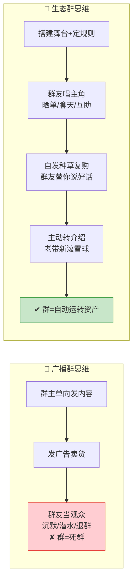
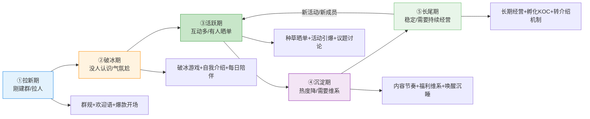
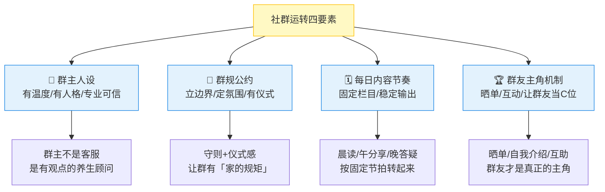
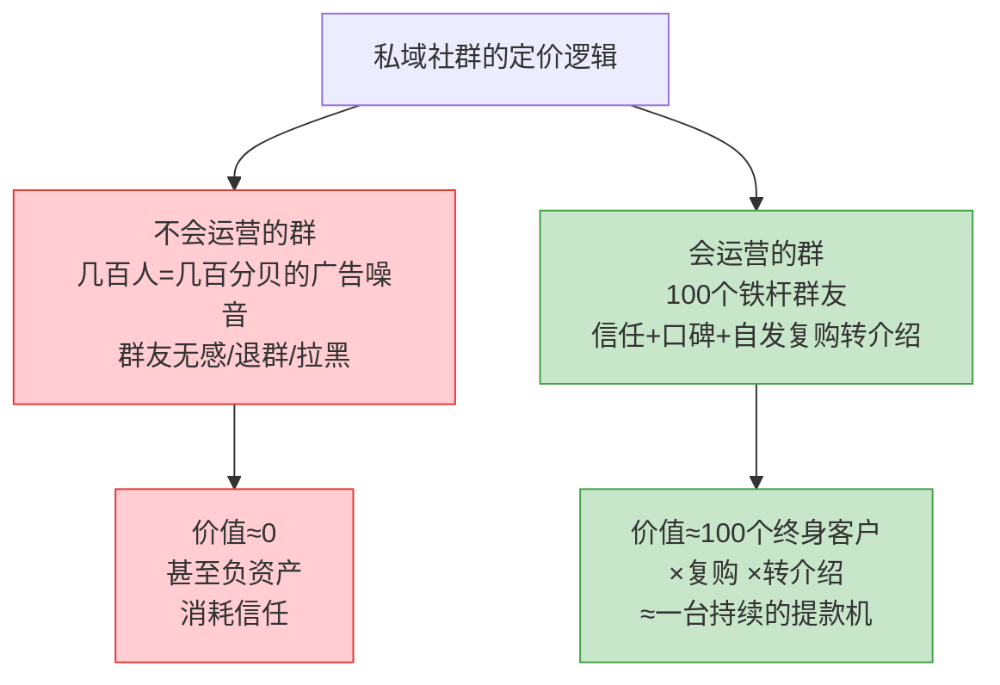

# Day46: 私域社群精细化运营——从「薅人进群」到「让群自己转起来、自发复购转介绍」的高阶运营

> 📅 学习日期：2026-09-01
> 🔗 关联笔记：[[00-目录]] | 上一篇：[[Day45-私域成交后客户关系经营与复购唤醒]] | 下一篇：Day47
> 🎯 适用场景：「反生活」好物养生账号费了老大劲把客户拉进群、也按 Day45 把客户分层养熟了，但群里还是那副半死不活的样子——除了发广告那几条有人看，平时没人说话，老客户复购靠你一个个私聊催，转介绍更是全靠运气。这一篇不讲「怎么把客户拉进群」（那是 Day07 的事），也不是「怎么逼单成交」（那是 Day44 的事），而是讲「**怎么把一个死气沉沉的群，盘成一个会自己转起来、自发种草、自发复购、主动帮你拉新客的自组织社群生态**」——私域社群从「你在里面吆喝」升级成「群友替你说好话、帮你带人」的自动运转机器
> 📚 学习来源：Day07 私域社群运营（承接「建群拉人」）× Day45 客户关系经营（承接「客户分层养熟」）× Day44 逼单心理学（承接「成交临门一脚」）× Day19 用户心理与行为设计（承接「心理底层」）× Day08 朋友圈营销（承接「内容场」）× Day22 私域成交与复购体系（承接「复购系统」）× Day27 转化文案（承接「种草话术」）× Day21 AI内容创作（承接「内容提效」）

---

## 1. 一句话总结

**私域社群精细化运营的本质，是「把一个『你一个人在里面吆喝卖货的群』，经营成一个『群友自己说话、自己种草、自己复购、主动帮你转介绍的生态』」——让「反生活」告别「群建了却没人理、复购靠逐个私聊催」的低效状态，通过「分层分群 + 群规立约 + 每日内容节奏 + 让群友当主角 + 活动引爆 + 数据复盘」的一套运营体系，把私域社群从「流量池」升维成「自动运转、自发裂变的超级资产」。**

**核心认知：** 很多卖家的私域群都经历过同样的尴尬——建群时热热闹闹，拉了几百人，以为拥有一条「躺着就能复购」的流量池，结果进群后立刻死寂：平时没人说话，只有你发广告时才有零星的「收到」。为什么？**因为很多卖家把群当成「广播喇叭」——单向地往群里发内容、发产品、发广告，群友只是「观众」；而一个健康的私域社群恰恰相反：它应该是「群友唱主角」的舞台，你是那个搭台子、定规则、点火的运营者。** 私域社群精细化运营的精髓，就是把「你一个人说」变成「一群人说」——你负责把群聚起来、把规则立起来、把每日的节奏带起来，再通过「让群友当主角」的机制（用户晒单、自我介绍、日常聊天、互助答疑），让群友之间有互动、有情感、有归属，于是种草、复购、转介绍不再是「你求着大家做」，而是「群友们自然而然地做」——买过的群友晒个喝法，其他群友就跟风问「在哪买的」；用着好的群友随口一句「这茶是真不错」，就是一条比你写十条广告都有效的种草。**老黄要切换的，是从「卖货群主」到「社群生态设计师」的心智：你不（只）是那个每次出现都是为了卖货的人，而是那个把一群有共同养生需求的人聚在一起、让他们自己热络起来、自己信任你、自己替你说话的「部落酋长」。** 一个运营好的私域社群，是「反生活」最坚固的护城河——它不靠买量、不靠算法、不靠平台抽成，靠的是一群认可你的人的信任和口碑，一旦转起来，复购和转介绍会像滚雪球一样自己越滚越大。

---

## 2. 核心框架

### 2.1 「广播群 vs 生态群」——先看清两种群的本质差别

很多卖家把私域群做死，根源是「把群当广播喇叭」。先看清两种群的天壤之别：



| 维度 | 广播群思维 | 生态群思维 |
|:----:|:----|:----|
| 群友角色 | 观众，被动接收 | 主角，主动参与 |
| 谁在说话 | 只有群主说 | 群友之间也互相说 |
| 种草来源 | 群主发广告 | 群友真实晒单、反馈 |
| 复购驱动 | 群主逐个私聊催 | 群友自发跟风、问链接 |
| 群主角色 | 卖货的 | 搭台子、定规则、点火的 |

> **给「反生活」的关键：** **死群和活群之间，隔的不是「人多人少」，而是「谁在唱主角」。** 一个几百人但只有你一个人说话的群，价值不如一个只有50人但群友天天聊天的群。老黄要做的第一步，是放下「群主必须每时每刻说话、发广告」的执念——**真正的社群运营，是把话匣子递给群友，让他们自己说起来。** 你越是包办一切，群越死；你越是把舞台让给群友，群越活。

### 2.2 「社群生命周期五阶段」——一个群从建到亡必经的阶段，运营要及时换打法

群不是一成不变的，它有生命周期。老黄先看懂群处于哪个阶段，才能对症下药：



| 阶段 | 特征 | 群主动作 | 目标 |
|:----:|:----|:----|:----|
| ① 拉新期 | 刚建群、拉人 | 立群规、发欢迎语、准备爆款开场 | 给群定下基调 |
| ② 破冰期 | 没人认识、气氛冷 | 破冰游戏、自我介绍、每日陪伴 | 让群友之间熟起来 |
| ③ 活跃期 | 互动多、有人晒单 | 种草晒单、活动引爆、议题讨论 | 让群自己热起来 |
| ④ 沉淀期 | 热度降、需要维系 | 内容节奏、福利维系、唤醒沉睡 | 防止群走向死寂 |
| ⑤ 长尾期 | 稳定、持续经营 | 长期经营、孵化KOC、转介绍机制 | 让群长期自动运转 |

> **给「反生活」的关键：** **私域群最忌「一口气建完然后放任不管」。** 拉新期你得立规矩、定基调；破冰期你要亲自下场带动、让大家熟起来；活跃期你要趁热打铁搞活动、推晒单；沉淀期一发现热度跌了就要赶紧用福利/新议题「续命」；长尾期则要往「群友自治、自发裂变」的方向经营。**老黄要盯住一张「群健康体检表」：每周看群活跃度（发言人数、晒单数、互动数），一发现下滑就切换对应阶段打法——群运营不是「建了就完」，而是「持续点火、不让它凉」。**

### 2.3 「社群运转四要素」——一个活群必须具备的四个底层结构

一个能自发转起来的群，底层需要四个要素支撑。老黄用这四根「柱子」搭起群的骨架：



| 要素 | 做什么 | 「反生活」示例 |
|:----:|:----|:----|
| ① 群主人设 | 立起有温度、有观点、专业的形象 | 老黄=「懂养生的实在人」，不只卖货还懂调理 |
| ② 群规公约 | 立边界、定氛围、给仪式感 | 「欢迎新朋友」仪式、禁止广告、友善互助守则 |
| ③ 每日内容节奏 | 固定栏目、稳定输出 | 晨读养生知识、午间歇作业分享、晚答疑 |
| ④ 群友主角机制 | 晒单、互动、让群友当C位 | 群友晒喝法、晒变化、被@表扬 |

> **给「反生活」的关键：** **一个活群不是「随便拉一群人随便聊」，而是「四个结构搭好的一个小世界」。** 群主立起可信的人设（群友信任你才愿意留）、立好群规（有边界的群才让人舒服）、保持稳定的每日节奏（让群友养成「每天来看一眼」的习惯）、更重要的是让群友当主角（群友晒单/互助，群才真正有黏性）。**四根柱子都立好了，群就是活的；缺一根，群就容易散。** 老黄按这四要素自查：人设立稳了吗？群规立了吗？有每日固定栏目吗？有让群友开口的机制吗？

### 2.4 「私域社群的价格逻辑」——为什么会运营的群，价值高十倍

同样是私域，会运营和不运营，价值天差地别。先看清这笔账：



> **给「反生活」的关键：** **私域社群的估值看的不（只）是人头数，而是「有多少人真心信任你、愿意为你复购和转介绍」。** 一个塞满广告、群友无感的「草群」，几百人也只是「一锅广告噪音」，反而伤信任（对应 Day08 朋友圈营销——内容不是越多越好）；而一个群友真正认可的「铁杆群」，哪怕只有100个人，每个人都是「会复购、会带人」的终身客户，价值抵得上十倍人头。**老黄要经营的，不是群的「人多了不起」，而是群里「有几个人是死心塌地认老黄的」。**

---

## 3. 可落地方法

### 3.1 【反生活可直接用】「建群开局七件套」——新群或重组群，第一天就立好基调

很多群从第一天就注定死，因为开局没立好。老黄用「建群开局七件套」，让群从第一天就走在活路上：

| 步骤 | 动作 | 目的 | 「反生活」示例 |
|:----:|:----|:----|:----|
| ① 想好群定位 | 明确这是「什么主题的群」 | 让人知道进群能得到啥 | 「老黄的养生小课堂」——每天学点调理知识 |
| ② 定群名/头像 | 好记、有辨识度 | 群友愿意留下的第一印象 | 「反生活·养生同好会」 |
| ③ 写群公告 | 讲清群是干嘛的、规矩是啥 | 立边界、定期待 | 公告写：这里分享养生调理、禁止硬广、友好互助 |
| ④ 发欢迎语 | 新成员进群有被欢迎的感觉 | 化解冷场、有仪式感 | 「欢迎 @新朋友 加入！先做个自我介绍呗」 |
| ⑤ 立入场仪式 | 新人自我介绍/晒照片/报需求 | 让新人第一时间参与 | 「新朋友报一下：你最近想调理的是湿气/睡眠/还是？我拉你对应小组」 |
| ⑥ 备好开场爆款 | 第一周持续输出有料内容 | 让人觉得「这群有货，值得留」 | 连续7天「湿气/睡眠调理干货」，先喂饱再谈卖货 |
| ⑦ 埋互动钩子 | 预设提问、投票、晒单话题 | 让群友一进来就有话可说 | 「你们平时最困扰的养生问题是什么？投票+留言」 |

> **给「反生活」的核心：** **群死不死，从建群第一天就注定了。** 前七件套里，最容易被忽略也最关键的是「立身份感」和「埋互动钩子」——前者让群友觉得「我不是进了个广告群，而是进了一个有归属的圈」，后者让群里从第一天就不冷场。**老黄建任何群，都要先把「立场定的定位、立的规矩、埋的钩子」设计好再拉人，绝不打无准备之仗。**

### 3.2 【反生活可直接用】「每日三聊节奏表」——用固定的节拍让群每天都热起来

很多群「三天打鱼两天晒网」，群主想起来了发一段，想不起来就死寂。老黄用一张「每日三聊节奏表」，让群每天按固定节拍转起来：

| 时段 | 栏目 | 内容示例 | 目的 |
|:----:|:----|:----|:----|
| ☀️ 早上 | 晨读/早安养生 | 「早安！今日养生小知识：春困不是病，是身体在提醒你该祛湿了」 | 开启一天、植入专业人设 |
| ☀️ 中午 | 午间分享/晒单 | 「分享一个群友昨天反馈：喝了14天，舌苔明显薄了」「你们谁也有变化？晒出来」 | 种草、激励、让群友动起来 |
| 🌙 晚上 | 晚答疑/互动 | 「今晚答疑：有什么养生问题尽管问老黄，知无不言」「来个互动投票」 | 答疑、互动、拉近距离 |

> **给「反生活」的核心：** **活群的关键是「稳定的节拍」——让群友养成「早上看一眼、中午来互动、晚上来聊天」的肌肉记忆。** 固定栏目不要求多花哨，关键在「稳定」：哪怕内容普通，只要天天准点出现，群就有了「活着的呼吸感」。**建议三个时段根据自己的作息只选1-2个坚持住（比如忙就只做「晨读+晚答疑」），宁可少而稳定，不可多而中断**——断更三天，群习惯就断了，前面全白搭。

### 3.3 【反生活可直接用】「让群友当主角的三招」——把话匣子递给群友，让他们替你说好话

生态群的核心是「群友唱主角」。老黄用三招，巧妙地把群友变成群的「共建者」和你的「免费种草员」：

| 招法 | 动作 | 话术/机制 | 目的 |
|:----:|:----|:----|:----|
| ① 晒单成机制 | 把「晒单」做成常态栏目，@表扬 | 「感谢李姐晒出真实反馈！坚持两周舌苔变化真的明显，大家有啥变化也可以晒」 | 让真实反馈成为群内最有效的种草 |
| ② 提问变互动 | 把「你问我答」变成「群友互答」 | 「这个问题有群友遇到过吗？有经验的请分享」 | 让群友之间有连接，而不是都找你 |
| ③ 邀人给奖励 | 让满意的群友主动拉同好进群 | 「你朋友也养生，拉TA进群，你们一起调理一起监督」 | 让满意群友自发帮你裂变 |

> **给「反生活」的核心：** **群友的真实反馈，是比你写十条广告都管用的种草。** 当你把「晒单」做成常态，把「问题答疑」变成群友之间的互助，把「拉新」变成群友的自觉——**群就从「你一个人在吆喝」变成了「一群人在替你说话」。** 老黄要学会做「氛围导演」：你负责点火（抛话题、@表扬、发钩子），群友负责燃烧（晒单、互助、拉人）。**一个群友的「亲测有效」，抵得过你一百句「特效显著」。**

### 3.4 【反生活可直接用】「群活跃度体检表」——用数据判断群是不是要「续命」了

死群往往是「悄悄死的」——群主没察觉，等发现时已经凉透了。老黄用一张「群活跃度体检表」，每周给群「体检」：

| 指标 | 看什么 | 健康标准 | 不健康就 |
|:----:|:----|:----|:----|
| 发言人数 | 每周有多少人说话 | 活跃期≥20%群友发言 | 下降就搞互动活动 |
| 晒单/反馈数 | 每周有几个真实晒单 | 每周≥2条 | 缺就引导+给晒单奖励 |
| 互动数 | 点赞/回复/投票 | 每周有来有回 | 冷就发钩子话题 |
| 退群/静默 | 有没有人退、多少人潜水 | 退群少、静默可控 | 多了就做「唤醒专属礼」 |
| 复购/转化 | 群里有没有带动复购 | 每月有稳定转化 | 低就做「群友专属福利」 |

> **给「反生活」的核心：** **群运营靠感觉容易误判，靠数据才能早发现、早止损。** 这张表不复杂，但坚持每周看一遍，你就能在群「病入膏肓」前及时干预——活跃度一掉就搞活动、晒单一少就引导奖励、冷场就发钩子话题、转化低了就上群友专属福利。**老黄把「看群数据」养成和 Day42 看直播数据一样的习惯，群就不会在你眼皮底下悄悄死掉。**

### 3.5 【反生活可直接用】「AI社群运营提效」——用AI把日常社群运营的重复工作自动化

一个人运营多个群、每天还要发内容，常常忙不过来。老黄可以用 AI（呼应 Day21），把社群运营里最耗时的重复工作自动化：

| 场景 | AI用法 | 提效效果 |
|:----:|:----|:----|
| 每日内容生成 | 让AI按「晨读/午分享/晚答疑」框架批量生成养生干货 | 10分钟产出一天的运营内容 |
| 群公告/欢迎语 | 让AI写好群公告、欢迎语、活动文案模板 | 建群/拉新人不用每次现写 |
| 互动话题池 | 让AI生成一周的互动话题、提问、投票 | 再也不愁「今天群里聊啥」 |
| 答疑话术库 | 让AI整理高频养生问题的标准答复话术 | 答疑又快又专业 |
| 晒单文案 | 让AI把群友反馈改写成有感染力的种草文案 | 晒单更有效、更吸引人 |

> **给「反生活」的核心：** **一个人撑一个群的日常运营，靠「勤奋」很快会耗尽，靠「工具」才能可持续。** 把「内容生成、文案改写、话术整理」这类重复劳动交给 AI，老黄把省下来的时间花在最值钱的「人」上——一对一答疑、情感维护、信任构建（呼应 Day45 客户经营）。**AI 管「量」（每天产出、保持节奏），你管「质」（人味儿、信任、关系），一个人也能把群运营得有模有样。**

---

## 4. 变现路径

### 4.1 「群友信任 = 转化率」——私域社群变现的底层逻辑

私域社群不直接卖货，它卖的是「信任」。先看清这条变现链路：

```text
私域社群的变现底层逻辑：
  群友进群 → 每日内容建立专业信任
          → 晒单/互助建立情感信任
          → 信任够了 → 你推什么都不反感
          → 复购率远高于公域 → 转介绍自然发生

  同样是卖一单168元的茶：
  公域（陌生流量）：转化率 1%-3%，还带广告费
  私域社群（信任老客）：转化率 20%-50%，几乎零成本
  → 私域社群是「反生活」转化率最高、roi最高的变现场景
```

> **给「反生活」的关键：** **私域群不是「用来直接发广告的」——广告发得越勤，信任流失得越快；它真正的价值是「攒信任」：每天用有用内容、真诚答疑、群友晒单，把群友对你的信任一点一点堆高。** 信任攒够了，「反生活」推新品、做活动、搞复购，群友买得爽快、还主动帮你推荐。**老黄要忍住「进群就卖货」的冲动——先让人信任你，钱是信任的副产品。**

### 4.2 「群 × 分层 × 复购 × 转介绍」——私域社群变现的完整飞轮

把社群运营嵌入整条变现链路，就是「反生活」私域社群的完整变现飞轮：

```text
建群开局七件套（3.1）→ 立好定位和基调
  ↓ 每日三聊节奏（3.2）→ 让群每天都热
  ↓ 让群友当主角（3.3）→ 晒单互助，自发种草
  ↓ 信任累积 → 群内推品/活动 → 高转化复购（呼应 Day44 Day45）
  ↓ 满意的群友 → 主动帮老黄介绍/拉同好进群
  ↓ 新群友 → 又被内容沉淀、被信任转化……循环往复
  ↓ 复购率、转介绍率不断上升 → 群自动运转 → 现金流越来越稳
```

| 环节 | 动作 | 对「反生活」的收入影响 |
|:----:|:----|:----|
| 群→复购 | 群内内容种草+专属福利 | 群友复购率高、几乎零获客成本 |
| 群→转介绍 | 满意群友自发拉同好 | 零成本裂变新客，滚雪球 |
| 群→多品 | 群内推新品/系列组合 | 一个群友从只买一样到买全套 |
| 群→私域深耕 | 结合 Day45 客户分层经营 | 群是养信任的场，私聊是成交的场 |

> **给「反生活」的关键：** **一个运营好的群，是「复购 + 转介绍 + 多品」三合一的可复用资产。** 群友在群里每天被内容种草、被晒单感染，复购自然发生；群友认可了就自发拉同好进群，裂变零成本；群内还能推新品、组合装，让一个群友贡献更多客单。**当群自己转起来，老黄就不再需要天天去公域买流量、抢新客——群里这群信任老黄的人，就是最稳定、最值钱的现金流来源。**

### 4.3 「100个铁杆群友 = 月入1万的稳定保障」——把群的复购价值量化

回到「反生活」从0到月入1万的目标，私域社群正是那个「把流量变成现金流」的转化器：

```text
「反生活」私域社群变现量化：
  一个活跃铁杆群友的年贡献：
    年复购 5-10 单 × 客单168 ≈ 840~1680元
    + 转介绍带来 1-3 个新客 ≈ 数百元

  月入1万 ≈ 只需经营好 50-80 个「活跃+铁杆」群友（持续复购+带人）
  （相比公域拉新要卖50-60单/月还天天买量，群内转化轻松十倍）

  群的价值不在「几百人人头」，而在「几十个铁杆的持续信任」：
  一个能把客户变成铁杆群友的私域社群，= 一台自动复购的提款机
```

> **给「反生活」的关键：** **私域社群的真正价值，是把「顾客」升级成「铁杆群友」。** 一个在公域买过一单的顾客可能转头就忘；但一个在群里被天天种草、被群友晒单感染、跟你有情感连接的铁杆群友，会反复复购、主动带人。**老黄不用焦虑群有多大、人有多多——埋头把群里的几十个活跃群友服务好、经营成铁杆，他们的持续复购+转介绍，就是「反生活」月入1万最稳妥的底盘（呼应 Day45 的「客户资产」认知）。**

---

## 5. 行动清单

### ✅ 行动①：给「反生活」的群做一次「健康体检」，用数据定位群处于哪一阶段（今天做）

**步骤1（20分钟）：** 打开现有私域群，按 3.4 的「群活跃度体检表」逐项盘点：发言人数、晒单数、互动数、退群数、复购转化——把这周的真实数据记下来。

**步骤2（10分钟）：** 对照 2.2 的「社群生命周期五阶段」，判断这个群目前处于哪一阶段（破冰期/活跃期/沉淀期/长尾期）。

**步骤3（10分钟）：** 根据诊断结果，把「下一步该做的阶段打法」写下来（比如「还在破冰期→先做自我介绍和破冰游戏」「已到沉淀期→赶紧搞活动续命」）。

> **产出：** ✅ 一张「反生活」群健康体检表 + 阶段判断，第一次用数据看清「这群到底死没死、该怎么救」，社群运营从「拍脑袋」升级为「看数据」。

### ✅ 行动②：给群立「群规 + 每日三聊节奏」，把群从「想起来了发一条」变成「每天准点转起来」（今天做）

**步骤1（15分钟）：** 按 3.1 把群公告写好——讲清群定位、立好群规（禁硬广、友好互助）、写欢迎语，发到群里「立规矩」。

**步骤2（15分钟）：** 按 3.2 选1-2个固定栏目定下来（比如只做「晨读养生 + 晚答疑」），把本周的内容先备好（可用 3.5 让 AI 帮你批量生成）。

**步骤3（当周）：** 本周每天准点在固定时段发栏目内容，雷打不动，坚持一周后回看群活跃度有没有起色。

> **产出：** ✅ 群有了「规矩」和「固定的呼吸节拍」，从第一天就有「这是个有组织的群」的体感，为后续活跃度打底。

### ✅ 行动③：发起一次「让群友当主角」的互动，让群友晒单/互助/自我介绍（本周内做）

**步骤1（10分钟）：** 在群里发起一个「让群友说话的」活动——可以请群友「晒出你的调理变化」，或做个「你最想调理的问题」投票，或请新老群友都做个简单自我介绍。

**步骤2（15分钟）：** 对参与晒单/互动的群友，一一@点名表扬（「感谢李姐！你这个坚持方法分享得很实在」），让群友感受到「我被看见了」。

**步骤3（记录）：** 记录这次活动带来的发言人数、晒单数、新增互动，和行动①的数据对比，看看「群友主角机制」有没有让群明显活跃起来。

> **产出：** ✅ 一场真实的「让群友唱主角」实战 + 活跃度前后对比数据，第一次让群友替你说上话，验证「群友种草效果 > 群主自说自话」这条铁律。

---

## 📊 今日学习总结

| 维度 | 内容 |
|:----:|------|
| 核心认知 | 私域社群运营的本质是从「广播群」（群主单向吆喝）升级为「生态群」（群友唱主角、自发种草复购转介绍）——群主是搭台子、定规则、点火的氛围导演，不是卖货喇叭 |
| 核心框架 | 广播vs生态群 × 生命周期五阶段（拉新/破冰/活跃/沉淀/长尾）× 社群运转四要素（群主人设/群规/内容节奏/群友主角）× 信任=转化率的定价逻辑 |
| 关键技能 | 建群开局七件套、每日三聊节奏表、让群友当主角三招、群活跃度体检表、AI社群运营提效 |
| 变现路径 | 群友信任=高转化率；群×分层×复购×转介绍飞轮；50-80个铁杆群友=月入1万稳定保障（群把顾客升级成铁杆群友） |
| 今日行动 | ① 群健康体检定位阶段 ② 立群规+每日三聊节奏 ③ 发起让群友当主角的互动 |

> 下一篇预告：**Day47: 私域社群活动策划与促销转化——从「日常养熟」到「一场活动引爆一波集中转化的」主题活动运营**，让「反生活」用「会爆的活动」把日常攒下的信任，一次性高效转化成订单与现金流。
