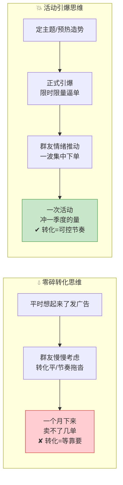
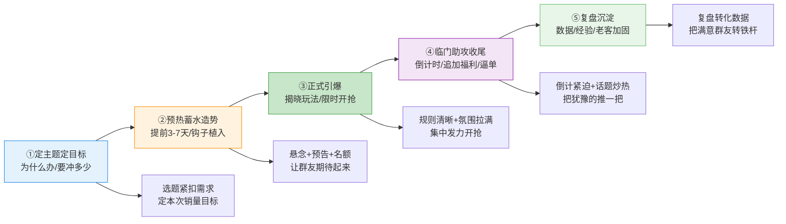
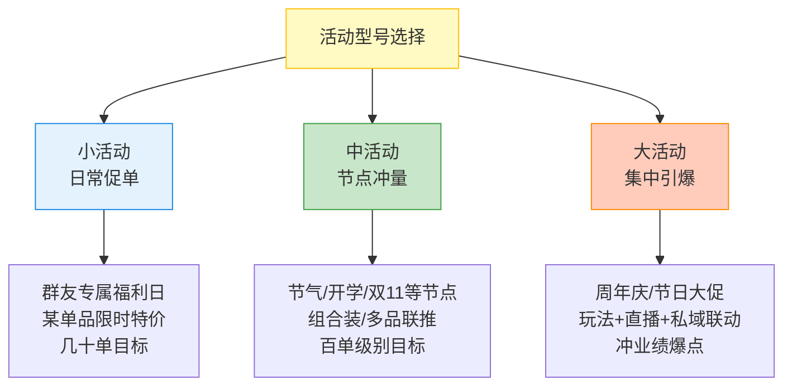
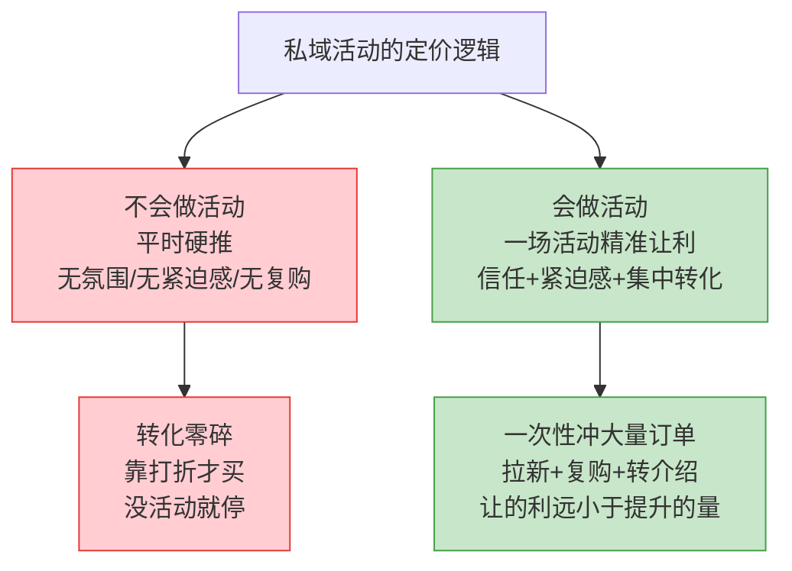

# Day47: 私域社群活动策划与促销转化——从「日常养熟」到「一场活动引爆一波集中转化」

> 📅 学习日期：2026-09-02
> 🔗 关联笔记：[[00-目录]] | 上一篇：[[Day46-私域社群精细化运营]] | 下一篇：Day48
> 🎯 适用场景：老黄按 Day46 把「反生活」的私域群盘活了——群规立了、每日三聊节奏带起来了、群友也开始晒单说话了，但群里的转化还是「细水长流、有一搭没一搭」：今天张三问一句买一单，明天李四纠结半天要不要买，整体节奏平、爆发弱，一个月下来卖不了几单。这一篇不讲「怎么把群盘活」（那是 Day46 的事），也不讲「怎么一对一逼单」（那是 Day44 的事），而是讲「**怎么用一场「会策划、会引爆、会收尾」的活动，把群友平时攒下的信任，在一段时间内集中引爆成一波高转化订单**」——私域社群从「日常养熟」到「一场活动冲一波销量、回一波款」的临门爆发
> 📚 学习来源：Day46 私域社群精细化运营（承接「把群盘活」）× Day44 逼单心理学（承接「成交临门一脚」）× Day45 客户关系经营（承接「对老客户搞活动」）× Day38 直播复盘与私域复购引擎（承接「联动直播搞活动」）× Day22 私域成交与复购体系（承接「复购钩子」）× Day27 转化文案（承接「活动文案」）× Day19 用户心理与行为设计（承接「促单心理」）× Day08 朋友圈营销（承接「活动预热」）

---

## 1. 一句话总结

**私域社群活动策划与促销转化的本质，是「把你和群友之间日积月累的信任，集中到一个『有主题、有节奏、有紧迫感、有回报』的时间窗口里，一次性引爆成一波高转化订单」——让「反生活」告别「转化靠平时零敲碎打、想起来了发个广告」的被动状态，通过「定主题定目标 → 预热蓄水造势 → 正式引爆逼单 → 临门助攻收尾 → 复盘沉淀」的一套活动操盘体系，把群变成一台「按你的节奏、想冲多少量就冲多少量」的转化机器。**

**核心认知：** 很多卖家面对"私域转化"有两个极端：要么"佛系"，平时温水煮青蛙，靠群友自己想起来了才买，转化平到爆炸不起来；要么"硬推"，想冲量了就在群里连发几条硬广、粗暴打折逼单，结果群友反感、信任流失、卖完一锤子买卖。这两个极端都不对。**真正高效的私域转化，靠的是「造势」而非「叫卖」——它不是你在群里扯着嗓子喊"快买！今天我打折了！"，而是你精心设计一场「有主题的活动」，像倒计时一样给群友一个「现在买有理由、错过会后悔」的窗口，让群友在情绪的推动下主动掏钱。** 私域活动策划的精髓，就是用「活动」把「情绪」和「购买理由」捏在一起：**因为有主题，所以现在买有正当理由；因为有限时限量的紧迫感，所以得现在买不能拖；因为有老客户专属回报，所以现在买特别划算。** 老黄要掌握的，是从「平时养熟」到「活动引爆」的节奏切换：平时用内容养信任、养期待，关键时刻用一场设计好的活动，把信任一次性变现。**一场成功的社群活动，不只是"冲一波销量"，更是一次"强化群友对老黄和反生活的信任"的聚会——活动办得好，群友不仅当时掏钱，活动后还会更黏你、更愿意复购和转介绍。**

---

## 2. 核心框架

### 2.1 「零碎转化 vs 活动引爆」——先看清两种转化的天壤之别

很多卖家不懂为什么"别人一场活动能卖我一季度的量"。先看清两种转化的差别：



| 维度 | 零碎转化思维 | 活动引爆思维 |
|:----:|:----|:----|
| 触发方式 | 想起来了发个广告 | 精心设计有主题的活动 |
| 购买理由 | 群友自己找理由 | 活动给足"现在买的理由" |
| 紧迫感 | 无，"拖一拖没事" | 限时限量，"错过会后悔" |
| 情绪推动 | 无，理性观望 | 主题+氛围+互动，情绪上头 |
| 转化节奏 | 被动、靠运气 | 主动、可控、可预测 |

> **给「反生活」的关键：** **私域转化的差距，不在"产品好不好"，而在"你会不会造势"。** 同一个产品，平时零碎推只能卖出"细水长流"的量；放进一场"有主题、有限时、有氛围"的活动里，就能让群友在情绪的推动下集中下单。**老黄要做的，不是"多卖几次货"，而是"少而精地策划几场活动，每场都冲一波集中销量"。** 平时把信任攒着（Day46），关键时刻一次性引爆，这才是私域转化的正确姿势。

### 2.2 「活动操盘五步法」——一场社群活动从想法到收尾的完整流程

一场活动不是"预告一下、发个链接"就完事，它有完整的操盘流程。老黄按五步走：



| 阶段 | 干什么 | 核心动作 | 目标 |
|:----:|:----|:----|:----|
| ① 定主题定目标 | 想清楚办什么、冲多少 | 选题紧扣需求、定销量目标 | 让活动有的放矢 |
| ② 预热蓄水造势 | 提前3-7天埋钩子 | 悬念、预告、名额、话题 | 让群友期待起来 |
| ③ 正式引爆 | 揭晓玩法、限时开抢 | 规则清晰、氛围拉满 | 集中发力开抢 |
| ④ 临门助攻收尾 | 倒计时、追加福利 | 紧逼感、炒热、催单 | 把犹豫的推一把 |
| ⑤ 复盘沉淀 | 看数据、攒经验 | 复盘转化、老客加固 | 下次办得更好 |

> **给「反生活」的关键：** **活动成败的关键在"预热"和"收尾"——很多人只盯着"正式引爆"那一下，忽略了两头，结果活动要么"雷声大雨点小"，要么"虎头蛇尾"。** 预热做得足，群友带着满心期待来参加，引爆才有爆发力；收尾做得稳，活动结束后满意群友被加固成铁杆，为下次复购转介绍埋单。**老黄办一场活动，五步都要走、不能偷工：预热埋钩子、引爆造氛围、收尾固信任，一步都不能少。**

### 2.3 「活动的三种型号」——不同目标对应不同规模的活动打法

不是所有活动都要兴师动众。老黄按"目标大小"选对应型号的活动：



| 型号 | 目标 | 适合场景 | 准备量级 |
|:----:|:----|:----|:----|
| 小活动 | 几十单 | 日常促单、单品清仓 | 轻，1-2天准备 |
| 中活动 | 百单级 | 节气、开学等节点冲量 | 中，提前一周预热 |
| 大活动 | 冲业绩爆点 | 周年庆、节日大促 | 重，提前两周造势+联动 |

> **给「反生活」的关键：** **不是每场活动都要搞得很重，量力而选型号。** 老黄现在刚起步，最适合先从小活动练手——一场"群友专属福利日"、一款单品限量特价，把活动操盘全流程走一遍练出感觉，再逐步升级到中活动、大活动。**先跑通一场小活动拿到正反馈，比憋一场大活动办砸了强一百倍。**

### 2.4 「活动的成本账」——会做活动的为什么销量高十倍、成本还不高

很多卖家怕做活动"让利太多亏本"。先看清这笔账：



> **给「反生活」的关键：** **做活动的"让利"，买的是"集中转化"——与其天天零敲碎打、每单都靠磨，不如一场活动让一点利，换来一波集中的订单量和复购黏性。** 一场活动办得好，让出去的那点利润，被多卖出去的几十上百单轻松覆盖，还会带来复购和新客。**老黄要转变心态：活动不是"割肉亏本"，而是"小代价撬动集中成交"的投资，关键在于怎么设计——让利的额度、玩法、紧迫感都设计好，让每一分让利都换来真金白银的转化。**

---

## 3. 可落地方法

### 3.1 【反生活可直接用】「活动主题菜单」——老黄随手可用的7个活动选题灵感

很多卖家想不到"办什么活动"。老黄用一个"活动主题菜单"，按需求直接挑：

| 主题 | 玩法 | 适合时点 | 目的 |
|:----:|:----|:----|:----|
| ① 群友专属福利日 | 单款断货产品限时限量特价 | 每月固定一天 | 日常促单、养复购习惯 |
| ② 节气养生专题 | 迎合时令（如祛湿季/秋燥季）推对应产品组合 | 换季/节气 | 应季需求+集中冲量 |
| ③ 开学季专场 | 学生/用眼/用脑人群需求产品 | 开学前后 | 节点流量变现 |
| ④ 晒单返现/集赞 | 晒真实反馈返券/满赞送礼品 | 积累反馈期 | 种草+促单两手抓 |
| ⑤ 老客回馈日 | 老客户专享折扣/赠品 | 有复购基础后 | 强化老客忠诚 |
| ⑥ 组合装特惠 | 多款产品搭成组合，比单买划算 | 想提客单时 | 提高单笔客单价 |
| ⑦ 新品尝鲜 | 新品限时限量尝鲜价 | 有新品时 | 冷启动推新品 |

> **给「反生活」的核心：** **活动灵感不难得，难得是把"主题"和"时点需求"对上。** 老黄不用想破头"办什么活动"，直接从这张菜单挑一个配合当前时点的（比如开学季就办"开学季专场"）。**关键在"给购买找个正当理由"——节气养生专题让群友觉得"现在买是应季需要"，开学季专场让群友觉得"孩子需要"，有理有据，促销就不显刻意。**

### 3.2 【反生活可直接用】「三天预热造势表」——正式引爆前把期待感拉满

活动成败，一半在预热。老黄用一张"三天预热表"，让群友在正式开场前就期待起来：

| 时间 | 预热动作 | 内容示例 | 目的 |
|:----:|:----|:----|:----|
| 第-3天 | 悬念预告 | "老黄准备了件大事，后天群里有惊喜，老客户有专属福利" | 勾起好奇心 |
| 第-2天 | 预告玩法 | 揭晓主题、上架节奏、预告"第一款是大家最爱的祛湿茶" | 让群友有期待对象 |
| 第-1天 | 气氛加温 | 晒往期活动老客反馈、发出"名额有限，先到先得" | 制造稀缺感、抢先机 |
| 活动日0点 | 正式引爆 | 揭晓玩法、限时开抢、上链接 | 集中发力 |

> **给「反生活」的核心：** **预热的目的，是让群友"从0点就开始守着的期待感"——而不是活动开始了你才第一次吆喝。** 悬念（"有惊喜"）、预告（"是哪款"）、稀缺（"名额有限"）三连招，把群友的情绪从"好奇"一步步推到"期待"，再到开场时的"生怕错过"。**老黄记住：预热期别透露太多，好东西要"挤牙膏"——让群友惦记着你，开场才不会冷场。**

### 3.3 【反生活可直接用】「正式引爆四件套」——活动一开场的标准动作

开场那一下最关键。老黄用"正式引爆四件套"，让活动一开场就炸：

| 动作 | 怎么操作 | 目的 |
|:----:|:----|:----|
| ① 揭晓玩法 | 一句话讲清"今天什么特价、多少名额、几点截止" | 规则清晰，人人看得懂 |
| ② 限时限量 | 明确"仅限今日/仅XX份" | 给足紧迫感，逼单 |
| ③ 首发尝鲜 | 第一波先上"最受欢迎的那款"让群友先抢起来 | 制造"抢购"场面感 |
| ④ 氛围点缀 | 晒单预告、抢购提醒、"已抢XX份"的进度播报 | 让群氛围热起来 |

> **给「反生活」的核心：** **开场四件套的核心，是把"今天买很值 + 不买会错过 + 大家都在抢"三件事一次传递给群友。** 玩法讲清（降低决策门槛）、限时限量（制造紧迫）、首发尝鲜（制造抢购氛围）、进度播报（营造"别人都买了"的从众心理）。**老黄开场要"快、准、狠"——别啰嗦，直接把价值、稀缺、从众一次全抛出去，让群友来不及犹豫就下单。**

### 3.4 【反生活可直接用】「临门助攻三连」——正式开场后怎么把犹豫的群友"推一把"

开场火了，但总有群友犹豫观望。老黄用"临门助攻三连"，把犹豫的人一个个转化成订单：

| 助攻 | 动作 | 话术/操作 | 目的 |
|:----:|:----|:----|:----|
| ① 晒单催化 | 把已经下单的群友反馈/购买晒出来 | "@李姐已入手祛湿茶！""这是她坚持两周的效果" | 真实反馈促冲动 |
| ② 倒计时催单 | 定时播报剩余时间和名额 | "最后2小时！还剩5份，错过再等一个月" | 制造紧迫逼单 |
| ③ 追加福利 | 快结束时追加小福利 | "再满10人下单，全员加送一包赠品" | 最后推一把冲量 |

> **给「反生活」的核心：** **活动最怕"开场冲了一下就没人了"，所以临门要持续"点火"。** 已下单群友的反馈是"最有效的促单催剂"（真实、可信、带入感强）；倒计时给犹豫的人"最后通牒"；追加福利给"还在观望的人"一个"再冲一波"的理由。**老黄主持活动要"全程在线、持续点火"——不是开场发个链接就下线，而是盯在群里，用晒单、倒计时、追加福利，把氛围一路推到底。**

### 3.5 【反生活可直接用】「AI活动操盘助理」——用AI把活动策划到执行的重复工作自动化

一个人策划、预热、主持一场活动，光文案和运营就够忙。老黄用 AI（呼应 Day21），把活动全流程的重复工作自动化：

| 环节 | AI用法 | 提效效果 |
|:----:|:----|:----|
| 活动主题/玩法生成 | 让AI按"活动主题菜单"批量生成多个活动方案 | 选题策划不再烧脑 |
| 预热文案 | 让AI生成3天预热期的悬念/预告/气氛文案 | 预热推广事半功倍 |
| 活动海报文案 | 让AI生成活动主视觉的标题、卖点、Slogan | 一张吸睛海报快速产出 |
| 话术库 | 让AI整理开场、晒单、催单、逼单的话术模板 | 主持活动胸有成竹 |
| 复盘报告 | 让AI汇总活动销量、转化、反馈，生成复盘 | 复盘沉淀省时省力 |

> **给「反生活」的核心：** **办一场活动的"体力活"（文案、话术、排期），靠 AI 大幅提效，老黄把省下的精力全花在"人"上——盯群互动、回应群友、维护现场氛围。** AI 管"量"（批量产方案、文案、话术），你管"质"（现场氛围、冷场救场、一对一跟进），一个人也能把一场活动操盘得有模有样。

---

## 4. 变现路径

### 4.1 「活动 = 信任集中变现」——私域活动转化的底层逻辑

私域活动不靠"打折力度"取胜，靠"信任+情绪"集中变现。先看清这条链路：

```text
私域活动转化的底层逻辑：
  日常养熟（Day46）→ 群友对老黄建立信任与好感
          → 活动主题给"现在买的正当理由"
          → 限时限量给"不能拖的紧迫感"
          → 晒单进度给"别人都买了的从众感"
          → 情绪到位 → 一波集中下单
          → 比平时转化率高数倍

  同样的优惠：
  公域打折：对陌生人不信任 → 转化低，纯让利
  私域活动：对老黄信任 → 给足理由+紧迫 → 高转化，还复购
  → 私域活动是「反生活」用"小让利值"撬动"集中成交"的最优解
```

> **给「反生活」的关键：** **活动是"信任"的变现器——你没有平时攒下的信任，再大的折扣也换不来集中成交；有了信任，一场活动给足理由和紧迫感，转化就水到渠成。** 老刚要清晰地看到：日常养熟（Day46）是"储蓄"，活动引爆是"提现"——平时把信任攒厚，关键时刻用一场活动把它一次性换成订单和现金流。

### 4.2 「活动 × 复购 × 转介绍」——一场活动既是冲量，更是攒复购和裂变的种子

把活动嵌进整条变现链路，它不只是"卖一单"，而是"种三颗果子"：

```text
一场活动的三重变现：
  第一重（当时）→ 活动集中下单，直接回款现金
  第二重（后续）→ 满意群友活动后复购，变成稳定老客
  第三重（裂变）→ 满意群友被"老客户有好运"感染 → 主动拉同好
  → 一场活动 = 现金 + 复购种子 + 裂变种子
```

| 果子 | 触发 | 对「反生活」的价值 |
|:----:|:----|:----|
| 即时汇款 | 活动集中下单 | 一波现金，回款快 |
| 复购种子 | 满意群友被奖励/被照顾 | 下次活动再来，老客更忠诚 |
| 裂变种子 | 群友对老黄认可+晒单传染 | 零成本拉新，滚雪球 |

> **给「反生活」的关键：** **一场活动要同时"收款、养复购、埋裂变"——别只看当天销量。** 活动结束后，对满意的群友及时跟进（呼应 Day45）、给专属奖励、邀请加入更深的社群（呼应 Day46），把他们从"买了的顾客"升级成"会复购、会带人的铁杆"。**老黄办一场活动，至少要吃透这"三颗果子"，让每一场活动都不只是一锤子买卖，而是一波三连的资产积累。**

### 4.3 「一个月两场小活动 + 一场中活动 = 稳定现金流」——把活动排进月度节奏

回到"反生活"从0到月入1万的目标，把活动排进每月的节奏，让现金流既有日常、又有爆发：

```text
「反生活」月度活动节奏：
  每月办：2场小活动（群友福利日/单品特惠）
        × 1场中活动（配合节气/开学等节点）
  每季度/大促办：1场大活动（联动直播，呼应 Day38）

  小活动：每场冲几十单 ≈ 单场景几千元
  中活动：每场冲百单级 ≈ 节点回一波款
  大活动：联动直播冲业绩爆点，冲刺月入目标

  → 日常养熟（稳定底盘） + 活动引爆（集中冲量）
  → 现金流既有细水长流，又有可预期的波峰
```

> **给「反生活」的关键：** **把"活动"排成固定节奏，现金流才有"可预期的爆发"。** 老黄不用天天想着怎么卖货，而是"平时用内容养熟（Day46），每月雷打不动办两场小活动、一场中活动，节点上大活动冲一把"——稳定底盘靠日常，业绩冲刺靠活动，两手都抓，月入1万才不是空中楼阁。**活动不是"偶尔冲一把"，而是"经营里固定的提款节奏"。**

---

## 5. 行动清单

### ✅ 行动①：从「活动主题菜单」选一场小活动，定好主题和本次销量目标（今天做）

**步骤1（15分钟）：** 从 3.1 的"活动主题菜单"里挑一个最适合当下的（现在是9月初，可选"开学季专场"或"秋燥养生专题"或"群友专属福利日"）。

**步骤2（10分钟）：** 给这场活动定一个明确的销量目标（比如"这场活动卖30单祛湿茶"），以及本次让利方阵（怎么定价、送什么、赠什么）。

**步骤3（记录）：** 把"活动主题 + 时间规划 + 目标销量 + 让利方案"写成一段活动计划，存进你的运营文档，作为这场活动的作战蓝图。

> **产出：** ✅ 一场小活动的完整策划方案落纸——主题、时间、目标、让利都定清楚，活动从"想想"变成"有作战图的执行"。

### ✅ 行动②：对选定的活动跑一遍「三天预热表」，把预热文案做出来（今明两天做）

**步骤1（15分钟）：** 按 3.2 的"三天预热表"设计这场活动的预热计划，决定第-3天/第-2天/第-1天分别发什么。

**步骤2（15分钟）：** 用 AI（3.5）把三天预热期需要的悬念预告、玩法预告、名额预热文案批量生成好，并自己润色成"老黄的口吻"。

**步骤3（检查）：** 把这三天文案排进日历，定好每天几点发，确保正式开场前能按节奏发出去。

> **产出：** ✅ 一套完整的"活动预热文案包" + 发布时间表，让活动开场前3天群友就"被吊足了胃口"，开场不冷场。

### ✅ 行动③：正式落地这场活动，操盘「引爆-助攻-收尾」全流程，并做复盘（本周内执行）

**步骤1（活动日）：** 按 3.3 "正式引爆四件套"准时开场（讲玩法、限时限量、首发尝鲜、氛围点缀），全程盯群。

**步骤2（活动进行中）：** 按 3.4 "临门助攻三连"持续点火——晒已下单反馈、定时倒计时、决定是否追加福利，把犹豫的群友一步步推向下单。

**步骤3（活动后）：** 按 3.5 用 AI 生成复盘报告，汇总活动销量数据（实际单数、客单价、转化率），对比行动①定下的目标，记录"办得好/办得差"的地方，并对满意的群友做 Day45 式跟进 + 发活动专属福利，把买过的群友往"铁杆"方向养。

> **产出：** ✅ 一场真实落地的社群活动 + 完整复盘数据 + 对老客的加固跟进，第一次用"活动"这种高效方式冲一波集中销量，跑通"策划→预热→引爆→复盘"的完整闭环。

---

## 📊 今日学习总结

| 维度 | 内容 |
|:----:|------|
| 核心认知 | 私域转化的本质是"信任集中变现"——靠造势（有主题、有紧迫、有氛围）而非叫卖；平时养熟（储蓄）、活动引爆（提现），一场活动既是冲量，更种下复购和裂变的种子 |
| 核心框架 | 零碎vs活动引爆 × 活动操盘五步法（定目标/预热/引爆/收尾/复盘）× 三种型号（小中大）× 活动让利=投资小代价撬动集中成交 |
| 关键技能 | 活动主题菜单、三天预热造势表、正式引爆四件套、临门助攻三连、AI活动操盘助理 |
| 变现路径 | 活动=信任变现器；一场活动=现金+复购种子+裂变种子三重果子；每月"两小一中+节点大促"=稳定可预期的现金流波峰 |
| 今日行动 | ① 从主题菜单定活动、定目标销量 ② 跑通三天预热表、产出预热文案 ③ 正式落地活动并复盘、加固老客 |

> 下一篇预告：**Day48: 私域活动后的客户沉淀与日常复购维护——从「一场活动的爆发」到「活动之间稳定的日常成交」**，让「反生活」别只在活动时有人买，而是把活动带来的热度平滑成随时都在发生的稳定复购。
