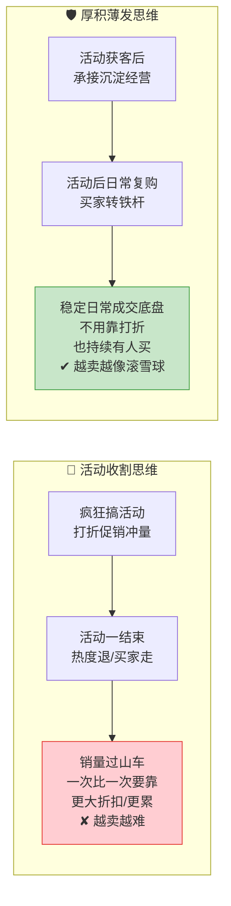
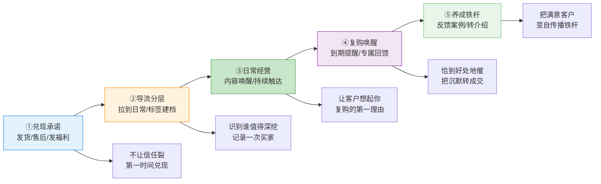
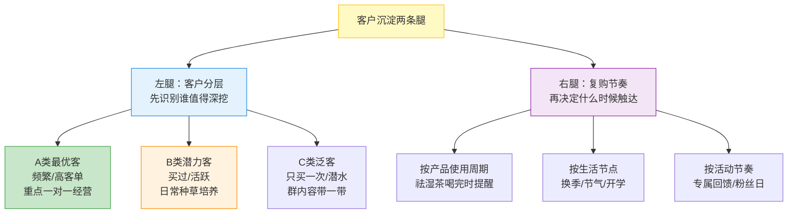
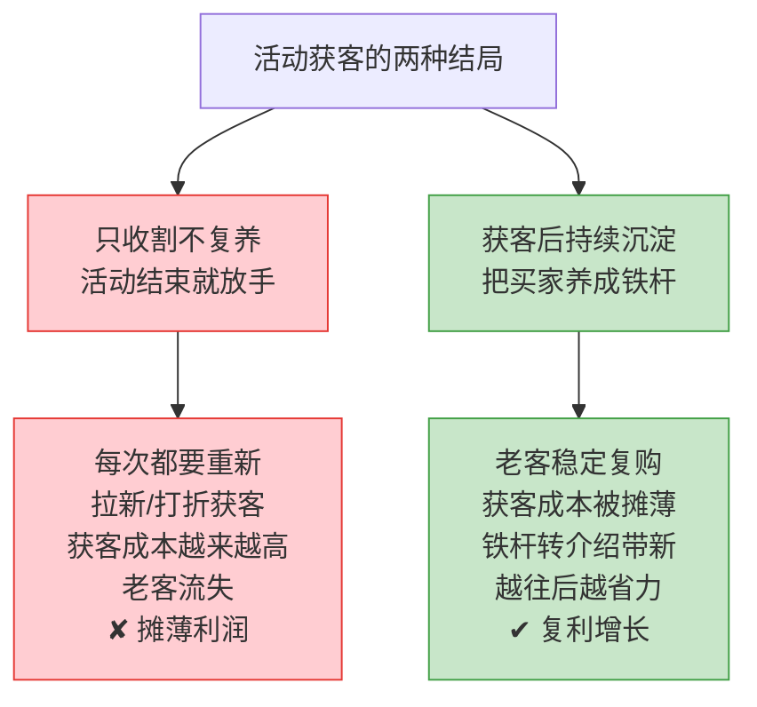

# Day48: 私域活动后的客户沉淀与日常复购维护——从「一场活动的爆发」到「活动之间稳定的日常成交」

> 📅 学习日期：2026-09-03
> 🔗 关联笔记：[[00-目录]] | 上一篇：[[Day47-私域社群活动策划与促销转化]] | 下一篇：Day49
> 🎯 适用场景：老黄按 Day47 策划的社群活动（群友福利日/节气专场）办完之后，群里热热闹闹冲了一波销量，但活动一结束，群里又慢慢安静下来——那波买了的群友好像"消失"了，平时没人主动问、没人催着复购，群里只剩偶尔的晒单和潜水；老黄发现"活动时有人买、活动后没人理"，销量像坐过山车，"平时淡、活动冲、完了又淡"，始终没能形成稳定的日常成交底盘。这一篇不讲"怎么策划一场活动"（那是 Day47 的事），也不讲"怎么一对一逼单"（那是 Day44 的事），而是讲"**活动结束后，怎么把那些被活动的热度吸引、被促销转化的群友，一步步沉淀成会主动复购、会自发转介绍的稳定老客，让『反生活』从一场活动的波峰爆发，平滑成活动之间随时都在发生的稳定日常成交**"——私域从"靠活动间歇性冲量"到"靠日常复购持续出单"的运营升级
> 📚 学习来源：Day47 社群活动策划与促销转化（承接"活动办完后的售后承接"）× Day46 私域社群精细化运营（承接"把群日常盘活"）× Day45 客户关系经营与复购唤醒（承接"对老客户一对一经营"）× Day44 私域成交话术（承接"成交后跟进"）× Day38 直播复盘与私域复购引擎（承接"复购引擎"）× Day22 私域成交与复购体系设计（承接"复购钩子"）× Day29 蒲公英品牌合作（承接"沉淀案例素材"）× Day27 转化文案

---

## 1. 一句话总结

**私域活动后的客户沉淀与日常复购维护，本质是"把活动带来的那一波热度，承接成一群会长期复购的铁杆客户"——让「反生活」告别"活动时有人疯抢、活动后冷冷清清"的过山车销量，通过"活动后及时兑现承诺、把一次性买家导流成日常关系 → 用客户分层识别谁值得深挖 → 用日常内容持续唤醒复购 → 用精细记录让每一次复购都更懂客户 → 用反馈和案例把满意客户养成铁杆"的一套运营体系，把活动冲出来的客户沉淀成随时都在触发复购的稳定底盘。**

**核心认知：** 很多卖家把"办活动"当成赚快钱的手段——活动一结束就以为完事了，群里热度一过，那波被促销吸引的买家也跟着散了，下次想冲量只能再搞一场更大的活动，越搞越累、越搞越要靠打折换销量。这是把活动当成了"一次性收割"，而不是"一场获客+沉淀的起点"。**真正会做私域的卖家，把一场活动看成"招进来的客户名单"，而不是"卖完的一锤子生意"——活动只是把新客户领进门的第一步，活动结束后的客户沉淀和日常复购维护，才是真正让私域产生长期价值的地方。** 老黄要完成的，是从"用活动冲一波销量"到"用日常复购持续出单"的升维：一场活动办完，不是"结束了"，而是"一批准客户正式进了你精心布置的场，等着被沉淀、被经营、被转成长期客户"。**所以活动结束那一刻，"怎么承接、怎么跟进、怎么把买家变成铁杆"，决定了那场活动是'赚了一波快钱'还是'引进了一群终身客户'。** 客户沉淀的本质，是把一次性的买卖关系，升级成持续的信任关系——你越懂他、越照顾他，他就越愿意反复在你这买，还会把他认识的人带进来。

---

## 2. 核心框架

### 2.1 「过山车销量 vs 稳定底盘」——先看清两种私域经营的天壤之别

很多卖家没意识到，为什么自己"活动一场接一场、促销一次比一次狠"，但销量始终起不来，永远要靠折扣撑着。先看清两种做法的差别：



| 维度 | 活动收割思维 | 沉淀底盘思维 |
|:----:|:----|:----|
| 看待买家 | 一次性的"下单人" | 待经营的"长期客户" |
| 活动后动作 | 结束,不管了 | 承接、跟进、沉淀 |
| 销量来源 | 靠活动间歇性冲量 | 靠日常复购持续出单 |
| 促销依赖 | 越依赖折扣,越难卖 | 不靠折扣也有人买 |
| 长期结果 | 越卖越累、越卖越难 | 客户越攒越多、越来越省力 |

> **给「反生活」的关键：** **私域的差距，不在"你会不会搞活动"，而在"活动之后你接不接得住那波客人"。** 活动只是临门一脚把客户领进门，真正让「反生活」产生长期价值的是活动结束后的沉淀——把那波被促销吸引的一次性买家，慢慢经营成不看折扣也愿意在你这里复购的铁杆。**老黄要转变视角：活动不是终点，而是获客的起点；一场活动的真正回报，藏在你活动后愿不愿意花心思去承接、去经营的每一天里。**

### 2.2 「活动后承接五步法」——从活动结束到稳定复购的完整运营阶梯

活动结束不是终点，而是承接待经营客户的起点。老黄按五步走，把活动买家逐步沉淀成稳定复购的老客：



| 阶段 | 干什么 | 核心动作 | 目标 |
|:----:|:----|:----|:----|
| ① 兑现承诺 | 活动后第一时间发货、售后、发福利 | 不拖延、多给一点 | 不让刚建立的信任裂掉 |
| ② 导流分层 | 把一次性买家拉到日常群/加微信+建档 | 标签、备注、分层 | 识别谁值得深挖 |
| ③ 日常经营 | 用内容持续唤醒、让客户想起你 | 种草、答疑、场景唤醒 | 成为客户复购的第一理由 |
| ④ 复购唤醒 | 到期提醒、专属回馈、节点唤醒 | 恰到好处地触达 | 把沉默客户转成复购 |
| ⑤ 养成铁杆 | 用反馈和案例让满意客户变成转介绍者 | 专属照顾、邀请传播 | 把客户变成自传播资产 |

> **给「反生活」的关键：** **活动后承接的价值,不在"立刻再卖一单",而在"一步一个脚印把客户往铁杆方向推"。** 五步是一个递进的"养熟"阶梯——从兑现承诺（护信任）→ 导流建档（识别谁值得深挖）→ 日常唤醒（让客户想起你）→ 复购触发（恰到好处催单）→ 养成铁杆（自传播）。**老黄走完这五步，一个活动买家就完成了从"被促销吸引的陌生人"到"会主动复购甚至帮忙转介绍的铁杆"的蜕变；每一步都在为下一步积累信任资产。**

### 2.3 「沉淀的两条腿」——客户分层 × 复购节奏，缺一不可

沉淀不是"对每个人做一样的事"，也不是"想起来才触达"。老黄用"两条腿"走路：



> **给「反生活」的关键：** **沉淀要"因人而异、因时制宜"——对所有人都用力，等于对没人用力。** 左手先把客户分分层（认清谁是值得花大力气深挖的A类核心、谁是日常种草的B类潜力、谁是顺便带的C类泛客），右手再设计好复购的触发节奏（按使用周期、生活节点、活动节奏精准触达）。**老黄先花一次小功夫给客户打标签分层，之后每一次触达都"用到刀刃上"：把最贵的精力给最可能回头看的高价值客户，复购转化率自然上一个台阶。**

### 2.4 「沉淀的成本账」——前端的爆发全是为后端的复购做垫脚石

很多卖家觉得"活动后还要花时间维护客户,太累不划算"。先看清这笔长期账：



> **给「反生活」的关键：** **前端活动砸下去的钱和精力，大部分价值要靠后端的复购来兑现——只收割不复养，等于每次都得重新花钱拉新；把买家养成会复购的铁杆，获客成本才被一次次摊薄，生意才越做越省力。** 老黄要算清这笔账：**维护一个老客的成本，往往只是拉一个新客的十分之一，而老客带来的复购和转介绍，是利润里最肥的一块。** 所以活动后的沉淀，不是"额外的负担"，而是"把前端投入收回来的必经之路"。

---

## 3. 可落地方法

### 3.1 【反生活可直接用】「活动后3天承接清单」——活动结束第一周就把客户接住

活动一结束,头几天的承接决定了那波买家是"买完就走"还是"留下来被经营"。老黄用一张"3天承接清单"：

| 时间 | 承接动作 | 具体操作 | 目的 |
|:----:|:----|:----|:----|
| 活动当晚 | 发布"感谢+预告发货" | 群里发感谢、告知发货顺序和时间 | 情绪收尾,给足确定性 |
| 第1天 | 发货通知 + 主动私聊核心买家 | 发货后逐个私聊A类买家,预告"收到有问题随时找我" | 建立一对一的售后信任 |
| 第2-3天 | 邀请进日常群/加微信承接 | 把活动买家拉进「反生活」日常群,发欢迎语和群规 | 从"活动场"导流到"日常场"持续经营 |

> **给「反生活」的核心：** **活动后最关键的是"接住"——别让那波被活动热度带动的人买完就散在公域里。** 当晚感谢+预告发货（情绪收尾）、第二天主动私聊核心买家（一对一建信任）、第三天往日常群导流（把一次性买家放进日常经营的池子里慢慢养）。**活动期间你在"活动的场"里卖货,活动结束后要把这些客源导进"日常的场"里继续经营——进了你的日常群、加了你的微信，他才算真正"沉淀"下来了。**

### 3.2 【反生活可直接用】「客户分三层」——先花一次小功夫，给客户打标签建档

不知道谁是核心客户，复购经营就无从下手。老黄按"价值维度"把客户分三层,给每个人打标签建档：

| 层级 | 判断标准 | 经营策略 | 打个比方 |
|:----:|:----|:----|:----|
| A类 最优客 | 复购2次+/高客单/常互动/爱晒单 | 重点一对一私聊、专属福利、优先体验 | 死忠好朋友 |
| B类 潜力客 | 买过1次/较活跃/关注你内容 | 日常内容种草、群内互动、活动提醒 | 常聊的熟人 |
| C类 泛客 | 只买一次/潜水/几乎不互动 | 群内容顺带带、广播通知,不用一对一 | 点头之交 |

> **给「反生活」的核心：** **客户分层的目的，是让老黄宝贵的精力花在"最有可能回头"的人身上。** 用什么判断？最朴素又最有用的：**买得多的、复购的、爱互动的、会主动问的，就是A类**；一眼就能从订单记录和聊天里看出来。**老黄给每个客户加个标签/备注（如"祛湿茶A类 9月复购期"），之后每次触达就知道对谁用力——A类值得你花十分钟一对一经营，C类发条群通知就行，不用平均用力。**

### 3.3 【反生活可直接用】「日常不会冷场的复购唤醒术」——不推销也能让客户想起你

日常复购最大的敌人是"客户把你忘了"。老黄用"四不式"日常唤醒，不用硬推销也能让客户在需要时想起你：

| 唤醒方式 | 怎么操作 | 为什么能促进复购 |
|:----:|:----|:----|
| ① 场景种草 | 发"换季了,秋燥口干怎么办"的干货顺带提产品 | 在客户有需求那一刻出现 |
| ② 使用答疑 | 主动问"之前买的那批用着感觉如何,有什么问题随时问" | 刷存在感+体现售后 |
| ③ 客户回访 | 对用了段时间的A类客户主动关心使用感受 | 强化"你记得我"的情感连接 |
| ④ 进度分享 | 晒"这单发出去/这位客人用了两周的反馈" | 让客户觉得选你没错 |

> **给「反生活」的核心：** **日常复购的底层，是让客户在"想买、需要、记起你"的每一个时刻都能想到你——这不是靠天天发广告,而是靠持续出现在他的生活场景里、展示你靠谱。** 老黄日常多发"场景相关的干货+答疑+回访+进度",而不是"今天又上新了快来买"。**先让客户记起你、觉得你靠谱、知道你手里有Ta正好需要的东西,复购是在这些润物无声的触达里自然发生的。**

### 3.4 【反生活可直接用】「复购触发四时机」——恰到好处地提醒，把沉默客户催成回头客

日常触达之外,"该提醒的时候提醒"是复购的临门一脚。老黄把握四个最自然的复购时机：

| 时机 | 触发点 | 话术/动作 | 为什么这时候提 |
|:----:|:----|:----|:----|
| ① 用完提醒 | 产品大概用完/到期时 | "祛湿茶快喝完了吧,要不要帮你留一份?" | 客户正需要,顺水推舟 |
| ② 换季节点 | 季节更替/气候转变 | "入秋了,秋燥开始了,祛湿换润燥" | 需求被时令自然唤醒 |
| ③ 会员专属日 | 每月固定老客回馈日 | "这个月A类老客专属福利来了" | 让铁杆觉得被优待 |
| ④ 断档回访 | 老客很久没买了 | "最近咋没见你,是不是上次哪不满意?" | 找回流失的客户,先售后再促销 |

> **给「反生活」的核心：** **复购唤醒的把握，是"恰到好处"，不是"死缠烂打"。** 最好的提醒时机，是客户自己"正需要"的时刻——产品快用完时主动补一句（用完提醒）、季节转换时递上应季方案（换季节点）、固定给铁杆专属回馈（会员日）、老客没动静时的暖心回访（断档回访先问原因再谈促销）。**老黄记住：这四种提醒都要"以客户的需求为由头",而不是"以我要卖货为由头"——你越像在替客户着想，客户越愿意回头。**

### 3.5 【反生活可直接用】「让复购滚雪球的铁杆养成术」——把满意客户变成自传播资产

最高级的复购,是客户不仅自己复购,还帮你拉来新客。老黄重点经营A类铁杆,让他们主动传播：

| 养成动作 | 怎么操作 | 回报 |
|:----:|:----|:----|
| ① 给足专属感 | 铁杆专属价、优先尝新、生日/节点问候 | 强化忠诚,让Ta被"优待"黏住 |
| ② 收集反馈案例 | 主动问使用效果,整理成真实案例素材 | 既是复购契机,又攒下转介绍弹药 |
| ③ 邀其现身说法 | 请满意铁杆在群里/活动晒单、说效果 | 真实口碑,比广告管用 |
| ④ 给转介绍奖励 | "介绍朋友来买,朋友和你都有礼" | 老客变"销售员",零成本拉新 |

> **给「反生活」的核心：** **铁杆养成,是让"你最满意的客户"替你说话、替你拉客,形成一个自转的复购+裂变飞轮。** 老黄不用去讨好所有人,而是把A类里那些用过有效、特别满意的铁杆重点"供"起来——给Ta专属优待（催生依赖）、收集Ta的真实反馈当案例（攒弹药）、请Ta在群里现身说法（真实口碑最管用）、给Ta转介绍奖励（把满意变成拉新动力）。**一个真心满意的老客,比一百条广告更能让新客户下决心——把铁杆经营好,「反生活」的复购和获客就能像滚雪球一样自己转起来。**

### 3.6 【反生活可直接用】「AI客户经营助理」——用AI把沉淀和维护的记录性工作自动化

一个人要记住每个客户买了啥、用了多久、何时该复购,光靠脑子不够。老黄用 AI（呼应 Day21）做客户经营助理：

| 环节 | AI用法 | 提效效果 |
|:----:|:----|:----|
| 客户档案整理 | 把订单/聊天记录喂给AI,让它总结出客户分层标签/备注 | 建档不再是苦力活 |
| 复购提醒排期 | 让AI按"产品使用周期+节点"生成每位A类客户的复购提醒计划 | 不漏掉该提醒的人 |
| 1对1话术生成 | 让AI按"用完提醒/断档回访"场景生成个性化跟进话术草稿 | 私聊有话术可依 |
| 节日关怀文案 | 让AI批量生成节气问候、生日祝福,再个性化润色 | 铁杆维护省时省力 |
| 反馈案例整理 | 让AI把客户使用反馈整理成可用的转介绍案例 | 口碑弹药随手可得 |

> **给「反生活」的核心：** **客户沉淀的"记录性、提醒性、话术性"工作（建档、排期、编话术、写关怀）,靠 AI 大幅提效,老黄把省下的精力花在"人味"上——真正的一对一私聊、电话/语音关心、现场互动,这些AI替代不了的"交心"时刻。** AI 管"记录与提醒"(确保你不忘不错过),你管"交心与温度"(让客户感受到是"人"在经营),一个人也能把几十上百个客户经营出温度、催出复购。

---

## 4. 变现路径

### 4.1 「复购 = 私域最肥的利润」——为什么老客复购比新客成交值钱得多

很多卖家拼命拉新,却忽略了老客复购才是最值钱的利润来源。这笔账要算清：

```text
老客 vs 新客的利润账：
  新客：要花钱投流/搞活动拉进来 → 一开始常要打折让利 → 利润薄，不确定性高
  老客：对你已建立信任 → 日常复购无需再打折 → 利润厚，稳定可预期

  一个老客的「终身价值(LTV)」：
  首次买100 → 复购3次各100 → 推荐2个新客各买100
  = 自己贡献400 + 带来的新客贡献200 = 一客撬动600
  → 维护老客投入的比例,收益是放大好几倍的

  → 老黄的私域,复购才是现金流的真正基本盘
```

> **给「反生活」的关键：** **把每一次活动/获客接回来的新客,通过复购沉淀,是在攒「终身价值」——老客的复购不用你再花拉新成本、不用打折,利润最厚最稳,还会转介绍,一客能撬动数倍收益。** 老黄要看清:获客(搞活动、投流)是"花钱买流入",复购是"把流入沉淀成利润"。**当一个账号的利润主要来自老客复购时,它才真正稳定下来——因为那不需要你天天花钱拉新、天天打折求人,是你平时养熟攒下的信任在持续变现。**

### 4.2 「日常复购 × 活动冲刺」双引擎——稳定底盘打底,活动波峰加码

把复购和活动配合起来,现金流既有稳定的日常,又有可冲刺的爆发。老黄用"双引擎"来布局：

```text
「反生活」双引擎现金流模型：
  第一引擎(日常底盘)：靠客户分层+日常唤醒+复购触发
      → 老客不看折扣也在买 → 稳定、可预期、利润厚
  第二引擎(活动冲刺)：靠策划活动集中冲量、拉新(呼应Day47)
      → 平时积攒的信任集中引爆 + 引流新客进池

  日常底盘保证"随时有钱进来、稳定不崩塌"
  活动冲刺负责"集中冲一波、快速扩规模"

  → 日常复购是"基本盘",活动是"加速器"
  → 现金流的曲线,从"过山车"变成"稳步上升、节点再跳高"
```

> **给「反生活」的关键：** **成熟的私域是"双引擎"——日常靠复购"稳",节点靠活动"冲"。** 老黄先把这个月活动引进来的客户老老实实走一遍承接沉淀,打下"平时也能持续出单"的底盘;尔后活动的意义就不再是"为了卖货而卖货",而是"在稳定底盘上集中冲一波+持续往池子里引新客"。**当"反生活"的现金流从"活动时才有波峰"变成"日常就在流动、节点再跳高",你才真正拥有了一个健康的、可持续的私域生意。**

### 4.3 「从0攒起」——哪怕一场活动只有二十个客户,也能滚出月入基本盘

回到"反生活"从0到月入1万的目标,沉淀不需要一蹴而就,而是一批一批地积累。递推这笔账：

```text
「反生活」月入1万的复购账（乐观估算）：
  假设产品均价100元、成熟老客月均复购1次、毛利50%

  第1个月:活动引进20个铁杆,复购20单×100=2000流水
  第2个月:攒到40个,复购40单=4000流水
  第3个月:老客带新客(转介绍)→涨到80个,复购80单=8000流水
  第4个月:破百个,复购100单=10000流水(约)  ✔ 达标

  → 关键不在一次性卖多少,而在"每个月把上月的客户
     再接住、再沉淀、再多带进几批"地滚下去
  → 复购和转介绍让客户数不是"加",而是"越滚越多"
```

> **给「反生活」的关键：** **沉淀的核心是"复利思维"——每个月的客户不是靠"打平"过日子,而是靠复购把老客留住、靠转介绍把新客带进来,客户基数像滚雪球一样越滚越大,月入自然水涨船高。** 老黄不用指望一场活动就月入过万,而是"每月攒一批、复购一批、老客带一批",客户数以复利的方式增长,月入1万只是滚到第几个月的事。**把"接住每一批客户、把它们养成铁杆"当作每天必做的基本功,比憋一场大活动更接近月入目标。**

---

## 5. 行动清单

### ✅ 行动①:给手上现有的客户做一次分层建档,标出A/B/C三类(今天做)

**步骤1(20分钟):** 翻一遍近期（尤其是最近一场活动）的购买记录和聊天记录,把客户按 3.2 的分层标准分成三类——A类(复购/高互动)、B类(买过1次/较活跃)、C类(只买1次/潜水)。

**步骤2(15分钟):** 把每个客户加上标签和备注（如"祛湿茶·A类·大概9月下旬要复购了"）,在好友备注/订单管理里都能一眼看到。

**步骤3(10分钟):** 用 AI（3.6）辅助把客户信息整理成一份分层的客户档案表,存进你的运营文档,以后每次触达前先看这表。

> **产出：** ✅ 一份分层清晰的客户档案——认清手上有多少A类核心、谁该重点经营,后续的日常触达和复购提醒都有了"对谁用力"的依据。

### ✅ 行动②:针对A类铁杆,设计一套"一对一经营+复购唤醒"计划(今明两天做)

**步骤1(15分钟):** 从档案里挑出最值得投入的5-10个A类客户。

**步骤2(15分钟):** 用 AI（3.6）按 3.4 的"复购触发四时机"给每个A类客户生成个性化的跟进话术草稿（用完提醒/断档回访/会员日),再自己润色成老黄的口吻。

**步骤3(10分钟):** 给这批A类客户设计3.5 里的专属优待（专属优惠、优先尝新、节点问候),定好每周固定经营这几个铁杆的时间。

> **产出：** ✅ 一套针对核心老客的一对一经营 + 复购唤醒方案——A类客户有了专属的跟进话术和优待计划,能被你从"活动买家"一步步经营成会主动复购的铁杆。

### ✅ 行动③:把"日常唤醒+复购触发"排进这一周的群/1对1节奏(本周执行)

**步骤1(15分钟):** 按 3.3 的"四不式"唤醒,给本周排好3-4条日常触达内容（一条场景种草、一次使用答疑、一条客户回访、一次进度分享)。

**步骤2(10分钟):** 结合 3.4 的"四时机",在本周围绕某个用完节点/换季节点,挑对应该复购的客户做一次恰到好处的提醒。

**步骤3(复盘):** 周记里记录:这周日常触达触发了多少复购、哪些A类客户有反馈,对比 Day47 活动期间的转化节奏,感受"活动冲刺到日常复购"的衔接效果,把做得好的沉淀成可复用的复购节奏。

> **产出：** ✅ 一周完整的"日常唤醒+复购触发"实跑 + 复购反馈记录——「反生活」第一次尝到"不搞活动也能持续出单"的踏实,为把活动带来的热度平滑成稳定日常成交打下第一块基石。

---

## 📊 今日学习总结

| 维度 | 内容 |
|:----:|------|
| 核心认知 | 活动不是终点而是获客起点;私域差距在"活动后接不接得住客人"——把一次性买家沉淀成稳定复购铁杆,靠日常复购(利润最厚)而非靠打折;维护老客成本约为拉新的1/10,复购是私域最肥的利润 |
| 核心框架 | 过山车vs稳定底盘 × 活动后承接五步法(兑现承诺/导流分层/日常唤醒/复购触发/养成铁杆)× 客户分层×复购节奏两条腿 × 沉淀=摊薄获客成本、复利增长 |
| 关键技能 | 活动后3天承接清单、客户分三层建档、四不式日常唤醒、复购触发四时机、铁杆养成术、AI客户经营助理 |
| 变现路径 | 复购=终身价值(LTV)最肥利润;日常复购(稳定底盘)×活动冲刺(加速器)双引擎;客户以复利滚雪球,月入1万是几个月攒出来的 |
| 今日行动 | ① 客户分层建档标A/B/C ② 针对A类铁杆设计一对一经营+复购唤醒计划 ③ 把日常唤醒+复购触发排进本周节奏并复盘 |

> 下一篇预告：**Day49: 私域成交标准作业流程(SOP)——把从引流到复购的每一步沉淀成可复制的系统,让生意不再靠老黄一个人的状态好坏**，让「反生活」的经营从"靠感觉、看状态"变成"有流程、可复制、能交给流程自动跑"的稳定系统。
