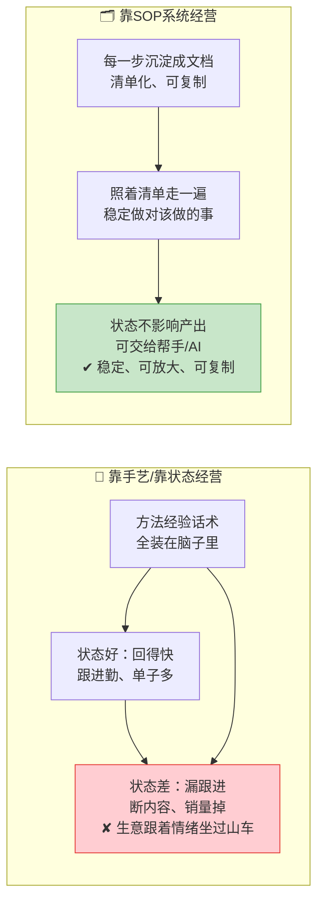
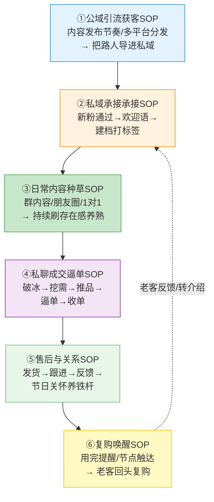
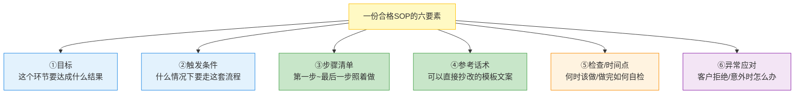

# Day49: 私域成交标准作业流程(SOP)——从引流到复购的每一步都沉淀成"可复制"的系统，让生意不再靠状态好才赚钱

> 📅 学习日期：2026-09-04
> 🔗 关联笔记：[[00-目录]] | 上一篇：[[Day48-私域活动后的客户沉淀与日常复购维护]] | 下一篇：Day50
> 🎯 适用场景：老黄这段时间学了 Day44-D48 一整条私域链路——成交话术（Day44）、客户关系经营（Day45）、社群精细化运营（Day46）、社群活动策划（Day47）、活动后客户沉淀与复购维护（Day48）。方法都学会了，但真上手时才发现一个问题：**每一步都靠老黄"记着做、心情好就做、临场发挥"在做**——今天状态好，话术发自内心、跟进积极，生意就好；哪天忙了累了、灵感不在线，私聊就不回了、跟进就断了、内容就搁浅了。于是销量也跟着老黄的心情坐过山车：**状态好时有单、状态差时断档，生意像个手艺活，离了老黄这个人就转不起来**。这一篇不新讲任何"具体怎么做成交"（那些 Day44-48 都教过了），而是讲"**把『反生活』从『引流→内容→私聊→成交→复购']整条链路里每一步的破冰话术、跟进节点、成交动作、执行节奏，全部沉淀成文字化的标准作业流程(SOP，Standard Operating Procedure)，让任何一个步骤都有一份『照着做就能干对』的检查清单**——让老黄的生意从『靠一个人的状态好坏』升级成『有一套流程在自动兜底』的稳定系统"。这是老黄从"会做"到"做得稳、做得久、能复制、能交付给别人"的关键一跃
> 📚 学习来源：Day48 活动后沉淀复购（承接"复购/沉淀阶段要SOP化"）× Day47 活动策划（承接"活动流程SOP"）× Day46 社群精细化运营（承接"日常群运营SOP"）× Day45 客户关系经营（承接"老客维护SOP"）× Day44 成交话术（承接"逼单话术SOP"）× Day43 直播连麦人设（承接"人设表达SOP"）× Day38 直播复盘与复购引擎（承接"复盘复购SOP"）× Day31 自媒体账号冷启动（承接"从0起步的流程思维"）× Day28 内容工业化（承接"内容可标准化生产"）× Day21 AI融合实战（承接"用AI把SOP做成模板/脚本，加速复制"）

---

## 1. 一句话总结

**私域成交标准作业流程(SOP)，就是把「反生活」从"引流获客、内容种草"到"私聊破冰、成交逼单"再到"复购唤醒、客户沉淀"这一整条链路里，每一个环节的「怎么开始、第一步做什么、用什么话术、何时跟进、怎么结束、出了意外怎么应对」全部沉淀成一份份文字化、清单化的操作手册——让老黄不用再靠"今天的状态/记性/灵感"来经营生意，而是"照着流程走一遍，就能稳定地把该做的事做对"，生意从靠一个人的手艺活，变成一套靠流程就能自动兜底稳定运转的系统。**

**核心认知：** 很多个人卖家（老黄也一样）最常踩的坑是——**"我脑子和手感里啥都有，就是没落到纸面上"**。一切成交的方法、跟进的经验、话术的灵感都装在自己脑子里，导致生意高度依赖"老黄这个人：状态、记性、时间、临场发挥"。状态好时回得快、聊得细、单子多；一忙一累，跟进就漏了、话术就敷衍了、内容就断了块。**这不是老黄不努力，而是"一个人的生意注定有天花板——天花板就是你自己的精力上限和情绪波动"**。SOP 解决的正是这个问题：**把"会赚钱的脑子"从老黄的身体里"复制"到一份份文档里，让这些流程替老黄记住该干嘛、该什么时候干、该怎么干。** 有了 SOP，"老黄状态好"不再是成交多少的前提——**哪怕是状态一般的日子，只要老黄（或未来请的帮手、甚至AI）照着清单一步步走，也能把当日该做的跟进、该发的内容、该聊的天做到八十分以上**。SOP 是个人IP从"靠本能经营"走向"靠系统经营"的分水岭：**它让老黄的经验第一次"可保存、可复用、可交给别人/工具执行"，也第一次让这门生意"离了老黄这个人的好状态，也能照常转起来"。**

---

## 2. 核心框架

### 2.1 「手艺 vs 系统」——先看清为什么靠脑子记的生意总有天花板

先看清很多个人卖家的真实困境：为什么明明会做，却始终做不大、做不稳？



| 维度 | 靠手艺(脑内经验) | 靠SOP(纸面系统) |
|:----:|:----|:----|
| 经验存放 | 在老黄脑子里 | 在文档/清单里，随时可查 |
| 依赖什么 | 状态、记性、灵感 | 照着流程执行 |
| 状态好坏 | 直接影响产出和销量 | 不影响(流程兜底) |
| 能否请假/休息 | 不行，一停生意就停 | 可以，帮手按SOP顶上 |
| 能否扩大 | 天花板=老黄一人的精力 | 可复制给团队/AI，规模化 |

> **给「反生活」的关键：** **一个人的生意，天花板不是"能力"，而是"精力上限+情绪波动"。** 老黄现在所有的成交功夫都装在脑子里，等于把这些功夫和"老黄状态好坏"绑死了。**写SOP不是多此一举，而是把"会赚钱的脑子"从老黄身体里复制一份放纸上——从此这门生意不再只靠老黄"今天的发挥"，而是靠一套"照着走就八九不离十"的流程。** 这是个人IP想做大做强、想休息、想招人、想复制，必须迈过的第一道门槛。

### 2.2 「全链路SOP地图」——把「反生活」整条生意链路拆成六段可SOP化的环节

写SOP的第一步，是先把"整个生意是怎么跑通的"画成一张流程图，看清哪些环节需要沉淀成手册：



| 环节 | 要沉淀成SOP的"可复制动作" | 关联笔记 |
|:----:|:----|:----|
| ① 公域引流获客 | 内容发布节奏、多平台分发步骤、导流话术 | Day13/Day34 |
| ② 私域承接 | 通过后的欢迎语模板、建档打标签的固定动作 | Day46 |
| ③ 日常内容种草 | 群/朋友圈/1对1的种草模板与发布节奏 | Day45/Day46 |
| ④ 私聊成交逼单 | 破冰→挖需求→推品→逼单→收单的标准话术脚本 | Day44 |
| ⑤ 售后关系经营 | 发货→跟进→收集反馈→节日关怀的固定节点 | Day45/Day48 |
| ⑥ 复购唤醒 | 用完提醒/节点触达/会员日的标准提醒话术 | Day38/Day48 |

> **给「反生活」的关键：** **写SOP不是写"一堆理论"，而是把"整条生意链路上每一步具体要做的可复制动作"固化下来。** 老黄不用一次性写全六段，但要心里有这张"全链路地图"——知道整门生意包含哪几段、每段各自该沉淀什么手册。**先挑当下最卡脖子、最依赖临场发挥的一两段先写（最典型的是④私聊成交逼单、⑥复购唤醒），跑顺了再补齐其他段，逐步把『反生活』的整条链路都装进SOP里。**

### 2.3 「一张SOP要写什么」——好SOP的六个必备要素

很多卖家一听说要写SOP就发怵"不知道从哪下笔"。其实一张能用的SOP，装好下面六样就八九不离十：



| 要素 | 说明 | 打个比方 |
|:----:|:----|:----|
| ① 目标 | 这段流程要达到的结果 | 麦当劳"薯条要在45秒内完成" |
| ② 触发条件 | 什么情况下启动这段流程 | "顾客下单薯条"时 |
| ③ 步骤清单 | 从第1步到最后的可执行动作 | 拿袋→装薯→称重→打包 |
| ④ 参考话术/模板 | 可直接照抄改的文案范例 | 点单的话术卡 |
| ⑤ 检查/时间点 | 何时执行、做完如何确认 | 每锅薯条不能放超7分钟 |
| ⑥ 异常应对 | 卡住/被拒/意外时怎么办 | 薯条售罄时怎么跟顾客说 |

> **给「反生活」的关键：** **写SOP最忌"只写大概、不写细节"，那可执行性就差。** 老黄写每一步，要写到"一个从没做过的人（或未来的帮手）照着这清单能独立做对"，而不是只写"用心跟进客户"这种大而空的话。**SOP的价值不在"写了"，而在"别人／状态差时的你，照着能100%复制出你状态最好时的那套操作"——所以参考话术、异常应对这两样绝不能省，它们才是把你这门手艺"复刻"出去的关键。** 用AI（呼应Day21）帮忙把零散经验整理成规范的结构化模板，能大幅提速。

### 2.4 「SOP为什么值得写」——一次写清单，换来长期稳定与可放大

有人会觉得写SOP是"花时间在纸上，不如多聊几个客户"。先看清这笔时间账：

```mermaid
flowchart TD
    A[经营靠脑内经验的成本] --> B[每次新动作都要<br/>重新琢磨临场发挥<br/>状态差就掉链子<br/>休息/请假=生意停摆<br/>想招人却教不会<br/>✘ 精力被琐事耗尽]
    C[写一次SOP的回报] --> D[一次沉淀 长期复用<br/>状态差也照常跑<br/>可交给帮手/AI执行<br/>越积累越省力<br/>可放大可复制<br/>✔ 一劳(一段时间)逸]
    style B fill:#ffcdd2,stroke:#e53935
    style D fill:#c8e6c9,stroke:#43a047
```

> **给「反生活」的关键：** **写SOP是"用一次性小投入，买断长期的稳定和可复制"。** 老黄现在"每件事都得自己想一遍怎么干"的成本，其实比"写一份SOP照着干"高得多——因为你每天都要为同样的动作消耗心力、每次状态差都付出掉单的代价。**把高频动作（回私信怎么开头、到点了发什么、客户说贵怎么接）一次性写成清单，之后就是零成本的重复使用。** 这份投入还会复利：经验越攒越多、接手的人/AI越来越能帮你分担，老黄的精力才能从"日常执行"解放出来，去琢磨更大的事。

---

## 3. 可落地方法

### 3.1 【反生活可直接用】「先挑一段写」——从最卡脖子的"私聊成交逼单SOP"入手

SOP不用一口气全写。老黄先从"最依赖临场发挥、最影响成交"的私聊成交段入手，做出一份能用的范本，再类推到其他段：

**第一步：回看近一周最成功的3次私聊成交对话**，把老黄当时"怎么开头、怎么问需求、怎么介绍产品、怎么处理异议、怎么促成下单"的话术原样摘出来。
**第二步：按"四段式"把对话拆成结构化脚本：**

| 阶段 | 目的 | 步骤要点 | 参考话术(可直接改) |
|:----:|:----|:----|:----|
| ① 破冰开场 | 让客户愿意聊 | 铺垫关系、从对方最近状态切入，别一上来就卖 | "最近天气转凉，看您上次问祛湿，这段时间感觉咋样？" |
| ② 挖需求 | 找准痛点再推品 | 用提问了解困扰、预算、使用场景 | "您主要是早上起床乏，还是久坐湿气重那种？" |
| ③ 推品塑价 | 让客户觉得值 | 讲卖点对应需求、说清价值，不硬讲成分 | "这款薏仁茯苓祛湿茶就是针对您这种晨起乏的，" |
| ④ 逼单收尾 | 促成下单 | 给优惠/承诺/临门一脚，留出收单动作 | "今天给您新客价，我这就帮你安排发货？" |

**第三步：把每步都补上"异常应对"**（客户说"再想想"/"太贵"/"我不需要"时分别怎么接），并存成一份可随时查的文档。

> **给「反生活」的核心：** **先把"成交"这一环SOP化，是因为它最值钱、也最看发挥——同一句破冰，状态好可能十拿九稳，状态差就尬在那。** 老黄从近几天真实的成功对话里"抄自己"，比凭空想话术更快更有手感。**把最顺手的3次对话拆成脚本后，你会发现：成交不是玄学，是有固定套路的——把这套路由老黄自己写下来，往后照走就行。**

### 3.2 【反生活可直接用】「私域承接欢迎SOP」——新客户进门第一分钟就留下好印象

新客刚通过好友那几分钟，决定了"留不留得住"。老黄做一份"承接欢迎SOP"，让每个新粉进门都走同一个稳定流程：


| 步骤 | 具体动作 | 参考文案(可直接用) |
|:----:|:----|:----|
| ① 即时欢迎 | 通过后30秒内主动发欢迎 | "嗨您好～看到您关注了反生活，我是老黄。您也是想调理湿气/秋季养生吗？" |
| ② 建档 | 立刻备注"来源+意向"（如"小红书来的·问祛湿"），打标签 | 备注栏填好，方便日后精准触达 |
| ③ 见面礼 | 发一份干货/优惠作为见面礼 | "送您一份《秋季祛湿自测+调理清单》，您先看看合不合适？" |
| ④ 埋钩子 | 顺势邀请进群/关注后续 | "平时我会在群里分享养生干货，拉您进去跟着一起调理？" |
| ⑤ 记录跟进 | 记下客户档位，设定下次跟进时间 | 归入 Day48 的客户分层档案 |

> **给「反生活」的核心：** **新客进门那几分钟的体验，直接决定了他愿不愿意进入你的"养熟池"。** 老黄把"欢迎+建档+送礼+邀群"这一套固定成SOP，就能保证**每一个新粉都享受到同样稳定、不遗漏的接待**——而不是"有空才好好欢迎，忙起来就晾着人家"。**SOP的本事，就是让你的"最好状态"在"普通状态"下也能被稳定复现。**

### 3.3 【反生活可直接用】「每日SOP日程表」——把一天该干的事排成稳定的执行节奏

成交不只是"坐下聊单"那一下，而是每天一系列动作的累积。老黄用一张"每日SOP日程表"兜住日常，不让任何一环靠"想不想记得"：

| 时间段 | 必做动作(SOP) | 时长 | 目标 |
|:----:|:----|:----:|:----|
| 早上30分钟 | 回昨晚漏回的私信 + 用欢迎SOP处理当天新粉 | 30分 | 不冷落任何客人 |
| 上午 | 按内容SOP发/排一条种草内容(群+朋友圈) | 15分 | 持续刷存在感 |
| 中午 | 定向跟进昨天聊过但没下单的1-3个意向客户 | 20分 | 把潜在单推进 |
| 下午 | 处理订单/发货 + 给1个A类老客做回访问候 | 20分 | 激活复购信任 |
| 晚上 | 复盘当天 + 更新客户档案 + 检查明天该触达的人 | 15分 | 不遗漏跟进节点 |

> **给「反生活」的核心：** **SOP落到"每日日程"，是把"做生意靠状态"变成"做生意靠习惯"。** 老黄不用再每天纠结"今天该干嘛"，只要按日程表走一遍，该回的私信、该发的内容、该跟进的单、该维系的老客就一样都不会漏。**累的时候，这套日程就是你的"自动驾驶"——它不要求你超常发挥，只要求你把必做项做完，稳定就已经把你托住了。**

### 3.4 【反生活可直接用】「异常应对话术库」——把最常遇到的拒绝写成"标准答案"

SOP最容易被忽略却最值钱的，是"客户不按剧本走"时的应对。老黄把成交中最常遇到的4种拒绝，提前写好"标准接法"存进话术库：

| 常见拒绝 | 客户的潜台词 | 标准应对思路 | 参考话术(可直接改) |
|:----:|:----|:----|:----|
| "我再想想" | 有顾虑，需要被推一把 | 先共情，再问犹豫点 | "理解，您主要是担心效果还是价格？我帮您参谋下" |
| "太贵了" | 觉得不值/超预算 | 强调价值与长期成本 | "听您爱熬夜，其实早睡+这款茶长期看比熬坏身体划算" |
| "效果有用吗" | 怕踩坑/不信任 | 给真实案例+试用保障 | "上个月有位群友喝了三周晨起不乏力了，您可先试一周" |
| "我不需要" | 需求没被激发 | 顺势转干货不硬推 | "没事哈～那先给您留着，秋天嗓子干随时找我" |

> **给「反生活」的核心：** **老黄最怕"客户一句话就把他问住"，然后就不知道该怎么接了——其实拒绝是有共性的，来来回回就那几句。** 把这些高频拒绝提前写进"话术库"，成交时就不用临场绞尽脑汁，照着"先接住情绪→再挖真实顾虑→给方案"的套路走，成功率立刻上台阶。**话术库越写越厚，老黄的"销售胆量"和对成交的底气也越攒越足——因为你知道，再难缠的拒绝都有一份参考答案等着你。**

### 3.5 【反生活可直接用】「AI帮你把SOP做出来、存起来、跑起来」——用AI加速整套系统落地

写SOP和跑SOP都是体力活，老黄用AI（呼应Day21）把"设计流程→沉淀文档→日常执行"都省力化：

| 环节 | AI用法 | 提效效果 |
|:----:|:----|:----|
| 提炼SOP | 把最近成功的3段对话原文贴给AI，让它拆出结构化话术脚本 | 半小时出一版SOP草稿 |
| 补全要素 | 让AI给每段SOP补"异常应对/检查清单"，再人工校对 | 不漏要素、写法规范 |
| 存成模板 | 把SOP存成可随时调用/复制的文档模板，分环节归档 | 日后可快速复制 |
| 生成话术 | 成交时让AI按SOP里的框架生成针对某客户的个性化话术 | 从"背模板"到"活用" |
| 日程提醒 | 让AI按每日SOP排日程、设提醒、到点推给老黄 | 不漏跟进节点 |

> **给「反生活」的核心：** **AI最适合干的，正是SOP这套"结构化、重复性、可模板化"的活。** 老黄的经验是"血肉"，AI的价值是把血肉"拆成骨架、做成可复制的模板、到点提醒执行"。**用AI把既往的成功经验快速固化成SOP文档，再用AI驱动日常执行——老黄的这门生意，就真正从"靠人脑记忆+临场发挥"变成了"靠文档系统+AI提醒"的稳定机器，一人也能跑出团队级的稳定。**

---

## 4. 变现路径

### 4.1 「SOP = 把产能从波动变可预期」——稳定，本身就是最值钱的变现

很多人觉得SOP跟赚钱没关系，其实恰恰相反——对个人卖家来说，"稳定"就是最直接的利润来源：

```text
「反生活」有没有SOP的两笔账：

靠状态经营(无SOP)：
  状态好的月 → 私信勤跟、单子多、收入高(假设8000)
  状态差的月 → 漏跟单、缺内容、收入掉(假设3000)
  一年下来 = 时好时坏，收入大起大落，难规划难积累

靠SOP兜底(有SOP)：
  无论状态，都能稳定做完该做的跟进/内容/唤购
  → 每月基本盘稳住(假设稳定6000+，再随积累爬坡)
  → 收入可预期、可规划、可持续向上，不会被状态拖垮

  结论：SOP拉高的不是"某天的上限"，而是"每一天的下限"
  → 底不下滑 = 利润不流失 = 变相多赚
```

> **给「反生活」的关键：** **SOP真正卖的不是"多成交一单"，而是"把收入的下限兜住"。** 老黄现在最怕的不是"不够拼"，而是"拼的日子和不拼的日子落差太大，收入忽高忽低、心里没底"。**有了SOP，状态差的那些天也能跑出八十分的产出，收入不再被老黄一个人的心情绑架——这份"稳定可预期"本身，就是个人IP最值钱、也最难被别人复制的资产。**

### 4.2 「从自己跑，到带着别人跑」——SOP是老黄未来招人/合作/放大的门票

个人IP做不大的瓶颈之一，是"只有你会、你走了生意就停"。SOP是突破这个瓶颈、打开更多变现可能的钥匙：

```text
SOP带来的三级变现跳板：

① 自我稳定（现在）
  → 状态差不掉单，收入下限兜底 → 省下的心力投入内容做增量

② 能交付给他人（积累后）
  → 招助理/找代运营，按SOP就能上手 → 从"一个人利润"扩到"小团队业绩"
  → 老黄从"亲自成交"退到"设计SOP+把关"，精力杠杆放大

③ 可复制的"产品"（高阶）
  → 好的SOP可沉淀为可复用的方法论/教学 → 开辟"卖方法、带徒弟"的新变现
  →（呼应Day18多平台变现矩阵）一条新的低边际成本收入

→ 没有SOP，这一切都无从谈起（教不会、交不出、放大不了）
```

> **给「反生活」的关键：** **SOP是老黄"从个人手艺人，进阶成能带团队/放大的经营者"的入场券。** 一门生意全装在老黄脑子里，就无法交给别人、无法休息、无法扩大——等于被自己"绑定"成瓶颈。**先把每个环节写成SOP，未来无论是招一个助理帮发内容、还是跟人合作、甚至把方法论做成卖点，都有了可交付、可考核、可复制的基础。** 这一步老黄现在就开始布局，正是为"反生活"从月入数千走向更大规模铺路。

### 4.3 「从0起草」——先花这一周写好最核心的1-2份SOP，就能看到稳定带来的复利

不用求多，老黄这个月先写好最关键的两份SOP，就足以撬动改变：

```text
本周落地路线：
  Day49(今天)：选"私聊成交逼单SOP"动手，从最近3段成功对话拆出脚本
  本周内：完成 + "每日SOP日程表"落地执行
  下周：补齐"售后服务/复购唤醒SOP"，把老客维护也纳入系统

  初期的复利回报：
  → 成交话术不靠临场 → 逼单成功率↑
  → 每日动作不漏 → 私信/内容/唤醒少了断档 → 转化与复购稳定↑
  → 老客维护成系统 → Day45/48的复购底盘真正运转起来
  
  → 不用等全部写完，第二周就能看到"收入曲线不再大起大落"
```

> **给「反生活」的关键：** **写SOP不必一口气吃成胖子，先抓"成交"和"每日执行"这两件事关最要紧的跑起来，就能先感受到"稳定不滑坡"带来的复利。** 老黄别被"要把整条链路都写成SOP"吓退——**从今天最值钱的一环开始，边跑边补，随着文档越攒越多，「反生活」会越来越像一台"自带流程、稳定运转"的机器，而不是"靠老黄状态撑起来的手艺活"。**

---

## 5. 行动清单

### ✅ 行动①:动手写第一份「私聊成交逼单SOP」——从最近的3段成功对话抄出脚本(今天做)

**步骤1(30分钟):** 翻微信/企微，回看最近成交最顺利、最满意的3次私聊对话，把老黄"怎么破冰、怎么问需求、怎么介绍产品、怎么处理异议、怎么收单"的关键话术原样摘出来。

**步骤2(30分钟):** 按 3.1 的"四段式"(破冰开场→挖需求→推品塑价→逼单收尾)把3段对话整理成一份结构化SOP，每步配上可直接改用的参考话术。

**步骤3(20分钟):** 用AI(3.5)帮你检查补全——让AI给每段补充"异常应对"(客户说再想想/太贵/不需要怎么接)和"检查清单"，再人工润色成自己的口吻，存成文档。

> **产出：** ✅ 一份能落地用的《私聊成交逼单SOP》——往后成交不再靠临场发挥，照着脚本走就有章法、有底气。

### ✅ 行动②:排一张「每日SOP日程表」，把一天该做的必做项固定下来(今天做·明天起执行)

**步骤1(15分钟):** 按 3.3 的框架，结合老黄自己的作息，排一张包含"回私信/发内容/跟单/维护老客/复盘"的每日必做日程表。

**步骤2(10分钟):** 用AI(3.5)把日程设置成每日定时提醒(早上/中午/晚上各设一到两个关键节点)，到点自动推给你，防止忙起来遗忘。

**步骤3(今晚):** 按日程走第一天，睡前对照清单勾一遍是否全部完成；凡是"漏的/不顺畅的"就随手补进SOP或调整时间。

> **产出：** ✅ 一张已在执行的每日SOP日程表 + 一份对照清单——从明天起，每一单、每一个跟进的节点都有人(流程+提醒)替你记着，不再靠状态和记性。

### ✅ 行动③:建一个「异常应对话术库」，把最常遇到的拒绝写成标准答案(本周内补齐)

**步骤1(20分钟):** 回想/记录老黄在成交私聊中"最常被客户问住/拒绝"的4-6种情形(如"太贵""再想想""没用吧""我不需要"等)。

**步骤2(20分钟):** 对照 3.4 的格式，给每种情形写好"先共情→再挖真实顾虑→给方案"的标准应对思路+可直接改用的参考话术。

**步骤3(持续):** 以后每次遇到新的、难答的客户问题，成交后立刻补进话术库——让它越攒越厚，成为老黄独有的"销售武器库"。

> **产出：** ✅ 一份越用越厚的《异常应对话术库》——任何拒绝都有"标准答案"兜底，老黄的销售胆量和成交底气随话术库存量一起水涨船高。

---

## 📊 今日学习总结

| 维度 | 内容 |
|:----:|------|
| 核心认知 | 一个人的生意天花板不在能力而在"精力+情绪波动";方法全装脑子里→靠状态、难复制、停不下;写SOP是把"会赚钱的脑子"复制到纸面上,让生意离了"状态好的老黄"也转得动 |
| 核心框架 | 手艺vs系统 × 全链路SOP地图(引流承接/种草/成交/售后/复购六段)× 一张SOP六要素(目标/触发/步骤/话术/时间点/异常)× 写一次清单换长期稳定可放大 |
| 关键技能 | 先从"私聊成交逼单SOP"抄成功对话入手、客户承接欢迎SOP、每日SOP日程表、异常应对话术库、"AI帮你写SOP存SOP跑SOP" |
| 变现路径 | SOP拉高的是"每一天的下限"(收入不滑坡=变相多赚);是招人/合作/放大的门票(从个人手艺到组织经营);从最核心一份写起就已见稳定复利 |
| 今日行动 | ① 从3段成功对话写第一份《私聊成交逼单SOP》 ② 排一张《每日SOP日程表》并设提醒、今晚照着走 ③ 建一份《异常应对话术库》把高频拒绝写成标准答案 |

> 下一篇预告：**Day50: 复盘与SOP迭代升级——定期复盘每一段流程跑得顺不顺，用数据把SOP越改越好用，让「反生活」的经营系统能自我进化**，迈入第二阶段实战落地篇的收尾升级。
