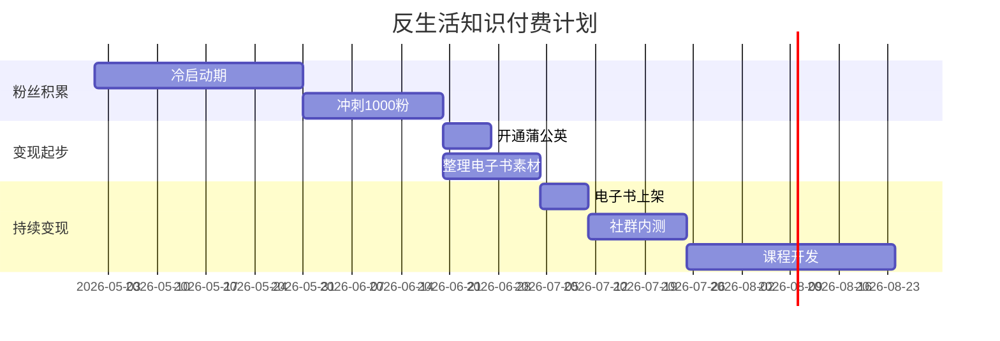

# 📕 Day5: 知识付费变现模型

> **核心：怎么把知识变成钱？知识付费的完整逻辑**
> 适用：老黄所有自媒体账号的终极变现方式

---

## 一、为什么知识付费是终极变现？

| 变现方式 | 利润率 | 可持续性 | 天花板 |
|:--------:|:------:|:--------:|:------:|
| 广告 | 20-30% | ⭐⭐ | 低 |
| 带货 | 5-30% | ⭐⭐⭐ | 中 |
| **知识付费** | **80-90%** | **⭐⭐⭐⭐** | **高** |
| 自有产品 | 40-60% | ⭐⭐⭐ | 高 |

**核心逻辑**：
> 一次创作，无限销售
> 边际成本趋近于零

---

## 二、知识付费的产品金字塔

```
        价格
          ↑
       ┌──────┐
       │ 1v1   │ 2000-1万/人
       │ 咨询   │
       ├──────┤
       │ 训练营 │ 999-5000/人
       │       │
       ├──────┤
       │ 社群   │ 99-499/月
       │       │
       ├──────┤
       │ 课程   │ 99-999
       │       │
       ├──────┤
       │ 电子书 │ 1-50元
       │ 模板包 │
       └──────┘
          ↓
        销量
```

### 各层级的策略

| 层级 | 价格 | 用户数 | 月收入 | 工作量 |
|:----:|:----:|:------:|:------:|:------:|
| 电子书 | 9.9元 | 100人 | 990元 | 一次写 |
| 课程 | 199元 | 50人 | 9950元 | 一次录 |
| 社群 | 99元/月 | 30人 | 2970元 | 每日维护 |
| 咨询 | 500元 | 10人 | 5000元 | 按次 |

---

## 三、最适合反生活的知识付费产品

### 初级产品（0-5000粉）
| 产品 | 定价 | 制作成本 |
|:----|:----:|:--------:|
| 《生活辟谣自查手册》电子书 | 9.9-19.9元 | 低（整理已有内容） |
| 《100条生活谣言真相》PDF合集 | 29.9元 | 低（整理发布内容） |
| 辟谣素材包（可商用） | 49.9元 | 中 |

### 中级产品（5000-2万粉）
| 产品 | 定价 | 说明 |
|:----|:----:|------|
| "反生活"专属社群 | 99-199元/月 | 每日辟谣+答疑 |
| 《辟谣内容创作课》 | 299-599元 | 教别人做辟谣号 |
| 1v1谣言鉴定 | 200元/次 | 帮用户鉴别信息真伪 |

### 高级产品（5万粉+）
| 产品 | 定价 | 说明 |
|:----|:----:|------|
| "辟谣IP孵化营" | 2999-4999元 | 带学员从0到1做辟谣号 |
| 企业内容风控 | 1万+/年 | 帮品牌做舆论风险管理 |

---

## 四、从0到1做课程

### 第1步：验证需求
```
在小红书发："想出一期辟谣内容教程，有人想看吗？"
→ 评论>50条 → 需求成立
```

### 第2步：最小化产品
```
不要一上来就录20节课
先做：3节试听课（免费或9.9）
→ 验证转化率
→ 根据反馈迭代
```

### 第3步：定价策略
```
锚定定价：599元（原价）
限时优惠：199元（前50人）
持续价格：299元（正常价）

原理：让用户觉得"赚到了"
```

### 第4步：推广渠道
```
小红书 → 种草笔记
公众号 → 文章转化
私域 → 朋友圈+社群
直播 → 限时优惠成交
```

---

## 五、变现模型的执行时间线



---

## 六、核心认知

### 知识付费的3个误区

| 误区 | 真相 |
|:----|:-----|
| "得先有10万粉" | 500粉也能卖9.9电子书 |
| "内容得100%原创" | 整理+复用已有内容即可 |
| "价格越低越好" | 低价=低信任，99元比9.9好卖 |

### 老黄的赚钱公式
```
收入 = 流量 × 转化率 × 客单价

先追流量（内容）
再优化转化率（信任/人设）
最后提客单价（产品力）
```

---

## 七、行动清单（今天能做）

```
□ 1. 梳理已有内容→哪些可以打包成电子书？
□ 2. 在小红书发一条"想学辟谣吗"的投票/调研
□ 3. 确定第一个知识付费产品（建议：电子书）
```

---

> **关联**：[Day1-小红书变现全攻略](Day1-小红书变现全攻略.md) · [自媒体运营入门](自媒体运营入门.md) · [文案公式](../02-内容方法论/文案公式.md)
