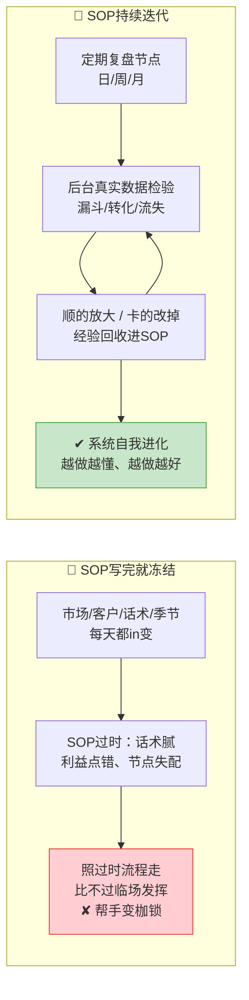

# Day50: 复盘与SOP迭代升级——定期复盘每一段流程跑得顺不顺，用数据把SOP越改越好用，让「反生活」的经营系统能自我进化

> 📅 学习日期：2026-09-05
> 🔗 关联笔记：[[00-目录]] | 上一篇：[[Day49-私域成交标准作业流程SOP]] | 下一篇：Day51
> 🎯 适用场景：老黄昨天(Day49)把「反生活」整条链路——引流承接、日常种草、私聊成交、售后复购——都沉淀成了纸上SOP，从此生意不再"靠状态、靠记性"。但真用起来会发现另一个问题：**SOP是死的，市场是活的**。今天话术A对这批客户管用，下个月TA们嫌腻了；这个月产品B卖得好，是因为季节对，下个月同样流程可能就跑不动了。如果老黄的SOP写一次就再也不动，那它很快就会从"帮手"退化成"枷锁"——照着过时的流程走，反而比不过状态好的临场发挥。这一篇不新讲"怎么做成交"(Day44-49都教完了)，而是讲"**怎么给SOP装上'眼睛'和'轮子'——建立一套定期复盘机制，用后台的真实数据(阅读/转化/复购/流失)反哺每一段流程，把跑得顺的环节放大、把跑不动的环节替换，让「反生活」的经营系统从'能稳定运转'进化成'能自己越改越好'的会进化的系统**"。这是老黄从"把生意做稳"迈向"把生意做活、越做越值钱"的最后一跃。

> 📚 学习来源：Day49 私域成交SOP（承接"SOP写好了之后要维护迭代"）× Day42 直播实时数据调优（承接"用实时数据当场调"）× Day38 直播复盘与复购引擎(承接"复盘驱动复购") × Day24 内容数据分析与迭代优化（承接"用数据迭代内容"）× Day48 活动后客户沉淀复购（承接"活动后要复盘沉淀"）× Day45 客户关系经营（承接"老客反馈是迭代素材库"）× Day28 内容工业化(承接"可复制流程要能自我优化")

---

## 1. 一句话总结

**复盘与SOP迭代升级,就是给「反生活」已经沉淀好的每一段SOP(引流、种草、成交、售后、复购)装上"复盘节点+数据仪表盘+反馈回流"三样东西——定好固定的复盘节奏(日/周/月),用后台最真实的几组数据(触达→承接→转化→复购各环节的漏斗数据)去检验每一段流程跑得顺不顺,跑得顺的环节就放大复制、跑不动的环节就定位原因、改掉重试,再把每一次复盘发现的新经验"回收"进SOP本身——让「反生活」的经营系统从"能稳定运转"升级成"能自己学会越做越好"的自我进化系统。**

**核心认知：** 很多把生意做上轨道的人,第二个最容易踩的坑是——**"SOP写完就冻结了,从此把它当圣经,再不改"**。昨天(Day49)好不容易把死记硬背的经验写成了纸上的流程,今天却忘了:纸上的流程诞生于"过去某个时刻的环境和判断",而市场、客户、平台规则、自己的产品每天都在变。**一份不迭代的SOP,保质期其实很短**——写它的那一刻它最准,之后每过一天就悄悄过时一点:话术用滥了客户没感觉、利益点讲错时期客户不买账、复购节点没跟住客户的真实使用周期。**老黄要的不是一份"永远对"的SOP(那不存在),而是一套"能根据真实结果不断自我修正"的机制**——而这套机制的核心,就是本篇要讲的"复盘+数据+回流"三件套。简单说:**会写SOP只是把生意做稳的开始,会复盘迭代SOP才是把生意做活、越做越值钱的关键;前者让你从"靠状态"变成"靠系统",后者让你从"靠系统"进化成"系统比你更懂怎么做"**。

---

## 2. 核心框架

### 2.1 「写死 vs 进化」——先看清为什么SOP不迭代会从帮手变枷锁

先看清很多个人卖家的第二个暗坑:为什么费尽心力写好的SOP,放着不动反而会害了生意?



| 维度 | SOP写死不动 | SOP复盘迭代 |
|:----:|:----|:----|
| 和真实市场的关系 | 脱节(诞生于过去某刻) | 每个周期都对齐一次 |
| 面对话术用腻/政策变化 | 反应慢,照着错路走 | 复盘及时发现、替换 |
| 迭代靠什么 | 靠碰运气/出问题了才改 | 靠固定复盘+数据,主动发现 |
| 长期趋势 | 越用越不准,价值递减 | 越用越准,越做越值钱 |
| 本质 | 静态文件 | 会自我进化的活系统 |

> **给「反生活」的关键：** **一份SOP的保质期,取决于老黄多久没复盘它。** 写完不碰,它就是你"过去某个时点"的切片,会随着市场一起过时;只有定期(固定节奏)拿真实数据去检验、把新发现回收回去,SOP的价值才会随使用时间越滚越高。**老黄不用怕SOP"会被改"——恰恰是那怕改的、肯迭代的SOP,才是真正让它保值增值的"活流程"。**

### 2.2 「复盘-数据-回流」三件套——让SOP长出动起来的"眼睛"和"轮子"

要让SOP自我进化,需要给它装上三个部件:固定的复盘节奏(什么时候看)、一张数据仪表盘(看什么)、一条经验回流管道(怎么把发现改回SOP):

```mermaid
flowchart TD
    A[📊 数据仪表盘<br/>触达/承接/转化/复购<br/>各环节漏斗看板] --> B[🕐 固定复盘节奏<br/>日:微调话术节点<br/>周:看漏斗换打法<br/>月:大改版重写流程]
    B --> C[🔍 定位"卡点环节"<br/>哪一段转化掉最多?<br/>是话术?时点?产品?承接?]
    C --> D[⚡ 形成迭代动作<br/>顺的:放大复制到全局<br/>卡的:出A/B方案改掉重试]
    D --> E[♻️ 经验回流进SOP<br/>新话术/新节点/新SOP<br/>更新文档+通知执行人]
    E -. 让下一轮跑得更顺 .-> A

    style A fill:#e3f2fd,stroke:#1e88e5
    style B fill:#fff3e0,stroke:#fb8c00
    style C fill:#f3e5f5,stroke:#8e24aa
    style D fill:#c8e6c9,stroke:#43a047
    style E fill:#fff9c4,stroke:#ffc107
```

| 部件 | 作用 | 给「反生活」的操作落点 |
|:----:|:----|:----|
| 📊 数据仪表盘 | 看清"哪里顺、哪里卡"的客观依据 | 列出从"引流→加微→进群→看圈→私聊→下单→复购"每一步的计数,做成一张简单表 |
| 🕐 固定复盘节奏 | 不被"忙忘了"打断的定时体检 | 日复盘(10分钟看当日数据)+周复盘(30分钟看漏斗换打法)+月复盘(大改版重写) |
| ♻️ 经验回流 | 把复盘发现的改进真正改回SOP,而不只是"心里知道" | 每次复盘输出"至少1条SOP更新",当场改文档、通知自己/帮手执行 |

> **给「反生活」的关键：** **复盘的产出,必须落成"SOP文档里的真实改动",否则只是一场"知道了但没动"的自我安慰。** 老黄每次复盘结束前,逼自己回答一个问题:**"今天这次复盘,我具体要改SOP里的哪一句/哪一步?"**——答得出来并当场改掉,这才算一次"有产出"的复盘。

### 2.3 「一杯漏斗照见卡点」——用最简单的漏斗数据找出SOP最该改的那一段

新手最容易把复盘做成"今天单多单少、心情好坏"的情绪复盘;真正的数据复盘,是看**每一步之间"掉了多少人"**。教老黄做一张只看5个数的迷你漏斗:


| 漏斗断层 | 说明 | 最可能卡的环节 | 该A/B测试的方向 |
|:----:|:----|:----|:----|
| ①→②加微多但进群少 | 人加了不会社恐、没动力进群 | 承接SOP的欢迎语/进群钩子 | 换进群钩子(领资料/进养生打卡群抽奖) |
| ②→③进群但没互动 | 群成了"死群",没人气 | 日常种草SOP的群内容/话题 | 换群内容调性、加固定互动活动 |
| ③→④有黏性但不下单 | 看的人多、买的人少 | 私聊成交逼单SOP话术 | 换利益点/紧迫感/逼单时机 |
| ④→⑤成交了不回头 | 一锤子买卖,复购低 | 售后复购唤醒SOP | 换复购钩子/会员日/回访话术 |

> **给「反生活」的关键：** **数据复盘的秘诀不是"看总数",而是"看每一段之间掉了多少人"。** 老黄只要每周把上面5个数字填一遍,马上就能看出"这周最该改的是哪一段SOP"——**别贪多,每周只挑掉人最狠的那一个断层去A/B测试**,改好它,下周这个数字就会告诉你改对没有。

### 2.4 「日-周-月」三级复盘节奏 + 数据表格模板

给老黄一套既不累、又能持续出成效的复盘频率,以及可以直接抄的复盘表:

| 节奏 | 花多少时间 | 主要看什么 | 该产出什么改动 |
|:----:|:----:|:----|:----|
| 🗓 日复盘 | 10-15分钟(睡前) | 今日新增/成交/复购当日数,有没有特别顺或特别卡的单 | 微调明天话术/跟进节点 |
| 🗓 周复盘 | 30-40分钟(周末) | 迷你漏斗5个数,找出掉人最狠的断层 | A/B测试这一段的1种新打法 |
| 🗓 月复盘 | 1-1.5小时(月底) | 整月数据趋势、大盘、哪些产品季节性掉量 | 大改版:重写过时SOP、砍表现差的环节 |

可以直接抄的一张《「反生活」周复盘数据表》:

| 指标 | 本周 | 上周 | 环比 | 健康线(参考) |
|:----:|:----:|:----:|:----:|:----|
| ① 新增加微人数 | — | — | — | 稳定为上 |
| ② 新粉进群人数 | — | — | — | ≥60%加微者 |
| ③ 群里活跃互动数 | — | — | — | ≥1次互动/人/周 |
| ④ 私聊成交单数 | — | — | — | 稳定需增长 |
| ⑤ 老客复购单数 | — | — | — | ≥30%成交复购 |
| 卡点断层(本周重点改哪段) | — | — | — | 只选最狠1个 |

> **给「反生活」的关键：** **复盘不是"等生意差了才做",而是"固定节奏雷打不动地做"。** 每周同一天、同一张表,把它当成和SOP一样"不靠状态也要执行"的必做项——**数据积累三个月,老黄就拥有了一本别人没有的、专属于自己生意的"体感+曲线",这本身就是别人抢不走的资产。**

---

## 3. 可落地方法

### 3.1 周复盘「四问四改」法：一问掉哪、二问为何、三问咋改、四问何时验

给老黄一套闭眼能走的每周复盘流程,不必会复杂分析,照四步走就行:

**第1问:本周5个数,哪个断层掉得最狠?**(先看数字,别靠感觉)
- 打开2.4那张周复盘表,把①②③④⑤五个数字填上上周和本周,算出环比。
- 圈出"掉人比例最扎眼"的那个断层——**本周只战这一个,别想全改**。

**第2问:这个断层,大概率卡在SOP的哪一段、哪个动作?**
- 掉"加微→进群"→查承接SOP的欢迎语/进群钩子;
- 掉"进群→互动"→查日常内容SOP的群内容;
- 掉"看圈→下单"→查私聊逼单SOP话术;
- 掉"下单→复购"→查售后复购唤醒SOP/回访节点。

**第3问:针对这个卡点,想一个"和现在不一样"的A/B改进**
- 只改一段SOP里的一步(比如换个进群钩子、换个逼单说法),别一次动三处,免得改坏了不知道是哪个导致的。

**第4问:给这个改进定一个"验证周期",下周同一张表能不能看出结果?**
- 一般A/B测1-2周就能看出话术/钩子有没有效;有效就"回收进SOP"固化,无效就换下一个方案再测。

> **给「反生活」的关键：** 每周只花40分钟,但产出必须"可被下周数据验证的一个改动"。宁可一周只改好一小步,也不要每周空想一堆却一步没落纸。

### 3.2 经验回流「三样东西」：复盘发现得"落到SOP文档里"才叫回收

只"心里知道"不叫复盘,把发现真正写回SOP文档才叫迭代。每次复盘固定产出三类东西:

| 回收类别 | 具体内容 | 落在哪 |
|:----:|:----|:----|
| 🗂 新话术/新钩子 | 这次成交里哪句特别管用、哪个钩子特别灵 | 追加进对应SOP的"话术库/异常应对"小节 |
| 🗂 新节点/新时机 | 发现某类客户在某时点特别容易被触达/复购 | 补充进对应SOP的"时间点/触发"栏 |
| 🗂 新SOP/新环节 | 复盘挖出新问题(如缺回访动作),现有流程没覆盖 | 新增一个SOP段落,或更新流程图 |

配套小习惯:**每次复盘结束,给SOP文档加一行"版本/更新日期/更新了什么"的更新日志**——三个月后回看,老黄能清晰地看到"这套系统是怎么一步步被我调优到今天这个样子的",这本身就是极大的正反馈和资产沉淀。

> **给「反生活」的关键：** **SDK最好配AI(见Day21/49的AI玩法):把复盘发现的"问题+想改的方向"甩给AI,让AI按老黄SOP的格式直接产出"改后的话术/新SOP段落",老黄只需润色存回文档**——迭代速度快到惊人,一个人也能撑起一支"优化团队"。

### 3.3 用AI帮你搭建「复盘仪表盘」：把5个数做成自动看板,复盘不再靠翻记录

别再靠脑子记每周数据,直接让AI/工具帮老黄做一张每周一填、能自动算环比的复盘表:

- **步骤1:** 用表格工具(或最简单的一张Excel/在线表格)按2.4的模板建一张"周复盘数据表",五列五指标+健康线,每周把数字填进去。
- **步骤2:** 把前后两周数据贴给AI,让AI帮你算环比、指出"哪个断层掉人最狠、可能卡在哪一段SOP、给1个可A/B的改进方向"——AI的归纳能力足够当老黄的半个数据分析师。
- **步骤3:** 让AI按老黄SOP的统一格式,把采纳的改进"写成可以直接替换进SOP文档的新话术/新节点",老黄照抄进文档就完成一次"回流"。
- **步骤4(进阶):** 等数据积累到一两个月,把整段数字甩给AI,让它帮你做"月度趋势分析":哪类产品季节性涨跌、哪段SOP整体该重写——为月末的大版本迭代做准备。

> **给「反生活」的关键：** AI在这套体系里最值钱的用法,不是替你"做",而是当你的"数据复盘副驾"——你负责每周喂数据、拍板"改不改",AI负责算环比、找卡点、代写迭代版SOP,一个人也能像一个小团队那样高效地迭代优化。

---

## 4. 变现路径

SOP迭代升级带来的回报,远比"换一句更好的话术"更大,它撬动的是「反生活」整体收益曲线的持续上扬:

| 变现维度 | 怎么赚 | 大概能到哪个量级 | 关联笔记 |
|:----:|:----|:----|:----|
| 💰 拉高转化下限 | 每个周期都剔除掉人最狠的断层,漏斗各段转化率持续上修 | 转化率每提5-10个百分点=同客流下多出的直接成交 | Day49 |
| 💰 复购唤醒翻倍 | 用真实使用周期校准复购节点(月记笔记的复购提醒改到真正"该买时"),老客复购率持续走高 | 复购率从30%拉到50%+ = 同样的老客盘子多出一整截稳定流水 | Day48/Day45 |
| 💰 反内卷的新壁垒 | 三个月积累的"专属数据曲线+迭代记录"是别人抄不走的运营资产 | 老黄对自家生意"哪个环节怎么改有效"的体感,含金量随时间递增 | Day24 |
| 💰 放大与交接的底气 | 有了数据验证过的SOP,才敢放手招帮手/投流放大,因为每一步都有据可查、能教 | 从"个人生意"走向"可规模化、可交付"的进阶门票 | Day28/Day31 |

> 给「反生活」的一句话账本：**SOP迭代最实惠的回报,是把"转化漏斗"和"复购唤醒"这两个能持续上修的水龙头一直拧——不是靠一次爆发,而是每个迭代周期都让它们比上一周更顺一点,三个月下来,同样的新客和老客户盘子,能稳定多产出超出直觉的一截流水。**

---

## 5. 行动清单

### ✅ 行动①:搭好「周复盘数据表」并跑通第一次"四问四改"(今天做)

**步骤1(20分钟):** 照2.4的表格模板,用表格工具建一张《「反生活」周复盘数据表》,把①加微②进群③活跃④成交⑤复购五列画好。
**步骤2(10分钟):** 回翻聊天/后台记录,把"上周"那列的真实数字先填上(填不准没关系,先有个起点,从这周开始稳步记)。
**步骤3(10分钟):** 对着2.4的"漏斗断层表"看一遍,圈出"最想先解决的1个断层",写下"打算下周A/B的一个改进方向"。

> **产出：** ✅ 一张已在填数据的周复盘表 + 明确了下周要A/B改进的那一个断层——从这周起,老黄不用再靠感觉判断生意,而是有一张客观的地图。

### ✅ 行动②:给SOP文档加「版本更新日志」,并完成第一次经验回流(本周内)

**步骤1(10分钟):** 打开昨天(Day49)写的《私聊成交SOP》,在文档末尾加一条"版本更新日志"(格式:日期 | 更新内容)。
**步骤2(15分钟):** 回看最近2-3次成交里"哪句话/哪个动作特别管用、哪一次特别卡",把管用的补充进SOP话术库、卡的问题记下来准备下次A/B。
**步骤3(持续):** 从今天起,凡成交中碰到"新难题/发现新妙招",都随手记进待复盘清单——让它成为每月迭代的原材料库。

> **产出：** ✅ 一份带更新日志、已经开始"收录好经验/积累待改问题"的活SOP——它从"写完就冻住"成功变成"会越攒越厚、越用越准"的活系统。

### ✅ 行动③:把「周复盘」设成一个固定日程,并安排本月末第一次"大版本迭代"(今天定下来)

**步骤1(5分钟):** 用AI/日历给自己设一个每周固定提醒(如每周日晚8点)叫"反生活周复盘"——像Day49排每日SOP日程一样,把它变成雷打不动的必做项。
**步骤2(5分钟):** 在日历上圈出"本月末(如月底周日)"的"月复盘大迭代"时间,预留1-1.5小时,打算重写过时的SOP。
**步骤3(第1次执行):** 下周日第一次照"四问四改"完整跑一遍,睡前对照复盘表核对是否产出了一句能被验证的A/B改动。

> **产出：** ✅ 一个不会忘的每周日复盘提醒 + 一次已排期的月末大迭代——「反生活」从此不是"靠天吃饭地做",而是"固定体检、持续进化地做",系统和老黄一起越来越稳、越来越好。

---

## 📊 今日学习总结

| 维度 | 内容 |
|:----:|------|
| 核心认知 | 会写SOP只是把生意做稳的开始;SOP写完冻结=过时的"过去切片",会从帮手变枷锁;定期复盘+数据+回流,才是让经营系统自我进化、越做越值钱的关键 |
| 核心框架 | 写死vs进化 × "复盘-数据-回流"三件套 × 迷你漏斗(加微/进群/互动/成交/复购找卡点断层)× 日-周-月三级复盘节奏+数据表模板 |
| 关键技能 | 周复盘"四问四改"(掉哪→为何→咋改→何时验)× 经验回流三类产出×用AI做数据副驾、自动算环比找卡点代写迭代版SOP |
| 变现路径 | 拉高转化下限(剔除断层)、复购唤醒翻倍(校准复购节点)、三个月专属数据曲线成反内卷壁垒、数据验证过的SOP是招人放大交接的底气 |
| 今日行动 | ① 搭《周复盘数据表》并跑通首次四问四改 ② 给SOP加版本日志并完成首次经验回流 ③ 把周复盘设成固定日程、排定月末大迭代 |

> 下一篇预告：**Day51: 阶段二收官总复盘——梳理「反生活」从 Day31 实战落地篇至今打通的整条链路、跑通的可变现闭环,做一次"经营体检"并排定下一步的增量优先级**,同时把整套方法沉淀成可复用的经营手册,帮老黄从"会做各自的事"进化到"能看清整盘棋、挑着赚钱"的经营者。
