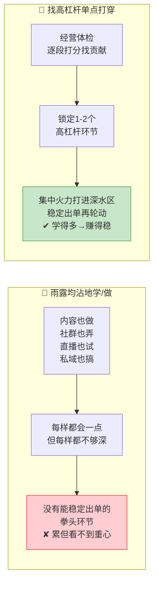

# Day51: 阶段收官总复盘与经营体检——梳理「反生活」从Day31实战落地篇至今打通的整条链路与跑通闭环，做「经营体检」并排定下一步增量优先级

> 📅 学习日期：2026-09-06
> 🔗 关联笔记：[[00-目录]] | 上一篇：[[Day50-复盘与SOP迭代升级]] | 下一篇：Day52
> 🎯 适用场景：老黄从 Day31 进入「实战落地篇」，一路学到今天（Day50 把整条链路 SOP 化并装上"复盘+数据+回流"的自我进化轮子），已经跑通了「反生活」从引流到复购的一套完整打法。但学到这个节点，最大的风险是**"学得很满、却不知道自己到底打通了哪条能赚到钱的链"**——脑子里塞满了话术、活动、社群、直播的招式，却很少有人停下来问一句："**我这些天到底练成了哪几块真本事？哪块已经在帮我赚钱？哪块是我最该先攻下的下一块？**"如果一直埋头逐个学、不抬头看全局，老黄很容易陷入"什么都学过、却说不清自己当下的经营重心该押在哪"的迷失。这一篇不做任何新方法的传授（Day31-50 已经把该讲的实操都讲透了），而是一次**"经营总盘点"**——把老黄的「反生活」从"内容引流"到"私域成交到复购"的整条链路用一张地图摊开，逐段盘点"哪段已跑通、哪段还卡着、哪段最值钱"，做一次**「经营体检 + 增量优先级排序」**，帮老黄从"会做每一步"进化成"能看清整盘棋、把力气花在最能下金蛋的环节"的经营者。
> 📚 学习来源：Day50 复盘SOP迭代（本篇的"体检方法论"）× Day49 私域成交SOP（承接"已沉淀的全链路SOP"）× Day48 活动后复购维护 × Day47 社群活动促销 × Day46 社群精细化运营 × Day45 客户关系复购 × Day44 成交话术逼单（承接"私域成交这一段已练透"）× Day38 直播复盘引擎 × Day31 自媒体账号冷启动（实战落地篇起点）× Day24/D42 数据驱动 × Day28 内容工业化（内容量产段）

---

## 1. 一句话总结

**阶段收官总复盘，就是把「反生活」从 Day31 至今学过的每一段(内容引流→承接→种草→私聊成交→社群活动→售后复购→复盘迭代)放到一张「全链路经营地图」上，逐段做一次体检打分——哪些环节的流程(SOP)已经跑通、真实带来转化，哪些还卡在"学了没落地"或"落地但量太小"，把它按"对收入的贡献大小 × 推进的难易"排出一个增量优先级，锁定未来4-6周老黄最该集中火力攻的1-2个"高杠杆环节"，其余保持稳住别贪——让老黄从"会做各自的事"翻升到"能看清整盘棋、把力气投到最下金蛋的环节"的经营者。**

**核心认知：** 学了很多、练了很多之后，最容易犯的错是——**"雨露均沾地努力，却没有一个明确的经营重心"**。人的精力有限，一个人既要写内容、又要做社群、又要搞直播、还要维护私域，不可能每段都做到最精。真正把生意做上台阶的个人卖家，靠的从来不是"每样都做一点"，而是**"认清自己此刻最该集中突破的那1-2个高杠杆环节，把它打穿到能稳定出单，再轮动去攻下一块"**。Day31 到今天（Day51）这一大段，老黄已经把"一个人好物养生号怎么从0做到能变现"的几乎每一块拼图都见过、学过、练过了；假如继续"每逢新主题就往前冲",却不回头把已经学过的东西"钉成自己能稳定跑通的闭环",那这些学习就会停留在"知道",变不成"收入"。**本篇的价值，就是用一次系统的总复盘，帮老黄找到那条真正属于自己、当下最该全力跑通的那条"现金链",把力气从"广撒网学着做"收拢成"单点打穿地干",一步步让自己从"学得多"变成"赚得稳"。**

---

## 2. 核心框架

### 2.1 「学了很多 vs 经营重心」——先看清为什么埋头逐个学,到节点必须来一次总盘点

先看清个人卖家长跑中最常见的迷失:为什么越学越满,反而越容易在原地打转?



| 维度 | 雨露均沾地学/做 | 单点打穿的经营 |
|:----:|:----|:----|
| 精力分配 | 平摊到每一段，哪段都不深 | 聚焦到1-2个高杠杆环节，打透 |
| 出单情况 | 每样都沾，难有稳定现金链 | 拳头环节能稳定出单 |
| 复盘心态 | 总觉得"还有好多不会" | 清楚"我已打通哪里、下个攻哪" |
| 成长曲线 | 学得多、赚得平 | 每轮打穿一环，收入随之上一台阶 |

> **给「反生活」的关键：** **一个人账号的瓶颈，从来不是"会的东西太少"，而是"没有一条被单点打穿到能稳定变现的链"。** 老黄若只顾一路向前学新主题、不肯在某一段上"集中火力打到底",那么学过的东西就永远是"库存知识"而非"现金流"。任何一门生意做上台阶，都要经历若干次"停下发散、回头补漏、单点打穿"的节点——本篇文章就是老黄走到现在这个节点必须做的一次"从广撒网到单点打穿"的收拢。

### 2.2 「全链路经营地图」——把「反生活」从引流到复购的整条链摊开成一盘棋

老黄从 Day31 至今学过的每一段，其实是一条前后咬合、能互相放大的完整经营链。先把它完整摊开，再从"收入贡献"和"推进状态"两个维度逐段体检：

```mermaid
flowchart TD
    A[① 公域内容引流<br/>小红书/多平台<br/>Day31-33,Day13]<br/>把路人从平台导进私域
    --> B[② 私域承接建档<br/>欢迎语/打标签<br/>Day49,Day31]<br/>进得来、认得清、接得住
    --> C[③ 日常内容种草养熟<br/>朋友圈/群/一对一<br/>Day46,Day28,Day27]<br/>持续刷存在、养信任
    --> D[④ 私聊成交逼单<br/>破冰→挖需→推品→收单<br/>Day44,Day27,Day49]<br/>把信任沉淀为第一单
    --> E[⑤ 社群活动/直播集中爆发<br/>Day25,Day37-43,Day47]<br/>活动周期里集中拉成交
    --> F[⑥ 售后复购与转介绍<br/>Day45,Day48,Day22]<br/>让客户回头、帮你介绍
    --> G[⑦ 全链路复盘迭代<br/>Day50,Day51]<br/>每段都能自我进化、越做越顺]

    style A fill:#e3f2fd,stroke:#1e88e5
    style B fill:#fff3e0,stroke:#fb8c00
    style C fill:#c8e6c9,stroke:#43a047
    style D fill:#f3e5f5,stroke:#8e24aa
    style E fill:#fff9c4,stroke:#ffc107
    style F fill:#fce4ec,stroke:#d81b60
    style G fill:#e0f7fa,stroke:#00acc1
```

| 环节 | 对应Day(已学) | 一句话作用 | 在「反生活」里的主要产出 |
|:----:|:----|:----|:----|
| ① 公域内容引流 | Day31/32/33/13 | 把路人从平台导进私域 | 稳定产出"可破冰的优质人群"来源 |
| ② 私域承接建档 | Day49/31 | 进得来、认得清、接得住 | 新客不流失、标签化好跟进 |
| ③ 日常种草养熟 | Day46/28/27 | 持续刷存在、养信任 | 朋友圈/群成为"信任温床" |
| ④ 私聊成交逼单 | Day44/27/49 | 沉淀为第一单 | 把信任转成实际成交额 |
| ⑤ 社群/直播集中爆发 | Day25/D37-43/D47 | 活动周期集中成交 | 单波集中冲一波销量 |
| ⑥ 售后复购转介绍 | Day45/48/22 | 让客户回头+介绍 | 老客盘子的稳定复购流水 |
| ⑦ 全链路复盘迭代 | Day50 | 每段自我进化 | 全链越做越顺、越做越值钱 |

> **给「反生活」的关键：** **不要把这七段看成"七个要分别学会的技能"，而是一条首尾咬合的"客户终身价值流水线"。** 上段做得好，会让下段更容易——比如①内容导进来的粉如果②私域接得好（欢迎语+建档），③种草和④成交就会顺得多；⑤⑥把客户养熟后，又会反过来助力①的转介绍。**老黄要练的，是把这一整条链越接越顺，而不是只盯某一段的局部最优。**

### 2.3 「体检打分二维表」——用"贡献×状态"看清哪段该重仓、哪段先稳住

逐段体检的实操，是给每一段打两个分：**"它现在对收入的贡献大不大？"** 和 **"它现在跑得通不通、深不深？"** 用这两维把七段排进四个象限，重仓象限自然浮现：

```mermaid
quadrantChart
    title 「反生活」经营体检四象限
    x-axis 该环节对收入贡献小 --> 对收入贡献大
    y-axis 推动还浅、没落地 --> 已跑通、做得深
    quadrant-1 高贡献+已打穿
    quadrant-2 高贡献+还偏浅(该重仓)
    quadrant-3 低贡献+还偏浅(先放着)
    quadrant-4 低贡献+已打穿(稳住即可)
    "① 公域内容引流": 0.6, 0.35
    "② 私域承接建档": 0.4, 0.7
    "③ 日常种草养熟": 0.5, 0.5
    "④ 私聊成交逼单": 0.8, 0.5
    "⑤ 社群/直播爆发": 0.7, 0.2
    "⑥ 售后复购转介绍": 0.7, 0.3
    "⑦ 全链路复盘迭代": 0.3, 0.8
```

| 该环节状态 | 判定 | 老黄该怎么办 |
|:----:|:----|:----|
| 高贡献 + 已打穿 | 「现金牛」| 稳定维持，别轻易动，复制放大 |
| 高贡献 + 还偏浅 | 「战略高杠杆」| **重仓突破**，这是下阶段主攻方向 |
| 低贡献 + 还偏浅 | 「待观察」| 先放着，别分心去深挖 |
| 低贡献 + 已打穿 | 「稳定项」| 稳住别退化即可，不必再投入 |

> **给「反生活」的关键：** **体检的目的不是"把所有短板都补上"（那永远补不完），而是找出"对收入贡献最大、但老黄还没打穿"的那1-2个环节，把它列为接下来4-6周的"主攻方向"。** 其余环节不求完美，只要"稳住别拖后腿"就行——把有限精力投到最能下金蛋、却还没下够的那块地。

### 2.4 「增量优先级排序」——用「贡献×难易×抢时」排出下一段主攻顺序

通过二维体检锁定候选后，再用三把尺把它排成清晰的"下一仗打谁"的行动优先级：
（老黄把每段的候选增量动作列出来，按下列标准打分排序）

| 排序维度 | 看的点 | 给「反生活」的落点示例 |
|:----:|:----|:----|
| 💰 收入贡献 | 打通后这个动作每月能多带来多少流水 | 如"把①内容导流做稳"→每月多N个可触达新客 |
| ⚙️ 推进难易 | 以现在的精力/单人小团队能不能1-2个月拿下 | 优先选"一个人做得动、2-3周能见效"的 |
| ⏰ 时机紧急性 | 是否被当下季节/平台节奏卡着窗口 | 如"开学季内容"若在窗口就走，否则排后 |

> **给「反生活」的关键：** **不要同时开三四条战线——那等于又退回"雨露均沾"。** 把候选动作按"贡献高 + 不特别难 + 有时机"排出一个第一名，把未来4-6周 80% 的额外精力集中给它，等它打穿变成稳定"现金牛"，再轮动去攻下一个第二名。**经营就是这样一个环：体检→锁定→打穿→再体检。**

---

## 3. 可落地方法

### 3.1 「一张图摊开 + 两维打分」的第一次经营体检(今天就能做)

给老黄一套闭眼能走的首次体检流程：

**第1步:把全链路地图画出来(20分钟内)**
- 打开 2.2 那张 `⑦环节的全链路经营地图`，对照 Day31-50 学过的内容，在每段下面**填入"老黄真实在做/还没做的具体动作"**(如①现在每周发几条、通过哪些平台；④私聊现在大概每周成交几单)。

**第2步:给每段打两个分(数据说话)**
- **贡献分(1-5)**:这一段目前直接/间接带给老黄的月流水大概多少？占比排序前三是谁？
- **状态分(1-5)**:这一段的操作是否已经"照着SOP就能稳定跑、不用靠状态"？
- 填进 2.3 的象限表，标出"高贡献+还偏浅"的环节——**那1-2个就是你下阶段的战略主攻方向**。

**第3步:写下"这份体检的一句话结论"**
- 例：「我现在最能帮我赚钱的是④⑤私聊成交与社群爆发，但最该补的是①内容引流量不够、导致后面全链'腹中无米'」——明确发力点，避免盲目均匀用力。

> **给「反生活」的关键：** 首次体检不求精确到分毫不差，重点是"过一遍、选出主攻点"。老黄可以用最近一周的真实记录当参考，先有个"大概的盘子轮廓"，比"凭感觉觉得都差不多"要可靠十倍。

### 3.2 「挑 1 个主攻 + 排 4-6 周小步」的单点打穿计划

体检选出的主攻方向，要变成"有节奏、可执行、能复盘的季度小步走"，不要一口气吞一个月的量：

| 周次 | 该周唯一目标(以"①内容导流量不够"为例) | 落地动作 | 用什么数据验证 |
|:----:|:----|:----|:----|
| 第1周 | 把内容频率和选题提上来 | 每日1条 > 每周3-4条，稳定爆款公式的选题库轮动 | 周新增可触达粉数回升 |
| 第2周 | 打磨单篇的爆款开头/封面 | 集中A/B 2套封面+3种开头 | 单篇点击率/加微数提升 |
| 第3周 | 让每篇都带明确的"私域钩子" | 结尾引导进群/领资料话术统一 | 从①导到②的进群率上升 |
| 第4-6周 | 跑顺"内容→私域→成交"最小闭环 | 每周复盘①这一段的漏斗，迭代导流SOP | 从①带来的新客成交 ≥ 稳定线 |

> **给「反生活」的关键：** **主攻不是"每周多做一点累加"，而是"每周只设一个能被数据验证的微目标"，4-6 周把某一环从"偏浅"推到"能稳定出单的现金牛"。** 每小步前进后回到 ⑦ 复盘，把它回收进 SOP（Day50 那套正好用上），下一周就在更顺的基础上继续。**一步步小，但方向笃定、每周都比上周环得更紧。**

### 3.3 用 AI 帮你做「体检 + 排优先级」的副驾

老黄不必孤军面对七段数据，AI 可以当好"经营参谋"：
- **给 AI 喂素材**:把最近一段时间的几组数字（各环节每周的新粉/进群/成交/复购单量、各平台的爆款情况）贴给 AI，让它帮忙按"贡献分/状态分"算一遍、标出高低，并总结"哪段掉人最狠、哪段贡献最大却最浅"。
- **问 AI 排优先级**:把几个候选主攻方向列给它，让它按"贡献/难易/时机"打个分、给一个推荐排序，并给出为什么。老黄再结合自己手感和资源拍板。
- **让 AI 起草季计划**:锁定主攻方向后，让 AI 按 3.2 的周节奏帮你把"每周唯一目标+落地动作+验证数据"排成一个 4-6 周的执行表，你再往里填真实资源和档期。

> **给「反生活」的关键：** AI 不能替老黄拍板"资金/精力压哪"，但能又快又客观地把"七段各自的贡献、浅深、最优排序"算给老黄看，把决策成本从"一下午脑力"压到"10 分钟确认"。一个人像一个小经营团队那样做季度规划，就是这么实现的。

---

## 4. 变现路径

收官总复盘这件事的回报，不在于"多学一招"，而在于**把已有的功夫真正拧成一条能持续出钱的现金链**，并为下一个台阶定准方向：

| 变现维度 | 怎么赚 | 大概能到哪个量级 | 关联笔记 |
|:----:|:----|:----|:----|
| 💰 单点打穿现金链 | 把"高贡献+偏浅"的环节从 浅→深 打穿，让主攻环节稳定出单，而非处处凑合 | 补上主要缺口那一环，通常能直接拉动整链月流水上一个台阶 | Day49/Day50 |
| 💰 减少无效分摊 | 把精力从"处处想做到"收拢到 1-2 个高杠杆点，被浪费在低产出的尝试少了 | 同样的时间精力，产出集中后自然更高、更省 | Day31 |
| 💰 老客复购放大 | 若主攻在售后复购段，则老客复购的稳定流水是新增之外的"第二增长曲线" | 老客复购占比做高，新客获客压力随之下降 | Day22/45/48 |
| 💰 可放大的经营底稿 | 把每一段都体检+定级后，老黄对"下一段该攻哪"有了清晰路线图，招人/放大每个阶段都有据可依 | 从"凭感觉经营"走向"按季度路线图打"，生意更可规模化、可交接 | Day50/Day28 |

> 给「反生活」的一句话账本：**收官总盘点的回报，是把老黄已经会的一大堆招式，收敛拧成"一条当下最该跑通、最能稳定出钱的现金链"，再排定未来 4-6 周的主攻方向——把力气从"广撒网学着做"收拢到"单点打穿地干"，让这一个月学的内容开始真正替你稳定地赚钱。**

---

## 5. 行动清单

### ✅ 行动①:画一次「反生活」全链路经营地图并做首轮体检(今天做)

**步骤1(20分钟):** 照 2.2 的七段地图，把 Day31-50 练过的每一段对应到老黄账号在真实做的动作，简写进去。
**步骤2(15分钟):** 照 2.4 方法给每段打"贡献分/状态分",把结果填进 2.3 的象限思路里，圈出"高贡献+还偏浅"的 1-2 个环节。
**步骤3(10分钟):** 写一句体检结论——"我现在赚得最稳的是____，最该补的是____，未来4-6周主攻____"。

> **产出：** ✅ 一张画完的全链路地图 + 一份打出分、圈出主攻方向的体检结论——这是老黄从"埋头逐个学"到"抬头看整盘、定主攻"的分水岭。

### ✅ 行动②:排一份 4-6 周的「单点打穿」小步计划(本周内)

**步骤1(15分钟):** 从体检圈出的主攻方向里选定 1 个"第一名"，别贪多。
**步骤2(20分钟):** 照 3.2 的周节奏，把"周目标→落地动作→验证数据"排成一张 4-6 周的执行表；用 AI 当副驾帮你草拟校准。
**步骤3(5分钟):** 把这张计划贴进你的复盘习惯(接 Day50 的每周日复盘)，让每个小步都回到周复盘去验证、去 A/B。

> **产出：** ✅ 一份贴在你固定日程里的 4-6 周单点打穿表——主攻方向明确、每周该干嘛、拿什么数据看进步都清清楚楚，接下来就按它稳稳推进。

### ✅ 行动③:给 Day31-51 这一整段做一个"学习→收入"的复盘仪式，更新经营手册(本周内)

**步骤1(30分钟):** 回看 Day31-50 所有笔记，把"已经真正落地/还没落地"的分两类，给已落地的标上"这套在帮我赚XX"。
**步骤2(15分钟):** 把你最认可的 3-5 套主方法(如爆款公式、私聊逼单话术、社群活动闭环、复购唤醒、全链路SOP)整理成一份"老黄心法精华"，作为未来可随时查的手册。
**步骤3(10分钟):** 在 [[00-目录]] 里把今天的 Day51 标记完成，并把"未来4-6周主攻方向+单点打穿表"附在手册开头——它既是复盘总结，也是你下一步的作战地图。

> **产出：** ✅ 一份"学习→收入"双清单 + 一份精选的"老黄心法手册"+ 已更新到 Day51 且挂着下阶段作战图的目录——老黄从此不是"学了一堆但是散装"的学徒，而是一位手里有地图、下一仗打哪心里有数、能边干边进化的经营者。

---

## 📊 今日学习总结

| 维度 | 内容 |
|:----:|------|
| 核心认知 | 学得多不等于赚得稳;一个人账号的瓶颈在"没有一条单点打穿到稳定出钱的链"。到节点必须"停下广撒网、回头体检、收拢单点打穿" | 
| 核心框架 | 全链路经营地图(内容引流→承接→种草→成交→社群/直播→复购→复盘迭代七段)× 体检二维表(贡献×状态四象限找高杠杆)× 增量优先级三把尺(贡献×难易×时机)× 4-6周单点打穿计划 |
| 关键技能 | 一张图摊开全链、给七段打贡献/状态两维分、挑 1 个主攻别的稳住、周小步设可验证微目标、用 AI 当经营参谋算贡献排优先级起草季计划 |
| 变现路径 | 补主攻缺口拉动整链月流水上一档、收拢精力减少无效分摊、老客复购成第二增长曲线、体检+路线图让生意可放大可交接 |
| 今日行动 | ① 画全链路地图并做首轮体检 ② 排 4-6 周单点打穿小步计划 ③ 做"学习→收入"复盘仪式、更新目录与"老黄心法手册" |

> 下一篇预告：**Day52: 小红书私域导流话术全栈实战——一套能边看边抄、从平台私信到微信承接的完整话术库，帮老黄把"①公域内容→②私域承接"这一段真正打穿到"加了就是有效粉、进了群就养得熟、聊了就愿意下单"的私域导流闭环**。
