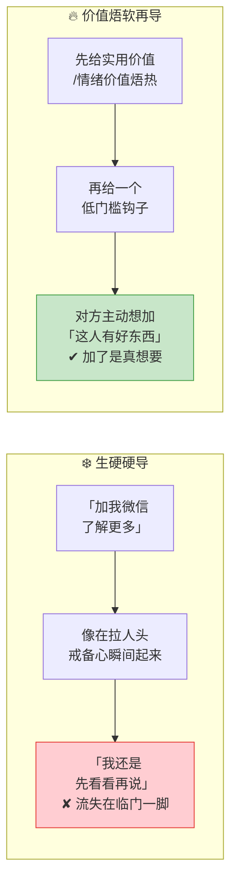
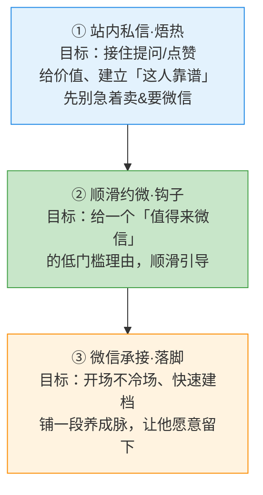

# Day52: 小红书私域导流话术全栈实战——一套从平台私信到微信承接、能边看边抄的完整话术库，把「①公域引流→②私域承接」这段打穿到「加了就是有效粉、聊了就愿意多留一步」

> 📅 学习日期：2026-09-07
> 🔗 关联笔记：[[00-目录]] | 上一篇：[[Day51-阶段收官总复盘与经营体检]] | 下一篇：Day53
> 🎯 适用场景：Day51 收官总盘体检后，老黄把「反生活」下一阶段主攻方向锁定在**公域引流 → 私域承接这一段**（高贡献、却最容易「加了就死」的环节）。翻遍过去笔记，成交话术（Day44）、破冰话术、社群话术都练过，却很少有人拆解**最前面那几步**——平台私信怎么回、怎么引导加微不违规、加进来第一句说什么才不会「石沉大海」。本篇文章不讲「怎么让内容爆」（那是 Day31-33），专门讲**「私域导流」这条窄路的每一句话术**：小红书站内私信钩子 → 加微信引导（不踩平台红线）→ 微信通过后的开场承接 → 建档打标签 → 铺一段让对方愿意看下去/留下的「第一印象流」，帮老黄把全链路地图里「①→②」这段从「浅」打穿到「加了就能养、养了就能聊、聊了就能往成交推」。
> 📚 学习来源：Day51 收官总体检（本篇的前提与主攻方向）× Day04 私域引流转化（承接整体导流逻辑）× Day44 私域成交话术逼单（衔接下一步成交）× Day31 自媒体冷启动（源起：公域怎么来粉）× Day49 私域成交SOP（承接建档/承接那段）× Day23 小红书搜索SEO（承接平台流量逻辑）× Day07 私域社群运营（承接进群承接）× Day19 用户心理与行为设计（承接用户心理底层）

---

## 1. 一句话总结

**私域导流话术的本质，是顺着用户「在小红书被种草 → 想了解更多/想买」的当下心理，用一串「敢要、敢勾、敢承接」的分步话术，把他从「平台流量」安全、顺滑地变成「微信里一个带着标签、愿意听你说话的有效私域粉」——让老黄把四处散落的内容流量，真正收进那个能反复触达、养成、谈成交的一亩三分地里。**

**核心认知：** 老黄已经能把内容做出来、把流量引进来（Day31-33），但很多账号的痛是「内容有人看、私信有人问，可一问『加个微信吧』就冷场，或者加了之后对方从此躺列、再也不说话」。问题往往不在「流量不够」，而在**导流那几步的话术太生硬、太像「拉人头」**——用户本来只是被一篇养生笔记勾起了兴趣，一句干巴巴的「加我微信聊聊」瞬间把他从「被种草的好感」里拉出来，警觉心一起，「再观望」就跑掉了。**私域导流的高手，走的不是「我要你加我」，而是「我给你一个值得加的理由」，并且每一步都在降低对方的「麻烦感」和「戒备感」**——站内私信先给「情绪价值/实用价值」把关系焐热，再给「一个低门槛的钩子」约到微信，微信通过后用「一句让人不反感的开场 + 快速建档 + 一段不急着卖货的承接流」让对方放下戒备、愿意留在这里。这条链上任何一句话说错，前面辛苦引来的流量就折在「最后十厘米」。**本篇，就是把从「她在私信里回你一句」到「她愿意在微信里听你说完一段话」这中间的每一句话，都替老黄打磨成可以直接抄、直接用的现成话术。**

---

## 2. 核心框架

### 2.1 导流本质：「加微信」不是目的，「把流量焐成愿意听你说话的人」才是

先看清为什么导流话术不能直接「要微信」——用户心智里藏着一条天然的防线：

| 维度 | 生硬硬导 | 价值焐软再导 |
|:----:|:----|:----|
| 第一句话 | 开口就要微信 | 先接住对方的情绪/给点有用的 |
| 用户感受 | 被当「流量/人头」 | 被当「一个正经来问问题的人」 |
| 加的动机 | 被迫/给面子 | 主动想要、心甘情愿 |
| 加进来后 | 戒备心重、难再触达 | 带着好感、愿意听你说 |

> **给「反生活」的关键：** 老黄卖的是养生好物、面对的是「身体有点困扰、来问怎么调」的真人——这种账号的私域粉，价值密度最高。但正因为他不是来「买广告」而是来「求答案」的，**千万不能用「拉人头」式的硬导糟蹋了这股信任**。把导流理解成「先焐热、再顺手递个值得加的钩子」，加了的人才是「真想要、能养熟、愿意下单」的有效粉——而不是一个加完就躺列的僵尸好友数。

### 2.2 导流三段漏斗：站内焐热 → 顺滑约微 → 微信承接

把整条导流拆成三段，每段都有各自的一句「目标话术」和「不能踩的线」：

| 阶段 | 这一句要达成的 | 常见死法 | 对「反生活」的钩子示例 |
|:----:|:----|:----|:----|
| ① 站内焐热 | 让对方觉得「这人聊得来、有干货」 | 一上来就甩购买链接/硬推品 | 针对对方问的体质问题给一句具象建议 |
| ② 顺滑约微 | 让加微信成为「最省事/最划算」的选择 | 「加我微信」之类生硬指令、或被平台判营销 | 发一份「体质自测表/调理清单」让来领 |
| ③ 微信承接 | 第一印象好、建档清楚、愿意留下听 | 通过后一句「你好」然后冷场 / 瞬间轰炸广告 | 开场带称呼+回应关切+送见面礼（私域专属） |

> **给「反生活」的关键：** 三段是漏斗不是三段独立动作——**前面的每一句，都要为下一句做铺垫**。①里焐出来的「这人懂我、有干货」，是②里对方愿意加微信的底气；②递出去的钩子，又决定③开场对方愿不愿意多聊。老黄只要把每一段「该说什么、为什么这么说、死在哪」都背下来，导流成功率会肉眼可见地提升。

### 2.3 画一条「反生活」导流话术红线：既要钩得住，又不能被平台/被封

在小红书导流，最大的坑是**平台的风控（站外导流检测）+ 用户的广告过敏**——所以话术里必须自己给自己定四条红线：

| 红线 | 为什么 | 正确的绕过写法 |
|:----:|:----|:----|
| 🚫 别发微信号/二维码/「V我」 | 小红书对站外导流检测极严，直发会被限流甚至封号 | 用「发你一份资料/私信里说」诱导对方留言或私聊再「引导」 |
| 🚫 别在正文硬塞联系方式 | 笔记是给「内容价值」做主场的，硬广破坏观感且易判营销 | 微信号放「简介的邮箱暗示/评论区引导私信」最小化暴露 |
| 🚫 别一上来就「要成交」 | 站内私信是「养熟场」不是「成交场」，硬推容易招黑+被举报 | 站内只给价值/答疑，把「成交冲动」留到微信建立信任后 |
| 🚫 别群发式复制粘贴 | 一开口就暴露是「机器人/群发」，好感瞬间清零 | 每句都带对方的称呼/结合她具体问题的定制感 |

> **给「反生活」的关键：** 红线不是「不让你导流」，而是**保护你别因为心急而把账号和好不容易养起来的信任一起搭进去**。养生这类高信任品类，用户对「硬广营销」尤其敏感——老黄宁可导流慢一点、稳一点，也不要用「踩线求快」换一个「死在半路的号」。

---

## 3. 可落地方法

### 3.1 话术库①:站内私信「焐热 + 造钩」——从对方主动来找你那一句接起

小红书私域导流，**最好的流量是「对方主动来私信」**（评论区/笔记里留下问题）。这一段的打法分两种：

**A. 有人来问（被动接）——三明治接话法：先共情 → 再给一句实用 → 顺势抛钩**
- ❌ 死法：「你好呀，我们家这个茶很好的，你要不要买？」（一上来别人只是问功效，你直接卖货，好感清零）
- ✅ 活法话术模板：
  > 认出对方诉求 + 共情 + 一句具体建议：
  > 「看你问的是失眠调理这块——很多人确实是『越累越睡不着』，跟肝血亏/心火旺都有关，不一定是单纯睡眠问题。」
  > （先给一句「懂她」的干货，别卖）
  > 顺势抛钩：
  > 「你要是想系统调理，我这儿整理过一份『体质自测表 + 对应调理思路』，比在评论区一句句说清楚，你要的话我私信发你？」
- **给「反生活」要点**：这一句既没卖货、又给了「懂她的价值」，还递出一个「来微信领资料」的合理钩子。对方只要接了，就自然过渡到下一段约微。

**B. 没人来问（主动钓）——评论区/私信用「提问钩子」把潜水者钓出来**
- 在笔记/评论里留一个「半开放问题」让人想私信你：「大家经常问的『湿气重到底是该祛湿还是该健脾』，其实很多人顺序都搞反了——想知道正确顺序的姐妹私信我，我一条条讲。」把答案的价值作为钩子，让对号入座的用户自己来私信。

**给「反生活」的总诀：** 站在「她想解决什么」来写每一句，而不是「你想卖什么」。所有话术里，多用「你身体这个情况、你担心的这个点」，少用「我家这个产品、你买这个」。

### 3.2 话术库②:顺滑约微——用「最省事/最划算」把微信递过去，而不是命令她加

站内焐热到一定程度，就到了最难的那一步「送微信」。核心原则是**给对方一个「非来不可还顺理成章」的理由，把「加微信」包装成是一次「领取福利/进一步服务」，而不是一次「社交请求」**：

| 场景 | 通用钩子话术模板 | 为什么有效 |
|:----:|:----|:----|
| 私信讲不清 | 「这个调理要分好几步，评论区/私信打太快讲不清，我把我整理的完整版发给你，你加我微信更方便看？」 | 把「加微」的动机从「她要我」变成「她需要完整方案」 |
| 资料/表格钩 | 「我这里有份『XX体质自测表+一周调理清单』，在微信发给你更方便你照着做，你要加我一下吗？」 | 「照着做」「更省事」给了一个实用收益 |
| 专属服务钩 | 「你说的情况我这边有个『一对一调理建议』可以帮你看看，微信上发身体状况我帮你对一对。」 | 「给你专属服务」价值感>索取感，对方觉得自己被重视 |

> **给「反生活」的关键：** 导流话术真正破防的，不是「我求你加我」，而是**「你加了我对你自己有好处、还顺带不麻烦」**。把每次「送微信」都配一个看得见的「利益点」（资料/清单/一对一建议），对方会觉得「这是我赚了」，而不是「这是他想套路我」。

### 3.3 话术库③:微信通过后「开场承接 + 快速建档」——前30秒决定他是「有效粉」还是「躺列僵尸」

**加进来只是开始，真正决定含金量的，是「通过后前 30 秒」**——绝大多数账号死在这儿：通过后干巴巴一句「你好」，然后就没了下文。给老黄一套「三连击中段」：

**第1击·带称呼的定制开场（消除「你是不是机器人」的疑虑）：**
> ❌「你好，欢迎~」（群发味十足）
> ✅「XX姐/看到你在小红书问宁心安神这块，正好我这边确实能帮上——先别急，我先把你要的那份自测表发你 👇」——开口就带对方的称呼和「她是来干嘛的」，立刻区别于群发。

**第2击·秒发「见面礼」+ 一句使用说明（让添加立刻有实际回报）：**
> 紧接着发文件/图片：「这份自测表你今晚有空对着填一下，填完发我，我帮你看看先从哪块调——比你自己瞎琢磨快。」让她第一次「添加微信」就体验到了「这人真能给东西」。

**第3击·顺手建档（一句话摸清画像，为后面养熟/成交铺路）：**
> 轻描淡写补一句：「顺便问下，你主要是想调睡眠还是想日常保养？我好给你发对应的内容，免得发一堆你不看的。」——这一句话同时完成了「打标签建档（Day49）」+「让她觉得你贴心定制」，为未来精准触达和推荐埋下伏笔。

> **给「反生活」的关键：** 微信承接的原则是**「先让她在你这儿拿到第一次好处，再让她觉得你记得她的具体情况」**。前30秒把「实用价值 + 定制感」同时给足，这位新粉就从「加了个陌生卖货的」变成「找到了一个能帮我调理的贴心顾问」——含金量天差地别。

### 3.4 用 AI 当「话术教练」，把对话越练越顺

导流话术不是背一遍就行，要靠真实对话不断迭代打磨。让 AI 帮老黄做「陪练 + 复盘」：
- **让 AI 扮演「挑剔的小红书用户」陪练**：老黄把一段导流收到「再观望/不回」时，把上下文贴给 AI，让它扮演那个犹豫的用户，两人一句句把「该怎么接住异议、怎么顺滑引导」对练到顺畅。
- **让 AI 给「私信→微信」每句话挑刺**：把自己写好的环节话术贴给 AI，让它站在「一个正在被导流的普通用户」角度指出哪句像营销、哪句会触发警觉，并给更自然的替换。
- **让 AI 建「反生活导流话术库」**：把 3.1–3.3 的模板 + 老黄跑出来的真实有效句子，沉淀进一份可随时翻的文档，每次对话遇冷就回来补一两句，让话术库越用越厚、越用越准。

> **给「反生活」的关键：** 一个人的账号最难的是「没人帮你照镜子」——AI 正好能当那个不客气的『模拟用户』+『话术教练』。把 AI 接进导流对话的日常打磨里，等于给老黄配了一个随时能对练、还能冷静挑刺的陪练，让话术能力光靠聊天就能涨。

---

## 4. 变现路径

把「①公域引流→②私域承接」这一段打穿，真正兑现的，是让前面辛苦做内容引来的每一滴流量，都能变成微信里可反复触达、能养成、能谈成交的「活资产」：

| 变现维度 | 怎么赚 | 大概能到哪个量级 | 关联笔记 |
|:----:|:----|:----|:----|
| 💰 加粉不再「加了个寂寞」 | 每句导流话术都在「筛选+建档」，让加进来的都是「带诉求、愿意聊」的有效粉 | 同样的渠道流量下，能沉淀进私域的「可成交粉」比例明显提升 | Day31/Day04 |
| 💰 承接打好成交地基 | 前30秒的建档+定制感，让 Day44 那套成交逼单话术有了「对象明确、信任已起」的前提 | 从「偶然成交」走向「私聊推品有回应、愿意下单」 | Day44/Day49 |
| 💰 内容流量活化成复购池 | 有效粉进了私域、被养熟，才有后续 Day45-50 那套复购、社群、活动的舞台 | 单个有效私域粉的 LTV（终身价值）数倍于「看完就走的公域流量」 | Day22/D45/D46 |
| 💰 少走弯路省下时间 | 话术标准化后不再一句话一句话现场想，导流成功率稳定、可复制 | 单粉获取的时间成本下降，老黄能把省下的时间投到内容或成交 | Day49/Day50 |

> 给「反生活」的一句话账本：**导流话术的回报，是把老黄那条「内容有流量、却漏在私域门口」的链补上最关键的一环——用会说话的分步话术，把公域流量稳稳收成微信里带着标签、愿意听你说话的有效粉，为 Day44-50 整条成交与复购闭环源源不断供料。** 这一步不通，后面的一切招式都缺「人」来施展。

---

## 5. 行动清单

### ✅ 行动①:把 3 段话术模板做成「反生活」自己的可抄话术卡(今天做)

**步骤1(30分钟):** 照 3.1-3.3，从老黄真实做过的内容里挑 3 个高频场景（有人问体质调理 / 有人问某款产品 / 评论区求资料），各写一套「站内焐热句 → 约微句 → 微信开场句」的完整话术。
**步骤2(15分钟):** 每套配一个「可送钩子」（自测表/清单/一对一建议），并用 3.2 的红线自我检查有没有「踩线硬导」的句子。
**步骤3(5分钟):** 存成一份「反生活·导流话术卡」，贴在常用笔记/手机里，加好友时直接照着上。

> **产出：** ✅ 一套 3 场景×3 段的人话版导流话术卡——从「还靠现场现想」升级成「有库可抄、照着走不冷场」。

### ✅ 行动②:做一次「真实的私信→加微」全流程演练(本周内)

**步骤1(10分钟):** 找一篇自己发的、有人来问/或模拟一个有人来问的私信场景。
**步骤2(15分钟):** 用 3.4 的 AI 陪练，把「站内焐热→约微→微信开场承接建档」完整演一遍，把卡壳/感到生硬的句子改顺。
**步骤3(10分钟):** 挑一个真实/意向用户走一遍全流程，回来后记录「哪句对方接住了、哪句冷了」，回填进话术卡。

> **产出：** ✅ 一次走通真实全流程的导流经历 + 一条「实战后微调」——话术从「纸面顺」试成「真人顺」。

### ✅ 行动③:给导流装一个「漏斗小数据」，接 Day51 的体检复盘持续看进步(持续做)

**步骤1(15分钟):** 定 3 个最小统计：#被私信触达数 / #成功加微信数 / #进群或愿意看内容数。
**步骤2(每周5分钟):** 每周日（接 Day50 周复盘）记一次三段漏斗数据，粗算「私信→加微」转化率。
**步骤3(复盘循环):** 哪段转化掉得最狠，就回这篇/对应环节话术去补强，形成「导流话术每周微迭代」。

> **产出：** ✅ 一组可追踪的导流漏斗数据 + 同步到 Day51 的整链体检——老黄从此不是「凭感觉觉得自己导得好不好」，而是看着「私信→加微→承接」的真实数字，稳稳把 ①→② 这环越打越顺。

---

## 📊 今日学习总结

| 维度 | 内容 |
|:----:|------|
| 核心认知 | 导流的本质不是「要你加我」，而是先焐热、再给一个「值得我加」的钩子；每句都站在「她想解决什么」而非「你想卖什么」写，才能真正把流量焐成「愿意听你说话的有效粉」 |
| 核心框架 | 导流三段漏斗（①站内焐热②顺滑约微③微信承接）× 4条平台/心理红线 × 微信前30秒「带称呼开场+秒发见面礼+顺手建档」三连击 |
| 关键技能 | 三明治接话法(共情→给实用→抛钩)、用「利益点」把加微包装成对方占便宜、前30秒消除「机器人疑虑」并完成打标签建档、用 AI 当话术陪练 |
| 变现路径 | 把漏在私域门口的流量收成可触达有效资产、给 Day44 成交打好「信任已起+对象明确」的地基、内容流量活化成可复购池(LTV放大)、话术标准化省下单粉获取时间 |
| 今日行动 | ① 做 3 场景×3 段「反生活导流话术卡」 ② 做一次真实「私信→加微」全流程演练并用 AI 改顺 ③ 装漏斗小数据、每周日接 Day51 复盘持续迭代 |

> 下一篇预告：**Day53: 微信承接后的「30天养熟」节奏设计——从加到微信到首次成交，用一套不会让客户反感、反而越来越信任的触达节奏，把 Day52 导进来的有效粉一段段养成愿意下单的铁杆客户**。

---

## 📌 关联笔记一览

| 关联主题 | 笔记链接 |
|:----|:----|
| 目录/进度 | [[00-目录]] |
| 上一篇（总体检定主攻） | [[Day51-阶段收官总复盘与经营体检]] |
| 承接（成交逼单话术，衔接导流后的成交） | [[Day44-私域成交话术与逼单心理学]] |
| 承接整体导流逻辑 | [[Day04 私域引流转化]] → 见 [[00-目录]] |
| 建档/SOP | [[Day49-私域成交标准作业流程SOP]] |
| 冷启动/公域来粉 | [[Day31-自媒体账号冷启动]] |
| 复购舞台 | [[Day45-私域成交后客户关系经营与复购唤醒]] |

> 🔗 反生活适用标注：本篇话术全部围绕「反生活」好物养生账号「高信任、需定制、慢养熟」的成交属性设计——站内先给实用调理建议、送自测表当加微钩子、开场即建档定位调理方向，完全贴合养生垂类「先建立专业信任、再谈成交」的打法，可直接套用。
