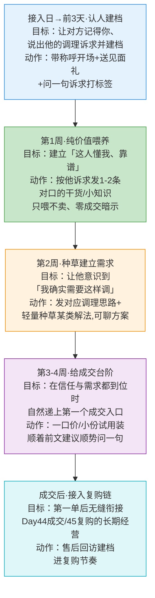

# Day53: 微信承接后的「30天养熟」节奏设计——从加到微信到首次成交，用一套不会让客户反感、反而越来越信任的触达节奏，把 Day52 导进来的有效粉一段段养成愿意下单的铁杆客户

> 📅 学习日期：2026-09-10
> 🔗 关联笔记：[[00-目录]] | 上一篇：[[Day52-小红书私域导流话术全栈实战]] | 下一篇：Day54
> 🎯 适用场景：Day52 帮老黄把「反生活」的高价值养生粉一个个接进了微信（有效粉进得来）。但接进来只是开始——**大多数人加完微信就「躺列」了**：不是他不想买，而是你加了之后要么三天不吭声让人遗忘，要么一上来就猛推广告把人吓跑。这一篇不教「怎么成交」（那是 Day44），专门解决「微信里那批刚加进来的有效粉，从『加上那天』到『愿意付钱那天』中间那 30 天怎么陪、怎么喂、怎么在正确的时点推那一下」，把从 add 到 first-purchase 的「养熟间隔期」做成一条可执行、有节奏、不油腻、还越养越亲密的时序打法。
> 📚 学习来源：Day52 私域导流（本篇前提：「承接后」的下一步）× Day44 私域成交话术逼单（衔接：养熟到位后的临门一脚）× Day49 私域成交SOP（本篇节奏要落到 SOP 里）× Day51 收官体检（承接：②私域承接建档是当前主攻方向）× Day45 复购唤醒（养熟成功后衔接长期经营）× Day19 用户心理（本条节奏设计背后的用户信任心理）× Day27 转化文案（喂内容阶段的用词）× Day46/47 社群养熟（群场合的另一条养熟并行线）

---

## 1. 一句话总结

**「30天养熟节奏」的本质，是把一个个刚加微信、抱着一点好感却还没准备好掏钱的陌生粉，用一条「先给价值焐信任 → 再种草养需求认知 → 到点给个不突兀的成交台阶」的时序触达曲线，让他从「加了你但不知道你管不管用」的安全距离，一步一步走到「觉得你靠谱、这段困扰就找你调」的成交临界点——让老黄把 Day52 辛苦导进来的每一批有效粉，不靠一次猛推、也不靠漫长空等，而是靠一段设计过的陪伴节奏，稳稳养成会下单的铁杆客户。**

**核心认知：** 很多养生好物卖家有个共同的误区——以为客户「加了就不会跑」，于是要么**三天不吭声**（等着他主动开口，结果他早把你忘了、或者觉得你根本不专业）、要么**加完就猛推**（一上来就「姐这款茶特别好」「要不要来一盒」，把人家从「被你种过草」直接吓回「又是微商卖货的」）。这两种都死在同一个根子上：**没有理解「加了微信 ≠ 可以卖货」，中间横着一个必须用价值与信任填满的「养熟间隔期」。** 一个被种草而加的养生粉，他当下的心理是「好奇 + 有点想调 + 但还没确定你靠不靠谱、方案适不适合自己」——这时候你越急，他的戒备越重；你越能在他需要的时候递上有用的东西，让他一次次体验到「这人懂行、给的建议靠谱」，他对你的信任就会在一周、一周的陪伴里越养越厚。**真正的养熟，不是「隔几天提醒一次他在你这里能买什么」，而是一条有设计的触达节奏：前段纯喂价值不提卖、中段种草建立「我需要这样调」的需求认知、到了对方信任与需求都到位的那几周，才自然给一个「顺着前面所有铺垫的水到渠成」的成交台阶。** 本篇，就把这条从「加上那天」到「第一单落地」的 30 天节奏，一步步拆成老黄照着就能走完的时序打法。

---

## 2. 核心框架

### 2.1 先破除两个「把有效粉养死」的极端——为什么养熟需要一条设计过的曲线

刚加了微信的有效粉，最容易死在两头的极端操作上：

```mermaid
flowchart LR
    subgraph 冷养 [🧊 三天打鱼不动]
        A1[加上后<br/>好几天不吭声] --> B1[对方忘了你<br/>/觉得你不专业]
        B1 --> C1[热情冷却<br/>✘ 成了僵尸好友]<br/>怎么想都想不起你
    end
    subgraph 裸推 [🔥 加了就硬卖]
        A2[一上来<br/>就推品/价格/链接] --> B2[暴露出<br/>只想赚他钱]
        B2 --> C2[戒备心拉满<br/>✘ 被当微商拉黑]<br/>好感瞬间清零
    end
    subgraph 节奏养 [🌿 按节奏喂价值+种草]
        A3[前段纯价值<br/>焐信任不设成交] --> B3[中段种草<br/>建需求认知]
        B3 --> C3[到点自然<br/>给成交台阶<br/>✔ 越养越亲密]<br/>信任到点顺势下单
    end
    style C1 fill:#ffcdd2,stroke:#e53935
    style C2 fill:#ffcdd2,stroke:#e53935
    style C3 fill:#c8e6c9,stroke:#43a047
```

| 维度 | 冷养(不动) | 裸推(硬卖) | 节奏养(30天曲线) |
|:----:|:----|:----|:----|
| 加的粉感受 | 被晾着、被遗忘 | 被当钱袋子 | 被当「一个正经想调身体的人」 |
| 信任走向 | 从好感→无感 | 从好感→反感 | 从好感→信赖 |
| 成交可能 | 极低(冷掉了) | 极低(吓跑了) | 到点成交顺理成章 |
| 客户LTV | 躺列浪费 | 一次性、拉黑难复购 | 养成铁杆、有复购转介绍 |

> **给「反生活」的关键：** 老黄的产品是养生好物、面对的是「身体有困扰、来求调理方案」的高价值粉——这类客户的决策周期天然比「买包买衣服」长，因为他要的**不只是货，而是「你懂我、方案对、值得信」**。硬卖伤信任，晾着又冷了热情，**只有按节奏喂「价值→需求→台阶」，才能把那股薄弱的好感一日日养成结实到能下单的信任**。老黄要把「养熟」当一件正经事来排节奏，不是想起来了问候一句、忘了就三天不动。

### 2.2 「30天养熟」四阶段节奏总览：不是每天刷屏，而是四段各有任务的陪伴曲线

把从 add 到 first-purchase 的养熟期拆成 4 个各有「阶段目标 + 主动作」的小段，组成一条完整的陪伴曲线：



| 阶段 | 时间窗 | 这个窗口的逻辑 | 常见的坑 → 怎么办 |
|:----:|:----:|:----|:----|
| ① 认人建档 | 接入日—前3天 | 趁热把口味摸清、把信任地基打下来 | 拖过期再问「你身体哪不好」→ 接入日当天就问清 |
| ② 纯价值喂养 | 第1周 | 少谈货、多谈身体，让对方觉得你懂 | 前一周就忍不住推品 → 忍住，先喂对口的干货 |
| ③ 种草建需 | 第2周 | 让他从「有所求」变成「意识到需调理」 | 只科普不落地 → 给「对应解法长这样」的具象种草 |
| ④ 给成交台阶 | 第3-4周 | 需求+信任双双到位，顺势给个小而轻的入口 | 一上来就安利大单 → 先推小份试用/一口价验证 |
| ⑤ 衔接复购 | 成交后 | 第一单不是终点，是无缝接进 Day44/45 的起点 | 卖完就失联 → 售后回访 + 建档进复购节奏 |

> **给「反生活」的关键：** **30 天不是「每天都要发消息」，而是「四段各有任务的陪伴曲线」——前两周几乎不出现「卖」字，只靠对口干货在润物细无声地攒信任；等到对方身体困扰被你点透、也觉得你方案靠谱了，第3-4周再递的成交台阶才会「顺理成章」而非「突兀杀价」。** 老黄只要心里装着这张四段地图，就不会在「该喂价值」的窗口去硬推货（那是慢性拉黑），也不会在「需求已成型」的窗口还只发科普（那是白白错过顺势成交）。

### 2.3 触达节奏的「度」——既不吵到他、又不让信任冷掉的最佳触点编排

每天的养熟不是让你一天到晚给他发消息。用「触达频率 + 内容性质」两维把节奏调到「刚好养熟」而不「烦人」：

```mermaid
flowchart LR
    A[加好友后30天] --> B{触达频率}
    B -->|过频·刷屏| C[天天私信<br/>像推销/微商<br/>✘ 烦人拉黑]
    B -->|低频·刚好| D[每周1-2次<br/>私信价值<br/>其余靠高质量朋友圈]<br/>✔ 不烦且持续养
    B -->|过疏·零触| E[加了就不理<br/>信任冷却掉<br/>✘ 僵尸好友]
    D --> F[30天后<br/>需求信任到位<br/>顺势成交]
```

| 触点 | 频度建议 | 发的「反生活」内容示例 | 为什么这个度刚好 |
|:----:|:----:|:----|:----|
| 1对1私信(前2周) | 每周1-2次 | 针对他诉求的一篇调理干货/一个体质小测试 | 私信是高打扰触点，只在「真有价值」时发，显得珍贵 |
| 1对1私信(3-4周) | 缩减到0-1次 | 顺着前文问一句「要不要先试试小份」 | 需求到位后专门留这一个「成交问句」 |
| 朋友圈(整个30天持续) | 每天1条高质量 | 客户真实反馈、一条辩证的养生科普、你真实的日常 | 朋友圈是低打扰主战场，价值感持续刷屏不进私信 |
| 朋友圈评论互动 | 见有人赞评就回 | 回一句「您上次问的XX更具体点回您」 | 把公域互动悄悄引回私信，越养越亲 |

> **给「反生活」的关键：** 老黄要是 30 天里天天私信喂干货，粉会嫌烦拉黑；要是只发私信不经营朋友圈，又会漏掉七成「靠刷到才想起你」的养熟机会。**聪明做法是把「私信」当高价值稀有弹药（每周1-2次、只在真有用时放），把「朋友圈」当每天悄悄养熟的温床（价值感不断、却几乎不打扰）**——这样既不会烦人、又天天在对方的世界里刷存在，正是信任能一天天堆起来又不被打扰的「度」。

---

## 3. 可落地方法

### 3.1 前3天「认人建档」三连——趁热把口味摸清、把信任地基打下来

**【反生活可直接用】接入日到第3天的标准动作链**——刚加进来的粉热情最高、最好开口，别浪费这个窗口：

**第1步·接入日当天带称呼开场 + 秒发见面礼(呼应 Day52)：**
> 沿用 Day52 微信承接第1击：「XX姐，看到你上次问的是睡眠调理那块——先别急，我把那份体质自测表先发你 👇 今晚有空对着填一下，填完发我，我帮你看看先从哪块调。」
> 让对方当天就「拿到了一样东西、觉得你有用」，信任第一印象落定。

**第2步·当天顺势问清诉求、顺手打标签(Day49建档)：**
> 轻描淡写补一句：「方便的话告诉我，你主要是睡不好、还是日常想保养？我好给你发对口的，免得发一堆你不看的。」——把「睡眠困扰／日常保养/湿气/气血」等标签记进备注名或标签分组。

**第3步·前3天内按标签发第一条对口的纯干货(只喂不卖)：**
> 例「你有没有发现最近入睡越来越慢？其实很多时候是『越累越睡不着』，跟肝血、心火有关——下条我专门给你讲讲怎么从根上调理，你先留意下自己是不是属于这种。」让他体验到你「记得他、且专业对口」。
> ⚠️ 前3天千万别提「买」字——这时候他还在看你是不是「认真帮他调」的人，你一开口卖就破功。

> **给「反生活」的关键：** **前3天是「认人 + 给甜头 + 建标签」的黄金窗**。老黄只要在这3天里让他「拿到见面礼、被问到诉求、收到记得他的干货」三件事都发生，他就从「加了个陌生卖货的」升级成「找到一个懂我、还主动帮我调的小顾问」——这个「第一印象差」一旦立好，后面 30 天全都顺。

### 3.2 第1周「纯价值喂养」话术——每周1-2次对口的干货，把「你懂我」喂成「你靠谱」

**【反生活可直接用】第一周的价值喂养节奏与句式模板**——这个阶段核心目标是把对方从「看你顺眼」养到「认定你专业」：

| 触发点 | 私信干话语料模板 | 性质 |
|:----:|:----|:----|
| 他上次回了诉求 | 「你说睡眠那段，我这几天下班整理把『睡不好的人最容易忽视的3个原因』整理成图发你 —— 你可能是其中一种，对照看看」 | 对口干货 |
| 你想刷存在但不硬推 | 「刚看到一篇文章讲秋天睡眠/湿气，跟我上次给你讲的那个思路对上了，转给你看看合不合你情况」 | 顺手的价值 |
| 让对方愿意多聊 | 发完干货后留一句开放式问题：「你是最近才开始睡不好，还是有一段了？」让他愿意接话、你继续摸需求 | 拉对话 |

- ⚠️ **本阶段红线：绝不出现价格、绝不出现「要不要来一盒」**。你唯一要做的是让他在一次又一次收到对口干货后，产生固定的念头——「身体上的事，问这个老黄/这个号准没错」。
- 💡 **一条高质量的养生干货 > 十条硬广**：前两周的私信弹药，全部用来换「专业信任」，不消耗在「卖东西」上。

> **给「反生活」的关键：** **第一周是「信任基建期」，老黄的目标不是「卖出去」，而是让这个粉在第七天时，心里的天平已经明显偏向「这人靠谱、身体问题找他」。** 不必贪多，一周 1-2 条真正对口的干货就够；重点是干货要「真诊断到他的情况」，而不是转一堆大众鸡汤。

### 3.3 第2周「种草建立需求」——从「聊身体」滑到「意识到自己需要这样调」

**【反生活可直接用】第二周的种草动作——把「纯科普」升到「给解法长什么样」**：

- **动作A·点透他的体质问题→顺嘴提解法方向：**
  > 前两周已经摸清他诉求，第2周可以开始点明：「像你这种睡不好，光靠早点躺是没用的，根源在肝血+心火没调——要调的话一般从『帮身体放松下来的内调』入手更稳。」把一个「你也许需要某类解法」的念头种进去，但先别点名卖某个产品。
- **动作B·用「真实案例/故事」具象化养熟对象：**
  > 发一个匹配他体质的真实客户反馈故事：「上周一个跟我差不多情况的姐，喝了一小段XX调理下来，说入睡明显快了，还跟我反馈改了点作息……」用「跟他同款的人+真实改善」，让他开始想象「我也许也能这样」。
- **动作C·把对该问题的「方案感」做出来：**
  > 到第2周末，对方若已认同「我确实该调一下」，可以顺势说：「如果你愿意，我下条给你理一份『针对你这种睡眠的内调小方案』，你可以看看适不适合自己照着做」——既不直接卖，又为第3-4周铺好了「他主动想要方案」的口子。

> **给「反生活」的关键：** **种草的诀窍不是让他「想买你的货」，而是让他先「确确实实意识到自己需要调理、且愿意接受一种解法」**。老黄这一步不要急着亮产品，先让他从「有点困扰」走到「我知道了，我应该找对路的内调」，这时一个针对他、可落地的方案，就成了他想要却还没有的东西——下一阶段顺水推舟就自然了。

### 3.4 第3-4周「给成交台阶」——用小而轻的第一口，把信任顺势变成第一单

**【反生活可直接用】第3-4周的成交入口设计（衔接 Day44 临门一脚，但起点要小）**：

- **别一上来安利整月大单**，先给一个「低门槛、好验证、不心疼」的第一口：
  | 第一口设计 | 为什么适合做「第一次成交」 | 例(养生茶/膏/丸场景) |
  |:----:|:----|:----|
  | 小份试用装/一口价 | 金额小决策快，先让他「尝到你的货+你的售后」 | 「你先拿一小份试试，合适再继续，不合适跟我说」 |
  | 顺势推「对应他体质的那一款」 | 不是所有都安利，只安利他诉求根上的那个 | 睡不好就推宁心安神对应的那款，别推一串 |
  | 給一个明确的「他适用的使用方案」 | 让下单=接受服务，而非单纯买东西 | 附一句怎么喝/多久/配什么作息 |
- **递单那句顺着前文自然落：**
  > 不是突兀的「这款你要吗」，而是承接前两周的种草地：「上回给你理的内调思路，真要落地的话，先从我说的那款对应XX开始试最稳。可以先拿个小份试试看合不合适，不合适随时跟我说。」把下单包成「顺着你前面给的方案走第一小步」。
- **用「无压力成交」收尾：** 加一句「不急，你先想想，身体调理讲的是对口和坚持，不是非买不可」——反而降低他的防御，让真有需求的自然下单（Day44 的逼单技巧留给他真正犹豫那一瞬间用）。

> **给「反生活」的关键：** **第3-4周是需求与信任双到位的窗口，老黄要给的不是「一次强卖」，而是「一个你想了很久、终于有人给你递上的、小而轻的第一口」**。先用小份/试用把「第一单」低成本拿下——比起一单大客，老黄此刻更需要的是一条「从他身上赚到口碑、还能顺势接进 Day45 复购」的信任闭环。第一口成了，后面的长期经营（Day44/45/46）才有对象可做。

### 3.5 用 AI 当「养熟节奏教练 + 内容弹药库」

老黄一个人要同时守好几个刚加的粉、还要管朋友圈，AI 能帮他省下大量心力：

- **让 AI 生成「按他体质对口的养熟干货草稿」**：把某个粉的标签/诉求告诉 AI，让它产出一篇针对「睡不好/湿气/气血」对口的短干货文案，老黄润色后发私信或发朋友圈。
- **让 AI 帮你排「单个粉的 30 天触达表」**：输入他的诉求，让 AI 按 3.1-3.4 四阶段帮你排出「第几天发什么、是干货还是种草还是递单」的节奏表，老黄照着执行即可，不再临时想「该给他发啥」。
- **让 AI 当「分寸感陪练」**：把一段自己即将发的话术贴给 AI，问它「这段会不会太像卖货/会不会太硬推」，挑刺后改顺再发。AI 帮你守住「前两周不卖、第三周才轻轻递」的分寸线。

> **给「反生活」的关键：** 养老黄这种高信任养生客户，最大的成本不是货，是**「要针对每个人写对口的内容、还要控制节奏」的心力**。AI 正好能当那个不抱怨的「养熟副驾」——帮你按诉求批量产出对口干货、把 30 天节奏表排得明明白白、还在发之前帮你把关「够不够克制」，让老黄一个人也能管好一批同时养熟的粉。

---

## 4. 变现路径

把「微信承接 → 30天养熟 → 首次成交 → 衔接长期经营」这段打穿，兑现的是把 Day52 导进来的每一批有效粉，都变成「到点能下单、下了单能复购、还能转介绍」的真资产：

| 变现维度 | 怎么赚 | 大概能到哪个量级 | 关联笔记 |
|:----:|:----|:----|:----|
| 💰 有效粉不浪费 | Day52 导流的粉若不会养熟，七成躺着凉掉；这条节奏让「加了→愿意下单」的比例明显提升 | 同样的导流量下，能走到「首次成交」的有效粉占比提升 | Day52/Day49 |
| 💰 小单低成本拉首单 | 用「小份试用/一口价」把第一单做小做轻，先把信任闭环拿下 | 首次成交门槛降低后，可成交粉基数变大 | Day44 |
| 💰 顺势接进长期的复购盘 | 第一单不是终点，养熟节奏稳稳把客户接进 Day44 成交、Day45 复购、Day46 社群的长线舞台 | 一个养熟成交的铁杆客户 LTV 数倍于一次性买家 | Day45/Day48 |
| 💰 老黄时间效率放大 | 靠节奏表 + AI 产出对口内容，不再「逐个临时想该发啥」，单人可同时养熟更多有效粉 | 单人可管理的养熟中客户数量提升，精力集中到最该递单的窗口 | Day50/Day28 |

> 给「反生活」的一句话账本：**30天养熟节奏的回报，是把 Day52 接进微信的那批「高价值却有七八成会凉掉」的有效粉，用一条『前段喂信任→中段种草建需求→到点轻轻递第一口』的节奏，活化成真正肯掏钱、下完单还能接进复购的铁杆客户——让导流花的每一分力气，都实打实变成能下金蛋的私域资产。** 不会养熟，导得再多也是「加了就死」的数字；会养熟，每一批导进来的粉都在为 Day44-50 的成交复购持续供料。

---

## 5. 行动清单

### ✅ 行动①:把「30天养熟节奏表」做成「反生活」现成的模板(今天做)

**步骤1(30分钟):** 打开 3.1-3.4，把四阶段(前3天建档 / 第1周纯干货 / 第2周种草 / 第3-4周递单)排成一张「Day0→Day30」的触达节奏表，每格写清「第几天、发什么、私信还是朋友圈、是干货还是种草还是递单话术」。
**步骤2(20分钟):** 用 3.5 的 AI,挑老黄最高的 2 个粉类型(如「睡不好」「湿气重」)各让 AI 生成一整条 30 天对口内容草稿,老黄改顺润色存库。
**步骤3(10分钟):** 把这份「书面节奏表」+「2条内容库」存成一份可随手翻的文档，新粉进来自动套用、不靠临时想。

> **产出：** ✅ 一份按天排好的 30 天养熟节奏模板 + 至少 2 套对口内容弹药——从「加完不知干啥」变成「模板在手、跟着发就行」。

### ✅ 行动②:挑 3 个近期刚加进来的粉,按四阶段节奏走一遍(本周内)

**步骤1(10分钟):** 从微信最近 7 天刚加进来的高意向粉里挑 3 个(有明确调理诉求的优先)。
**步骤2(20分钟):** 对每个把「标签诉求」记进备注(呼应 Day49),并按 3.1-3.4 把他们的「前3天喂养 / 第1周干货」先发出去。
**步骤3(10分钟):** 记录每人的状态(回了没、对哪条反应好),走完一轮后回填进行动①的节奏表,把发得顺/卡壳的句子迭代改顺。

> **产出：** ✅ 3 个粉真正按节奏开始被养熟 + 一张「实战后微调过的节奏表」——节奏从「纸面顺」试成「真人顺」。

### ✅ 行动③:给养熟装一个「漏斗看板」，接 Day51 体检持续复盘(持续做)

**步骤1(15分钟):** 定 3 个最小统计：#刚加微信的有效粉 / #走到第2-3周仍活跃的粉 / #30天内完成首次成交的粉。
**步骤2(每月/每次导流后复盘):** 粗算「有效粉→首次成交」转化率,看四阶段里哪段「掉人最狠」(是喂价值没人回、还是种草没建到需求、还是到点不敢递单)。
**步骤3(复盘循环):** 哪段流失最多,就回这篇对应阶段去补强(或回去看 Day44/52/49),形成「养熟节奏每月微迭代」——数据说话才能把养熟越做越准。

> **产出：** ✅ 一组清晰的「加微→养熟→首单」漏斗数据 + 同步进 Day51 的整链体检——老黄从此不是凭感觉觉得「养得不错」，而是看着「导进来→养得活→肯下单」的真实数字，稳稳把 ②私域承接这句话越打越透。

---

## 📊 今日学习总结

| 维度 | 内容 |
|:----:|------|
| 核心认知 | 加了微信 ≠ 可以卖货，中间横着必须用价值与信任填满的「养熟间隔期」；猛推吓跑、冷养凉掉，只有按「喂信任→种草建需求→到点轻递口」的节奏触达，才能把有效粉养成铁杆 |
| 核心框架 | 30天四阶段节奏(前3天认人建档→第1周纯价值喂养→第2周种草建需→第3-4周给成交台阶→成交后接复购链)× 触达的「度」(私信稀有高价值、朋友圈当每日温床)× 小而轻的第一口设计 |
| 关键技能 | 接入日带称呼开场+送见面礼+顺势问诉求建档、前2周只喂对口干货不提卖、点透体质+真实案例种草建需求、用小份试用/一口价把首单做小做轻、用 AI 当养熟教练+内容弹药 |
| 变现路径 | 让 Day52 导进来的有效粉不凉掉、把「加微→首单」转化率提上来、首单后用低门槛信任闭环稳稳接进 Day44/45/46 的成交复购长线舞台、用节奏表+AI 放大单人可养熟的客户规模 |
| 今日行动 | ① 做「30天养熟节奏表」模板+AI内容弹药 ② 挑3个刚加粉按四阶段走一遍并微调 ③ 装"加微→养熟→首单"漏斗看板接 Day51 体检持续复盘 |

> 下一篇预告：**Day54: 私域高价值内容体系搭建——朋友圈+社群+一对一三位一体的内容分工，让老黄不再为「每天该发什么养熟客户」发愁，用一套可持续产出的价值内容，把养熟的信任持续做厚、为成交与复购源源不断供料**。

---

## 📌 关联笔记一览

| 关联主题 | 笔记链接 |
|:----|:----|
| 目录/进度 | [[00-目录]] |
| 上一篇(承接：导流话术把粉接进来) | [[Day52-小红书私域导流话术全栈实战]] |
| 衔接(养熟到位后的成交临门一脚) | [[Day44-私域成交话术与逼单心理学]] |
| 建档标签(SOP里的承接建档) | [[Day49-私域成交标准作业流程SOP]] |
| 主攻方向(体检锁定的②私域承接段) | [[Day51-阶段收官总复盘与经营体检]] |
| 承接(养熟成功后的复购长期经营) | [[Day45-私域成交后的客户关系经营与复购唤醒]] |
| 复购/转介绍 | [[Day48-私域活动后的客户沉淀与日常复购维护]] |
| 社群养熟的另一条并行线 | [[Day46-私域社群精细化运营]] |

> 🔗 反生活适用标注：本篇整套「30天养熟节奏」围绕「反生活」好物养生账号「高信任、需定制、决策周期长、忌硬推」的成交属性设计——前两周只喂对口干货攒专业信任、按体质点透需求再种草解法、用「小份试用/一口价」把首次成交做轻做稳，完全贴合养生垂类「先建立信任、再顺势成交」的用户心理，可直接套用。
