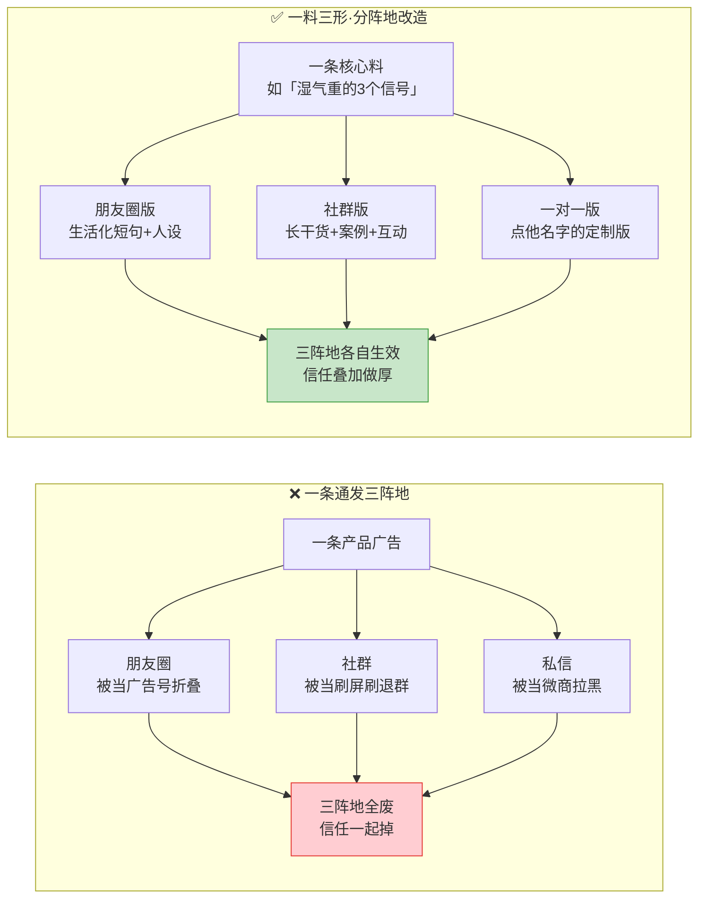
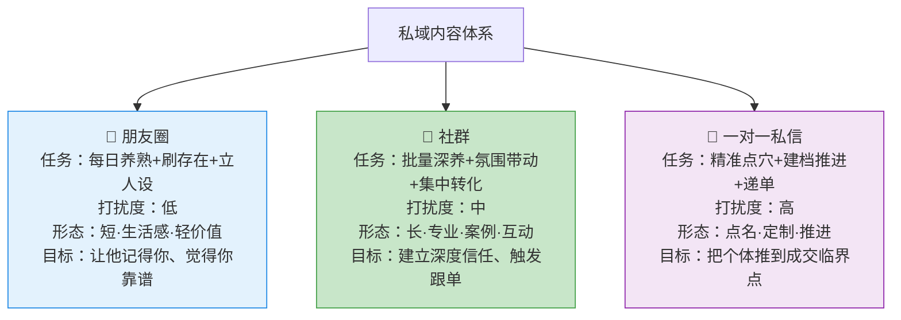
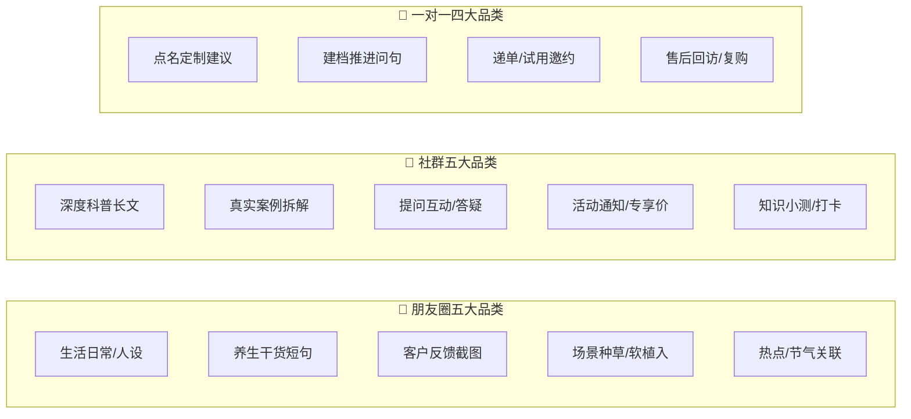
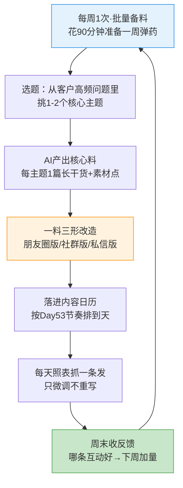

# Day54: 私域高价值内容体系搭建——朋友圈 + 社群 + 一对一「三位一体」的内容分工，让老黄不再为「每天该发什么养熟客户」发愁，用一套可持续产出的价值内容，把养熟的信任持续做厚、为成交与复购源源不断供料

> 📅 学习日期：2026-09-11
> 🔗 关联笔记：[[00-目录]] | 上一篇：[[Day53-微信承接后的30天养熟节奏设计]] | 下一篇：Day55
> 🎯 适用场景：Day53 帮老黄把「微信里那批有效粉」排好了 30 天养熟节奏——「什么时候发、发几成」有了。但节奏表排出来之后，老黄立刻撞上第二个更磨人的问题：**「到了该发的那一天，我到底发什么？」** 朋友圈天天发，发的都是「今天喝了这杯茶」，三天就把人发腻；社群想运营，除了发广告不知道跟大家聊啥；一对一私信更是每次打开对话框都发愁「这条到底该说啥」。Day53 解决的是「节奏的『形』」，这一篇解决的是**节奏的『肉』**——把「朋友圈 / 社群 / 一对一私信」这三个私域阵地各自的内容定位、内容品类、内容配比做成一套**有分工、可复用、可持续产出**的「三位一体」内容体系，让老黄的私域从此不靠灵感、不靠临时想，而是「照着内容矩阵抓一条就能发」，把养熟信任持续做厚。
> 📚 学习来源：Day53 30天养熟节奏（本篇是它「喂什么内容」的弹药库）× Day52 私域导流话术（一对一话术的内容底料）× Day46/47/48 私域社群（社群内容的主战场）× Day45 复购唤醒（老客户内容线）× Day49 私域SOP（内容体系要落进SOP）× Day50 复盘迭代（内容体系要按月体检迭代）× Day28 内容工业化（本篇是它在私域场景的落地）× Day27 转化文案（每条内容的用词）× Day09 个人IP（朋友圈人设线的内容来源）

---

## 1. 一句话总结

**「私域三位一体内容体系」的本质，是把私域里「朋友圈 / 社群 / 一对一私信」这三个阵地当成三个**分工不同的岗**——朋友圈负责「每天悄悄养熟、刷存在、立人设」，社群负责「批量深养、氛围带动、集中转化」，一对一私信负责「精准点穴、建档推进、临门递单」——再给每个阵地配好它该发的固定内容品类与配比，让老黄从此不再对着空白的输入框发愁「今天发什么」，而是打开一张「内容分工表」，照着阵地抓一条对口弹药就能发出去。** 私域做久了，所有人的瓶颈都一样：**不是不会发，是发着发着没词了。** 前三周靠热情天天发「今天泡了杯祛湿茶、客户说好」，第四周开始自己都嫌重复；等到没内容可发，养熟节奏表就成了一张空壳——该发的日子到了，打开微信，愣住，随便发条广告，信任反而掉。**真正能撑起长期养熟的私域，靠的从来不是「灵感式更新」，而是一套『阵地分工 + 内容品类 + 内容配比』的体系化内容供给。** 老黄的「反生活」养生号尤其吃这一套：养生内容易得但易水、专业内容要积累、客户案例是最好的信任料，正好能拆进「朋友圈铺人设、社群做深养、一对一戳痛点」这三岗，各出各的力。本篇就把这三个阵地各自的内容体系，拆成老黄照着就能搭、搭完就能持续填料的实操案。

**核心认知：** 养生好物私域最大的误区，是**「三个阵地发同一条内容」**——把一条产品介绍同时丢朋友圈、丢社群、丢私信，看似省力，实则三个阵地全废：朋友圈被硬广刷成广告号，社群被刷屏刷到退群，私信被当微商拉黑。**三个阵地的用户心理状态、打扰容忍度、内容消费场景完全不同**：他刷朋友圈是「顺手滑，不设防」，所以他吃「人设 + 生活感 + 轻价值」；他在群里是「围观氛围、看别人怎么选」，所以他吃「深度价值 + 真实案例 + 群体共鸣」；他打开你的私信是「一对一、被单独对待」，所以他吃「点他名字的定制建议 + 一对一推进」。**内容错配，再好的内容也白搭；内容对位，一条普通干货也能双重生效。** 这一篇立的核心，就是把「同一套内容按阵地拆成三种形态」，让老黄发出去的每一条都刚好踩在对方那个阵地的心理预期上。

---

## 2. 核心框架

### 2.1 先破除最大的浪费——「一条内容三个阵地通发」

老黄最省力的做法，恰恰是最伤私域的做法。看这张对照：



| 维度 | 一条通发 | 一料三形 |
|:----:|:----|:----|
| 内容来源 | 每次现想一条 | 一条核心料改出三版 |
| 朋友圈观感 | 广告号、被折叠 | 有人味的专业号 |
| 社群观感 | 刷屏、想退群 | 有料、愿围观 |
| 私信观感 | 群发微商 | 被单独照顾 |
| 老黄精力 | 每条从零憋 | 改版省力、还能复用 |
| 信任效果 | 三阵地一起掉 | 三阵地叠加做厚 |

> **给「反生活」的关键：** 老黄不是没内容，是**没把「一条内容拆成三种形态」**。同样讲一个「湿气重的3个信号」——朋友圈发一句「今天又碰到一个说自己怎么睡都不够、还老长痘的姐妹，其实十有八九是湿气堵住了，我放在评论区了」（短、生活、带人设）；社群发一篇「湿气重的3个信号 + 3个调理思路 + 一个真实客户前后对比」（长、专业、带案例、末尾抛互动）；一对一私信发「XX姐，你上回说的那个睡不好，我看更像是湿气困脾——你对照下这3个信号占了几条，占两条以上我专门给你配个思路」（点名、定制、推进）。**同一条核心料，三个阵地各长各的样——这就是「一料三形」，也是老黄私域内容永不枯竭的秘诀。**

### 2.2 三位一体：三个阵地各自的分工地图

把私域三个阵地按「核心任务 / 打扰度 / 内容形态 / 主要目标」排成一张分工地图：



| 阵地 | 核心任务 | 打扰度 | 内容形态 | 频度 | 主目标 |
|:----:|:----|:----:|:----|:----:|:----|
| 📸 朋友圈 | 每日养熟、刷存在、立人设 | 低 | 短、生活感、轻价值 | 每天1条 | 记得你、信你靠谱 |
| 👥 社群 | 批量深养、氛围、集中转化 | 中 | 长、专业、案例、互动 | 每天1-2条 | 深信任、触发跟单 |
| 💬 一对一 | 精准点穴、建档、递单 | 高 | 点名、定制、推进 | 每周1-2次 | 推到成交临界点 |

> **给「反生活」的关键：** 老黄要**把「养熟」这件事拆给三个阵地一起干、按打扰度分层**——朋友圈是「天天在但几乎不打扰」的主力养熟岗；社群是「愿意沉下来看的深度粉」的深养岗；一对一私信是「已经聊到有需求、只差临门一脚」的精推岗。**别指望一个阵地包打天下**：只发朋友圈，深粉养不深；只在群里发，个体推进不了；只发私信，打扰又太重。三位一体，才覆盖从「刚加」到「成交」的全过程。

### 2.3 每个阵地的「内容品类库」——抓一条就能发

分工清楚之后，关键就是给每个阵地备好**固定内容品类**，让老黄不用天天想「发啥」，而是「从库里抓一条改一下」。这张表就是老黄的内容军火库：



| 阵地 | 内容品类 | 「反生活」示例 | 占比建议 |
|:----:|:----|:----|:----:|
| 📸 朋友圈 | 生活日常/人设 | 自己泡茶、工作室一角、真实的挑货过程 | 30% |
| 📸 朋友圈 | 养生干货短句 | 「睡不好先看这3点」配一张图 | 30% |
| 📸 朋友圈 | 客户反馈 | 打码聊天截图 + 一句「又一个姐妹调顺了」 | 20% |
| 📸 朋友圈 | 场景种草/软植入 | 换季提醒 + 顺带提到解决方案 | 15% |
| 📸 朋友圈 | 热点/节气关联 | 白露润燥、秋分养肺的一条 | 5% |
| 👥 社群 | 深度科普 | 「为什么越累越睡不着」完整思路 | 30% |
| 👥 社群 | 真实案例 | 一个客户的调理前后全过程 | 25% |
| 👥 社群 | 提问互动 | 「你们入秋最先哪里不舒服？扣1」 | 20% |
| 👥 社群 | 活动通知 | 限时专享、拼团 | 15% |
| 👥 社群 | 知识小测/打卡 | 体质测试、7天打卡 | 10% |
| 💬 一对一 | 点名定制建议 | 按他诉求给一条对口建议 | 40% |
| 💬 一对一 | 建档推进 | 「方便告诉我你主要哪不舒服」 | 20% |
| 💬 一对一 | 递单/试用邀约 | 「要不要先试小份」 | 20% |
| 💬 一对一 | 售后/复购 | 「上次那款喝着咋样」 | 20% |

> **给「反生活」的关键：** **这张「品类库」的价值，是让老黄把「内容创作」变成「内容选取」**——每天打开的不是空白输入框，而是一张有 5 个抽屉的柜子，今天朋友圈抽「客户反馈」、社群抽「深度科普」、私信抽「点名建议」，抽出来改一改就发。**养生垂类的比例要偏「价值」：朋友圈生活+干货占 60%、软广别超 15%；社群干货+案例占 55%、活动别超 15%——养生的信任是靠「你真懂行」堆的，广告一多就崩。** 老黄按这个配比发，既不水也不硬，天天有料还不腻。

### 2.4 内容生产的「工业化」——一个人怎么持续产出三个阵地

三个阵地、每天要发好几条，怎么一个人撑住？答案是把 Day28 的「内容工业化」搬进私域，用「**一次性批量产 + 一料三形**」把产能拉满：



| 步骤 | 频度 | 耗时 | 产出 |
|:----:|:----:|:----:|:----|
| ① 批量选题备料 | 每周1次 | 90分钟 | 1-2个核心主题的长料 |
| ② AI 产出核心料 | 每周1次 | 含上 | 干货长文 + 要点卡片 |
| ③ 一料三形改造 | 每周1次 | 含上 | 三版内容存入库 |
| ④ 落进内容日历 | 每周1次 | 20分钟 | 一周排期表 |
| ⑤ 每天照表抓发 | 每天 | 5分钟 | 发出去即可 |
| ⑥ 周末收反馈 | 每周1次 | 20分钟 | 下周选题依据 |

> **给「反生活」的关键：** 老黄千万别「每天现想现发」——那样又累又容易断更（断更就是养熟节奏崩）。**正确做法是「一周备一次料、每天只抓发」**：周末花 90 分钟，用 AI 围绕 1-2 个客户最常问的主题（如「睡不好」「湿气重」「换季咳嗽」）出一批长料，当场劈成三版丢进内容库；周一到周日每天打开日历，「今天轮到发哪条、从库里抽出来微调后发」。**这样老黄从「每天都是创作者」变成「每周只当一次创作者、其余时间只当分发员」，一个人也能稳稳撑起三个阵地的持续产出。**

---

## 3. 可落地方法

### 3.1 搭「朋友圈内容日历」——每周七条不重样的自动排法

**【反生活可直接用】朋友圈七格固定排法**，周周循环、永不重样：

| 周几 | 品类 | 「反生活」示例（改一改就能发） |
|:----:|:----|:----|
| 周一 | 生活人设 | 周末挑货/泡茶的照片 + 「新的一周，先给身体松口气」 |
| 周二 | 干货短句 | 「入秋总觉得累？先看这3个信号」+ 图 |
| 周三 | 客户反馈 | 打码截图 + 「又一个姐妹说这周睡得踏实了」 |
| 周四 | 场景种草 | 「换季老咳嗽？我家这款XX我给爸妈都在喝」 |
| 周五 | 热点/节气 | 结合当周节气发一条养生提醒 |
| 周六 | 生活人设 | 真实日常（带娃/做饭/看书），拉近距离 |
| 周日 | 轻互动 | 「这周你们最困扰的是啥？评论区告诉我」 |

**操作（每周一次，20分钟）：** 按 Day53 的节奏表，把这七格填上具体内容，直接从 2.3 的品类库里抓、用 AI 改顺。**发的时候只微调不改结构**——这样老黄两周就能养成肌肉记忆，闭着眼都知道今天该发哪格。

### 3.2 搭「社群一周内容表」——让群天天有料、不冷场、不刷屏

**【反生活可直接用】社群一周排法（每天1-2条）**：

| 周期 | 日子 | 发什么 | 目的 |
|:----:|:----:|:----|:----|
| 周一 | 深度科普 | 一篇对口长干货 | 立专业信任 |
| 周二 | 提问互动 | 「你们入秋最先哪不舒服？扣1」 | 激活沉默粉 |
| 周三 | 真实案例 | 一个客户调理前后全过程 | 建「我也能调好」的信念 |
| 周四 | 知识小测 | 体质自测表/7天小打卡 | 制造参与感 |
| 周五 | 活动通知 | 限时专享/拼团（呼应 Day47） | 集中转化 |
| 周末 | 轻内容 | 晒单、氛围图、群友反馈 | 维持温度不停群 |

**操作要点：**
1. 每天**固定时间发**（如晚间 8 点），让群友形成「这个点群里会有料」的期待；
2. **科普 : 互动 : 广告 ≈ 4 : 1 : 1**——广告绝不能超 1/6，养生群尤其怕被广告刷死；
3. 每条科普后**必带一个互动问句**，把「单向发」变「双向聊」，群才活；
4. 周五活动提前一天预热（Day47 打法），别当天突然甩链接。

### 3.3 搭「一对一私信三问句模板」——每次打开对话框都有话说

**【反生活可直接用】私信不做群发，只做「三问句」推进**：

**问句①·建档问句（新粉前3天，呼应 Day53）：**
> 「XX姐，方便说说你主要是不好睡、还是想日常保养？我好给你发对口的，免得发一堆你不看的。」

**问句②·点穴问句（中期养熟）：**
> 「你上回说那个睡不好，我看更像是湿气困脾——你对照下这3个信号占了几条？占两条以上，我给你专门配个思路。」

**问句③·递单问句（需求信任到位时）：**
> 「你那种情况，我建议先按这个思路试一个月——先拿个小的（一口价/试用装）试试，合适了再续，你觉得呢？」

**操作要点：** 永远**先给价值、再拉近、最后才递单**；每次私信带**对方的称呼 + 他之前说过的具体诉求**，让他感到「你记得我」；没到递单窗口（Day53 判定）绝不提钱。

### 3.4 一料三形实战：以「晨起口苦」为例改出三条

**【反生活可直接用】核心料 → 三版改造示范**：

- **核心料**：晨起口苦多与肝胆湿热、胃火有关；三个信号（口苦+舌苔黄+易烦躁）；三个调理方向（饮食清淡、作息、对应食材）。
- **📸 朋友圈版（短·生活感）**：
  > 「今早碰到个姐妹说自己天天晨起口苦、还老想发脾气——其实这不一定是上火，多半是肝胆湿热。三个信号我放评论区了👇 中了的姐妹吱一声。」
- **👥 社群版（长·专业·带互动）**：
  > 「今天群里聊个高频问题：晨起口苦。① 先自查3个信号… ② 背后的机理其实是… ③ 三个调理方向… 上个月群里L姐就是这种情况，按这个思路调了两周，反馈口苦明显少了。你们有这个情况的，扣「口苦」，我私发你一份对照表。」
- **💬 一对一版（点名·定制）**：
  > 「L姐，你上回说的早上起来嘴巴发苦——我琢磨了下，你那个更像是肝胆湿热，不是单纯上火。你对照下这3个信号占几条，占两条以上我给你专门写个调理的先后顺序，别乱吃清火的。」

**操作：** 老黄每周只要出 1-2 条「核心料」，就能劈出 3-6 条能发的内容，一周的弹药就有了大半。

### 3.5 用 AI 当「私域内容军火商」——批量产出三阵地弹药的提示词

**【反生活可直接用】**：把这几条提示词存进「反生活」的内容库，每周备料时直接调用：

```
【提示词1·出核心料】
「你是资深养生内容编辑。围绕『【填主题，如：湿气重】』，
写：①3个自查信号 ②背后的中医机理（通俗化）③3个调理方向（可落地）
④3个客户最可能追问的问题。面向30-50岁女性，口吻亲切专业，限800字内。」

【提示词2·一料三形】
「把下面这篇养生干货改写成三个版本：
A【朋友圈版】：80字内，生活化、带人设、结尾带互动问句；
B【社群版】：500字，专业、加一个真实案例感、结尾抛互动；
C【一对一私信版】：点名版，用『XX姐』称呼，100字内，先共情再给定制建议。
原文：【粘贴核心料】」

【提示词3·排一周内容】
「把下面这些要点排成一周朋友圈内容日历（周一到周日各一条）：
每条注明品类（生活/干货/反馈/种草/热点）和一句话文案。要点：【粘贴】」

【提示词4·写客户反馈模板】
「根据这个真实情况【填】，写一条发朋友圈的客户反馈，要求：
打码对话的叙述口吻、不夸大疗效、合规（不承诺治病）、结尾轻互动、60字内。」
```

---

## 4. 变现路径

把「三位一体内容体系」搭起来，兑现的是把 Day53 排好的养熟节奏**真正填上肉**，让私域从「有节奏没内容」变成「天天有料、越养越厚」：

| 变现维度 | 怎么赚 | 大概能到哪个量级 | 关联笔记 |
|:----:|:----|:----|:----|
| 💰 养熟节奏不落空 | Day53 的节奏表若没内容填，很快就断更；内容是节奏的燃料，填满才跑得通 | 断更率大幅下降，有效粉不再「加了就凉」 | Day53 |
| 💰 单粉信任更厚 | 三阵地叠加触达（朋友圈熟脸+社群深养+私信定制），信任密度远高于只发一个阵地 | 同样的粉，成交转化率提升 | Day53/Day46 |
| 💰 内容一料三用、产能翻倍 | 一条核心料劈三版，私域内容产出效率成倍提升 | 单人可支撑的私域粉丝规模翻倍 | Day28 |
| 💰 社群集中转化的弹药 | 社群有料才有人气，有人气才带得动 Day47 的集中活动转化 | 社群活动转化率提升 | Day47/Day46 |
| 💰 成交临门一脚有料可递 | 私信三问句让「递单」有前文铺垫，不突兀不杀价 | 私域一对一成交率提升 | Day44/Day52 |

> 给「反生活」的一句话账本：**三位一体内容体系的回报，是把 Day53 那条已经排好却「随时可能断更」的养熟节奏，用一套『朋友圈天天养、社群批量深养、私信精准推』的内容军火库彻底喂饱——老黄不再靠灵感写内容，而是每周备一次料、每天照表抓发，让私域的信任在三条线上同时做厚，最终实打实地把「导进来→养得活→肯下单」这条链跑得更顺、更快、更不费力。** 内容体系是私域的『自来水』：没有它，节奏表是空壳；有了它，养熟、成交、复购都不再缺料。

---

## 5. 行动清单

### ✅ 行动①:搭「朋友圈内容日历」+ 备一周弹药(今天做)

**步骤1(20分钟):** 按 3.1 的七格排法，把「反生活」本周周一到周日的朋友圈内容填出来（从 2.3 品类库抓）。
**步骤2(30分钟):** 挑老黄客户最常问的 1 个主题（如「睡不好」），用 3.5 提示词让 AI 出一篇核心料 + 三版改稿。
**步骤3(10分钟):** 把「一周日历 + 三版弹药」存成一份文档，设为本周发圈底稿。

> **产出：** ✅ 一份排好的朋友圈内容日历 + 至少 3 条备好的内容——从「每天现想」变成「照表抓发」。

### ✅ 行动②:搭「社群一周内容表」并试跑一天(本周内)

**步骤1(20分钟):** 按 3.2 把社群一周排法填好，确定每天固定发布时间。
**步骤2(30分钟):** 准备好周一「深度科普」那条 + 周三「真实案例」那条（可用 AI 辅助）。
**步骤3(复盘):** 周一发出后看群反应（回复数、扣1数），据此微调后面的品类比例。

> **产出：** ✅ 一张社群一周内容表 + 至少 2 条备好的群内容 + 一次真实反馈——群从此天天有料、不冷场。

### ✅ 行动③:把「一料三形」变成本能，设立内容库(持续做)

**步骤1(15分钟):** 建一个「反生活内容库」文件夹/表格，分「核心料 / 朋友圈版 / 社群版 / 一对一版」四栏。
**步骤2(每周1次):** 备料时固定「先出核心料 → 再劈三版 → 存入库」，逐步积累自己的弹药库（呼应 Day28 工业化）。
**步骤3(每月复盘):** 哪条内容互动最好、哪版转化率最高，回填进库，下一月照着加量——接 Day50 复盘，把内容体系越用越顺手。

> **产出：** ✅ 一个持续变厚的「反生活私域内容库」 + 一料三形的肌肉记忆——老黄的私域内容从此可复制、可复用、可进化，稳稳接进 Day51 体检锁定的「②私域承接」主攻方向的长期供料。

---

## 📊 今日学习总结

| 维度 | 内容 |
|:----:|------|
| 核心认知 | 私域瓶颈不是「不会发」，是「发着发着没词了」；三个阵地不能通发同一条，必须按阵地心理对位拆成三形态；内容体系才是养熟节奏的燃料 |
| 核心框架 | 三位一体分工（朋友圈=每日养熟刷存在立人设 / 社群=批量深养氛围转化 / 一对一=精准点穴递单）× 各阵地品类库 + 配比（朋友圈生活干货60%、社群干货案例55%）× 一料三形 × 每周批量备料每天照表抓发 |
| 关键技能 | 朋友圈七格日历、社群一周四比一内容配比、一对一三问句模板、核心料劈三版、用 AI 批量产私域弹药 |
| 变现路径 | 让养熟节奏不断更、三阵地叠加加厚信任、内容一料三用产能翻倍、给社群集中转化供弹药、让一对一递单有铺垫不突兀 |
| 今日行动 | ① 搭朋友圈内容日历+备一周弹药 ② 搭社群一周内容表并试跑 ③ 建「反生活内容库」把一料三形变成本能 |

> 下一篇预告：**Day55: 私域内容合规与信任风险防控——养生赛道最容易踩的「疗效承诺、绝对化用语、过度营销」三根红线怎么避，让老黄的内容既能打动人心、又能稳稳合规，把信任做长久而不是做一锤子买卖**。

---

## 📌 关联笔记一览

| 关联主题 | 笔记链接 |
|:----|:----|
| 目录/进度 | [[00-目录]] |
| 上一篇(养熟节奏：本篇是它「喂什么」的弹药库) | [[Day53-微信承接后的30天养熟节奏设计]] |
| 导流话术(一对一内容底料) | [[Day52-小红书私域导流话术全栈实战]] |
| 社群运营(社群内容的主战场) | [[Day46-私域社群精细化运营]] |
| 社群活动(内容给转化供弹药) | [[Day47-私域社群活动策划与促销转化]] |
| 复购唤醒(老客户内容线) | [[Day45-私域成交后客户关系经营与复购唤醒]] |
| 成交话术(递单话术来源) | [[Day44-私域成交话术与逼单心理学]] |
| 私域SOP(内容体系要落进SOP) | [[Day49-私域成交标准作业流程SOP]] |
| 复盘迭代(内容体系按月体检) | [[Day50-复盘与SOP迭代升级]] |
| 内容工业化(本篇在私域场景的落地) | [[Day28-自媒体内容工业化生产]] |
| 个人IP(朋友圈人设线) | [[Day09-个人IP打造]] |

> 🔗 反生活适用标注：本篇整套「三位一体内容体系」围绕「反生活」好物养生账号「高信任、需定制、决策周期长、忌硬推」的属性设计——朋友圈以生活+干货立专业人设、社群以干货+案例建深度信任、一对一以点名定制推进成交，三条线各司其职又互相补位，完全贴合养生垂类「先建立信任、再顺势成交」的用户心理，可直接套用。
