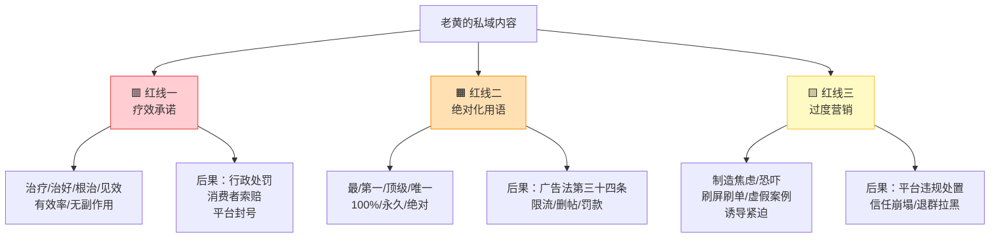
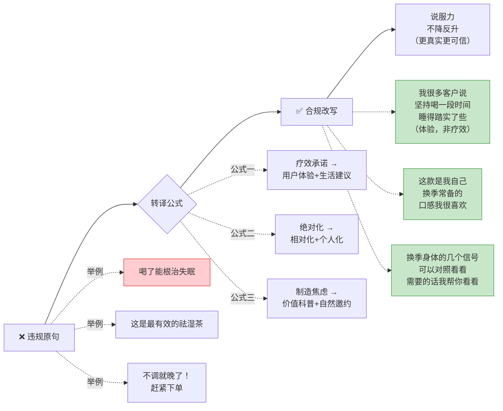
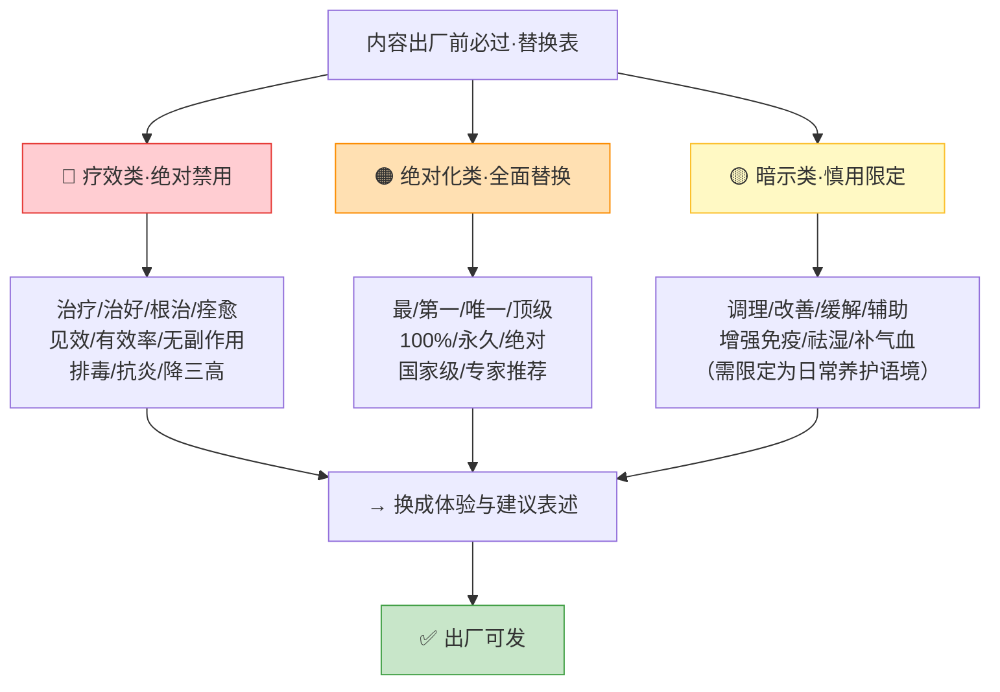
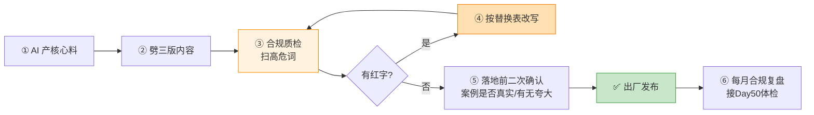

# Day55: 私域内容合规与信任风险防控——养生赛道最容易踩的「疗效承诺、绝对化用语、过度营销」三根红线怎么避，让老黄的内容既能打动人心、又能稳稳合规，把信任做长久而不是做一锤子买卖

> 📅 学习日期：2026-09-13
> 🔗 关联笔记：[[00-目录]] | 上一篇：[[Day54-私域高价值内容体系搭建]] | 下一篇：Day56
> 🎯 适用场景：Day52 到 Day54，老黄已经能把「反生活」的粉从公域导进微信、用 30 天节奏养熟、用三位一体内容体系天天喂料——**整套私域内容机器已经装好、开始转了**。但机器一转起来，最要命的隐患就浮出水面了：养生赛道是所有垂类里**合规风险最高的一条**——「这个能调理好你的失眠」「三天见效」「根治」「最有效」「纯天然无副作用」「比药还管用」，这些老黄随口就能说出来的话，每一句都踩在《广告法》《食品安全法》《化妆品监督管理条例》以及各平台社区规范的红线上。平时没事，一旦量大、一旦被人投诉、一旦平台巡查，轻则笔记限流删帖、微信封号，重则**行政处罚 + 消费者索赔 + 账号全盘清零**——老黄辛辛苦苦养了 50 多天的私域池，可能一夜蒸发。这一篇不教「怎么把话说得更猛」（那反而是要治的病），专门解决**「怎么在合规的笼子里，把话说到既打动人心、又能安全地长久做下去」**：把养生赛道最容易踩的三根红线一根根讲清楚、给老黄一套「改写公式 + 自查清单 + 风险话术替换表」，让「反生活」的内容从此**能打、更安全**——把信任做长久，而不是做一锤子买卖。
> 📚 学习来源：Day54 私域内容体系（本篇是它「内容能发出去」的安全阀）× Day27 转化文案（文案要既有效又合规）× Day44 私域成交话术（成交话术里的违规高危句）× Day06 公众号爆款公式（标题党与绝对化用语的风险）× Day09 个人IP打造（人设靠长期信任，不靠夸大）× Day46/47 社群运营与活动（活动文案的合规底线）× Day51 收官体检（把「合规风控」列为经营系统的必检项）× Day50 复盘迭代（合规自查要进 SOP 定期跑）

---

## 1. 一句话总结

**「私域内容合规风控」的本质，是承认养生赛道的『内容效果』和『合规边界』天生是一对矛盾——你要打动一个失眠、湿气重、气血虚的人，最本能的话就是「这个能治好你」，但这恰恰是《广告法》和平台规范里最重的红线；所以老黄真正要练的不是「怎么把效果说得更狠」，而是一套「**转译功夫**」：把『疗效承诺』转译成『用户体验与生活方式建议』，把『绝对化用语』转译成『个人感受与相对表述』，把『过度营销』转译成『价值科普与真实案例』——让内容该有的说服力一点不少，但每一句都落在合规区内。** 记住一句话：**养生赛道赚的从来不是「一次猛推」的快钱，而是「长期信任」的慢钱；而合规不是给内容戴镣铐，恰恰是保护老黄能把这门生意做十年、而不是做三个月就归零的护栏。** 老黄的「反生活」前期投入了 50 多天做导流、养熟、内容体系，私域池就是最值钱的资产——一次违规封号 = 全部归零；而掌握了合规转译，代价只是「换个说法」，收益却是「这套系统可以安全地滚动、放大、传给团队」。**合规是私域规模化前必须过的那道关。**

**核心认知：** 养生好物私域最危险的误判，是把合规当成「形式主义」——觉得「大家都这么说」「客户都爱听这种」「我又不是卖药，说点效果没事」。**平台和监管的执法逻辑恰恰相反：不看你的初衷，只看你的表述**。「调理」「改善」「辅助」是合规词，「治疗」「治好」「根治」「有效率」是违规词；「我个人喝了觉得睡得踏实了」是体验描述，「喝了就能根治失眠」是疗效承诺——**同样的产品、同样的效果，一句话之差，一边是安全区、一边是处罚区。** 更关键的是：**养生垂类因为直接关联「健康」，被监管和平台重点盯防**，同样的表述放在卖衣服的账号上没人管，放在养生账号上就是高危。所以老黄必须比别的垂类更早地把合规意识装进内容生产流程里——**不是等出了事再改，而是从「内容出厂质检」这一环就装上安检机。** 这一篇立的核心，就是把合规从「怕被查」的被动心态，升级成「有一套转译公式、一张替代词表、一道出厂自查」的主动能力。

---

## 2. 核心框架

### 2.1 先看清风险地图——养生赛道私域内容的三根红线

老黄的私域内容从朋友圈、社群、一对一私信出去，每一条都在三根红线附近游走：



| 红线 | 典型违规表达 | 主要法律/规范依据 | 后果 | 风险等级 |
|:----:|:----|:----|:----|:----:|
| 🟥 疗效承诺 | 「治好失眠」「根治湿气」「三天见效」「有效率98%」「无副作用」 | 《广告法》第十七条、《食品安全法》第七十三条、平台规范 | 行政处罚、索赔、封号 | ⭐⭐⭐⭐⭐ |
| 🟧 绝对化用语 | 「最有效」「第一款」「唯一」「100%有效」「永久不复发」 | 《广告法》第九条、第二十八条 | 罚款、限流、删帖 | ⭐⭐⭐⭐ |
| 🟨 过度营销 | 「不调就晚了」「再不吃就完了」制造恐慌、虚假案例、刷屏式硬广 | 平台社区规范、消保法 | 违规处置、信任崩塌 | ⭐⭐⭐ |

> **给「反生活」的关键：** 老黄最容易踩的是**第一根**——因为养生粉天然问的就是「这个能治好吗」，老黄顺口回答「能，很多人都调好了」，这句话就出界了。记住：**普通食品/膳食食品/普通护肤品，法定上不能说任何疾病的治疗、预防功效**。「反生活」的产品若属食品类，能说的只有「口感、成分、日常食用体验、膳食搭配建议」，绝不能落到「治什么病」。**这不是保守，是保命**——老黄 50 天的私域池，命门就在这三根线上。

### 2.2 合规不是「少说话」，是「换一套说法」——转译公式

很多人一听到合规就头大，觉得「那我还怎么卖货」。真相是：**合规不是让你没话说，是让你换一种既安全又有说服力的说法。** 三根红线，各有一句「转译公式」：



| 红线 | ❌ 违规原句 | ✅ 转译公式 | ✅ 合规改写 |
|:----:|:----|:----|:----|
| 疗效承诺 | 「这款祛湿茶能治好你的湿气」 | 疗效 → 体验+建议 | 「很多姐妹说坚持喝着，感觉身体轻快了些，我一般会建议搭配作息一起调」 |
| 疗效承诺 | 「吃了就见效，专治失眠」 | 疗效 → 场景+陪伴 | 「我自己睡前会泡一杯，慢慢把睡前刷手机的习惯换掉，入睡会顺一些」 |
| 绝对化 | 「全网最有效的祛湿方案」 | 绝对 → 相对+限定 | 「目前我试过的几款里，这款口感我自己最能坚持」 |
| 绝对化 | 「100% 无副作用，放心喝」 | 绝对 → 成分说明 | 「成分就是常见的几味食材，具体适不适合你得看体质，我可以帮你看看」 |
| 过度营销 | 「不调就晚了，今天就下单！」 | 焦虑 → 科普+邀约 | 「换季有这几个信号挺常见，可以对照看看；需要的话我帮你理个思路」 |
| 过度营销 | 「限时最后3分钟，抢！」 | 紧迫 → 真实活动信息 | 「这周有个小份装的体验价，想试试的可以跟我说一声」 |

> **给「反生活」的关键：** **转译公式的妙处在于——改完之后不但合规，还更可信了**。因为「根治失眠」这种话客户听多了、早就免疫（满屏都在吹）；而「我自己睡前泡一杯、很多姐妹说睡得踏实了些」这种**带体验、带限定、带陪伴**的话，反而更像一个真实的人在分享，信任度更高。**老黄要把「合规」重新定义为「说人话」**——不是少说，是把「商家话术」换成「朋友分享」。这一换，规避了风险，还顺手提升了转化。

### 2.3 高危词替换表——老黄的「合规词库」

结合 Day27 转化文案与 Day44 成交话术，把养生赛道最高频的高危词做成一张「一查就能替换」的表，贴在内容库最前面：



| 类别 | ❌ 高危词 | ✅ 替换表达 | 说明 |
|:----:|:----|:----|:----|
| 疗效 | 治疗、治好、根治、痊愈 | （删除疗效）→ 日常养护、陪伴式调整 | 食品/普通护肤品禁用 |
| 疗效 | 见效、有效率、三天起效 | 我自己的体验是…、很多姐妹反馈… | 改体验陈述 |
| 疗效 | 无副作用、安全无害 | 成分是…（如实说明）、适不适合看体质 | 不承诺安全 |
| 疗效 | 排毒、抗炎、降三高、提高免疫力 | 换季养护、日常膳食搭配 | 医疗术语禁用 |
| 绝对化 | 最有效、第一、唯一、顶级 | 我自己比较喜欢、我用得比较久 | 相对化 |
| 绝对化 | 100%、永久、绝对、彻底 | 基本上、我个人感觉、坚持了一段时间 | 模糊量化 |
| 绝对化 | 国家级、专家推荐、权威认证 | （删除，或如实注明具体资质与出处） | 需有据可查 |
| 暗示 | 祛湿、补气血、调理体质 | 换季身体养护、日常饮食搭配（加"因人而异"） | 需限定语境 |
| 暗示 | 不吃就晚了、错过后悔 | 有需要可以看看、想试就说一声 | 去焦虑化 |

> **给「反生活」的关键：** 老黄把这张表**打印出来贴在电脑前、或存成速查卡**——每次写完内容，先扫一遍这几个红字有没有出现。**「调理」这个词也别滥用**：它虽比「治疗」轻，但仍属功效暗示，最好放在「日常养护 / 饮食搭配 / 因人而异」的语境里，且避免指向具体疾病。**记一条铁律：凡是指向「病」的词（失眠、湿疹、三高、炎症），一律改成「状态描述」（睡不好、皮肤状态、换季不适）**——把「病」说成「状态」，就跨过了最大那道坎。

### 2.4 内容出厂质检——把合规装进生产流程

光有词表不够，得把「合规自查」做成内容出厂前的**固定一关**，接进 Day54 的内容工业化流程：



| 关卡 | 动作 | 谁来把 | 频度 |
|:----:|:----|:----:|:----:|
| ① 生成 | AI 出核心料 | 老黄 | 每周备料 |
| ② 改形 | 一料三形改造 | 老黄 | 每周备料 |
| ③ 质检 | 扫高危词（贴词表对照） | 老黄/AI | 每批内容 |
| ④ 改写 | 按替换表转译 | 老黄 | 命中即改 |
| ⑤ 复核 | 案例真实性、有无夸大 | 老黄 | 发布前 |
| ⑥ 复盘 | 本月有无擦边、是否更新词表 | 老黄 | 每月 |

> **给「反生活」的关键：** **把合规变成一道「自动过筛」而不是「临时想起」**。老黄可以给自己写一条 AI 提示词（见 3.3），让 AI 在出稿的最后一步自动跑一遍「合规体检」——把高危词标红、给出替换建议。**再加一条铁律：所有客户案例必须是真实的、且去掉可识别的个人信息（打码昵称、隐去具体病情诊断）**。**造假案例是比用词更重的雷**——一旦被扒出「这个客户根本不存在」，那不是罚款的事，是整个账号的信誉归零。

---

## 3. 可落地方法

### 3.1 【反生活可直接用】合规自查清单——每条内容发布前过一遍

老黄发布任何一条私域内容（朋友圈/社群/私信）前，对照这张清单逐项打勾：

| # | 自查项 | 合格标准 | ✔/✘ |
|:--:|:----|:----|:--:|
| 1 | 有无疗效承诺词 | 无「治疗/治好/根治/见效/有效率/无副作用」 | |
| 2 | 有无绝对化用语 | 无「最/第一/唯一/100%/永久/绝对」 | |
| 3 | 有无指向具体疾病 | 「失眠/湿疹/三高」已改为状态描述 | |
| 4 | 有无医疗术语 | 无「排毒/抗炎/降三高/提高免疫力」 | |
| 5 | 有无制造焦虑 | 无「不调就晚了/错过后悔」式恐吓 | |
| 6 | 案例是否真实 | 案例真实、已打码、无夸大疗效 | |
| 7 | 有无资质问题 | 不用「专家推荐/权威认证」除非有据 | |
| 8 | 有无诱导紧迫 | 无「最后3分钟/仅限今天」式虚假紧迫 | |
| 9 | 有无"因人而异"提醒 | 涉及体质建议处已注明 | |
| 10 | 私信有无过度打扰 | 符合 Day53 节奏，非群发硬推 | |

**操作：** 前 20 条内容严格逐项打勾（养成肌肉记忆），之后可简化为「扫三眼」：先扫疗效词、再扫绝对化词、最后确认案例真实性。

### 3.2 【反生活可直接用】三根红线的「一句话改写」速查

老黄现场直播/私信最容易脱口而出的高危句，直接背这组改写：

| 老黄想说（潜意识） | ❌ 脱口而出的违禁版 | ✅ 背下来的合规版 |
|:----|:----|:----|
| 这产品对失眠特管用 | 「喝了就能治失眠」 | 「很多姐妹说睡前泡一杯、配合早点放下手机，入睡会顺一点」 |
| 这个祛湿效果最快 | 「三天祛湿见效」 | 「换季的时候身体容易发沉，我自己会喝段时间，感觉轻快些」 |
| 今天必须下单 | 「最后3分钟，不抢就没了」 | 「这周有个小份体验价，想试试的跟我说一声就行」 |
| 我这绝对安全 | 「纯天然100%无副作用」 | 「成分就是常见的几味，适不适合你，我可以帮你看看体质」 |
| 人家都调好了 | 「我这客户全都治愈了」 | 「有位姐姐反馈坚持了一段时间，她自己感觉状态好了些」 |

**操作：** 把这 5 组改写抄在手机备忘录里，直播前、私信前扫一眼——**把「想说」的条件反射，替换成「合规版」的条件反射。**

### 3.3 【反生活可直接用】AI 合规质检提示词

接进 Day54 的 AI 内容生产流程，在出稿最后一步调用：

```
【提示词·合规质检】
「你是熟悉《广告法》《食品安全法》《化妆品监督管理条例》及小红书/微信社区规范的
食品与美妆类内容合规审查员。请审查下面这段养生内容，逐项输出：
① 列出所有涉嫌违规的表述（疗效承诺/绝对化用语/医疗术语/制造焦虑/诱导紧迫）；
② 对每一处给出符合法规的改写建议；
③ 特别检查是否出现『治疗、治好、根治、见效、有效率、无副作用、排毒、抗炎、
   降三高、增强免疫、最、第一、唯一、100%、永久』等词；
④ 检查客户案例是否可能涉及虚假或夸大；
⑤ 最后给出该内容的『风险等级：高/中/低』和一句总体结论。
待审内容：【粘贴】」

【提示词·合规改写】
「把下面这段内容改写成完全符合广告法与平台规范的版本，保持原有的亲切口吻和
说服力，但：把疗效承诺改成用户体验陈述；把绝对化用语改成相对表述；去掉指向
具体疾病的词，改为状态描述；去掉制造焦虑的句子；涉及体质的建议加『因人而异』。
原文：【粘贴】」
```

**操作：** 把这两条提示词存进「反生活」内容库，**每周备料时对每条成品跑一遍**——AI 质检比人眼快，且能兜住「写顺手了忘了看」的漏网之鱼。

### 3.4 【反生活可直接用】账号与私域的安全底线动作

除内容外，还有几个「结构性」的风险动作要一次性做对：

1. **合规声明固定化**：个人简介或朋友圈签名加一句「本店所售为食品/日用类产品，非药品，不具疾病治疗功能，相关体验因人而异」——一句话挡住大半风险；
2. **禁用工具规避**：不用「自动群发机器人」高频轰炸（违反平台规则 + 易被判定骚扰），坚持 Day53 的手工节奏；
3. **客户信息脱敏**：任何案例截图**先打码昵称头像**，绝不放客户的真实病情诊断、化验单；
4. **广告标识合规**：涉及商业推广的内容（如品牌合作，呼应 Day29）**标明「合作/广告」**，别以纯分享口吻发商单；
5. **留存证据**：进货凭证、成分资料、资质文件**归档保存**——真被质疑时，能自证是「合法经营 + 如实描述」而非「虚假宣传」；
6. **不碰医疗建议**：客户问「我这病该怎么治」→ 一律回「这个得看医生，我只能在日常养护上给你点建议」，**绝不越界给治疗方案**。

> **给「反生活」的关键：** 这 6 条是**「一次性做对、长期受益」的基础设施**——合规声明写上去只要 1 分钟，但能挡掉大部分投诉；客户脱敏每张图多花 10 秒，但能避免一次隐私纠纷。**老黄千万别嫌麻烦：养生赛道一次的违规成本，远高于这些动作累计 100 次的时间成本。**

### 3.5 月度合规复盘模板（接 Day50 体检）

每月末花 20 分钟跑一遍，把合规变成「可体检」的项：

| 复盘项 | 检查方法 | 本月记录 |
|:----|:----|:----|
| 本月有无擦边内容 | 随机抽 10 条私域内容自查 | |
| 高危词有无漏网 | 用替换表全量扫描 | |
| 有无客户投诉/警告 | 查平台通知、私信 | |
| 有无被限流/删帖 | 对比数据异常波动 | |
| 词表是否需更新 | 平台出新规/新案例 | |
| SOP 是否要补合规关 | 是否有新场景未覆盖 | |

> **给「反生活」的关键：** 合规不是「学一次就完事」，**平台规则和执法风向每年都在变**（比如对「种草笔记」的商业标识要求越来越严、对养生类目越来越盯得紧）。所以它必须像 Day50 说的「SOP 定期体检」一样，**进到老黄每月复盘清单里，越跑越全**。

---

## 4. 变现路径

把「合规风控」做扎实，兑现的**不是「多赚一笔」，而是「保护前面 54 天赚到的一切不归零、并让规模化成为可能」**：

| 变现维度 | 怎么赚 | 大概能到哪个量级 | 关联笔记 |
|:----:|:----|:----|:----|
| 🛡️ 保命：私域资产不归零 | 一次违规封号 = 50 天导流养熟全废；合规 = 保住整个私域池 | 避免「全部归零」的毁灭性损失 | Day51/Day52 |
| 💰 信任更厚、转化更高 | 合规的「体验式表述」比「疗效吹嘘」更真实可信，客户反而更愿意买 | 转化率不降反升 | Day27/Day44 |
| 💰 规模化前提 | 只有合规，才敢把内容交给团队/外包/AI 批量生产、才敢投流放大 | 单人 → 团队规模化的入场券 | Day02/Day28 |
| 💰 品牌合作不踩雷 | 商单内容合规（标广告、不夸大），才敢接品牌合作、不被品牌方追责 | 打开蒲公英/商单变现（Day29） | Day29 |
| 💰 降低售后纠纷 | 不承诺疗效 → 客户不会因「没治好」来闹退款、投诉、差评 | 售后成本与差评率下降 | Day45 |
| 💰 长线经营的地基 | 合规是「能做十年」和「做三个月就跑」的分水岭 | 决定生意天花板 | Day09/Day51 |

> 给「反生活」的一句话账本：**合规风控的回报，是一笔「保险 + 复利」的组合账**——短期看它不直接产生收入（甚至约束了最猛的卖货话术），但它是老黄 50 多天私域资产的**保险费**（一次违规 = 归零，合规 = 保住本金），更是把生意从「单人小打小闹」放大成「团队规模化」的**入场券**（不敢合规，就永远不敢放量）。**记住：养生赛道的终局赢家，从来不是话说得最猛的那个，而是活得最久的那个。**

---

## 5. 行动清单

### ✅ 行动①:做一张「反生活合规速查卡」贴电脑前(今天做)

**步骤1(25分钟):** 把 2.3 的高危词替换表 + 3.2 的「五组一句话改写」抄成一张 A4 速查卡。
**步骤2(10分钟):** 打印或存成手机备忘录置顶，发内容前必扫一遍。
**步骤3(5分钟):** 在个人简介/朋友圈签名加上合规声明：「本店产品为食品/日用类，非药品，不具疾病治疗功能，体验因人而异」。

> **产出：** ✅ 一张随手可查的合规速查卡 + 一句固定合规声明——从此发内容有「安检参照」。

### ✅ 行动②:用 AI 给「反生活」现有内容做一次全量合规体检(本周内)

**步骤1(20分钟):** 从已发的朋友圈/社群/私信中挑 10 条，用 3.3 的合规质检提示词逐条过。
**步骤2(30分钟):** 把 AI 标出的高危句，用替换表逐条改写，存成「合规版」备查。
**步骤3(10分钟):** 把「合规质检」这一步，正式加进 Day54 的内容生产流程（出稿 → 质检 → 发布）。

> **产出：** ✅ 一份现有内容的合规体检报告 + 至少 10 条改写示范 + 质检环节并入生产流程——内容从此「出厂即安检」。

### ✅ 行动③:把合规复盘写进月度SOP(持续做)

**步骤1(15分钟):** 把 3.5 的月度合规复盘表加入老黄的月度复盘清单（接 Day50/Day51）。
**步骤2(每月1次):** 抽 10 条内容自查、扫描高危词、检查有无投诉警告、更新词表。
**步骤3(长期):** 关注平台规则更新（如商业标识、养生类目新规），有新规就补进速查卡——让「反生活」的合规体系随平台一起进化。

> **产出：** ✅ 一个可每月自动跑的「合规体检」机制 + 一张会自我更新的词表——让老黄的信任经营能长久、安全地滚动下去，为 Day51 体检锁定的「规模化与私域放大」主攻方向清掉最大的那颗地雷。

---

## 📊 今日学习总结

| 维度 | 内容 |
|:----:|------|
| 核心认知 | 养生赛道是合规高危垂类，效果与合规天生矛盾；合规不是戴镣铐，是保命的护栏；不该「少说话」，而该「换套说法」——合规的体验式表述反而更可信 |
| 核心框架 | 三根红线（疗效承诺/绝对化用语/过度营销）× 三句转译公式（疗效→体验+建议 / 绝对→相对+限定 / 焦虑→科普+邀约）× 高危词替换表 × 内容出厂合规质检 × 月度合规复盘 |
| 关键技能 | 高危词速查替换、五组一句话改写、AI 合规质检提示词、账号安全底线六动作、月度合规体检表 |
| 变现路径 | 保命（私域资产不归零）、信任更厚转化更高、规模化的入场券、品牌合作不踩雷、降低售后纠纷、长线经营地基 |
| 今日行动 | ① 做合规速查卡+加合规声明 ② 用 AI 给现有内容做全量合规体检并接入流程 ③ 把合规复盘写进月度SOP |

> 下一篇预告：**Day56: 私域客户分层与精细化运营——把微信里从「刚添加的陌生粉」到「复购多次的老客户」分成几层，每层配不同的内容、话术与触达节奏，让有限的精力精准投给最有价值的那批人，把私域从「一视同仁地养」升级成「分层递进地养」。**

---

## 📌 关联笔记一览

| 关联主题 | 笔记链接 |
|:----|:----|
| 目录/进度 | [[00-目录]] |
| 上一篇(私域内容体系：本篇是它的安全阀) | [[Day54-私域高价值内容体系搭建]] |
| 转化文案(文案要既有效又合规) | [[Day27-自媒体转化文案写作]] |
| 成交话术(成交话术里的违规高危句) | [[Day44-私域成交话术与逼单心理学]] |
| 公众号爆款公式(标题党与绝对化风险) | [[Day06-公众号爆款文章公式]] |
| 个人IP(信任靠长期，不靠夸大) | [[Day09-个人IP打造]] |
| 私域社群运营(社群内容的合规底线) | [[Day46-私域社群精细化运营]] |
| 社群活动(活动文案的合规边界) | [[Day47-私域社群活动策划与促销转化]] |
| 蒲公英与品牌合作(商单合规标识) | [[Day29-小红书蒲公英平台与品牌合作变现]] |
| 复盘与SOP迭代(合规自查进SOP) | [[Day50-复盘与SOP迭代升级]] |
| 收官体检(合规列为必检项) | [[Day51-阶段收官总复盘与经营体检]] |

> 🔗 反生活适用标注：本篇整套「合规转译 + 高危词替换 + 出厂质检」围绕「反生活」好物养生账号「健康关联、监管高危、靠长期信任成交」的属性设计——用体验式表述替代疗效承诺、用相对表述替代绝对化用语、用科普邀约替代焦虑营销，既守住合规底线，又提升内容的真实感与可信度，完全贴合养生垂类「说人话、做长线」的经营逻辑，可直接套用。
