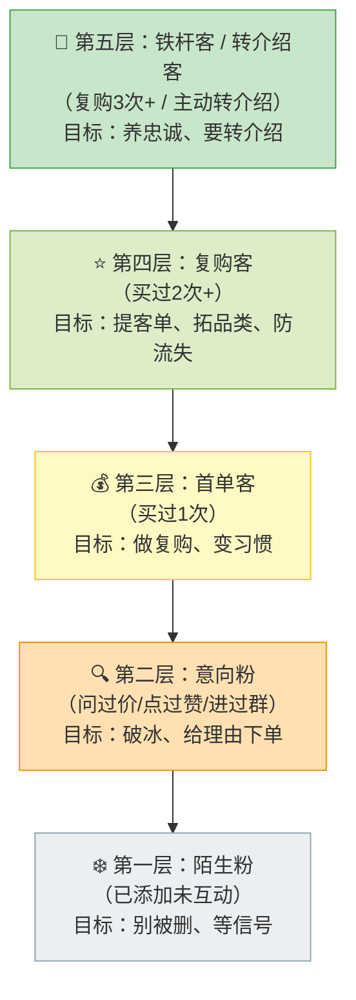
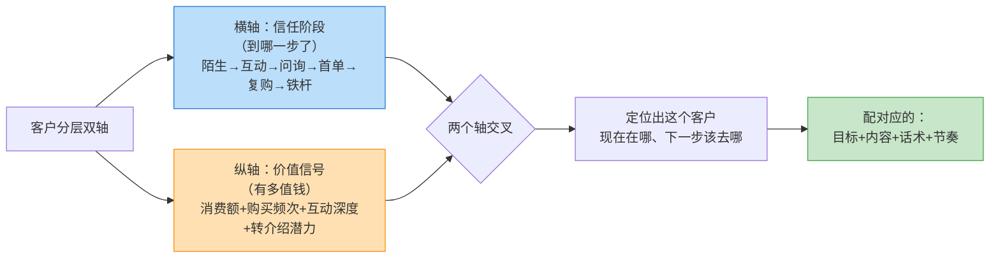
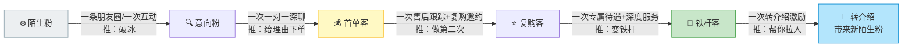
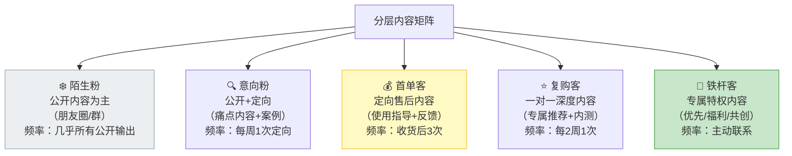
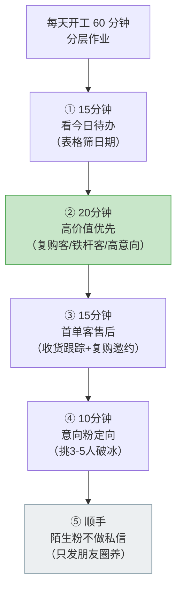

# Day56: 私域客户分层与精细化运营——把微信里从「刚添加的陌生粉」到「复购多次的老客户」分成几层，每层配不同的内容、话术与触达节奏，让有限的精力精准投给最有价值的那批人，把私域从「一视同仁地养」升级成「分层递进地养」

> 📅 学习日期：2026-09-15
> 🔗 关联笔记：[[00-目录]] | 上一篇：[[Day55-私域内容合规与信任风险防控]] | 下一篇：Day57
> 🎯 适用场景：Day52 到 Day55，老黄的「反生活」已经把一整套私域机器跑起来了——粉导进来了（Day52）、30 天养熟节奏排好了（Day53）、三位一体的内容弹药库备足了（Day54）、内容出厂还有合规安检（Day55）。**但机器一转起来，老黄立刻被现实撞醒：微信里躺着几百号人，他却在用同一套话术、同一种内容、同一个频率去对待所有人。** 结果就是——刚加了两天的陌生粉收到「老客户专属回馈」，一脸懵直接屏蔽；跟了三个月、买过三次的老客户，还在收「欢迎了解我们的产品」这种新人话术，觉得你根本没记住他；而那些高意向、问过三次价格还没下单的人，被埋在一堆「已读不回」里彻底沉底。**精力平均分配 = 对谁都不到位。** 这一篇专门解决「人一多就管不过来、越管越没转化」的问题：给老黄一套**客户分层模型（从陌生粉 → 意向粉 → 首单客 → 复购客 → 铁杆客/转介绍客）**，每层配不同的经营目标、内容、话术、节奏和精力配比——把「一视同仁地养」升级成「分层递进地养」，让老黄与其累死累活伺候 500 人，不如**用 80% 的精力喂饱那 20% 真正能带来收入的人**。

> 📚 学习来源：Day52 私域导流（分层是承接后的第一件事）× Day53 30天养熟节奏（分层后每层节奏不同）× Day54 私域内容体系（分层后每层内容不同）× Day55 合规风控（分层推送也不能违规）× Day44 私域成交话术（高意向层的逼单）× Day45 复购唤醒（复购层的老客经营）× Day46 社群精细化（群内也要分层）× Day48 活动后沉淀（活动是分层的天然分水岭）× Day49 私域SOP（分层要写进 SOP）× Day50/51 复盘体检（分层数据要进体检表）× Day19 用户心理（分层背后是「人只关心跟自己相关的事」）× Day22 私域成交与复购体系（分层是复购体系的骨架）

---

## 1. 一句话总结

**「私域客户分层与精细化运营」的本质，是承认一个反直觉的真相——私域不是「人越多越好」，而是「把对的人喂到位才值钱」。** 老黄微信里躺着的几百号人，价值天差地别：有人已经复购五次、主动转介绍，是能带来真金白银的铁杆；有人刚加两天、还没信任你，随时可能删好友；有人问过三次价格却没下单，是埋在最深处的金矿；还有人只领过一次福利、从来没互动过，是纯粹占位的僵尸。**如果老黄用同一套内容、同一个频率、同一种话术对待所有人，结果必然是——对高价值客户太浅（没被记住、没被重视、慢慢流失），对低价值客户太重（被打扰、被骚扰、反手一个屏蔽）。** 分层的核心逻辑就是：**先给客户「贴标签分类」，再按「价值 + 阶段」两个维度分层，然后给每一层配一套专属的「经营目标 + 内容 + 话术 + 触达节奏 + 精力配比」**——把「一视同仁地养」变成「分层递进地养」，把有限的时间精力从「平均撒胡椒面」变成「精准投给最值钱的那批人」。**记住一句话：私域的天花板不取决于你有多少人，而取决于你能识别出多少人、并且把每个人推到下一层——分层的终点不是「分类」，是「晋升」。**

**核心认知：** 大多数做私域的人，败在把「运营」理解成「群发」。**他们以为私域 = 加人多 + 发得多，于是建一个大号把所有人塞进去，朋友圈照发、群消息群推、私信格式统一——看起来热热闹闹，实则效率极低。** 真正会做的人恰恰相反：**人越多，越要层层筛、分着养。** 因为私域经营的本质是「注意力生意」——老黄一天24小时，能手工触达的上限就那么多（Day53 强调过手工节奏），**时间是不可扩大的稀缺资源，所以必须做「精力的重新分配」**：把 80% 的深度沟通留给最近有信号的（高意向 / 高价值）客户，对低价值的层则用「标准化、低频、低成本」的方式批量维护。这背后是一条硬邦邦的用户心理规律（Day19）——**人只关心跟自己相关的事**：一个刚加你两天的人，看到「老客户专享」只会觉得被套路；一个买了三次的老客户，看到「了解一下我们的产品」只会觉得你没记住他。**同一句话，对不同层的人效果可能完全相反。** 所以分层不是「做精细了更好看」，而是「不让对的话说错人」的必然要求。

---

## 2. 核心框架

### 2.1 客户价值金字塔——五层客户与五套打法

老黄的微信好友池，本质是一座金字塔。从下往上，价值逐级递增，人数逐级递减：

| 层级 | 识别标准 | 人数占比 | 经营目标 | 精力配比 | 触达方式 |
|:----:|:----|:----:|:----|:----:|:----|
| ❄️ 陌生粉 | 已加未互动、7天无回应 | ~40% | 别被删，等他动 | 10% | 朋友圈 + 低频群发 |
| 🔍 意向粉 | 有互动（点赞/评论/问价/进群但没买） | ~30% | 破冰、给下单理由 | 25% | 社群 + 定期一对一 |
| 💰 首单客 | 买过 1 次 | ~20% | 做复购、养习惯 | 25% | 一对一 + 售后跟踪 |
| ⭐ 复购客 | 买过 2 次以上 | ~8% | 提客单、拓品类 | 25% | 一对一深度沟通 |
| 👑 铁杆客 | 复购 3 次+ 或主动转介绍 | ~2% | 长期复购 + 转介绍 | 15% | 专人维护、优先特权 |

> **给「反生活」的关键：** **这张表的重点不是「人数占比」，而是「精力配比」——它彻底推翻了老黄的本能（谁问得多就给谁多的时间）。** 真正的分配逻辑是**「价值 × 可推进性」**：陌生粉数量最多但推进率最低，所以只花 10% 精力用低成本方式维护；而意向粉、首单客、复购客这三层虽然加起来才 58% 的人，却是**收入的主要来源，要吃下 75% 的精力**。老黄的「反生活」现阶段人还不多（可能就几百粉），更要**从第一天就养成「先分层再动手」的习惯**——否则人一多（比如破千），没有分层体系就只能靠感觉乱抓，抓瞎是必然的。

### 2.2 两个维度定坐标——「阶段 × 价值」双轴分层法

单看「价值」还不够。老黄要判断一个人该怎么养，得同时看两个轴：

| 维度 | 看什么 | 怎么采集（反生活落地） | 意义 |
|:----:|:----|:----|:----|
| 🔵 信任阶段 | 关系走到哪一步 | 是否互动过、是否问过价、是否下过单、买过几次 | 决定「推什么」和「能不能推」 |
| 🟠 价值信号 | 这个人有多值钱 | 累计消费、客单、购买频次、活跃度、有没有转介绍 | 决定「花多少精力」和「优先照顾谁」 |

**四象限速判表（阶段 × 价值）：**

| | 🟠 低价值信号 | 🟠 高价值信号 |
|:----:|:----|:----|
| **🔵 低信任阶段** | 【待激活】刚加没互动 → 低频朋友圈养着 | 【重点争取】高意向但还在犹豫 → 优先一对一破冰 |
| **🔵 高信任阶段** | 【重点维护】买过但不活跃 → 唤醒复购（Day45） | 【核心资产】老客户+高客单 → 专人维护+转介绍 |

> **给「反生活」的关键：** **「高信任 + 低价值」这一格是老黄最容易忽略的隐藏金矿**——买过一两次但后来没动静的老客户，他们信任基础已经有了（不用再破冰），只是缺一个「再回来的理由」。这一格的客户唤醒成本极低、成功率最高（Day45 复购唤醒的适用对象）。**反过来，「低信任 + 高价值」这一格要吃老黄最多的精力**——他们有兴趣、有购买力，只是还差最后一步（Day44 逼单心理学的适用对象）。老黄每天开工第一件事，应该先看这两格有没有「今天该动的人」。

### 2.3 分层不是静态分类，是「晋升流水线」

分层的真正价值，在于**每一层都在往上推**——老黄每天的运营动作，本质上都是「把这个人从这层推到上一层」：

**每一层的「晋升触发动作」：**

| 层级 | 待办信号（该推了） | 晋升动作 | 目标 |
|:----:|:----|:----|:----|
| ❄️ 陌生粉 | 点赞了/看朋友圈了/领了资料 | 轻互动一次（回评、私信问候） | → 意向粉 |
| 🔍 意向粉 | 问价/问成分/进群活跃 | 一对一深聊 + 给下单理由（Day44） | → 首单客 |
| 💰 首单客 | 收货 3-7 天 | 售后跟踪 + 复购邀约（Day45） | → 复购客 |
| ⭐ 复购客 | 买第 2 次后 | 专属待遇 + 拓品类 + 深度服务 | → 铁杆客 |
| 👑 铁杆客 | 长期复购中 | 转介绍激励 + 荣誉感 | → 转介绍 |

> **给「反生活」的关键：** **把「分层」和「推进」绑成一件事，是老黄这套体系能不能转起来的分水岭。** 只在 Excel 里把客户分成五类，那叫「归档」，不叫「运营」——**分层的目的，是让老黄每天早上打开表格时，能一眼看到「今天该推哪几个人」。** 所以老黄的客户表里，最重要的不是「分类标签」，而是**「下一步动作」+「待办日期」**这两栏（见 3.1 的台账表）：一个意向粉标着「已问价、明天跟进给体验价」，一个首单客标着「9-18 收货满 7 天、安排复购邀约」——**表格本身就是老黄的「今日待办」。**

### 2.4 每层一套「内容 + 话术 + 频率」——分层的落地颗粒度

分层的最终落点，是**「这一层的人，看到什么、听到什么、多久一次」**。把 Day53 的节奏和 Day54 的内容，按层重新分配一遍：

| 层级 | 内容类型 | 话术口吻 | 触达频率 | 合规要点（接 Day55） |
|:----:|:----|:----|:----|:----|
| ❄️ 陌生粉 | 公开科普、生活分享 | 朋友式、不推销 | 跟着朋友圈走 | 不涉疗效、不打广告标识 |
| 🔍 意向粉 | 痛点内容 + 真实案例 + 问答 | 顾问式、给建议 | 每周 1 次定向 | 案例打码、体验式表述 |
| 💰 首单客 | 使用指导 + 收货关怀 + 复购邀约 | 贴心售后式 | 收货后 3 次跟踪 | 不承诺效果、不制造焦虑 |
| ⭐ 复购客 | 专属推荐 + 新品内测 + 深度答疑 | 老友式、有温度 | 每 2 周 1 次 | 不夸大、如实描述 |
| 👑 铁杆客 | 优先购 + 专属福利 + 内容共创 | 合伙人式、讲感情 | 主动、随时 | 转介绍激励要真实可兑现 |

> **给「反生活」的关键：** **这张表把 Day53 的「30 天养熟节奏」和 Day54 的「三位一体内容」从「一刀切」升级成了「分层的」**——同样的朋友圈、社群、一对一三个阵地，对不同的层发不同的东西。**最关键的一条：老黄别再犯「对陌生粉用老客话术、对老客用新人话术」这个低级错**——前者让人反感（我还没买呢你就说专属），后者让人寒心（我买三次了你还在给我发新人价）。**分层的直接收益就是：同一句话，终于说给了对的人。**

---

## 3. 可落地方法

### 3.1 【反生活可直接用】微信客户分层台账（一张表管住所有人）

老黄不需要复杂 CRM，一张表格加微信自带标签就够了：

**第一步：用微信标签打底（5 分钟建好）**

给每个客户打 2-3 个标签：
- **阶段标签**：`00陌生` `01互动` `02问价` `03首单` `04复购` `05铁杆`
- **价值标签**：`A高价值` `B中价值` `C低价值`
- **来源标签**：`小红书私信` `小红书评论` `群引流`（呼应 Day52）
- **待办标签**：`今日跟进` `本周邀约` `收货待访`

**第二步：一张台账表，重点在「下一步动作」**

| 客户昵称 | 阶段 | 价值 | 来源 | 最近动作 | ⭐下一步动作 | 待办日期 | 备注 |
|:----|:--:|:--:|:----|:----|:----|:--:|:----|
| 小A | 02问价 | A | 小红书私信 | 问过祛湿茶价格 | 私信给体验价+成分说明 | 9-16 | 犹豫中，别催 |
| 小B | 03首单 | B | 小红书评论 | 9-11 买过1份 | 收货满7天做复购邀约 | 9-18 | 反馈口感不错 |
| 小C | 04复购 | A | 群引流 | 已买3次 | 邀入铁杆专属小群 | 9-20 | 主动转介绍过1人 |
| 小D | 00陌生 | C | 小红书私信 | 加后无互动 | 朋友圈养着，别私信 | — | 观察点赞信号 |

> **操作：** 前 20 个客户手工建档（约 30 分钟），之后每加一个新粉就顺手打标签。**表格不用天天全看——只每天早上筛「待办日期 ≤ 今天」的行，就是老黄当天的全部运营任务。**

### 3.2 【反生活可直接用】五层客户的「一句话破冰 / 推进」话术

每层准备一句能立刻用的开场，避免每次打开对话框都发愁：

| 层级 | 场景 | ✅ 可直接用的话术（已过 Day55 合规） |
|:----:|:----|:----|
| ❄️ 陌生粉 | 首次轻互动 | 「看到你之前点了赞，谢谢呀～最近换季，你平时会注意些什么养护吗？」 |
| 🔍 意向粉 | 问过价没买 | 「上次你问的那款，我自己这两天也在喝，把我们平时的搭配思路整理给你参考下～」 |
| 💰 首单客 | 收货 3 天 | 「收到货了吧？有人第一次不知道怎么用，我发你个简单的用法～喝着有什么感觉随时跟我说」 |
| 💰 首单客 | 收货 7 天复购邀约 | 「上次那份快喝完了吧？这周有个小份组合，想接着用的可以跟我说一声」 |
| ⭐ 复购客 | 第 2 次购买后 | 「你算是我们的老朋友了，我这边新拿了款还没公开的，先给你留一份试试？」 |
| ⭐ 复购客 | 防流失 | 「有阵子没见你了，最近状态怎么样？需要什么随时找我，别客气」 |
| 👑 铁杆客 | 转介绍激励 | 「你之前推荐的朋友也来了，太谢谢你了～我给你留了份小礼物，下次一起给你」 |

> **操作：** 把这张表存成手机备忘录。**原则：越往下层，话术越「像朋友」；越往上层，话术越「像待遇」。** 陌生粉别急着推销，铁杆客别只谈生意。

### 3.3 【反生活可直接用】每日分层作业节奏（一天 60 分钟跑完）

分层不是「盘一次就完」，是「每天按层的优先级花掉时间」：

| 时段 | 时长 | 做什么 | 对应层 |
|:----:|:----:|:----|:----:|
| ① | 15 min | 筛表格「今日待办」 | 全部 |
| ② | 20 min | 主动联系有信号的高价值客户 | ⭐👑 + 高意向🔍 |
| ③ | 15 min | 收货跟踪 + 复购邀约 | 💰 |
| ④ | 10 min | 挑 3-5 个意向粉破冰 | 🔍 |
| ⑤ | 顺手 | 朋友圈照发，不主动私信 | ❄️ |

> **操作：** **这个节奏的排序逻辑是「先贵后贱、先动后静」**——先处理最值钱、最有信号的（这些人回复率最高），低层的用「发朋友圈」这种一对多的低成本动作顺带覆盖。**切记：老黄越忙，越不能反过来先去回复一堆陌生粉的废话问题**——那是精力黑洞。

### 3.4 【反生活可直接用】分层推进的三个「不该做」

| ❌ 不该做 | 为什么 | ✅ 该做 |
|:----|:----|:----|
| 对全池群发同一条私信 | 高价值客户觉得不被重视、陌生粉觉得被打扰 | 只对「待办筛选出的人」定向发 |
| 一次性把陌生人全私信一遍 | 骚扰感极强、封号风险（Day55）、回复率极低 | 陌生粉只在有信号（点赞/评论）时轻互动 |
| 老客户只发促销不谈感情 | 老客户要的是「被记住」不是「被推销」 | 老客户先聊状态、再谈产品 |
| 分层后不更新标签 | 客户是流动的，标签过时=分层失效 | 每次互动后随手更新阶段标签 |

### 3.5 分层数据看板——直接接进 Day50/51 的体检表

| 指标 | 怎么算 | 反映什么 | 健康线 |
|:----|:----|:----|:----|
| 各层人数分布 | 标签统计 | 池子结构是否健康 | 金字塔形（底层多）为正常 |
| 层间晋升率 | 本月往上走的人数 / 该层总数 | 运营是否在「推进」 | 意向→首单 ≥ 10% |
| 复购率 | 复购客 / 首单客 | 产品+售后是否过硬 | ≥ 30% |
| 铁杆占比 | 铁杆客 / 总人数 | 核心资产的厚度 | ≥ 2% 起步 |
| 转介绍数 | 本月转介绍新客 | 口碑发酵程度（Day55 信任变现） | 逐年上升 |
| 僵尸率 | 30天无互动 / 总人数 | 池子是否在腐烂 | ≤ 40% |

> **操作：** 每月末花 15 分钟填这张表——**如果「层间晋升率」长期为 0，说明老黄只在「守池子」没在「推人」；如果「僵尸率」超 50%，说明前端的引流质量或养熟节奏出了问题（回头查 Day52/53）。**

---

## 4. 变现路径

分层精细化运营**不直接创造新流量，但它把「已有的流量」加工成「更高的收入」**——这是私域里最「省钱」的一笔增量：

| 变现维度 | 怎么赚 | 大概能到哪个量级 | 关联笔记 |
|:----:|:----|:----|:----|
| 💰 收入结构上移 | 把精力从僵尸粉挪到高价值层，复购和客单直接上升 | 同等人数下收入可翻倍 | Day22/Day45 |
| 💰 复购率提升 | 首单客不再是「一次性买卖」，有售后跟踪的复购率显著高于放任 | 复购率 30%→50%+ | Day45/Day48 |
| 💰 客单价提升 | 复购客/铁杆客专推高单价的组合/新品 | 老客客单可达新客 2-3 倍 | Day41/Day45 |
| 💰 转介绍裂变 | 铁杆客被「当回事」后主动带人，等于免费获客 | 每个铁杆带 1-3 人 | Day52/Day55 |
| 💰 精力杠杆 | 把 80% 精力投给 20% 高价值客户，单位时间产出最大化 | 单人产能天花板抬高 | Day53/Day49 |
| 💰 抗风险 | 分层后能提前发现流失信号，及时挽回 | 降低老客流失率 | Day45/Day50 |

> 给「反生活」的一句话账本：**分层精细化是一笔「不花一分钱广告费、纯靠提高加工精度」的增量。** 因为私域的钱不是「进来多少人」决定的，而是「每个人被你加工到什么程度」决定的——**一个 500 人的池子，如果 40% 是僵尸、高价值客户没人管，它可能只值 5000 块；同样的 500 人，如果分层运营到位、复购和转介绍跑起来，它能值 2 万。** 老黄现在人还少（这正是最好的窗口期）——**趁人少把分层体系跑通，等引流放量（Day51 定的主攻方向）的时候，池子进来多少人都能接得住、加工得了。** 是先有体系再放量，还是先放量再补体系？答案永远是前者。

---

## 5. 行动清单

### ✅ 行动①:给「反生活」微信好友做一次全量分层(今天做)

**步骤1(30分钟):** 把微信里所有好友按 2.1 的五层标准过一遍，打上「阶段标签 + 价值标签」。
**步骤2(20分钟):** 建一张 3.1 的台账表（Excel/飞书表格都行），填入前 20 个最重要客户的「下一步动作 + 待办日期」。
**步骤3(10分钟):** 统计各层人数，算出「精力配比表」——看看老黄现在的精力是不是正在平均分配给所有人。

> **产出：** ✅ 一份标好层的客户台账 + 一张精力配比对照表——从此「该给谁时间」有据可依，不再凭感觉。

### ✅ 行动②:今天先救「两个最值钱的格子」(今天做)

**步骤1(15分钟):** 从台账里挑出「低信任+高价值」（问过价没下单的高意向）和「高信任+低价值」（买过但沉寂的老客户）两格的人。
**步骤2(25分钟):** 对高意向层用 3.2 的话术发 3-5 条破冰私信；对沉寂老客户发 3-5 条关怀+复购邀约（接 Day45）。
**步骤3(5分钟):** 记录回复情况，更新台账的阶段标签。

> **产出：** ✅ 5-10 条针对性私信 + 至少 1-2 个推进到下一层的客户——直接验证「分层比群发有效」。

### ✅ 行动③:把分层写进每日SOP与月度体检(持续做)

**步骤1(15分钟):** 把 3.3 的「每日分层作业 60 分钟节奏」加进老黄的日程（接 Day49 SOP）。
**步骤2(10分钟):** 把 3.5 的分层数据看板加进月度体检表（接 Day50/51）。
**步骤3(每月1次):** 更新各层人数、算晋升率/复购率/僵尸率；若晋升率长期为 0 或僵尸率超 50%，回头查养熟节奏（Day53）与内容体系（Day54）。

> **产出：** ✅ 一套「每天按层推进 + 每月按层体检」的闭环机制——为 Day51 体检定的「私域放大与规模化」主攻方向铺好承接容器：**池子先能分层消化，才敢放量引流。**

---

## 📊 今日学习总结

| 维度 | 内容 |
|:----:|------|
| 核心认知 | 私域不是「人越多越好」而是「把对的人喂到位」；同一句话对不同层的人效果相反；分层的终点不是分类，是「晋升」；精力是稀缺资源，必须按价值重新分配 |
| 核心框架 | 五层客户价值金字塔 × 「阶段×价值」双轴分层法 × 四象限速判表 × 分层晋升流水线 × 每层「内容+话术+频率」矩阵 |
| 关键技能 | 微信标签建库、客户分层台账、五层破冰话术、每日分层作业节奏、分层数据看板 |
| 变现路径 | 收入结构上移、复购率提升、客单价提升、转介绍裂变、精力杠杆、抗流失风险 |
| 今日行动 | ① 全量好友分层+建台账 ② 今天先救「高意向」和「沉寂老客」两格 ③ 把分层写进每日SOP与月度体检 |

> 下一篇预告：**Day57: 私域客户生命周期管理与流失预警——把客户从「第一次接触」到「沉默流失」的全过程画成一条生命周期曲线，在流失发生前就收到信号、提前干预，让「反生活」的客户池不只进得来、养得熟，还能留得住。**

---

## 📌 关联笔记一览

| 关联主题 | 笔记链接 |
|:----|:----|
| 目录/进度 | [[00-目录]] |
| 上一篇(合规风控：分层推送也不能违规) | [[Day55-私域内容合规与信任风险防控]] |
| 私域导流(分层是承接后的第一件事) | [[Day52-小红书私域导流话术全栈实战]] |
| 30天养熟节奏(分层后每层节奏不同) | [[Day53-微信承接后的30天养熟节奏设计]] |
| 私域内容体系(分层后每层内容不同) | [[Day54-私域高价值内容体系搭建]] |
| 私域成交话术(高意向层的逼单) | [[Day44-私域成交话术与逼单心理学]] |
| 复购唤醒(复购层的老客经营) | [[Day45-私域成交后客户关系经营与复购唤醒]] |
| 私域成交SOP(分层要写进SOP) | [[Day49-私域成交标准作业流程SOP]] |
| 复盘与SOP迭代(分层数据进体检) | [[Day50-复盘与SOP迭代升级]] |
| 收官体检(私域放大是主攻方向) | [[Day51-阶段收官总复盘与经营体检]] |
| 私域成交与复购体系(分层是复购体系骨架) | [[Day22-私域成交与复购体系设计]] |
| 用户心理(人只关心跟自己相关的事) | [[Day19-用户心理与行为设计]] |
| 社群精细化运营(群内也要分层) | [[Day46-私域社群精细化运营]] |

> 🔗 反生活适用标注：本篇整套「五层金字塔 + 双轴分层 + 晋升流水线 + 分层内容矩阵」围绕「反生活」好物养生账号「人少但精、靠长期信任与复购成交、单人手工运营」的属性设计——用分层把有限精力精准投给高价值客户，用晋升流水线把每个客户往上推一层，用分层话术避免「对陌生粉讲老客话、对老客讲新人话」的致命错配，完全贴合养生垂类「慢养、长线、靠老客滚雪球」的经营逻辑，可直接套用。
