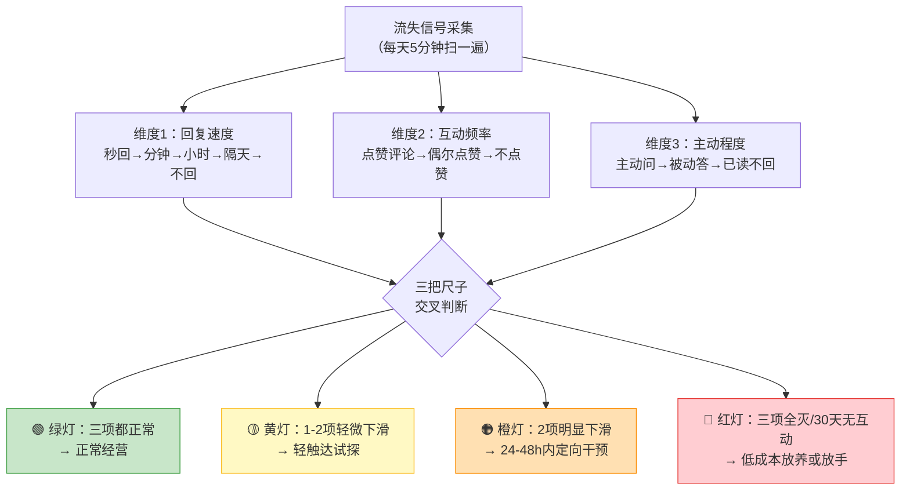
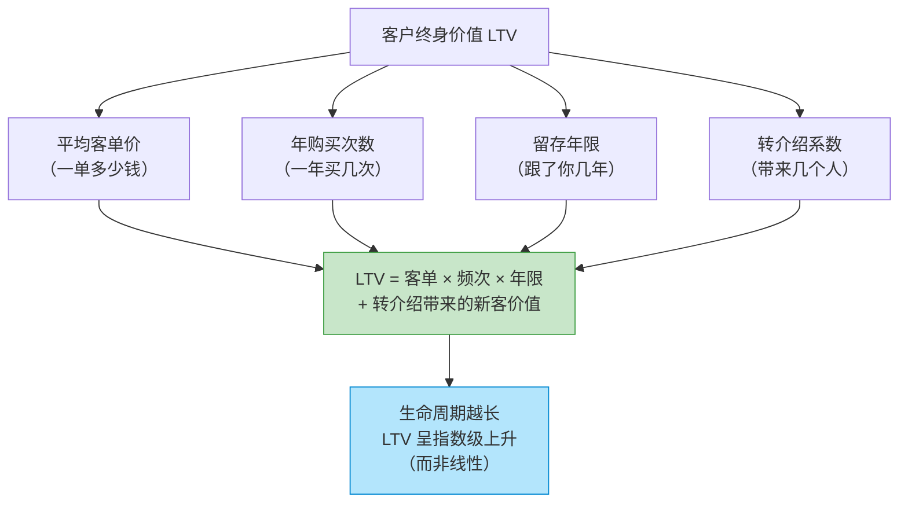
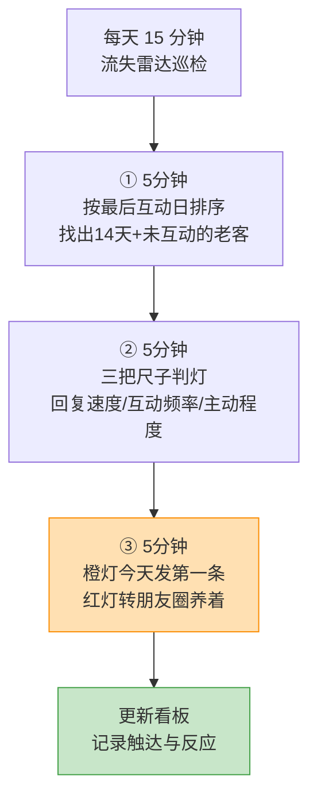

# Day57: 私域客户生命周期管理与流失预警——把客户从「第一次接触」到「沉默流失」的全过程画成一条生命周期曲线，在流失发生前就收到信号、提前干预，让「反生活」的客户池不只进得来、养得熟，还能留得住

> 📅 学习日期：2026-09-17
> 🔗 关联笔记：[[00-目录]] | 上一篇：[[Day56-私域客户分层与精细化运营]] | 下一篇：Day58
> 🎯 适用场景：Day52 到 Day56，老黄的「反生活」已经把一整套私域机器跑起来了——粉导进来了（Day52）、30 天养熟节奏排好了（Day53）、三位一体的内容弹药库备足了（Day54）、内容出厂有合规安检（Day55）、客户还分成了五层精准投喂（Day56）。**但机器一转起来，老黄又撞上了下一个更隐蔽的问题：人来人往，池子看着在涨，真正下单的却总是那么几个；更糟的是，有些明明买过、聊得挺好的人，突然某天就再也不回消息了。** 老黄翻聊天记录才发现——人家不是突然走的，是早有信号：从每天点赞变成偶尔点赞、从秒回变成隔天回、从主动问「有没有新货」变成只回「嗯嗯」……**这些信号全在他眼前滑过去了，因为他从来没把「客户流失」当一件需要监测、预警、干预的事。** 这一篇专门解决「人为什么会悄悄走、怎么在他走之前发现、发现之后怎么拉回来」：给老黄一条**客户生命周期曲线（接触期 → 考察期 → 首购期 → 复购期 → 忠诚期 → 沉默期 → 流失期）**，配上**七级流失预警信号灯**、**分阶段的生命周期经营策略**、**流失挽回的分级话术与投入原则**——把「等客户走了才想起来」升级成「在客户想走的时候就被拦住」，让池子不只进得来、养得熟，还能**留得住、活得久**。

> 📚 学习来源：Day56 客户分层（分层是生命周期管理的骨架）× Day53 30天养熟节奏（养熟节奏决定生命周期速度）× Day45 复购唤醒（生命周期中最重要的一次跃迁）× Day52 私域导流（生命周期的起点质量）× Day54 私域内容体系（生命周期的燃料）× Day55 合规风控（留存的前提是信任）× Day46/47/48 社群与活动（活动是生命周期的加速器）× Day49 私域SOP（生命周期要写进SOP）× Day50/51 复盘体检（流失率是体检核心指标）× Day19 用户心理（人流失的底层是「想起你的理由变少了」）× Day22 私域成交与复购体系（生命周期是复购体系的延长线）× Day24 内容数据分析（数据驱动的流失识别方法）

---

## 1. 一句话总结

**「私域客户生命周期管理」的本质，是承认一个残酷但可管理的事实——客户不是「留下」或「离开」的二元状态，而是一刻不停地在一条从「刚认识」到「彻底沉默」的时间轴上滑动；老黄做的每一个动作，要么在把他往「忠诚」那头推，要么在任由他往「流失」那头滑。** 大多数做私域的人对客户的理解是「静态的」：加了就是我的了，买过就是老客了，躺在微信里就是资产。**但真相是：微信里的每一个人，每天都在做一次无声的「要不要继续留着你」的选择。** 他不删你，不代表他还在；他不说话，不代表他在等你说；而一旦他真的把你从「会看一眼的人」降级成「刷到都不点的人」，你就永远失去了这个客户——**而且你甚至不会收到通知。** 生命周期管理的核心逻辑是：**先承认客户有「阶段」和「寿命」，再承认「流失是有前兆的、前兆是能观测的、观测到是能干预的」**，然后把老黄的运营动作从「想起来就发一发」升级成**「按客户所处阶段配动作 + 按流失信号灯触发干预」**——把「等客户走了才想起来」变成「在客户想走的那一刻就出手」。

**核心认知：** 老黄最容易犯的错，是**把「流失」理解成一个瞬间事件**（「他把我删了」），而实际上是**一个持续数周甚至数月的渐进过程**。用户心理（Day19）给出的底层解释非常朴素：**人流失的根本原因，不是「你的东西不好」，而是「想起你的理由变少了」。** 一个客户从活跃到沉默，中间必然经历「互动减少 → 回复变慢 → 不再主动 → 只被动接收 → 完全静默」这条滑梯——**这条滑梯上的每一格，都是一个可以被观察到的信号，也都是一个可以伸手拉一把的位置。** 麻烦在于，大多数人的注意力只放在「进来的」和「成交的」两头，中间这条滑梯被完全忽略。**生命周期管理的价值，就是给这条滑梯装上感应灯：** 客户滑到第一格时，一条轻触达就能把拉回来；滑到第四格，得用一次有诚意的专属动作才有戏；滑到第七格（彻底静默），挽回成本已经高到不值得做（Day56 的僵尸层就是这个结果）。**所以真正赚钱的不是「挽回」，是「提前拦」——** 每早一格发现，成本低一个数量级，成功率高一个数量级。对老黄的「反生活」来说，私域池是 50 多天辛苦导流 + 养熟攒下来的最核心资产（Day55 已强调过它的价值），**一个老客户的终身价值可能是新客的 5-10 倍**（因为他会复购、会转介绍、不需要再花引流成本）——**留住一个已经信任你的老客，比拉来三个陌生粉更值钱。** 这一篇要装的，就是「让老客不悄悄溜走」的那套雷达和拦截系统。

---

## 2. 核心框架

### 2.1 客户生命周期曲线——七个阶段，一条不能断的接力

老黄的每一个微信好友，都在这条曲线上某个位置，而且**一直在往右滑**（除非有动作往左推）：

```mermaid
flowchart LR
    A["① 接触期<br/>刚加、还没互动"] --> B["② 考察期<br/>在看、在观望"]
    B --> C["③ 首购期<br/>下了第一单"]
    C --> D["④ 复购期<br/>买了第2-3次"]
    D --> E["⑤ 忠诚期<br/>长期复购+转介绍"]
    E --> F["⑥ 沉默期<br/>互动明显减少"]
    F --> G["⑦ 流失期<br/>彻底静默/已删除"]

    F -.->|"⚠️ 唯一能挽回的位置"| E
    G -.->|"❌ 挽回成本极高"| G

    style A fill:#e1f5fe,stroke:#0288d1
    style C fill:#fff9c4,stroke:#fbc02d
    style D fill:#dcedc8,stroke:#7cb342
    style E fill:#c8e6c9,stroke:#43a047
    style F fill:#ffe0b2,stroke:#fb8c00
    style G fill:#ffcdd2,stroke:#e53935
```

| 阶段 | 客户状态 | 老黄的经营目标 | 关键动作 | 危险信号 |
|:----:|:----|:----|:----|:----|
| ① 接触期 | 刚加，0 互动 | 别被删，制造第一次接触 | 轻问候、朋友圈观察 | 加后 7 天零互动 |
| ② 考察期 | 在看内容、在比较 | 给信任、给下单理由 | 痛点内容 + 案例 + 定向沟通 | 看了很久但不问不买 |
| ③ 首购期 | 刚下第一单 | 交付体验做到位 | 售后跟踪、使用指导 | 收货后不反馈 |
| ④ 复购期 | 买过 2-3 次 | 养习惯、拓品类 | 复购邀约、专属推荐 | 第 2 次到第 3 次间隔拉长 |
| ⑤ 忠诚期 | 长期复购或转介绍 | 稳关系、要转介绍 | 专属待遇、荣誉感、共创 | 突然不再主动 |
| ⑥ 沉默期 | 互动显著减少 | **提前拦截，拉回上一段** | 关怀触达、价值唤醒 | 回复从秒回变隔天 |
| ⑦ 流失期 | 已静默 / 已删 | 极低成本偶尔触达或放手 | 朋友圈养着（不私信） | 30 天以上零互动 |

> **给「反生活」的关键：** **这张表最反常识、也最值钱的一列是「危险信号」**——它告诉老黄：客户离开不是从「删好友」开始的，是从「第一次回复变慢」开始的。**而在所有七个阶段里，只有第 ⑥ 沉默期是「还有救且值得救」的黄金挽回窗口**：往前（①②）本来就在推进中，往后（⑦）成本已经倒挂。所以老黄每天真正该盯的不是「今天新加了几个人」，而是**「有哪些人的活跃度在往下掉」**——这一句话，就是整篇笔记的核心。

### 2.2 七级流失预警信号灯——把「感觉他要走」变成「数据说他危险」

老黄不需要复杂系统，靠**回复速度 + 互动频率 + 主动程度**三个可观察维度，就能给每个客户点一盏灯：

| 信号灯 | 判定标准（任一阶段客户） | 判定依据示例 | 干预优先级 | 干预动作 |
|:------:|:----|:----|:----:|:----|
| 🟢 绿灯 | 回复正常、有互动、会主动 | 3 天内回过消息 / 点过赞 | 无需干预 | 按 Day53 常规节奏走 |
| 🟡 黄灯 | 回复变慢但仍有回、互动减少 | 回复从当天变隔天 / 少点赞了 | 低（观察） | 一条无推销的轻问候 |
| 🟠 橙灯 | 连续 2 次冷回复 / 1-2 周无双向互动 | 只回「嗯嗯」「好的」 | **高（48h 内）** | 定向关怀 + 价值内容（不推销） |
| 🔴 红灯 | 30 天零互动 / 私信不回且不点赞 | 发给他的消息都不回 | 停止投入 | 退回朋友圈养着，不私信 |

> **给「反生活」的关键：** **老黄要建立一条铁律——「橙灯 48 小时内必须动，红灯不再私信」。** 为什么是 48 小时？因为客户刚滑到「回复变冷」时，心里其实还有你，只是「没什么非回不可的理由」；这时候一条不谈产品的关心，回复率往往很高。**一旦拖过两周，他的心理账户已经把你归到「可有可无」那一栏了，再发就是打扰。** 而红灯客户（30 天零互动）——**别再私信了**：一方面回复率极低、浪费精力（Day56 已经算过精力账），另一方面频繁私信静默用户容易被判定骚扰、有封号风险（Day55）。**但注意：红灯 ≠ 放弃。** 正确的处理是「降级为朋友圈养着」——万一哪天他刷到你一条内容被戳中，自己就会回来（这就是内容体系 Day54 的隐性复利）。

### 2.3 各阶段的经营策略——把「一刀切节奏」升级成「阶段化接力」

Day53 给了老黄一套 30 天养熟节奏，Day56 给了分层配比。**现在把这两套东西叠到「生命周期」这根时间轴上**，才是完整的：

| 阶段 | 客户最关心什么 | 该给什么内容（接 Day54） | 该用什么话术（接 Day44/52） | 该多久触达一次 |
|:----:|:----|:----|:----|:----|
| ① 接触期 | 你是谁、靠谱吗 | 公开科普 + 生活感 | 朋友式轻问候，零推销 | 跟朋友圈，不私信 |
| ② 考察期 | 这东西对我有用吗 | 痛点内容 + 真实案例 + 成分说明 | 顾问式给建议，不谈价 | 每周 1 次定向 |
| ③ 首购期 | 我买对了吗、怎么用 | 使用指导 + 收货关怀 | 贴心售后式 | 收货后 3 次跟踪 |
| ④ 复购期 | 还有什么值得买 | 专属推荐 + 组合搭配 | 老友式推荐 | 每 2 周 1 次 |
| ⑤ 忠诚期 | 我被当回事吗 | 优先购 + 内测 + 共创 | 合伙人式讲感情 | 主动、随时 |
| ⑥ 沉默期 | 还值得理你吗 | **不谈产品，只给价值** | 纯关怀 + 有用信息 | 1 次，看反应 |
| ⑦ 流失期 | —（已不在意） | 朋友圈内容顺带覆盖 | 不私信 | 无 |

> **给「反生活」的关键：** **注意 ⑥ 沉默期那一行的内容策略——「不谈产品，只给价值」是化解流失的唯一钥匙。** 客户沉默的原因往往是「你每次找我都是要卖我东西」（Day19：人只关心跟自己相关的事）。**所以挽回的第一条消息必须「零商业意图」**——分享一个换季养护的小提醒、发一篇他可能感兴趣的内容、甚至只是问一句「最近状态怎么样」。**只有让他觉得「这个人找我，不一定为了卖货」，关系才可能重新变暖。** 一旦第一条挽回消息里带促销，等于亲手把橙灯按成红灯。

### 2.4 客户终身价值（LTV）——为什么「留人」比「拉人」划算得多

老黄做生命周期管理，最终是为了这个数：

| 维度 | 怎么提升 | 生命周期管理的作用 |
|:----:|:----|:----|
| 客单价 | 组合推荐、升级款（Day41 排品逻辑） | 复购期/忠诚期专推高单价 |
| 购买频次 | 复购邀约、定期提醒（Day45） | 缩短每次购买的间隔 |
| **留存年限** | **防止流失、延长寿命** | **本篇核心——直接决定 LTV 上限** |
| 转介绍系数 | 专属待遇、荣誉感（Day56 铁杆层） | 忠诚期客户的裂变动作 |

> **给「反生活」的关键账本：** 假设老黄的客户平均客单 100 元、一年买 4 次——**如果他只留存 1 年，LTV = 400 元；如果能留存 3 年，LTV = 1200 元。** 也就是说，**生命周期从 1 年做到 3 年，一个客户的终身价值直接翻三倍，而老黄为此付出的额外成本几乎为零**（人已经在池子里了，不需要再花引流成本）。反过来，一个已经买过三次的老客流失，损失不是「少一单」，是**损失了他未来可能贡献的全部 800 元 + 他可能带来的转介绍**。**这就是「留人」的财务逻辑：拉新要花钱，留存只花心思，而后者的回报更高。**

---

## 3. 可落地方法

### 3.1 【反生活可直接用】生命周期看板——一张表看清池子健康度

在 Day56 的客户台账基础上，加三列就能管住生命周期：

| 客户 | 分层 (Day56) | **所处阶段** | **最后互动日** | **信号灯** | **LTV 预估** | 下一步动作 | 待办 |
|:----|:--:|:--:|:--:|:--:|:--:|:----|:--:|
| 小A | 02问价 A | ② 考察期 | 9-16 | 🟢 | ¥600 | 本周给体验装建议 | 9-19 |
| 小B | 03首单 B | ③ 首购期 | 9-15 | 🟢 | ¥400 | 9-18 收货满 7 天邀复购 | 9-18 |
| 小C | 04复购 A | ④ 复购期 | 9-14 | 🟢 | ¥1500 | 9-20 推组合装 | 9-20 |
| 小D | 04复购 A | **⑥ 沉默期** | **9-01** | **🟠** | ¥1200 | **48h 内发一条无推销关怀** | **9-18** |
| 小E | 05铁杆 A | ⑤ 忠诚期 | 9-17 | 🟢 | ¥3000 | 邀入共创群、谈转介绍 | 9-21 |
| 小F | 00陌生 C | ① 接触期 | 9-12 | 🟡 | — | 观察到信号再轻互动 | — |

> **操作：** **「最后互动日」是这张表的灵魂——它就是老黄的生命周期雷达。** 每天开工只做一件事：**按「最后互动日」倒序排列，看最长时间没互动的那几个是谁、在哪一层、值不值得救。** 超过 14 天没互动的、阶段在 ③-⑤ 的客户（即已经买过的老客），全部标橙灯、进当天待办。这个动作每天只要 3 分钟，但能挡住老黄 80% 的老客流失。

### 3.2 【反生活可直接用】分阶段「续命」触达动作库

每个阶段准备一个「续命动作」，到点就执行，不用临时想：

**① 接触期 → 考察期（破冰续命）**
> 「看到你之前点了赞，谢谢你呀～最近换季，你平时会注意些什么养护吗？」（Day52 话术复用）

**② 考察期 → 首购期（给理由续命）**
> 「上次你问的那款，我自己这两天也在喝，把我们平时的搭配思路整理给你参考下～」

**③ 首购期 → 复购期（售后续命，最关键的一跃）**
> 收货 3 天：「收到货了吧？有人第一次不知道怎么用，我发你个简单的用法～喝着有什么感觉随时跟我说」
> 收货 7 天：「上次那份快喝完了吧？这周有个小份组合，想接着用的可以跟我说一声」

**④ 复购期 → 忠诚期（专属续命）**
> 「你算是我们的老朋友了，我这边新拿了款还没公开的，先给你留一份试试？」

**⑤/⑥ 沉默期拦截（零推销续命，本篇核心）**
> 第 1 条（48h 内，纯关怀）：「有阵子没见你了，最近状态怎么样？换季这几天我自己也有点不适应，你要是有什么想聊的随时找我，别客气」
> 第 2 条（3-5 天后，给价值）：「看到一篇讲换季饮食的记录，想起你之前提过睡不好，发你留个参考～」（**绝不带任何产品链接**）
> 第 3 条（再 5 天，给台阶）：「最近我们这边上了个新的小组合，不着急买，就是想着你可能用得上，跟你提一句」（**轻提，不催**）

> **操作：** 把这段存成备忘录。**铁律：挽回消息最多发 3 条，每条间隔 3-5 天，且第 1 条必须零商业意图。** 3 条无回应 → 转入红灯，退回朋友圈养着，不再私信。

### 3.3 【反生活可直接用】每日 15 分钟流失雷达巡检（写进 Day49 的 SOP）

| 时段 | 时长 | 动作 | 判定规则 |
|:----:|:----:|:----|:----|
| ① | 5 min | 排序找「沉睡老客」 | 已买过 + 14 天无互动 = 优先看 |
| ② | 5 min | 点灯 | 三项信号交叉判 🟢🟡🟠🔴 |
| ③ | 5 min | 干预 | 🟠 今天发第 1 条；🔴 只发朋友圈 |

> **操作：** 这个巡检接在 Day56 的「每日分层作业」之后，总共 75 分钟搞定全池运营。**注意顺序：先做「拦截」（挽回快流失的老客，性价比最高），再做「推进」（开发新客户）。** 因为挽回一个老客的成功率远高于转化一个陌生粉，而老客的 LTV 已经验证过。

### 3.4 【反生活可直接用】流失复盘四问——每次真流失都要归因

客户真走了（删除/半年静默），花 5 分钟填这四问：

| 问题 | 排查方向 | 常见根因 |
|:----|:----|:----|
| ① 他在哪一阶段走的？ | 回看台账阶段记录 | 多数流失发生在 ③ 首购期（售后没做好） |
| ② 走之前有什么信号？ | 回看最后互动日/回复变化 | 信号出现过但没被识别 → 雷达失灵 |
| ③ 我做错了什么？ | 回看最后 3 次触达内容 | 全是推销 / 消息太频繁 / 产品体验问题 |
| ④ 这类客户走了几个？ | 按来源/分层统计 | 若集中在某来源或某产品 → 系统性问题 |

> **操作：** **每季度做一次集中归因。** 如果发现流失集中在「首购后 30 天内」，说明售后跟踪（③→④ 那一跃）出了问题，回去改 Day45 的复购邀约节奏；如果集中在「某款产品买过的人」，说明产品本身有问题，跟运营无关——**归因的价值就是分清「是我没服务好」还是「是产品不行」，别把产品问题当成运营问题一直死磕。**

### 3.5 生命周期健康度看板——接进 Day50/51 的体检表

| 指标 | 怎么算 | 反映什么 | 健康线 |
|:----|:----|:----|:----|
| 阶段分布 | 各阶段人数统计 | 池子结构是否健康 | ②③④⑤ 应占 40%+ |
| **月流失率** | 本月静默数 / 月初总人数 | 池子是否在漏水 | ≤ 10% |
| **老客留存率** | 3 个月后仍活跃的买过的人 / 3 个月前买过的人 | 售后服务是否过硬 | ≥ 60% |
| 沉默→活跃唤醒率 | 橙灯客户中被拉回的比例 | 挽回话术是否有效 | ≥ 20% |
| 平均生命周期 | 客户从接触到静默的平均天数 | 关系是否越做越深 | 逐季上升 |
| 平均 LTV | 客户累计消费均值 | 生意的天花板 | 逐季上升 |

> **操作：** 每月末 15 分钟填。**最该盯的两个数是「月流失率」和「老客留存率」**——如果流失率超过 15%，说明前端导流来的粉质量差或养熟节奏太急（回头查 Day52/53）；如果老客留存率低于 50%，说明产品/售后有硬伤（这是最危险的信号，比流量少严重得多）。

---

## 4. 变现路径

生命周期管理**不带来新流量，但它决定了「你所有的流量能变现多久」**——这是私域里回报周期最长、也最被低估的一笔：

| 变现维度 | 怎么赚 | 大概能到哪个量级 | 关联笔记 |
|:----:|:----|:----|:----|
| 💰 LTV 倍增 | 留存年限从 1 年做到 3 年，单客户价值翻 3 倍 | 同等客户数下收入 ×3 | Day22/Day56 |
| 💰 唤醒沉睡老客 | 橙灯拦截把本要流失的老客拉回下单 | 每个唤醒客户贡献 1-3 单 | Day45 |
| 💰 降低获客成本 | 老客留存替代一部分拉新需求 | 获客成本实际下降 30%+ | Day52 |
| 💰 转介绍释放 | 忠诚期客户的裂变只有在长期留存下才发生 | 每个铁杆带 1-3 人 | Day56 |
| 💰 抗波动能力 | 有稳定老客的池子不依赖单次爆款 | 收入曲线更平滑 | Day50/Day51 |
| 💰 定价能力 | 深度信任的老客对价格不敏感 | 高单价组合更容易卖出 | Day41/Day44 |

> 给「反生活」的一句话账本：**老黄的生意能不能从「月入几千」走到「月入过万」，瓶颈不在「能不能拉来更多人」，而在「拉来的人能留多久」。** 假设老黄有 500 个有效粉：如果月流失率 20%，一年后池子里的老客基本换了一遍，永远在「从零开始」；如果月流失率控制在 8%，一年后池子里有 180+ 个跟了你一整年的老客——**这批人每人每年贡献 400-1200 元，就是 7-20 万的年收入底盘**，而且是「不需要再花广告费」的确定收入。这就是从「流量生意」升级到「客户资产生意」的分水岭。**记住：Day52-56 解决的是「怎么把人弄进来并养好」，Day57 解决的是「怎么让人不跑」——前者决定增长，后者决定盈利。**

---

## 5. 行动清单

### ✅ 行动①:给现有客户做一次「生命周期定位 + 点灯」(今天做)

**步骤1(20分钟):** 打开 Day56 的客户台账，给每个客户标上「所处阶段 + 最后互动日」两列。
**步骤2(10分钟):** 用 3.2 的三把尺子给每个已买过的客户点灯（🟢🟡🟠🔴）。
**步骤3(10分钟):** 数出各阶段人数和红灯/橙灯人数，算出当前「月流失率」估算值。

> **产出：** ✅ 一张带阶段和信号灯的生命周期看板 —— 从此老黄第一次能「看见」谁正在悄悄溜走，而不是等他删了你才发现。

### ✅ 行动②:今天 48 小时内救回 3 个橙灯老客(今天做)

**步骤1(10分钟):** 从看板挑出 3 个「已买过 + 14 天以上无互动」的橙灯客户。
**步骤2(20分钟):** 用 3.2 的「零推销关怀话术」发第 1 条消息（**不许提产品、不许提促销**）。
**步骤3(5分钟):** 在看板上记录触达时间；设 3 天后的提醒，无回应再发第 2 条（给价值那条）。

> **产出：** ✅ 3 条无商业意图的关怀消息 + 至少 1 个重新回话的老客 —— 直接验证「提前拦比事后挽回有效」，也验证「不谈产品反而更容易破冰」。

### ✅ 行动③:把流失雷达写进每日 SOP 与月度体检(持续做)

**步骤1(10分钟):** 把 3.3 的「15 分钟流失雷达巡检」加进老黄的每日流程（接 Day49 SOP，排在 Day56 分层作业之后）。
**步骤2(10分钟):** 把 3.5 的健康度看板加进月度体检表（接 Day50/51）。
**步骤3(每季度1次):** 做 3.4 的「流失复盘四问」集中归因，若流失集中在某阶段或某产品，分别回查 Day45 复购节奏或产品本身。

> **产出：** ✅ 一套「每天扫信号 + 每月看指标 + 每季做归因」的完整留存闭环 —— 让「反生活」的私域池从「进得来、养得熟」升级到「留得住、活得久」，为 Day51 定的「私域放大与规模化」方向提供最关键的底座：**池子先能留住人，放量引流才有意义。**

---

## 📊 今日学习总结

| 维度 | 内容 |
|:----:|------|
| 核心认知 | 客户不是「留或走」的二元状态，而是持续在生命周期曲线上滑动；流失不是瞬间事件而是渐进过程；人流失的根本原因是「想起你的理由变少了」；沉默期是唯一「还有救且值得救」的黄金窗口；留住一个老客比拉来三个新粉更值钱 |
| 核心框架 | 七阶段客户生命周期曲线 × 七级流失预警信号灯（回复速度/互动频率/主动程度三把尺子）× 阶段化经营策略表 × 客户终身价值 LTV 四因子模型 |
| 关键技能 | 生命周期看板（最后互动日 = 雷达）、三把尺子点灯法、分阶段续命话术库、15 分钟流失雷达巡检、流失复盘四问、健康度指标看板 |
| 变现路径 | LTV 倍增（留存年限 ×3 → 收入 ×3）、唤醒沉睡老客、降低获客成本、释放转介绍、抗波动、提升定价能力 |
| 今日行动 | ① 全量客户阶段定位 + 点灯 ② 48h 内零推销关怀救回 3 个橙灯老客 ③ 把流失雷达写进每日 SOP 与月度体检 |

> 下一篇预告：**Day58: 私域精细化运营的自动化与工具化——当分层、节奏、内容、雷达这几套体系都跑起来之后，一个人怎么用工具（微信标签/自动化提醒/表格系统/AI 辅助）把它们串成半自动流水线，把老黄从「每天手工伺候」里解放出来，让「反生活」能靠更少的人力跑更多的客户。**

---

## 📌 关联笔记一览

| 关联主题 | 笔记链接 |
|:----|:----|
| 目录/进度 | [[00-目录]] |
| 上一篇(客户分层与精细化运营) | [[Day56-私域客户分层与精细化运营]] |
| 私域导流(生命周期的起点质量) | [[Day52-小红书私域导流话术全栈实战]] |
| 30天养熟节奏(决定生命周期速度) | [[Day53-微信承接后的30天养熟节奏设计]] |
| 私域内容体系(生命周期的燃料) | [[Day54-私域高价值内容体系搭建]] |
| 合规风控(留存的前提是信任) | [[Day55-私域内容合规与信任风险防控]] |
| 复购唤醒(生命周期最关键的一跃) | [[Day45-私域成交后客户关系经营与复购唤醒]] |
| 私域成交话术与逼单(沉默期反向参考) | [[Day44-私域成交话术与逼单心理学]] |
| 私域成交SOP(流失雷达写进SOP) | [[Day49-私域成交标准作业流程SOP]] |
| 复盘与SOP迭代(健康度进体检表) | [[Day50-复盘与SOP迭代升级]] |
| 收官体检(私域放大是主攻方向) | [[Day51-阶段收官总复盘与经营体检]] |
| 私域成交与复购体系(生命周期是复购延长线) | [[Day22-私域成交与复购体系设计]] |
| 用户心理(流失=想起你的理由变少) | [[Day19-用户心理与行为设计]] |
| 社群精细化运营(群内也要防流失) | [[Day46-私域社群精细化运营]] |
| 社群活动策划(活动是生命周期加速器) | [[Day47-私域社群活动策划与促销转化]] |

> 🔗 反生活适用标注：本篇整套「生命周期曲线 + 七级信号灯 + 阶段化策略 + 15 分钟雷达巡检」围绕「反生活」好物养生账号「单人手工运营、靠长期信任与复购成交、老客 LTV 远高于新客」的属性设计——用「最后互动日」当雷达发现正在溜走的老客，用「零推销关怀」当钥匙在沉默期提前拦截，用「阶段化续命话术」把每个客户从低阶段推到高阶段，用 LTV 四因子模型算清「留人比拉人划算」这笔账，完全贴合养生垂类「慢养、长线、靠老客滚雪球」的经营逻辑，可直接套用。
