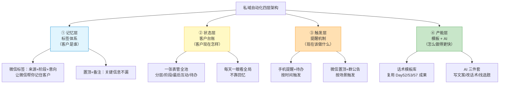
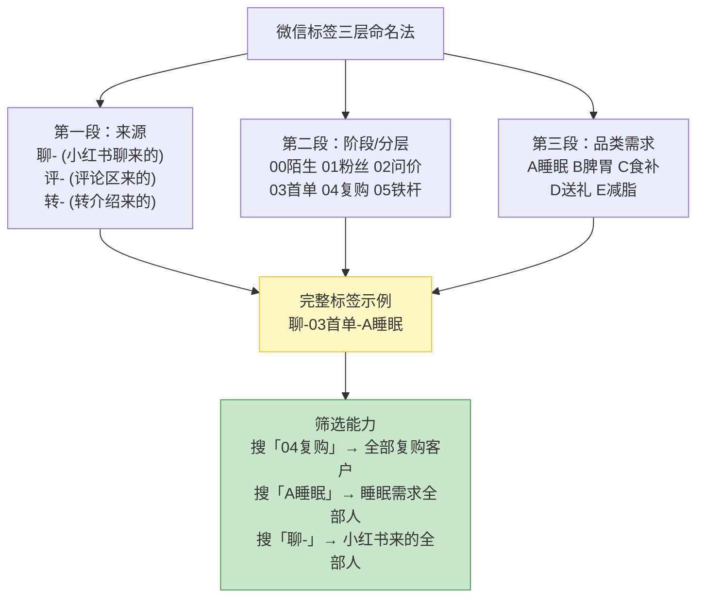
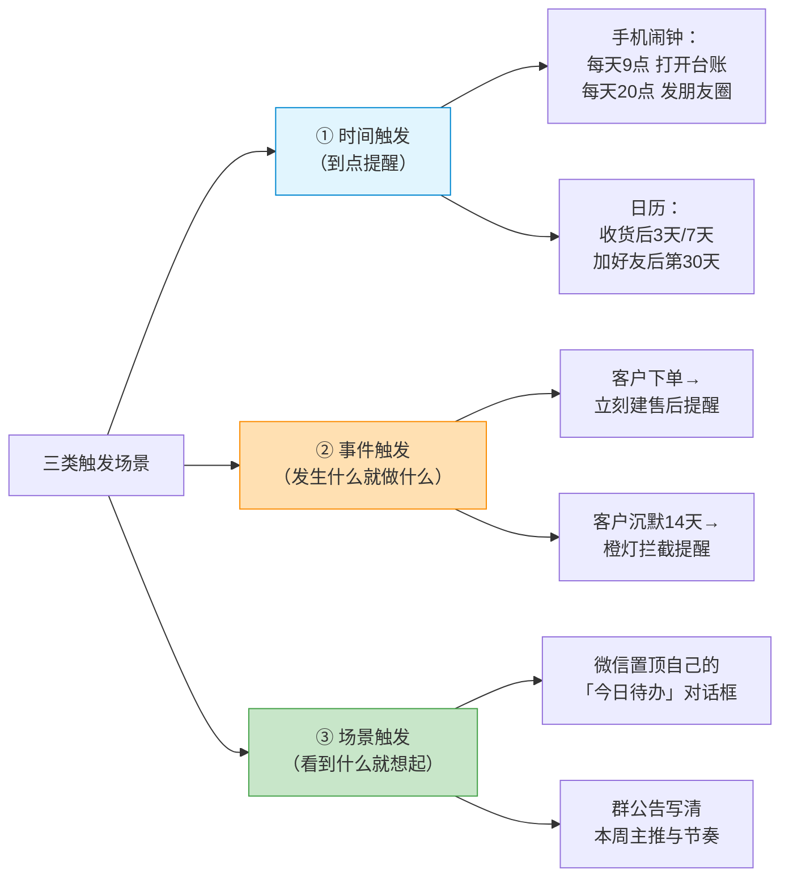
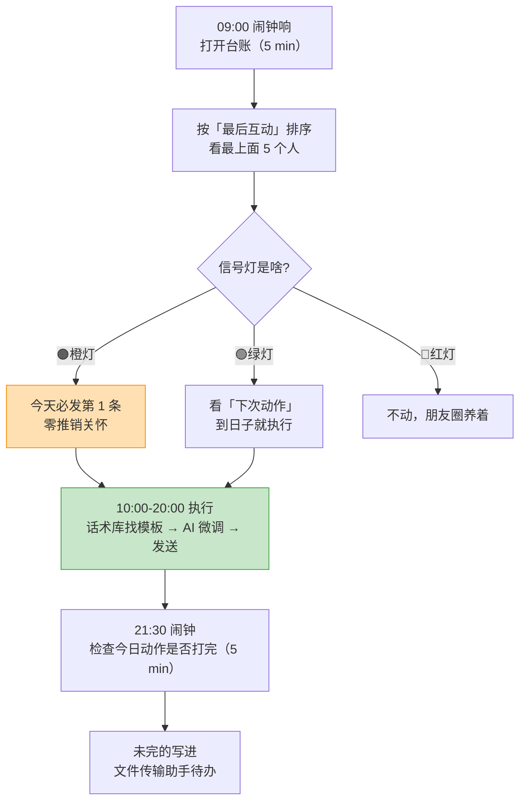

# Day58: 私域精细化运营的自动化与工具化——把分层、养熟节奏、内容、流失雷达四套体系用「标签 × 表格 × 省事提醒 × AI」串成一条半自动流水线，让一个人也能稳稳养活几百个客户

> 📅 学习日期：2026-09-18
> 🔗 关联笔记：[[00-目录]] | 上一篇：[[Day57-私域客户生命周期管理与流失预警]] | 下一篇：Day59
> 🎯 适用场景：Day52 到 Day57，老黄的「反生活」已经把私域这台机器完整装好了——粉从小红书导进微信（Day52）、30 天养熟节奏排好了（Day53）、朋友圈+社群+一对一的内容弹药库备足（Day54）、内容出厂有合规安检（Day55）、客户分成五层精准投喂（Day56）、流失雷达每天扫一遍（Day57）。**但机器装好之后，老黄发现自己被机器绑住了。** 每天要干的事变成了一串手工活儿：翻微信标签看看今天该找谁、翻聊天记录确认上次聊到哪、翻朋友圈决定今天发哪条、翻 Day57 的看板点灯、翻待办确认谁 48 小时内要拦——**每一件都不难，但加起来是每天两三个小时的重复劳动，而且只要有一天状态不好、或者出门在外，整套体系当天就整个停摆。** 更危险的是：这套「人肉驱动」的系统有个致命上限——**当客户从 200 涨到 500、1000 时，老黄一个小时都忙不过来了。** 这一篇专门解决「怎么让这套体系自己跑起来」：给老黄一套**标签体系**（让微信自己记住客户是谁）、一套**一张表管全池的客户台账**（让状态自己浮出水面）、一套**省事提醒机制**（让该做的事自己跳出来）、一套**AI 辅助用法**（让最耗时的三件事——写文案、写话术、找选题——从小时级降到分钟级），最终把「每天 2 小时手工伺候」压到「每天 15 分钟看板 + 做决策」——**让「反生活」从「一个人能管 200 人」升级到「一个人能管 500-1000 人」。**

> 📚 学习来源：Day56 客户分层（标签体系是分层的落地载体）× Day57 生命周期与流失雷达（自动化最该自动化的就是雷达巡检）× Day53 30天养熟节奏（节奏进提醒系统才跑得起来）× Day54 私域内容体系（内容库 + AI 是产能杠杆）× Day52 私域导流话术（话术库的复用与 AI 改写）× Day49 私域成交SOP（SOP 是自动化的脚本）× Day50 复盘与SOP迭代（工具用起来的唯一判据是效率提升）× Day28 内容工业化生产（AI 流水线的底层逻辑）× Day21 AI与内容创作融合（AI 工具的实操经验）× Day24 内容数据分析（台账 = 数据源）× Day51 阶段收官体检（单点瓶颈诊断）

---

## 1. 一句话总结

**「私域运营自动化」的本质，不是去买一套 CRM 系统，而是承认一件事——一个单人运营的账号，它的产能上限不取决于老黄有多能干，而取决于「有多少工作量是不需要老黄本人出现的」。** 老黄每天的工作可以粗暴拆成两类：**「判断类」**（谁值得投入、这条内容该不该发、这个客户怎么接）和 **「搬运类」**（记住谁是谁、记住上次聊到哪、记住今天该找谁、把同一套话术改一改用在不同人身上）。**这两类工作的性价比差着数量级：判断类是不可替代的，直接决定生意天花板；搬运类是纯粹的损耗，做得再多也不增值。** 而绝大多数做私域的人，**八成时间都耗在搬运上**——翻标签、翻记录、翻待办、临时想话术——**不是因为他们不聪明，是因为他们没有把这套「记忆」和「触发」的工作从脑子里外包出去，全都装在自己这个 24 小时会衰减、会累、会忘的人脑里。** 自动化的核心逻辑只有一句话：**把「记住」外包给标签，把「状态」外包给表格，把「该做什么」外包给提醒，把「从零到一」外包给模板和 AI——老黄本人只保留「判断」和「温度」这两件机器干不了的事。** 做完之后，老黄每天的私域工作时间应该从 2 小时压到 15-30 分钟，而且**这 15 分钟里的每一分钟都在做真正值钱的决策，而不是在做记忆检索。**

**核心认知：** 老黄最该纠正的误解，是**把「自动化」等同于「买工具」**。市面上那些 CRM 系统、SCRM 工具，动不动几千块一年，功能一大堆，但**对一个月流水几千块的单人账号来说，90% 的功能一辈子用不到，而它带来的最大成本不是钱，是「学习成本」和「依赖成本」**——系统崩了、涨价了、改版了，老黄的生意就跟着抖。**真正适合单人账号的自动化，是用已经在手里的工具（微信自带标签 + 一个表格 + 手机自带提醒 + 免费 AI），把流程固定下来、把动作变成清单。** 微信标签免费、Excel/飞书表格免费、手机提醒免费、AI 助手一个月几十块——**总成本近乎为零，而且这些工具老黄本来就在用，学习成本几乎为零。** 这套东西虽然「土」，但它有一个 CRUD 系统比不了的优点：**它是老黄完全掌控的，可以随时改，而且改起来不用求任何人。** 第二个要纠正的误解是**「自动化 = 自动回复机器人」**。恰恰相反——**在私域里，最不该自动化的就是「沟通」本身。** 客户能感觉到对面是不是真人，一句模板化的自动回复足以毁掉 Day52-Day54 攒下的信任（Day55 已强调过信任是私域的地基）。**自动化该做的是「提醒老黄去沟通」，而不是「代替老黄沟通」。** 记住这条分界线：**流程自动化、沟通手工化。** 老黄可以有自动提醒，不能有自动问候。第三点是**「先有流程，才谈工具」**——Day49 已经把 SOP 写好了，Day53-57 把节奏和雷达也定好了，**现在这一步不是重新设计流程，是把已经跑通的流程「翻译」成工具里的动作**。顺序搞反（先去研究工具、再想怎么用）是最常见的浪费，因为没有流程的工具就是一堆空字段。

---

## 2. 核心框架

### 2.1 自动化四层架构——从「记在脑子里」到「长在系统里」

老黄要外包出去的东西，按优先级分四层，从下往上建：

| 层 | 外包的是什么 | 用什么工具 | 老黄省下的 | 建造成本 |
|:--:|:----|:----|:----|:--:|
| ① 记忆层 | 「这个人是谁、从哪来、走到哪一步」 | 微信标签 + 备注 + 置顶 | 每天 20 分钟翻记录 | 2 小时（一次性） |
| ② 状态层 | 「我全池现在什么状况」 | 一个表格（飞书/Excel） | 每天 15 分钟回忆 | 1 小时（一次性） |
| ③ 触发层 | 「今天该找谁、该发什么」 | 手机提醒 + 日历 + 待办清单 | 每天 30 分钟决定 | 40 分钟（一次性） |
| ④ 产能层 | 「从零写文案/话术/选题」 | 模板库 + AI 助手 | 每天 1 小时创作 | 3 小时（一次性） |

> **给「反生活」的关键：** **这四层的总建造成本约 7 小时，一次性投入，换来的是每天省 2 小时。** 也就是说——**第一周就回本了。** 老黄最该记住的是这个投入产出比：不是「等有空再弄」，而是「弄完就有空」。**建议按顺序建，不要跳**：标签（①）是地基，因为台账（②）和提醒（③）里的每一条都以标签为索引；而模板和 AI（④）反过来要用到台账里的客户信息。**顺序搞错会返工。** 另外，**四层里回报最高的是 ③ 触发层**——因为「忘了做」是老黄最大的隐性损失（Day57 的橙灯 48 小时窗口，错过就没了），而提醒机制几乎是零成本，一个手机闹钟就能救回一单。

### 2.2 标签体系设计——让微信自己记住你的客户

微信标签是老黄能用的**最便宜、最稳定的数据库**。关键在于**标签的命名规则要能「一看就懂、一搜就出来」**：

**标签与 Day56 分层的对应表（直接照抄）：**

| 标签前缀 | 含义 | 对应 Day56 分层 | 该配什么动作 | 多少人算健康 |
|:--:|:----|:----|:----|:--:|
| 00陌生 | 加了没说过话 | 陌生层 | 只养朋友圈，不私信 | 占比可高 |
| 01粉丝 | 聊过但没问价 | 泛粉层 | 每周 1 次价值内容 | 20-30% |
| 02问价 | 问过价格没成交 | 意向层 | 重点跟进，给理由 | 10-20% |
| 03首单 | 买过 1 次 | 首购层 | 售后跟踪（最关键的窗口） | 10-15% |
| 04复购 | 买过 2-3 次 | 复购层 | 专属推荐 + 组合 | 10-15% |
| 05铁杆 | 长期买 + 转介绍 | 铁杆层 | 专属待遇 + 共创 | 3-8% |

> **给「反生活」的关键：** **标签里最值钱的是「来源」那一段，但 99% 的人都不打。** 为什么？因为**来源决定了这个客户的信任起点和转化难度**——「转-」（老客介绍来的）几乎不用破冰，一句话就能进正题；「聊-」（小红书私信来的）已经有内容铺垫，信任中等；「评-」（评论区随机来的）信任最低，需要重新养。**老黄按来源分开发力，同样的时间效率能差 2-3 倍。** 另外，**打标签这个动作必须「当场做」，绝不能「回头补」**——加上好友的那 10 秒顺手打第三个标签，成本几乎为零；等三天后想补，就得翻聊天记录，成本变成 10 倍，而且大概率会放弃。**TagsGet 铁律：加好友 = 打标签，绑在一起，不允许分开。** 老黄可以把它写进 Day52 的导流话术收尾动作里（「加完之后立刻打标签」）。

### 2.3 客户台账——一张表管住全池状态

Day56/57 已经有了台账的雏形（分层 + 生命周期 + 信号灯），**现在把它定型成一张「每天早上打开就看」的表**：

| 客户昵称 | 标签 | 来源 | 分层 | 阶段 | 最后互动 | 信号灯 | 下次动作 | 动作日期 | 累计消费 |
|:----|:--|:--:|:--:|:--:|:--:|:--:|:----|:--:|:--:|
| 小A | 聊-02问价-A | 小红书 | 02问价 | ②考察期 | 09-16 | 🟢 | 发体验装建议 | 09-19 | ¥0 |
| 小B | 转-03首单-A | 老客介绍 | 03首单 | ③首购期 | 09-15 | 🟢 | 收货 7 天邀复购 | 09-18 | ¥128 |
| 小C | 聊-04复购-B | 小红书 | 04复购 | ④复购期 | 09-14 | 🟢 | 推组合装 | 09-20 | ¥520 |
| 小D | 评-04复购-A | 评论区 | 04复购 | **⑥沉默期** | **09-01** | **🟠** | **48h 零推销关怀** | **09-18** | ¥460 |
| 小E | 转-05铁杆-C | 老客介绍 | 05铁杆 | ⑤忠诚期 | 09-17 | 🟢 | 邀共创群 | 09-21 | ¥2380 |

> **给「反生活」的关键：** **这张表的核心不是「记录」，是「排序」。** 老黄每天早上只做一件事——**按「最后互动」这列从旧到新排一遍，看最上面那 5 个人**。这 5 个人就是当天最该动的 5 个人（大概率就是 Day57 说的橙灯老客）。**其余 200 个人不用看，看了也是浪费时间。** 这就是「一张表」真正的价值：**把「我该关心谁」这个判断，从「随机想起来」变成「排序自动浮上来」。** 另外三个使用要点：① **表格要放在手机能一键打开的地方**（飞书/腾讯文档，别放电脑桌面）；② **"下次动作"和"动作日期"必须填**，没填的动作等于没计划；③ **表格不是给客户看的，别追求记录完整**——只记能驱动动作的字段，其余一律不填，**字段越多，维护越累，越容易放弃**。

### 2.4 提醒机制——让「该做的事」自己跳出来

老黄的遗忘是最大的隐性损失，而**提醒是最便宜的保险**：

**老黄的「三闹钟 + 一置顶」极简配置：**

| 触发方式 | 内容 | 触发时点 | 成本 |
|:----|:----|:----|:--:|
| ⏰ 闹钟1 | 打开台账、按最后互动排序、点灯 | 每天 09:00（5 分钟） | 0 |
| ⏰ 闹钟2 | 发朋友圈（Day54 内容体系） | 每天 20:00（10 分钟） | 0 |
| ⏰ 闹钟3 | 检查当日「下次动作」是否做完 | 每天 21:30（5 分钟） | 0 |
| 📌 置顶 | 「文件传输助手」当私人待办本：想到什么往里发一句 | 随时 | 0 |
| 📅 日历 | 收货后 3 天 / 7 天 售后提醒（下单时立刻建） | 按事件 | 0 |

> **给「反生活」的关键：** **这套东西总成本为零，但它解决的问题价值上万元。** 老黄想想 Day57 那条铁律——「橙灯 48 小时内必须动」——**靠记性，这条铁律的遵守率大概三成；靠一个 21:30 的闹钟，遵守率能到九成。** 差别就在于「想到」和「被提醒」之间的距离。**特别推荐「文件传输助手当待办本」这一招**：微信里随时发一句「明天问小D睡得怎么样」，第二天打开就能看到。比任何待办 App 都省事——**因为它就在老黄每天要看 50 次的那个 App 里。**

### 2.5 模板与 AI——把「从零创作」变成「填空 + 改写」

这是回报最大的一层，因为它直接砍掉老黄每天最耗时的 1 小时：

| 任务 | 从零做要多久 | 有模板/AI 后 | 提效倍数 |
|:----|:--:|:--:|:--:|
| 写一条朋友圈 | 20-30 分钟 | 5 分钟（选模板填空） | 4-6× |
| 回一个客户的问题 | 5-10 分钟 | 1 分钟（话术库找 + 微调） | 5-10× |
| 写一篇小红书笔记 | 1-2 小时 | 20 分钟（AI 出框架 + 人润色） | 3-5× |
| 找 10 个选题 | 1 小时 | 10 分钟（AI 批量生成 + 人筛） | 6× |
| 做一张封面/配图 | 30 分钟 | 5 分钟（AI 生图，Day14 工具） | 6× |

**老黄的「AI 三件套」用法（每个都配好固定提示词）：**

**① 写文案（小红书笔记初稿）**
> 提示词模板：「你是养生好物赛道的资深小红书博主。请针对【节气/痛点】写一篇 300 字笔记，人群是 25-40 岁关注养生的女性，要求：① 开头 3 秒用痛点抓人 ② 中间有个人真实体验感 ③ 结尾不硬推产品，只给一个小建议 ④ 语气像朋友聊天，不要广告腔。不许出现『最』『根治』『疗效』这类词。」

**② 改话术（把通用话术改成针对某个客户的）**
> 提示词模板：「这是我的客户情况：【分层=04复购，需求=睡眠，上次买过XX，最后互动是 9-01，最近回复变慢】。这是我原来的关怀话术：【…】。请帮我改成一条更贴合他情况的、零推销意图的微信消息，80 字以内，语气像熟人，不要提产品。」

**③ 找选题（补充内容日历）**
> 提示词模板：「我是养生好物账号，现在【季节/节点】。请给我 15 个小红书选题，要求：① 都是用户会主动搜的具体问题 ② 每个选题附上核心关键词 ③ 避开医疗和疗效宣称 ④ 优先『怎么做』类而非『是什么』类。用表格输出。」

> **给「反生活」的关键：** **AI 的定位是「一稿机器」，不是「终稿机器」。** 老黄必须保留最后一道人工润色——**加上自己的口癖、加上具体到某一天的细节（「昨天我家…」）、删掉一切 AI 腔（「总之」「综上」「让我们一起」）**。原因不只是「像不像人」，而是**平台和用户都能识别 AI 味，而养生赛道的核心竞争力恰恰是「真实感」**。另外一条硬规矩：**AI 出的所有内容，必须过一遍 Day55 的合规三红线（功效承诺 / 绝对化用语 / 过度营销）**——AI 特别爱写「有效改善」「最养生」，这是它的默认倾向，老黄要专门检查这几个词。

---

## 3. 可落地方法

### 3.1 【反生活可直接用】7 小时搭建计划——四层一次性建好

把 2.1 的四层拆成可执行的一周任务，**每天只花 1 小时**：

| 天 | 时段 | 建什么 | 具体动作 | 产出 |
|:--:|:--:|:----|:----|:----|
| D1 | 60 min | ① 标签体系 | 打开微信→通讯录→标签→新建 6 个分层标签 + 来源标签；给现有全部好友逐个打标签 | 全池打完标签 |
| D2 | 60 min | ② 台账骨架 | 新建飞书/腾讯表格，按下表建 10 列，从微信标签批量录入现有客户 | 台账 v1 |
| D3 | 40 min | ③ 提醒机制 | 建 3 个手机闹钟 + 电脑日历；把「文件传输助手」置顶 | 提醒上线 |
| D4 | 60 min | ④ 话术模板库 | 把 Day52/53/57 的话术整理进 1 个文档，按场景分 8 类 | 话术库 v1 |
| D5 | 60 min | ④ AI 三件套 | 写好 3 个提示词模板，存备忘录，各试跑 1 次 | AI 上手 |
| D6 | 40 min | ⑤ 串起来 | 走一遍完整流程：看台账→点灯→找动作→用模板/AI 执行 | 流程验证 |
| D7 | 20 min | ⑥ 微调 | 删掉不用的字段、合并重复标签、补 1-2 条常用话术 | 系统定型 |

**台账字段（照抄这 10 列，不要加）：**

| 列名 | 填什么 | 必填 |
|:----|:----|:--:|
| 1 客户昵称 | 微信备注名 | ✅ |
| 2 标签 | 复制微信标签 | ✅ |
| 3 来源 | 聊/评/转 | ✅ |
| 4 分层 | 00-05（Day56） | ✅ |
| 5 阶段 | ①-⑦（Day57） | ✅ |
| 6 最后互动 | 最后一次双向说话日期 | ✅ |
| 7 信号灯 | 🟢🟡🟠🔴（Day57） | ✅ |
| 8 下次动作 | 一句话写清做什么 | ✅ |
| 9 动作日期 | YYYY-MM-DD | ✅ |
| 10 累计消费 | 数字，方便算 LTV | ⬜ |

> **操作：** 建表时最容易犯的错是「字段贪多」——加上「年龄」「职业」「生日」「购买偏好」……结果维护三天就放弃。**这 10 列里前 9 列全是驱动动作的，「累计消费」是唯一一个纯记录的，够了。** 另外，**表建成后不要追求「一次录全」**——老黄可以只录分层 02 以上的客户（老黄真正会跟进的那批），00 陌生的先不录，等他们升级了再录。**台账的价值在「被打开」，不在「被填满」。**

### 3.2 【反生活可直接用】15 分钟日常流水线（替代原来的 2 小时手工）

| 时段 | 时长 | 动作 | 工具 |
|:--:|:--:|:----|:----|
| 09:00 | 5 min | 排序、找最该动的人、点灯 | 台账 |
| 分散 | 20 min | 逐个执行「下次动作」（不在一个时段做完） | 话术库 + AI + 微信 |
| 20:00 | 10 min | 发朋友圈（选模板填空） | 内容库 + AI |
| 21:30 | 5 min | 检查今日完成度、把未完成的写进待办 | 闹钟 + 文件传输助手 |

> **操作：** **核心是「动作分散、决策集中」**——早上花 5 分钟决定「今天要碰哪 5 个人」，然后这一天里碎片时间逐个执行，不用再回台账。**为什么这样设计？** 因为私域沟通最怕「批量集中发」——同一时段连发 10 条消息，不仅显假，微信也容易判定异常。**分散执行既自然又安全。** 另外，**这套流水线跑顺之后，老黄要主动给自己设一个上限：每天最多深度跟进 5 个人。** 超出这个数就分到第二天——**不是懒，是保证质量。** Day57 已经算过，跟错人比不跟人更亏。

### 3.3 【反生活可直接用】话术模板库的 8 类结构（把已有成果沉淀成资产）

Day52/53/57 已经写过大量话术，**现在把它们归到 8 个格子里，用的时候按格子找**：

| # | 场景 | 来源 | 使用频率 | 关键原则 |
|:--:|:----|:--|:--:|:----|
| 1 | 加好友后第一句 | Day52 | 每天 | 自我介绍 + 不推销 |
| 2 | 破冰轻互动 | Day52/57 | 每天 | 问一个具体的小问题 |
| 3 | 价值内容推送 | Day54 | 每周 2-3 次 | 不提产品 |
| 4 | 问价后的跟进 | Day44 | 按需 | 给理由不给压力 |
| 5 | 售中/售后跟踪 | Day45 | 每单 3 次 | 关心使用效果 |
| 6 | 复购邀约 | Day45 | 每 2 周 | 老友式推荐 |
| 7 | 沉默挽回 | Day57 | 按需 | 第 1 条零商业意图 |
| 8 | 转介绍请求 | Day56 | 每月 | 只在铁杆层用 |

> **操作：** **「话术模板库」的最大价值是「降低开口的心理成本」。** 老黄每次要主动找客户，最怕的不是不会说，是「不知开头怎么起」——一段写好的开头，能把行动门槛从「组织语言」降到「复制粘贴 + 改个称呼」。**注意：模板是「毛坯」，必须改**——至少改三处：称呼、上次聊过的具体细节、这次的由头。**一字不改直接发的，等于自曝模板。** 建议老黄每个月做一次「话术库复盘」（接 Day50）：**把当月实际用过、效果好的话术补进去，把用着别扭的删掉，让库越用越贴身。**

### 3.4 【反生活可直接用】工具选型三原则（避坑指南）

| 原则 | 说明 | 反例（别这么干） |
|:----|:----|:----|
| **① 只用已经在用的工具** | 微信 + 表格 + 闹钟 + AI，够了 | 花 3000 买 SCRM，学两周，用三天就弃 |
| **② 拒绝一切「自动群发」** | 群发伤信任、封号风险高 | 用群发助手给 200 人发同一句话 |
| **③ 每个工具必须有「一个明确用途」** | 一工具一用途，不搞全能 | 表格里既记客户又想当内容日历还想当财务账 |

> **操作：** 选工具时先问自己一句：**「如果这个工具明天消失了，我的生意会不会停？」** 如果答案是「会」，那这个工具太中心化了，是风险；如果答案是「不会，我换个表格继续」，那才是好选择。**单人账号的自动化应该是「低成本、可替换、易上手」的组合，而不是一套绑死自己的系统。** 特别提醒：**任何要求「导入客户名单到第三方平台」的工具，一律不碰**——那等于把老黄最核心的资产（客户关系）交到别人服务器上，既是隐私风险（Day55），也是合规风险。

### 3.5 效率体检——用数据验证自动化真的生效（接 Day50/51）

| 指标 | 自动化前（估） | 目标值 | 怎么测 |
|:----|:--:|:--:|:----|
| 每日私域耗时 | 2 小时 | **≤30 分钟** | 手机屏幕时间 / 自记 |
| 该做的动作完成率 | ~50% | **≥90%** | 台账「动作日期」打勾率 |
| 橙灯拦截及时率 | ~30% | **≥80%** | 48h 内触达数 / 橙灯数 |
| 内容产出速度 | 1 篇/2h | **1 篇/20 min** | 计时 |
| 单人可管客户数 | ~200 | **500-1000** | 台账总行数 / 是否失控 |
| 忘记跟进导致的流失 | 每月 3-5 人 | **≤1 人** | 月度流失复盘（Day57） |

> **操作：** 每月末花 10 分钟填这张表。**最该盯的是「每日耗时」和「完成率」这两个反向指标**——如果耗时降了但完成率也降了，说明不是自动化，是偷懒；如果耗时没降，说明四层只建了一半（通常是 ④ 产能层没做起来）。**自动化的唯一判据是「用同样的时间，做了更多该做的事」**，不是「看起来很有系统」。

---

## 4. 变现路径

自动化**不直接带来收入，它带来的是「产能天花板的上移」**——这是最难量化、但回报最高的一笔投入：

| 变现维度 | 怎么赚 | 大概能到哪个量级 | 关联笔记 |
|:----:|:----|:----|:----|
| 💰 单人产能 ×3 | 从管 200 人 → 管 500-1000 人，同样的方法论服务更多人 | 池子规模上限 ×3-5 | Day56/Day57 |
| 💰 动作不漏 → 成交不漏 | 该跟进的都跟上了，橙灯拦截及时率翻倍 | 每月多救回 3-8 单 | Day57 |
| 💰 内容产能释放 | 每天省 1 小时创作，可产出更多笔记/朋友圈 | 内容量 ×2-3 | Day28/Day54 |
| 💰 老客复购率提升 | 售后 3 次跟踪靠日历提醒，不再漏 | 复购率 +10-20% | Day45 |
| 💰 时间腾出来做高价值事 | 省下的 1.5 小时用于选品/内容/复盘 | 长期增长复利 | Day51 |
| 💰 精力可持续 | 系统驱动而非状态驱动，不会因为累而停摆 | 避免「三天打鱼」 | Day49/Day50 |

> 给「反生活」的一句话账本：**老黄现在的瓶颈不是「不会做」，而是「一天只有 24 小时」。** 假设当前每天花 2 小时服务 200 个客户、月收入 5000 元；自动化后每天花 30 分钟服务同样的 200 人——**省下的 1.5 小时可以再服务 300-500 人**。按 Day56 的有效粉转化率保守估（5% 月下单、客单 100 元），**多出的 400 人每月带来约 2000 元增量**；同时「动作不漏」这一项大约能再救回 3-8 单，**约 300-800 元**。**两项相加，月收入从 5000 到 7300-7800，涨幅约 50%，而额外投入的时间成本为零（都是省出来的）。** 更关键的是**抗风险**：过去老黄生病一天、出门一天，整套体系停摆一天；现在有台账和提醒兜底，**停一天也不会漏掉关键动作**——这种「可持续」本身就是收入（Day49 说的「不靠状态」）。**记住：自动化的收益不在「多赚一笔」，在「同样的时间里能赚得更多、且不会因为累而断掉」。**

---

## 5. 行动清单

### ✅ 行动①：给现有客户打完标签（今天做，60 分钟）

**步骤1(15分钟):** 打开微信 → 通讯录 → 标签 → 新建 6 个分层标签（00陌生/01粉丝/02问价/03首单/04复购/05铁杆）+ 3 个来源标签（聊-/评-/转-）。
**步骤2(40分钟):** 逐个给现有好友打标签——**分层不清的宁可归到低一层**（Day56 原则：宁可高估难度，别高估信任）。
**步骤3(5分钟):** 数一遍各标签人数，看看池子结构（对照 2.2 的健康占比表）。

> **产出：** ✅ 一个「微信自己会说话」的客户池 —— 从此搜「04复购」就能找出所有复购客户，而不是靠翻 200 条聊天记录。**这是四层架构的地基，今天必须完工。**

### ✅ 行动②：建台账 + 上闹钟（今天做，50 分钟）

**步骤1(30分钟):** 在飞书/腾讯文档新建表格，按下表建 9 个必填列，从刚打的标签批量录入分层 02 以上的客户。
**步骤2(10分钟):** 建 3 个手机闹钟：09:00 看台账、20:00 发朋友圈、21:30 查完成度；把日历里加上「每日私域 30 分钟」的循环日程。
**步骤3(10分钟):** 把「文件传输助手」置顶，发一条测试消息验证当待办本可用。

> **产出：** ✅ 一张每天早上打开就能决策的台账 + 三个不会背叛老黄记性的闹钟 —— 从此「该做什么」不再依赖「想起来」。

### ✅ 行动③：搭话术库 + 配好 AI 提示词（今天做，60 分钟）

**步骤1(30分钟):** 把 Day52/53/57 已有的关怀话术、挽回话术、复购邀约话术复制到 1 个文档，按 3.3 的 8 类分格。
**步骤2(20分钟):** 写好 3 个 AI 提示词模板（写文案 / 改话术 / 找选题），存进备忘录，各试跑 1 次看效果。
**步骤3(10分钟):** 用新系统走一遍完整流程——打开台账 → 排序 → 挑 3 个人 → 用模板/AI 生成消息 → 发送 → 打勾。

> **产出：** ✅ 一套「选模板 + AI 微调」的内容产能装置 + 一次完整的流程演练 —— 明天早上开始，老黄的私域工作从 2 小时变成 30 分钟，而省下的时间正好用来做那件真正值钱的事：**选品、做内容、想战略**。

---

## 📊 今日学习总结

| 维度 | 内容 |
|:----:|------|
| 核心认知 | 单人账号的产能上限取决于「有多少工作不需要本人出现」；八成时间耗在「搬运」而非「判断」上；自动化 ≠ 买 CRM ≠ 自动回复机器人；铁律是「流程自动化、沟通手工化」；必须先有流程（Day49 的 SOP）再谈工具 |
| 核心框架 | 自动化四层架构（记忆层标签 / 状态层台账 / 触发层提醒 / 产能层模板+AI）× 标签三层命名法 × 10 列台账 × 三闹钟一置顶 × AI 三件套（写文案/改话术/找选题） |
| 关键技能 | 微信标签当场打法、台账「按最后互动排序」用法、提醒机制设计、话术库 8 类结构、AI 提示词模板、效率体检 6 指标 |
| 变现路径 | 单人产能 ×3-5、动作不漏多救 3-8 单、内容产能 ×2-3、复购率 +10-20%、时间腾给高价值事、精力可持续抗停摆（合计月收入约 +50%） |
| 今日行动 | ① 60 分钟给全池打完标签 ② 50 分钟建台账 + 上闹钟 ③ 60 分钟搭话术库 + 配 AI 提示词 |

> 下一篇预告：**Day59: 微信生态的搜索与推荐流量红利——当私域体系跑顺之后，回头把「微信问一问 + 搜一搜 + 视频号」这三块还没吃到的免费流量吃进来，给「反生活」开第二增长曲线。**

---

## 📌 关联笔记一览

| 关联主题 | 笔记链接 |
|:----|:----|
| 目录/进度 | [[00-目录]] |
| 上一篇(生命周期与流失预警) | [[Day57-私域客户生命周期管理与流失预警]] |
| 客户分层(标签体系是分层的载体) | [[Day56-私域客户分层与精细化运营]] |
| 私域内容体系(内容库+AI是产能杠杆) | [[Day54-私域高价值内容体系搭建]] |
| 30天养熟节奏(节奏进提醒系统才跑得起来) | [[Day53-微信承接后的30天养熟节奏设计]] |
| 私域导流话术(话术库的来源) | [[Day52-小红书私域导流话术全栈实战]] |
| 私域成交SOP(自动化的脚本) | [[Day49-私域成交标准作业流程SOP]] |
| 复盘与SOP迭代(工具用起来的唯一判据) | [[Day50-复盘与SOP迭代升级]] |
| 阶段收官体检(单点瓶颈诊断) | [[Day51-阶段收官总复盘与经营体检]] |
| 内容工业化生产(AI 流水线底层逻辑) | [[Day28-自媒体内容工业化生产]] |
| AI与内容创作融合(AI 工具实操经验) | [[Day21-AI与自媒体内容创作融合实战]] |
| 复购唤醒(售后跟踪靠日历提醒) | [[Day45-私域成交后客户关系经营与复购唤醒]] |
| 内容合规(AI 产出必须过合规安检) | [[Day55-私域内容合规与信任风险防控]] |
| 内容数据分析(台账即数据源) | [[Day24-内容数据分析与迭代优化]] |

> 🔗 反生活适用标注：本篇整套「标签体系 + 台账 + 提醒 + 模板/AI」围绕「反生活」好物养生账号「单人运营、客户靠长期信任慢养、每天时间被手工搬运吃掉」的属性设计——用微信免费标签当数据库解决「记住谁是谁」，用一张九列表格解决「现在什么状况」，用三个手机闹钟解决「今天该做什么」，用话术库和 AI 提示词解决「从零创作太慢」，**总成本近乎为零，7 小时一次性建成，第一周即回本**，完全贴合养生垂类「低预算、单人、重信任、靠复购滚雪球」的经营逻辑，可直接照抄执行。
