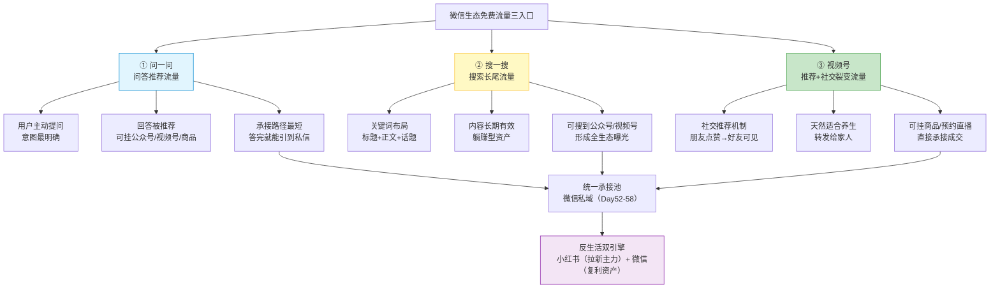
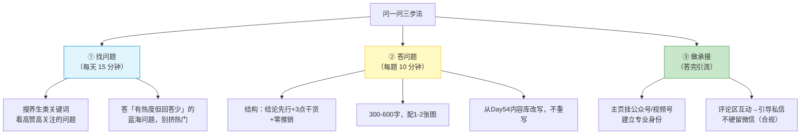
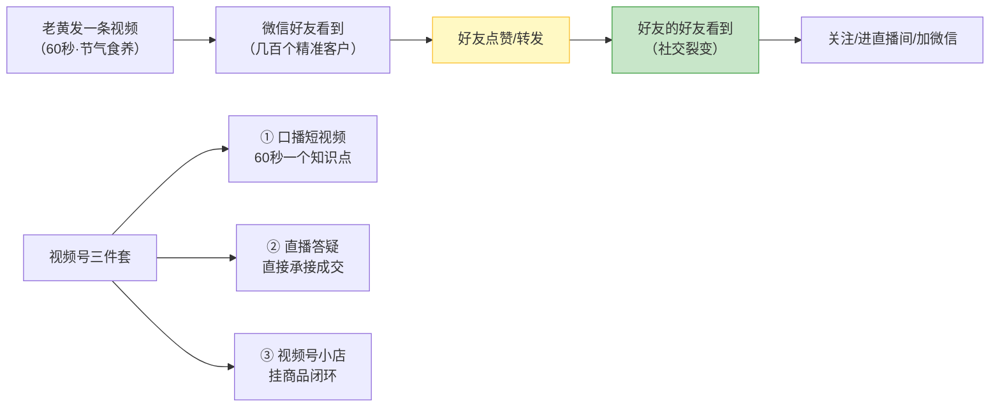
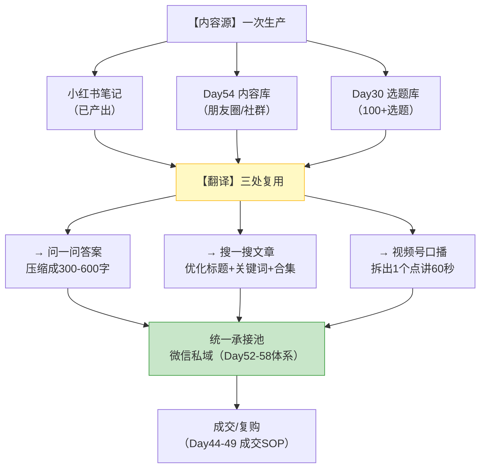

# Day59: 微信生态的搜索与推荐流量红利——把「微信问一问 + 搜一搜 + 视频号」这三块还没吃到的免费流量吃进来，给「反生活」开第二增长曲线

> 📅 学习日期：2026-09-20
> 🔗 关联笔记：[[00-目录]] | 上一篇：[[Day58-私域精细化运营的自动化与工具化]] | 下一篇：Day60
> 🎯 适用场景：Day58 之后，老黄的「反生活」私域这台机器已经全部装好并且能半自动跑了——标签、台账、提醒、话术库、AI 产线，一个人能稳稳管住 500-1000 个客户。**但这套机器有一个前提：得有人进来。** 回头一看，老黄的流量来源非常单一——**几乎全靠小红书这一个入口**（发笔记 → 私信 → 加微信）。这就带来三个越来越明显的风险：**① 单点依赖风险**：小红书一次限流、一次封号、一次算法改版，老黄的整个生意就断了；**② 增长天花板**：小红书导流的转化效率已经被老黄优化到接近上限，想再涨只能靠砸投放（Day02），ROI 越打越低；**③ 已有资产被浪费**：老黄微信里已经躺着几百个精准养生客户、微信本身又是全国最大的搜一搜+内容生态，但老黄在微信里**只做人（私域沟通），不做货（内容曝光）**——等于守着一座金矿只挖了一个角落。** 这一篇专门解决「第二增长曲线」的问题：**在不增加内容总量的前提下，把老黄已经产出的内容二次分发到微信生态的三个免费流量入口——「问一问」（问答推荐流量）、「搜一搜」（搜索长尾流量）、「视频号」（推荐+社交裂变流量），用「一次生产、三处复用」的方式，把小红书单点依赖变成「小红书 + 微信」双引擎。** 这一篇的关键词是：**复用，不是重新做。**

> 📚 学习来源：Day13 多平台内容复用（本篇是它的微信特化版）× Day18 多平台变现矩阵（双引擎的战略意义）× Day23 小红书搜索SEO（搜索逻辑跨平台同构）× Day28 内容工业化生产（复用是产能杠杆）× Day30 内容选题策划（选题库可直接转问答）× Day52 私域导流话术（问一问/搜一搜的承接路径）× Day54 私域高价值内容体系（内容资产盘点）× Day58 自动化工具化（分发也进流水线）× Day12 视频号生态（本篇把它从「理论」落到「反生活能干什么」）× Day24 内容数据分析（跨平台数据归因）× Day51 阶段收官体检（单点瓶颈诊断）

---

## 1. 一句话总结

**「微信生态流量红利」的本质，是承认一件绝大多数人没意识到的事——微信不是一个「聊天工具」，它是中国唯一一个「社交关系 + 搜索 + 推荐 + 内容 + 支付」全部打通在一个 App 里的闭环生态，而这个生态里最肥的三块免费流量（问一问、搜一搜、视频号），恰好都需要「有专业沉淀的内容生产者」才能吃到，而老黄正好有。** 拆开说，这三块流量的价值在于：

- **「问一问」** 是微信里的「知乎 + 百度知道」，用户在问具体问题，平台需要优质答案来填内容池。**它的流量是「意图最明确的推荐流量」**——一个问「脾胃虚弱吃什么好」的人，比刷到老黄笔记的人，转化意向高出好几倍。
- **「搜一搜」** 是微信里的搜索引擎，**它是唯一一个「用户主动来找你、而且可以长期躺赚」的入口**——一篇答得好的内容，可能两年后还在持续带人进来（这就是 Day23 讲的小红书搜索逻辑的微信版）。
- **「视频号」** 是微信里的短视频+直播，**它最独特的机制是「社交推荐」——朋友点赞的内容会推给朋友的朋友**，这是抖音、小红书都没有的裂变机制，而老黄的养生内容天然「适合被转发给家人」。

**这三块加起来，构成了老黄的第二增长曲线。而最妙的地方在于：老黄不需要为它们重新做内容——他需要的是把已经产出的内容「翻译」成这三种形态。** 一篇已有的《秋天养脾胃 . 3 个动作》，在微信生态里可以变成：一条问一问的答案、一个搜一搜的标题优化、一条视频号的 60 秒口播。**一次生产，三处复用，边际成本趋近于零。** 记住这一篇的核心公式：**新流量 = 已有内容 × 新形态 × 新入口。**

**核心认知：** 老黄最该纠正的第一个误解，是**「多平台运营 = 多平台都要从零做」**。绝大多数人一想到「我是不是该去做视频号」，脑子里浮现的是「要学拍摄、学剪辑、重做一遍内容」——于是直接放弃了。**这是被「内容形式」吓住了，而不是被工作量吓住了。** 真相是：**老黄已经有的资产远比他想的多**——Day54 的内容库、Day30 的选题库、Day52 的话术库、Day28 的工业化产线、还有几百个真实客户的真实提问。**这些资产的 80% 可以直接改写成微信生态要的内容。** 第二个误解是**「微信生态流量小，不值得做」**。恰恰相反——微信的流量**不以「大」取胜，以「准」和「久」取胜**：小红书一条笔记可能一天 10 万曝光但 3 天后就死；问一问/搜一搜的一条好内容可能一天只有 200 曝光，但**两年后还在带人**——**这是一笔「时间复利」的资产，不是一次性的流量**。第三个误解是**「视频号要重新起号，等于重头再来」**。其实**视频号是可以「冷启动借力」的**：老黄微信里几百个精准好友本身就是视频号的第一批种子观众（朋友点赞 → 社交裂变），**这是小红书永远给不了的起步优势**。最后要建立的关键认知是：**「微信生态的三个入口，用户意图浓度是「视频号 < 搜一搜 < 问一问」,而承接路径的顺畅度正好相反」。** 视频号最容易被刷到但意图最模糊（需要养熟），问一问意图最明确（几乎可以直接承接）——**老黄要按「意图浓度」分配精力，先做问一问（最短路径），再做搜一搜（长尾资产），最后做视频号（长期基建）。**

---

## 2. 核心框架

### 2.1 微信生态三入口全景图——老黄的「第二增长曲线」长什么样

| 入口 | 流量类型 | 用户意图 | 生效速度 | 持续时间 | 老黄的投入 | 反生活适配度 |
|:--:|:----|:--:|:--:|:--:|:--:|:--:|
| ① 问一问 | 推荐（问答） | ⭐⭐⭐⭐⭐ 最明确 | 快（几天） | 中（1-3 月） | 低（改写已有内容） | ⭐⭐⭐⭐⭐ |
| ② 搜一搜 | 搜索 | ⭐⭐⭐⭐ 明确 | 慢（1-3 月收录） | ⭐⭐⭐⭐⭐ 极长 | 中（需关键词布局） | ⭐⭐⭐⭐⭐ |
| ③ 视频号 | 推荐 + 社交 | ⭐⭐⭐ 较模糊 | 中（需养号） | 中 | 高（要出镜/剪辑） | ⭐⭐⭐ |

> **给「反生活」的关键：** **这三个入口的排序，就是老黄的执行顺序——先问一问，再搜一搜，最后视频号。** 理由只有一条：**投入产出比**。问一问几乎不用学新技能（老黄本来就会写文字，而且有大把现成内容），见效快，意图精准；搜一搜需要一点关键词思维，但一旦起来就是躺赚资产；视频号要出镜/剪辑，是老黄最不熟的一环，应该放在前两个跑顺、有正反馈之后再啃。**特别提醒：不要三个同时开工**——单人的精力是有限的，同时做三件事的结果通常是三件都没做起来（这个错误 Day51 已经诊断过）。**一个季度只主攻一个入口。**

### 2.2 问一问实操——0 成本吃「意图最明确」的流量

问一问是微信里的问答社区，**入口：微信「发现」→ 问一问**。老黄的打法分三步：

**答一问的黄金结构模板（直接照抄）：**

| 部分 | 字数 | 写法 | 反生活示例（问：「秋天总觉没胃口怎么办？」） |
|:--:|:--:|:----|:----|
| 开头结论 | 30-50 | 一句话给答案，不绕弯 | 「没胃口多半是脾胃被暑湿困住了，秋天要做的是『唤醒』而不是『硬补』。」 |
| 干货主体 | 200-400 | 3 点具体做法，可执行 | ①早饭换温热小米粥 ②饭后走 10 分钟 ③少碰冰饮 |
| 收尾提醒 | 50-80 | 给一个边界/提醒，建立专业感 | 「如果持续两周以上还伴随消瘦，建议先做个检查，别只靠食补。」 |
| 引导 | 0-30 | 轻引导，不硬广 | 「我平时会分享一些节气食养的做法，主页有。」 |

> **给「反生活」的关键：** **问一问最反直觉的技巧是「不要抢热门问题」。** 一个已经有 200 个回答、5000 关注的热门问题，老黄的答案排在第 201 位，几乎不会被看到；而一个「有 200 关注、只有 3 个回答」的问题，老黄的答案可能直接排第一——**曝光量差 10 倍以上。** 这是 Day23 讲过的「蓝海关键词」逻辑在问答场景的翻版。**第二个关键：答案必须「零推销」。** 问一问对硬广非常敏感，一句「想买可以私信我」可能整个答案被限流。正确做法是**「先给足价值，问的人自己会点头像」**——头像和简介里放好「养生食养 · 8 年从业者」这类身份，主页自然会承接流量。**第三个关键：这是老黄最省力的入口**——**答案内容直接改写自 Day54 的内容库和 Day30 的选题库**，一篇 300 字的小红书图文，压缩一下就是一条优质答案。**每天答 2-3 题，一个月就是 80 条内容资产。**

### 2.3 搜一搜实操——做一笔「两年后还在带人」的资产

搜一搜是微信的搜索入口（微信顶部搜索框），**它的核心是「关键词布局」**：

| 层级 | 优化对象 | 具体做法 | 反生活示例 |
|:--:|:----|:----|:----|
| ① 账号层 | 公众号名称/简介 | 名字里带核心品类词 | 「反生活·节气食养」而不是「反生活的日常」 |
| ② 标题层 | 文章/视频标题 | 关键词前置，越靠前权重越高 | 「**秋燥咳嗽**别急着吃药，试试这碗汤」 |
| ③ 正文层 | 内容关键词密度 | 核心词自然出现 3-5 次 | 「脾胃」「食养」「节气」自然重复 |
| ④ 话题层 | 话题标签 | 每个标签都是一个检索入口 | #脾胃虚弱 #秋分食养 #家常汤方 |
| ⑤ 合集层 | 内容合集 | 把同类内容归到一个合集 | 「脾胃调理 12 讲」「24 节气食养」 |

> **给「反生活」的关键：** **搜一搜最大的价值不是「来的人多」，是「来的人对、而且会一直来」。** 一篇标题优化的《秋燥咳嗽别急着吃药》，可能上线第一周只有 50 次搜索，**但每年秋天它都会被重新搜出来**——三年累计可能带来几千个精准粉丝，而老黄的边际成本是零。**这就是「资产型流量」和「消耗型流量」的区别**：小红书笔记是消耗型（发的时候一次性给量，之后衰减），搜一搜内容是资产型（持续给量）。**老黄的长期护城河应该建在资产型流量上。** 另一个容易被忽略的点：**「合集」是搜一搜隐藏的权重洼地**——把同一主题的 10 篇文章做成一个合集，合集本身会成为一个搜索入口，而且内部互相导流，**这是最省力的 SEO 动作**（建议老黄第一批做「脾胃」「睡眠」「节气食养」三个合集）。**最后提醒合规（接 Day55）：标题里绝对不能出现「根治」「治好」「最有效」这类绝对化/疗效承诺词**，否则不只是不收录，还可能违规。用「食养」「调理」「试试」这类安全表述。

### 2.4 视频号实操——用「社交裂变」这个别的平台没有的机制

视频号的核心差异是**社交推荐**——**你朋友的点赞，会让他朋友看到**。这对养生内容是天赐的机制：

**老黄的最低成本视频号启动方案：**

| 项 | 最低成本做法 | 说明 |
|:--|:----|:----|
| 拍什么 | **纯口播 + 手部特写**（拍煮汤/拣药材/做动作） | 不用露全脸，不用买设备，手机支架即可 |
| 时长 | **30-60 秒**，一个视频只讲一个点 | 短完播率高 |
| 文案 | 从 Day54 内容库 / 问一问答案直接改写 | 不重写，只换形态 |
| 频率 | 每周 2-3 条（接 Day28 产线节奏） | 宁可少而稳，别三天打鱼 |
| 冷启动 | **发布后转发到自己朋友圈 + 客户群** | 借微信好友的社交权重启动 |
| 承接 | 主页挂公众号，评论区互动引私信 | 与 Day52 导流路径打通 |

> **给「反生活」的关键：** **视频号对老黄最大的意义，不是「多一个流量池」，是「多一个裂变放大器」。** 老黄微信里躺着几百个精准的养生客户——**这些人如果给老黄的视频点赞，他们的朋友（大概率也是同年龄段、同样关注养生的人）就会看到。** 这在抖音、小红书都是做不到的（那些平台不基于你的私人关系链分发）。**换算成钱：一条视频如果能撬动 100 个精准好友点赞，按社交推荐机制可能触达 3000-10000 个「同类人群」——而且是零成本。** 所以老黄做视频号的第一条铁律是：**每条视频发完，一定要转发一次朋友圈**——这不是「发广告」，是给社交推荐机制「上发条」。**第二条铁律：内容要「值得被转给家人」。** 养生内容天然有这个属性——「这个汤方对咳嗽有用，转给我妈」——**老黄选题时要主动往「有转发动机」的角度靠**（实用汤方、节气提醒、常见误区纠正），这类内容的裂变率远高于纯知识科普。

### 2.5 三入口的「一次生产、三处复用」流水线

老黄的产能不该增加，增加的只该是「分发」：

**翻译规则表（照抄执行）：**

| 原形态 | → 问一问 | → 搜一搜 | → 视频号 |
|:----|:----|:----|:----|
| 小红书图文（800字/5图） | 取核心结论 + 3 点做法，压到 400 字 | 原样发公众号，标题重写加关键词 | 只取其中最有用的 1 个点，拍 60 秒 |
| 长文/合集 | 拆成 3-5 条独立答案 | 做合集，内部互链 | 一条视频讲合集里最关键的一招 |
| 客户高频提问 | **直接就是最好的答案素材** | 写成一篇文章 | 拍一条「最近好多人问我…」 |
| 节气/热点 | 蹭热度回答相关问题 | 标题带节气词（搜索量大） | 节气当天发，裂变率最高 |

> **给「反生活」的关键：** **这张表的最后一行藏着一个金矿——「客户高频提问」。** 老黄每天在私域被问的问题（「经期能喝吗」「小孩能喝吗」「什么时间喝最好」），**本身就是最好的内容素材，而且是被验证过「有人真的想问」的选题。** 把它们记成一张「问题清单」（建议直接加进 Day58 的台账体系里），**每一个问题都可以拆成：一条问一问答案 + 一篇搜一搜文章 + 一条视频号视频。** 这样老黄的内容生产就从「我想讲什么」变成「用户要什么」，命中率天然更高（接 Day30）。**另外：翻译不等于照搬。** 三个平台用户心理不同——**问一问要「像在跟人解释」，搜一搜要「像一份说明书」，视频号要「像跟朋友唠嗑」。** 同一份内容，语气要换。

---

## 3. 可落地方法

### 3.1 【反生活可直接用】第一周启动排期（每天 30 分钟，不加班）

| 天 | 任务 | 时长 | 产出 |
|:--:|:----|:--:|:----|
| D1 | 建「问题清单」：翻聊天记录，列出客户问过的 20 个真问题 | 30 min | 20 个选题 |
| D2 | 把问题清单里的 5 个问题，改写成问一问答案 | 30 min | 5 条答案 |
| D3 | 注册/完善问一问主页（身份、简介、头像统一） | 30 min | 专业身份卡 |
| D4 | 发布 D2 的 5 条答案，观察哪条有反响 | 30 min | 首轮数据 |
| D5 | 梳理公众号：把现有 3 篇文章标题重写（关键词前置） | 30 min | 3 个优化标题 |
| D6 | 建 1 个合集（「脾胃调理」），把相关文章归进去 | 30 min | 搜索入口 |
| D7 | 拍第一条视频号（60 秒口播，手机拍摄），发完转朋友圈 | 30 min | 首条视频 + 社交启动 |

### 3.2 问一问的「三个不」避坑指南

| 不要 | 为什么 | 正确做法 |
|:----|:----|:----|
| ❌ 不要硬留微信号 | 违规、限流、封号风险（Day55） | 引导看主页/私信，微信在私信里加 |
| ❌ 不要答热门挤爆的问题 | 排在 200 位等于没答 | 选「有热度、回答少」的蓝海问题 |
| ❌ 不要答自己不专业的领域 | 答错一次专业信任就崩 | 只答养生/食养/节气相关，边界清晰 |

> **操作：** 每天固定 15 分钟「扫题」——搜索老黄的核心关键词（脾胃、睡眠、食养、节气），**按「关注数 100-1000、回答数 < 10」筛选**，收藏 3 个，当天答完。**稳定输出 30 天，老黄的问一问账号会积累约 80-90 条答案，形成一个自动运转的精准流量入口。**

### 3.3 【反生活可直接用】搜一搜的「关键词银行」

老黄要建一个关键词表，长期用（这是 Day23 SEO 思路的微信落地版）：

| 关键词类型 | 示例 | 搜索意图 | 内容怎么配 |
|:----|:----|:--:|:----|
| 🎯 品类词 | 养生、食养、节气饮食 | 泛 | 建立账号定位 |
| 🎯 症状词 | 脾胃虚弱、失眠、秋燥咳嗽 | **强** | 每个词配一篇长文 |
| 🎯 场景词 | 熬夜后怎么补、经期能喝什么 | **极强** | 直接对应私信高频问题 |
| 🎯 节气词 | 秋分吃什么、立冬进补 | **强（周期性）** | 提前 3 天发，蹭搜索峰值 |
| 🎯 人群词 | 中年养生、女性调理、孩子脾胃 | 中 | 做合集，做人群细分 |

> **操作：** 在微信搜一搜里输入一个词，**看下拉框的「联想词」——那就是真实用户在搜的东西**（免费的关键词工具）。把联想词记进关键词银行，每个词标记「有没有内容」。**三个月后，老黄会得到一张「哪些需求我还没覆盖」的地图**，直接就是选题排期表。

### 3.4 视频号的「社交裂变」放大器设计

| 环节 | 动作 | 目的 |
|:--|:----|:----|
| 发布前 | 想清楚「这条内容，用户会转给谁？」 | 转发动机设计 |
| 发布时 | 标题写「转给家里…的人看」类引导 | 降低转发心理成本 |
| 发布后 10 分钟 | 转发到朋友圈 + 3 个客户群 | 启动社交推荐 |
| 发布后 2 小时 | 在评论区回 3 条留言（自己先留一条引导） | 提升互动权重 |
| 发布后 24 小时 | 看数据：完播率、点赞、转发量 | 记录进 Day24 数据表 |

> **操作：** **视频号最重要的指标不是「播放量」，是「转发量」。** 播放量是平台给的，转发量是社交机制给的——**一条转发 50 次的视频，比一条播放 5000 但没人转的视频值钱得多**（因为前者会持续裂变）。老黄要养成习惯：**每条视频发完，去评论区自己留一条「家里有 XX 情况的可以存一下」**——这类评论能显著提升转发率。

### 3.5 跨平台数据归因——搞清楚「人到底从哪来」（接 Day24）

| 来源入口 | 归因方式 | 要看的指标 |
|:----|:----|:----|
| 小红书 | 私信话术里问一句「从哪篇笔记来的」 | 单篇笔记引流数 |
| 问一问 | 加好友时问「是不是看了我答的问题」 | 每个问题的引流数 |
| 搜一搜 | 公众号后台「搜索来源」数据 | 关键词带来的阅读 |
| 视频号 | 视频号后台 + 私信来源询问 | 单条视频引流数 |
| 转介绍 | 标签「转-」（Day58） | 裂变系数 |

> **操作：** **在新好友的 Day52 导流话术末尾，加一句轻问句「你是在哪看到我的呀？」** ——这一句话，就是老黄跨平台归因的全部成本。**连续记一个月，老黄就能知道「哪个入口最值钱」，然后砍掉不划算的、加码划算的（接 Day50/51）。** 没有归因的多平台运营，等于闭着眼睛撒网。

---

## 4. 变现路径

第二增长曲线的变现，分「直接」和「间接」两层：

| 变现维度 | 怎么赚 | 大概量级 | 关联笔记 |
|:----:|:----|:----|:----|
| 💰 新增精准粉 | 问一问答题引流（意图最明确） | 每天 3-10 个精准粉 | Day52 |
| 💰 躺赚长尾流量 | 搜一搜内容持续带人（2 年+） | 每月 50-300 人（累积） | Day23 |
| 💰 社交裂变放大 | 视频号转发触达「同类人群」 | 单条视频 3000-10000 触达 | Day12 |
| 💰 降低单点风险 | 小红书被限流时，微信仍能供血 | **保命价值**（不可估） | Day51 |
| 💰 内容复用省成本 | 一次生产三处分发，边际成本≈0 | 内容产能 ×3（不加班） | Day28/Day13 |
| 💰 私域池扩张 | 池子从 200 → 500-1000，承接 Day58 半自动系统 | 收入上限 ×2-3 | Day58 |
| 💰 视频号电商闭环 | 视频号小店 + 直播，微信内直接成交 | 长期主要增量 | Day12/Day25 |

> 给「反生活」的一句话账本：**老黄现在的日引流量大致是「小红书每天 5-15 个有效粉」**，月入约 5000 元（Day58 假设）。**加上微信三入口后，保守估计：问一问每天带来 3-5 个精准粉（意图比小红书更高、转化率更高）× 搜一搜每月自然增长 50-150 人（前 3 个月少，之后加速）× 视频号每周 2 条视频、按单条 5-15 人引流。** 汇总下来**每月新增 200-400 个精准粉，是老黄当前增速的 1.5-2 倍。** 按 Day56 保守转化（5% 月下单、客单 100 元），**多出来的 250 人每月带来约 1250 元增量，叠加现有收入，月收入从 5000 涨到约 6000-6500。** **但真正的价值不在这个数字，在于「抗风险」和「复利」两件事：** ① 如果某天小红书限流，老黄的微信入口仍能带来一半以上的新粉——**生意不会断**；② 搜一搜的内容资产是**逐年累加**的，今年写的文章明年还在带人，**这是真正的睡后收入结构**。**再往后看，视频号一旦跑起来，微信内的小店 + 直播是能直接成交的闭环（不用把人导来导去），这是老黄第二年的主要增量来源。** 记住：**第一增长曲线（小红书）是「借来的流量」，第二增长曲线（微信生态）是「自己的资产」。** 老黄现在做的，是把借来的流量转化成自己的资产。

---

## 5. 行动清单

### ✅ 行动①：建「客户问题清单」（今天做，40 分钟）

**步骤1(25分钟):** 打开微信，从最近 3 个月的聊天记录里，**抄下客户问过的所有具体问题**（不做归纳，原话照抄）。
**步骤2(10分钟):** 数一遍，按出现频率排序，取前 20 个。
**步骤3(5分钟):** 存进一个永久文档（建议叫「选题金矿·客户提问」），以后每天新问题都往里加。

> **产出：** ✅ 一份 20+ 条的「被验证过有人想问」的选题清单 —— 这是问一问答案、搜一搜文章、视频号口播三者的共同内容源。**这是今天最重要的一件事，因为它是「内容复用」的原料仓库。**

### ✅ 行动②：开通并优化问一问主页 + 答 3 题（今天做，45 分钟）

**步骤1(15分钟):** 微信「发现」→ 问一问 → 完善头像、昵称（建议统一为「反生活·节气食养」这类带品类的名字）、一句话简介（写清专业身份，不写营销）。
**步骤2(20分钟):** 搜索「脾胃」「失眠」「秋燥」等词，**筛选出「关注 100-2000、回答 < 10」的 3 个蓝海问题**，按 2.2 的四段结构（结论→3点→提醒→轻引导）各答一条。
**步骤3(10分钟):** 检查三条答案里**有没有违规词（根治/最好/疗效承诺）**，有就改掉，然后发布。

> **产出：** ✅ 3 条已经上线的精准答案 + 一个能承接流量的专业主页 —— 这是微信生态里**见效最快、成本最低**的一个入口，今天就能开始收粉。

### ✅ 行动③：把公众号/视频号「接上网」（今天做，50 分钟）

**步骤1(20分钟):** 检查公众号名称/简介里有没有核心关键词（如「食养」「养生」「节气」），没有就改；从已有文章里挑 3 篇，**标题重写为「关键词前置」式**（例：《秋燥咳嗽别急着吃药，试试这碗汤》）。
**步骤2(15分钟):** 新建 1 个合集（推荐「脾胃调理」），把相关文章全部归入，测试搜一搜能否搜到合集。
**步骤3(15分钟):** 拍第一条视频号：**选行动①清单里最高频的那个问题**，手机支架架好，60 秒讲清「问题 + 3 点做法 + 一句提醒」；发布后**立刻转发朋友圈 + 1 个客户群**，启动社交裂变。

> **产出：** ✅ 一个能被搜到的公众号内容阵地 + 一个已启动社交推荐的第一条视频 —— 从今天起，老黄的内容开始「一次生产、三处复用」，而流量的来源，从一个变成了四个。**记住今天这一篇的核心：不是多做内容，是把已经做过的好内容，拿到更多人面前。**

---

## 📊 今日学习总结

| 维度 | 内容 |
|:----:|------|
| 核心认知 | 微信 = 社交+搜索+推荐+内容+支付的封闭生态；三入口（问一问/搜一搜/视频号）都需要「有专业沉淀的内容生产者」才能吃到；多平台运营 ≠ 从零做，而是「已有内容 × 新形态 × 新入口」；意图浓度：问一问 > 搜一搜 > 视频号，而执行优先级正好按此排序；小红书是「借来的流量」，微信生态是「自己的资产」 |
| 核心框架 | 三入口全景与优先级排序 × 问一问三步法（找蓝海题/黄金四段结构/零推销承接）× 搜一搜五层关键词布局（账号/标题/正文/话题/合集）× 视频号社交裂变放大器（每条必转朋友圈）× 一次生产三处复用的翻译规则表 |
| 关键技能 | 蓝海问题筛选（关注100-2000、回答<10）、问一问黄金四段（结论→干货→提醒→轻引导）、关键词银行搭建（用搜一搜联想词）、合集权重洼地、视频号转发动机设计、跨平台归因一句话问句 |
| 变现路径 | 问一问日增 3-5 精准粉、搜一搜月增 50-150（长尾复利）、视频号单条 3000-10000 触达、单点风险兜底（保命）、内容产能 ×3 零加班、私域池 ×2-3；综合月收入 5000 → 6000-6500，核心价值在抗风险 + 复利 |
| 今日行动 | ① 40 分钟建「客户问题清单」（20 条选题金矿）② 45 分钟开通问一问 + 答 3 条蓝海题 ③ 50 分钟公众号标题/合集优化 + 拍第一条视频号并转朋友圈 |

> 下一篇预告：**Day60: 内容资产化与复利经营——把「每天发内容」升级成「每发一条都在往资产账户里存钱」，给「反生活」建一套能持续生出流量的内容资产结构。**

---

## 📌 关联笔记一览

| 关联主题 | 笔记链接 |
|:----|:----|
| 目录/进度 | [[00-目录]] |
| 上一篇(私域自动化与工具化) | [[Day58-私域精细化运营的自动化与工具化]] |
| 多平台内容复用(本篇是其微信特化版) | [[Day13-多平台内容复用]] |
| 多平台变现矩阵(双引擎战略) | [[Day18-多平台变现矩阵]] |
| 小红书搜索SEO(搜索逻辑跨平台同构) | [[Day23-小红书搜索SEO与长尾流量策略]] |
| 内容工业化生产(复用是产能杠杆) | [[Day28-自媒体内容工业化生产]] |
| 选题策划(选题库转问答素材) | [[Day30-小红书内容选题策划]] |
| 视频号生态(本篇落到反生活实操) | [[Day12-视频号生态]] |
| 私域导流话术(三入口的统一承接) | [[Day52-小红书私域导流话术全栈实战]] |
| 私域内容体系(内容资产盘点) | [[Day54-私域高价值内容体系搭建]] |
| 内容合规(标题绝对化用语红线) | [[Day55-私域内容合规与信任风险防控]] |
| 客户分层(转介绍标签做归因) | [[Day56-私域客户分层与精细化运营]] |
| 成交SOP(承接后走成交流程) | [[Day49-私域成交标准作业流程SOP]] |
| 内容数据分析(跨平台归因) | [[Day24-内容数据分析与迭代优化]] |
| 阶段收官体检(单点依赖诊断) | [[Day51-阶段收官总复盘与经营体检]] |
