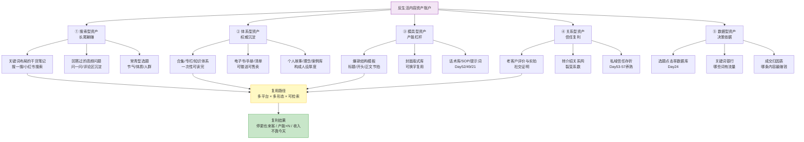
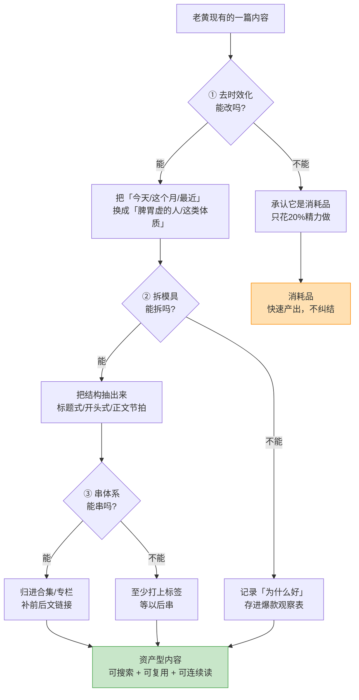
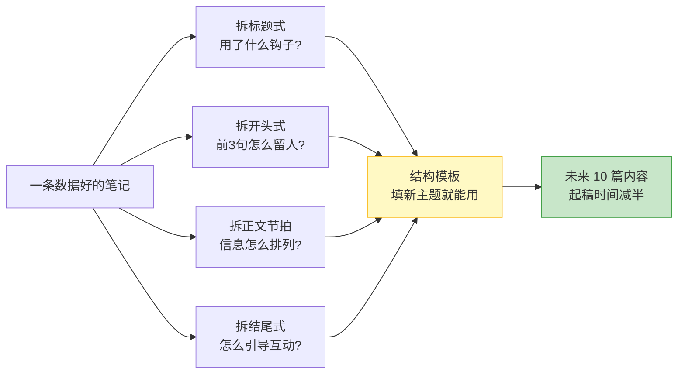
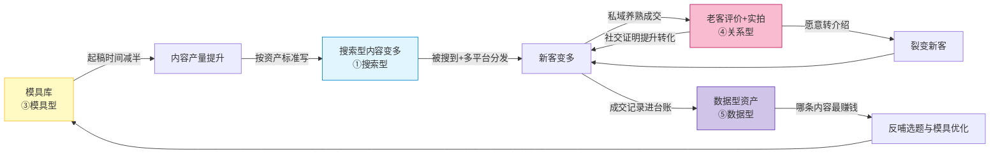

# Day60: 内容资产化与复利经营——把「每天发内容」升级成「每发一条都在往资产账户里存钱」，给「反生活」建一套能持续生出流量的内容资产结构

> 📅 学习日期：2026-09-22
> 🔗 关联笔记：[[00-目录]] | 上一篇：[[Day59-微信生态的搜索与推荐流量红利]] | 下一篇：Day61
> 🎯 适用场景：Day59 之后，老黄的「反生活」已经从一个入口（小红书）扩到四个入口（小红书 + 问一问 + 搜一搜 + 视频号），私域那台半自动机器（Day58）也在稳稳运转。**但这一路做下来，老黄身上其实压着一个越来越大的隐患：他每天在「产内容」，却几乎没在「攒资产」。** 区别在哪？**产内容 = 今天发了，明天就沉了，后天得重新来一遍**（小红书一条笔记的流量寿命通常是 3-7 天，之后就彻底躺平）；**攒资产 = 今天发了，三个月后还在带人，一年后还在成交**（搜一搜的文章、被反复引用的干货、可复用的模板与SOP、老客户的真实评价）。**老黄现在 90% 的精力都花在「产内容」上，只有 10% 花在「攒资产」上——这就是为什么他每天都很累，却总觉得「停下来就没了」。** **这一篇要解决的是一个根本性的经营结构问题：把「流量生意」升级成「资产生意」。** 具体说，就是把老黄手里的东西分成两类——**消耗品**（发完就死、必须连载的）和**资产**（发完还活、能自动生利的）——然后有意识地做两件事：**① 把消耗品尽量改造成资产；② 让资产之间互相供血、滚起来。** 这一篇的关键词是：**不是多产，是复利。**

> 📚 学习来源：Day59 微信生态流量红利（搜一搜是典型的长尾资产入口，本篇把它升级为「资产结构」）× Day23 小红书搜索SEO（搜索型内容天然是资产）× Day28 内容工业化生产（化产能为可复用模具）× Day13 多平台内容复用（一次生产多处存放）× Day18 多平台变现矩阵（资产的多渠道生利）× Day24 内容数据分析（用数据判断哪条是资产）× Day30 选题策划（选题库就是资产的原料仓）× Day52 私域导流话术（话术库是资产）× Day54 私域高价值内容体系（内容资产盘点）× Day58 自动化工具化（模板/SOP是资产）× Day59 已建立的四入口 × Day50 复盘与SOP迭代（资产需要复盘维护）× Day51 阶段收官体检（资产体检）

---

## 1. 一句话总结

**「内容资产化」的本质，是意识到一个反直觉的事实——老黄缺的从来不是「内容」，而是「能生息的内容」。** 他每天写的东西里，**大约 80% 是会过期的消耗品，20% 是能长期生息的资产**，而可怕的地方在于：**这 80% 和 20% 的产出成本是一样的，区别只在于「有没有用对结构去写」。** 换句话说，老黄完全可以在不增加工作量的前提下，把其中一大半的消耗品改造成资产——只要他掌握三个动作：**① 把「时效内容」写成「常年有效」（去掉「今天/这个月」，换成「脾胃虚的人」）；② 把「一次性的成品」拆成「可复用的模具」（一篇爆款 → 一个结构模板 → N 篇新内容）；③ 把「散落的成品」串成「可被检索的体系」（单篇 → 合集/专栏 → 能被人一次性读完）。** 这三个动作，就是「内容资产化」的全部。

**资产 vs 消耗品，一张表说清区别：**

| 维度 | 消耗品（老黄现在 80%） | 资产（老黄该多做的 20% → 目标 50%） |
|:----:|:----|:----|
| **典型形态** | 蹭热点的笔记、当天的养生提醒 | 搜索型干货、体系化合集、话术库、SOP、模板 |
| **流量寿命** | 3-7 天（小红书笔记） | 3 个月 - 3 年（搜一搜/合集/被引用） |
| **产出成本** | 同 | 同（甚至更低，因为可复用） |
| **是否可复用** | 不可，发完即弃 | 可反复复用、多平台分发 |
| **是否可被人搜到** | 几乎不 | 高（关键词布局过） |
| **停更后是否还来客** | 完全断流 | 仍持续带人（睡后流量） |
| **复利效应** | 无（1+1=2） | 有（1+1>2，互相供血） |

> 给「反生活」的关键认知：**老黄现在最大的成本不是「内容做得不够多」，而是「每天都在重造轮子」。** 他今天想选题、写文案、做封面、答私信——明天还要从零再想一遍。**因为他的产出没有被「沉淀」，只是被「消费」了。** 而一旦把结构调过来——**选题从「金矿库」里拿（Day30），文案从「结构模板」里套（Day27），封面从「版式库」里挑（Day33），话术从「话术库」里抄（Day52）**——他就从「每天做新东西」变成了「每天用老资产产新内容」。**这就是复利：你今天的工作，是建立在昨天积累之上的，而不是把昨天推倒重来。**

**核心认知：** 要纠正的三个误解——**① 「资产化 = 写长篇大论」**：错。资产的门槛不是长度，是**「是否有人长期会搜、会看、会复用」**。一条 60 秒的视频号口播，只要讲的是「脾胃虚弱的人到底能不能喝牛奶」这种常年有人问的问题，它就是资产；一篇 3000 字的时事评论，如果三天后没人再提，它也只是消耗品。**② 「先把量做起来，资产以后再说」**：这是最危险的念头。因为**资产化的最佳时机恰恰是在写作的同时**——一篇笔记写的时候顺手埋关键词、顺手归进合集、顺手把结构存成模板，成本只增加 10%；等你想回头「资产化」已有的 200 篇内容，成本就是 10 倍。**③ 「资产是沉淀，和流量没关系」**：完全相反。**在这个时代，资产和流量是同一件事的两面——好的资产会持续带流量（搜索型资产），好的流量沉淀下来也会变成资产（客户评价/案例）。** 老黄要做的不是「先把流量做起来再建资产」，而是**让每一次做流量的动作，都顺手往资产账户里存一笔**。

**核心公式：** **内容复利 = 资产型内容 × 复用路径 × 时间。** 三个变量缺一不可——只有资产型内容（值得被反复用），配上复用路径（多平台/多形态/可被搜），再乘以时间（不着急，让它长），才会产生复利。**老黄缺的正是第二个变量（复用路径），因为他的内容几乎都停在一个平台上、一个形态里、发完就完了。**

---

## 2. 核心框架

### 2.1 内容资产五层结构全景图——老黄的「资产账户」里有什么

| 资产层 | 老黄现在有什么 | 缺口在哪 | 优先级 |
|:--:|:----|:----|:--:|
| ① 搜索型 | 少量关键词笔记（Day23 起步） | 没系统布局、没归到合集、微信侧没同步 | ⭐⭐⭐⭐⭐ |
| ② 体系型 | 选题库（Day30）、话术库（Day52） | 没有「能被一次性读完」的对外体系（合集/手册） | ⭐⭐⭐⭐ |
| ③ 模具型 | 有零散的爆款经验 | 没沉淀成「填进去就能出稿」的模板 | ⭐⭐⭐⭐⭐ |
| ④ 关系型 | 私域几百客户、部分评价 | 评价没系统化收集，转介绍没机制化 | ⭐⭐⭐⭐ |
| ⑤ 数据型 | 有零散的后台数据 | 没有「选题-流量-成交」的归因台账 | ⭐⭐⭐ |

> **给「反生活」的关键：** **这五层资产里，回报周期最短、老黄最该立刻动手的是 ③ 模具型**。理由：**模具是「杠杆中的杠杆」**——它不直接带来流量，但它让老黄**未来每一条内容的成本降下来**。而 ① 搜索型 是**回报最长**的（三个月后开始显现，一年后变成主要来源），所以**今天就要开始布局，但别指望立刻见效**。**最容易被忽略的是 ⑤ 数据型**——老黄发了这么多内容，却说不清「哪条内容带来了成交」，导致每次复盘只能凭感觉。**这五层不需要齐头并进，按「先 ③ 模具 → 再 ① 搜索 → 补 ④ 关系 → 建 ⑤ 数据 → 最后 ② 体系」的顺序推进，一个季度啃一层。**（顺序理由：模具先建，后面所有内容创作都会受益；搜索要时间发酵，越早埋越好；体系型资产是「攒够了才成型」的，急不来。）

### 2.2 三个改造动作——把消耗品变成资产的具体手法

这是本篇最核心的可执行部分。老黄已有的内容，可以用下面三个动作改造：

**动作① 去时效化（成本最低，效果最直接）**

对比看看：

| ❌ 消耗品写法 | ✅ 资产写法 | 差别 |
|:----|:----|:----|
| 今天立秋，该喝这碗汤了 | 脾胃虚的人，一年四季都该喝这碗汤 | 换成常青人群，全年可搜 |
| 9月开学季，学生党养生指南 | 熬夜学生党：3个不伤脾胃的宵夜选择 | 去掉月份，留下人群+场景 |
| 最近换季容易上火，怎么办 | 一换季就上火的人，先分清是哪种火 | 换成「体质标签」而非「时间」 |
| 双11养生好物清单 | 家里常备这3样，换季不慌 | 去掉活动，留下使用场景 |
| 我踩过的5个坑 | 养生小白最容易踩的5个坑 | 去掉「我」，留下「你」 |

> **【反生活可直接用】一个实操技巧：** 老黄每次写完标题，**做个「三个月后测试」——把标题贴到三个月后的日历上，问自己「那时候还有人在搜这个吗？」** 如果答案是「有」，它就是资产型选题；如果是「没有」，那就是消耗品，**写快点、别纠结、别花大力气**。这个测试只需要 5 秒钟，但它能帮老黄把精力精确投到会沉淀的地方。

**动作② 拆模具（回报最高的动作）**

老黄已经发过不少笔记，其中肯定有那么几条数据明显好的。**这些好笔记的价值不是「这条爆了」，而是「它暴露了一个可复制的结构」。** 拆模具就是把这个结构抽出来：

> **【反生活可直接用】模板长什么样：** 不用写得复杂，一个 Excel/Markdown 表格就够。**列头建议：模板名 / 适用场景 / 标题句式 / 开头钩子类型 / 正文结构 / 结尾引导 / 用过的笔记。** 例：
>
> | 模板名 | 适用场景 | 标题句式 | 开头钩子 | 正文结构 |
> |:--|:--|:--|:--|:--|
> | 「错-对」对比式 | 纠正误区 | 「XX的人，别再YY了」 | 先说你也在做的错事 | 错的做法 → 为什么错 → 对的做法 → 提醒 |
> | 「3个信号」式 | 自测类 | 「出现这3个信号，说明XX」 | 直接抛信号1 | 信号1/2/3 → 对应做法 → 引导自查 |
> | 「一碗汤」式 | 食谱类 | 「XX的人，这碗汤要常喝」 | 讲场景（干燥/乏力） | 食材 → 做法 → 什么时候喝 → 谁别喝 |

**动作③ 串体系（让资产之间互相供血）**

单篇内容像散落在房间里的书，**串成体系就像装上了书架**——用户能一次读完，平台也能识别你是「这个领域的」，权重更高。

| 串法 | 怎么做 | 效果 |
|:----|:----|:----|
| **归合集** | 把同主题笔记归进一个合集（如「脾胃调理」） | 用户读完一篇接着读下一篇，时长↑权重↑ |
| **做专栏** | 把合集写成「入门→进阶→实战」顺序 | 形成「体系感」，涨粉率↑ |
| **互相引** | 新笔记开头引老笔记（「上次说过的XX」） | 老资产被反复激活，流量复利 |
| **跨平台存** | 一条笔记同时存在于小红书+搜一搜+问一问 | 一份资产多处生息（Day59） |

> ⚠️ **注意事项：串体系不要「为了串而串」。** 判断标准很简单：**能不能用一句话说清这个合集是给谁看的、解决什么问题。** 说得清 → 串；说不清 → 说明你自己的体系还没想明白，先别串（否则会变成「什么都往里放」的垃圾合集）。

### 2.3 资产的「维护」——资产是会衰减的，需要定期体检

**这是最容易被忽略的一点：资产不是「建完就永久有效」的，它会衰减。** 平台规则变了、关键词热度降了、内容过时了、链接失效了——**不体检的资产，半年后可能变成一堆「僵尸内容」**（存在但不再带流量）。所以要引入「资产体检」：

| 体检项 | 频率 | 判断标准 | 动作 |
|:----|:--:|:----|:----|
| 搜索型资产 | 每月 | 本月是否还有搜索流量进来 | 有 → 保留；连续2月为0 → 改写或下架 |
| 模具型资产 | 每季 | 本季用过几次 | 0 次 → 说明不好用，改造或删 |
| 体系型资产 | 每季 | 合集是否还在更新 | 停更 3 月 → 补一篇续命 |
| 关系型资产 | 每月 | 老客复购/转介绍有吗 | 无 → 该唤醒（Day45） |
| 数据型资产 | 每月 | 台账还在记吗 | 断了 → 立刻恢复（数据断了就没法决策） |

> **给「反生活」的一句话：** **每月花 30 分钟做一次资产体检，比每天多写一条笔记有价值得多。** 因为多写一条 = 临时多几个流量；体检一次 = 让过去几个月积累的资产重新活过来。**这就是「经营资产」和「打工资」的区别——前者管的是存量，后者管的是流量。**

---

## 3. 可落地方法

### 3.1 【反生活可直接用】内容资产盘点表——先搞清「我有什么」

**第一步不是建资产，是盘点已有资产。** 老黄手上大概率躺着不少「忘了它还有用」的东西。

**操作步骤：**

**步骤①（30 分钟）：** 打开小红书/公众号/微信/手机相册，**把这半年发过的所有内容列成一张表**（不用写全，起码把「数据好的」和「问的人多的」都列上）。

**步骤②（20 分钟）：** 给每条内容打上这 4 个标签：

| 标签 | 问题 | 填什么 |
|:----|:----|:----|
| 类型 | 是消耗品还是资产？ | 消耗品 / 资产 / 半资产 |
| 可搜索性 | 三个月后有人搜吗？ | 会 / 不会 / 不确定 |
| 可复用性 | 结构能抽成模板吗？ | 能 / 不能 |
| 归属 | 属于哪个主题体系？ | 脾胃 / 睡眠 / 节气 / 人群… |

**步骤③（10 分钟）：** 按「资产 + 可搜索 + 可复用」三项筛出**前 10 条**，这 10 条就是老黄的**核心资产**——它们值得被重点改造、反复利用。

> **产出：** ✅ 一张「内容资产盘点表」，里面至少 10 条核心资产被识别出来。**这是今天最重要的一步，因为「不知道有什么」就永远建不起资产结构。**

### 3.2 【反生活可直接用】模具库搭建——建一个「填进去就出稿」的模板箱

**步骤①（25 分钟）：** 从 3.1 筛出的前 10 条里，挑出**数据最好的 3 条**，逐条拆结构（标题句 / 开头钩子 / 正文节拍 / 结尾引导）。

**步骤②（20 分钟）：** 按 2.2 的表格格式，把它们写成 3 个模板，存进一个永久文档（建议命名「反生活·内容模具库」）。

**步骤③（15 分钟）：** **立刻用其中一个模板，套一个新选题，写一篇出来**（不要只存不用——用一次才验证得了模板好不好用）。

> ⚠️ **注意事项：模板不是「照抄」，是「骨架」。** 标题句式可以照着套，但内容必须是新的、真实的、针对具体人群的。**套模板的目的是省掉「怎么组织」的时间，不是省掉「想什么」的时间。**

### 3.3 阶段策略——按「资产化程度」分层推进

#### 阶段一：0-30 天（把现有内容资产化）

| 项目 | 投入 | 目标 |
|:----|:----|:----|
| 资产盘点 | 1 小时 | 识别 10 条核心资产 |
| 模具库 | 1 小时/周 | 沉淀 3-5 个模板 |
| 去时效化改写 | 每天 10 分钟 | 每周改写 3 条老内容 |
| 合集搭建 | 2 小时 | 建 1-2 个核心合集 |

> 目标：**让「已有内容」的死资产活过来**，不增加新内容产出，但流量略有提升。

#### 阶段二：30-90 天（新内容按资产标准写）

| 项目 | 投入 | 目标 |
|:----|:----|:----|
| 选题库改造 | 每周 30 分钟 | 一半选题改为常青型 |
| 关键词布局 | 每篇 | 标题/正文/话题埋词（Day23） |
| 多平台同步 | 每周 2 小时 | 每篇资产发 3 个入口（Day59） |
| 数据台账 | 每天 5 分钟 | 记录「选题-流量-成交」 |

> 目标：**新产内容里资产占比从 20% 提到 40-50%**，搜索流量开始显现。

#### 阶段三：90 天+（资产互相供血，形成复利）

| 项目 | 投入 | 目标 |
|:----|:----|:----|
| 体系化专栏 | 每月 1 个 | 形成 3-5 个可对外讲的体系 |
| 资产体检 | 每月 30 分钟 | 淘汰衰减资产，续命优质资产 |
| 关系资产化 | 持续 | 评价/案例/转介绍系统收集 |
| 手册化输出 | 每季 1 份 | 把体系做成可赠送/可售卖的电子手册 |

> 目标：**搜索流量成为稳定来源，即使停更一两周也有客来**——这就是复利成型的标志。

### 3.4 复利飞轮——资产之间怎么互相供血

老黄的资产不是各自独立的，它们之间会转起来。理解这个飞轮，就知道为什么「先做模具」是对的：

> **给「反生活」的关键：** **这个飞轮转一圈的时间大约是 1-2 个月**（不是几天），所以老黄要有耐心。**但一旦转起来，每一圈都会比上一圈快**——因为模具越来越多、搜索资产越攒越多、老客评价越积越厚。**这就是「复利」两个字的真正含义：不是线性的多赚一点，而是每一轮都在为下一轮加速。** 反过来说，**如果老黄只做消耗品（天天追热点、发完就扔），这个飞轮根本转不起来**——因为每一轮都是从零开始，没有东西可以积累。

---

## 4. 变现路径

### 4.1 变现模式对比

**模式A：搜索型资产变现（推荐★★★★★）**

- 流程：写常青干货 → 埋关键词 → 多平台同步 → 持续被搜到 → 私信 → 私域成交
- 特点：**流量成本为零，且逐年累加**，是最健康的模式
- 月收入预估：
  - 第 1-3 月：几乎为 0（发酵期）
  - 第 4-6 月：300-800 元（开始有搜索来的客户）
  - 第 7-12 月：800-2500 元（**成为主要流量来源之一**）

**模式B：模具型资产变产能（推荐★★★★★）**

- 流程：沉淀模板 → 起稿时间减半 → 同等时间产出更多内容 → 更多内容 = 更多流量
- 特点：**不直接赚钱，但让所有其他环节的效率翻倍**
- 效率收益：起稿时间从 60 分钟 → 25 分钟（约 2.4 倍），**相当于免费多了半个人**

**模式C：体系型资产变现（推荐★★★★☆）**

- 流程：体系化内容 → 做成电子手册/专栏 → 免费送（引流）或付费卖（知识变现）
- 特点：**一次性成果，可无限次售卖**，边际成本为零
- 收入预估：手册 9.9-39 元 × 每月 30-100 份 = **300-3900 元/月**

**模式D：关系型资产变现（推荐★★★★★）**

- 流程：老客评价/实拍系统化收集 → 做成社交证明 → 提升新客转化率 + 老客转介绍
- 特点：**转化率提升是最直接的收入杠杆**
- 效果：评价体系上线后，新客下单率可提升 30-50%（同样流量，多赚钱）

**【反生活可直接用】推荐组合：模式A + 模式B + 模式D**

> 理由：**B 是杠杆（让 A 做得更快），A 是流量（让客户自己找上门），D 是转化（让进来的客户更愿意买）。** 三者互相加强：模具让内容变多 → 搜索资产变多 → 新客变多 → 老客评价变多 → 转化变高 → 又反过来让老客更愿意转介绍。**这就是复利的飞轮。** 模式C 可以放在三个月后，等体系自然成型了再做。

### 4.2 收入计算示例

| 项目 | 数据 |
|:----|:----|
| 现状：小红书日引流 | 5-15 个有效粉（Day59 假设） |
| 现状月收入 | 约 5000-6500 元 |
| 资产化后：搜索型资产补充 | 每月 +50-200 人（累积，第4月起明显） |
| 资产化后：内容产能提升 | 起稿时间减半 → 可多发 30-50% 内容 |
| 资产化后：老客评价提升转化 | 新客下单率 +30%（保守按一半算 +15%） |
| 资产化后：转介绍（关系资产） | 裂变系数从 0 → 0.1-0.2（每 10 个老客带来 1-2 个新客） |
| **综合月收入（6 个月后）** | **7000-11000 元** |
| **关键差异** | **停更一周，收入几乎不降（区别于纯流量模式）** |

> 给「反生活」的一句话账本：**老黄现在的收入结构是「今天的努力 → 今天的收入」，这是打工模型。** 资产化要把他推到**「过去的努力 → 今天的收入」**——**这是老板模型。** 具体路径：**第一步（1-3 月）做模具，让产能翻倍；第二步（第 4 月起）搜索资产开始回本，每月多 50-200 个不花钱的客户；第三步（第 6 月起）老客评价和转介绍开始自动供血。** 到第 6 个月，**月收入从 5000-6500 涨到 7000-11000，而且是从「尽力做才有」变成「不做也有」。** 特别提醒：**这个模型前期（前 3 个月）几乎看不到额外收入**——因为资产要时间发酵。**这是最大的心理关卡：老黄必须忍住「写了三个月怎么没多赚钱」的焦虑，因为资产的价值全在后面。** 判断自己有没有走对的标志只有一个：**模具库有没有越攒越多、搜索流量有没有逐月上升。** 这两个指标只要在涨，方向就是对的。

---

## 5. 行动清单

### ✅ 行动①：做「内容资产盘点表」，筛出 10 条核心资产（今天做，60 分钟）

**步骤1(30分钟):** 打开小红书/公众号/相册，把近半年发过的内容列成一张表（标题 + 大致数据）。
**步骤2(20分钟):** 给每条打 4 个标签（类型/可搜索性/可复用性/归属），至少覆盖 30 条。
**步骤3(10分钟):** 筛出「资产 + 可搜索 + 可复用」三项齐全的**前 10 条**，单独标黄。

> **产出：** ✅ 一张完整的「内容资产盘点表」+ 10 条被点名的核心资产 —— 这是老黄「资产账户」的第一次对账。**做完这一张表，老黄会第一次真正看到「自己其实已经有多少东西」，也会第一次发现「原来这么多内容发完就废了」。** 这个发现本身就是最大的收获。

### ✅ 行动②：建「内容模具库」+ 立刻用一次（今天做，60 分钟）

**步骤1(25分钟):** 从行动①的 10 条里挑数据最好的 3 条，逐条拆：标题句式 / 开头钩子 / 正文节拍 / 结尾引导。
**步骤2(20分钟):** 按 3.2 的格式写成 3 个模板，存进永久文档「反生活·内容模具库」。
**步骤3(15分钟):** **用模板 1，套一个新选题，当场写出一篇完整笔记**（不用发，先验证模板能不能用）。

> **产出：** ✅ 一个 3 模板的模具库 + 1 篇用模板产出的新笔记 —— 从今天起，老黄的内容生产从「每次从零开始」变成「从模具箱里拿工具」。**这一件的价值不在今天，而在未来每一次写内容时省下的时间。**

### ✅ 行动③：做一次「去时效化改写」+ 建第一个合集（今天做，50 分钟）

**步骤1(25分钟):** 从行动①的盘点表里挑 **3 条数据不错但已沉底的消耗品**，用 2.2 的方法改写标题（去掉时间/事件，换成人群/场景/体质），重新发布或修改已发布笔记的标题。
**步骤2(15分钟):** 在小红书/公众号新建 **1 个合集**（推荐「脾胃调理」或「节气食养」），把相关笔记全部归进去，补上「看完这篇接着看…」的一句引导。
**步骤3(10分钟):** 打开日历，**设置每月 1 日的提醒：「资产体检 30 分钟」**（按 2.3 的体检表过一遍）。

> **产出：** ✅ 3 条被改造的常青型内容 + 1 个已上线的合集 + 一个每月自动触发的资产体检提醒 —— **从今天起，老黄的内容不再只有「发布」这一个动作，而是多了「沉淀、改造、体检」三个动作。** 记住今天这一篇的核心：**不是多写内容，是让写过的内容，一直替你干活。**

---

## 📊 今日学习总结

| 维度 | 内容 |
|:----:|------|
| 核心认知 | 老黄缺的不是内容，是「能生息的内容」；80% 产出是消耗品（3-7天死）、20% 是资产（长期带客），而二者成本相同，区别只在结构；内容复利 = 资产型内容 × 复用路径 × 时间；从「今天的努力→今天的收入」（打工模型）升级为「过去的努力→今天的收入」（老板模型） |
| 核心框架 | 内容资产五层结构（搜索型/体系型/模具型/关系型/数据型）× 三个改造动作（去时效化/拆模具/串体系）× 资产体检五表（月/季频率与淘汰标准）× 三阶段推进（0-30天盘活存量 / 30-90天新内容按资产标准写 / 90天+资产互相供血） |
| 关键技能 | 「三个月后测试」判断资产 vs 消耗品（5 秒）、爆款结构四拆法（标题式/开头式/正文节拍/结尾引导）、模具库表格设计（模板名/场景/句式/钩子/结构）、合集串体系的判断标准（能否一句话说清给谁看）、资产衰减体检（连续2月0搜索→改写或下架） |
| 变现路径 | 搜索型资产第 4-6 月起月增 300-800 元、第 7-12 月 800-2500；模具型让起稿时间减半（产能 ×2.4）；体系型手册 9.9-39元×30-100份；关系型让新客下单率 +15-30%、转介绍裂变系数 0→0.1-0.2；6 个月后月收入 5000-6500 → **7000-11000，且停更一周收入不降** |
| 今日行动 | ① 60 分钟做「内容资产盘点表」，筛出 10 条核心资产 ② 60 分钟建 3 模板的「内容模具库」并当场用一次 ③ 50 分钟改写 3 条时效内容 + 建第一个合集 + 设置每月资产体检提醒 |

> 下一篇预告：**Day61: 用户旅程地图与全触点体验设计——把用户从「第一次刷到你」到「主动帮你转介绍」的每一个接触点画出来，找到哪些点让人流失、哪些点能设计成惊喜，让「反生活」的用户体验从「随机发生」变成「被设计出来的」。**

---

## 📌 关联笔记一览

| 关联主题 | 笔记链接 |
|:----|:----|
| 目录/进度 | [[00-目录]] |
| 上一篇(微信生态流量红利) | [[Day59-微信生态的搜索与推荐流量红利]] |
| 多平台内容复用(复用路径来源) | [[Day13-多平台内容复用]] |
| 多平台变现矩阵(资产多渠道生利) | [[Day18-多平台变现矩阵]] |
| 小红书搜索SEO(搜索型资产的方法) | [[Day23-小红书搜索SEO与长尾流量策略]] |
| 内容工业化生产(模具型资产的前身) | [[Day28-自媒体内容工业化生产]] |
| 选题策划(选题库=资产原料仓) | [[Day30-小红书内容选题策划]] |
| 转化文案写作(文案结构可拆模具) | [[Day27-自媒体转化文案写作]] |
| 养生账号视觉体系(封面版式库) | [[Day33-养生账号视觉体系设计]] |
| 内容数据分析(数据型资产+资产判断) | [[Day24-内容数据分析与迭代优化]] |
| 私域导流话术(话术库=典型资产) | [[Day52-小红书私域导流话术全栈实战]] |
| 私域高价值内容体系(内容资产盘点) | [[Day54-私域高价值内容体系搭建]] |
| 私域自动化与工具化(模板/SOP即资产) | [[Day58-私域精细化运营的自动化与工具化]] |
| 客户复购与唤醒(关系型资产经营) | [[Day45-私域成交后的客户关系经营与复购唤醒]] |
| 复盘与SOP迭代(资产需定期体检) | [[Day50-复盘与SOP迭代升级]] |
| 阶段收官体检(资产结构诊断) | [[Day51-阶段收官总复盘与经营体检]] |

> 🔗 **反生活适用标注：** 本篇是「反生活」从**流量经营升级为资产经营**的分水岭。它不要求老黄多写一条内容，而是要求他**改变「写完就扔」的习惯**——每写一条，顺手做三件事：埋关键词（让它可被搜到）、拆结构（让它能变成模具）、归合集（让它和别人连起来）。**对单人运营的养生账号来说，这一篇是「从累死自己到让内容自己干活」的转折点**：老黄未来最值钱的不是他今天发了什么，而是他过去一年沉淀下来的搜索资产、模具库、客户评价——**这些在他睡觉、休息、生病的时候，都还在替他工作。**
