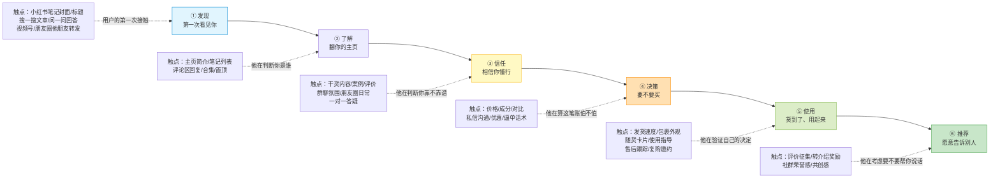
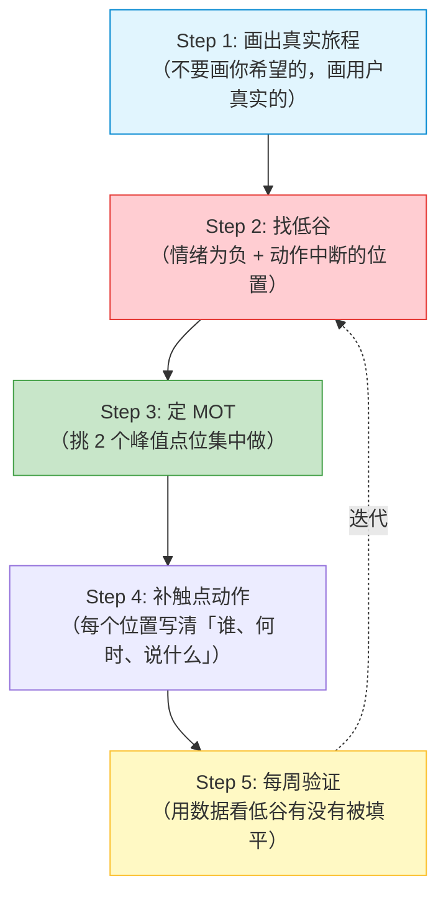

# Day61: 用户旅程地图与全触点体验设计——把用户从「第一次刷到你」到「主动帮你转介绍」的每一个接触点全部画出来，找到哪些点让人流失、哪些点能设计成惊喜，让「反生活」的用户体验从「随机发生」升级成「被设计出来的」

> 📅 学习日期：2026-09-23
> 🔗 关联笔记：[[00-目录]] | 上一篇：[[Day60-内容资产化与复利经营]] | 下一篇：Day62
> 🎯 适用场景：Day52 到 Day60，老黄的「反生活」已经把一整条链路铺出来了——导流、养熟、合规、分层、流失雷达、自动化、微信第二曲线、内容资产化。**但零件拼在一起之后，撞上了一个更隐蔽的问题：每一段单独看都不错，可整条路走下来，用户还是在某些地方莫名其妙地掉了**——刷到笔记看了赞了收藏了就是不加微信、加了微信聊两句再没动静、货收到了用一次就再没复购、明明挺满意却从没想过转介绍。**老黄一直用「自己的视角」看生意（我做了什么、发了什么），从没站在「用户的视角」把整条路走一遍。** 这一篇装的就是那把「用户视角的摄像机」——**用户旅程地图 + 全触点体验设计**：把「反生活」从用户角度切成 6 阶段（**发现 → 了解 → 信任 → 决策 → 使用 → 推荐**），逐阶段列出所有**接触点**、画出一条**情绪曲线**，然后做两件事：**① 找到「流失点」（情绪低谷 + 动作断层，堵住它）；② 设计「惊喜点」（在关键位置埋超预期体验，把人推向下一阶段）。** 关键词：**不是做得更多，是每一步都被看见、被设计。**

> 📚 学习来源：Day52 导流话术（最大漏斗）× Day53 养熟节奏（时间轴）× Day54 内容体系（每阶段燃料）× Day55 合规（触点错会毁信任）× Day56 分层（不同层走不同段）× Day57 生命周期（旅程的空间化表达）× Day58 自动化（触点要能批量触达）× Day59 微信入口（起点变多）× Day60 内容资产化（搜索是长期入口）× Day19 用户心理（情绪曲线的心理规律）× Day44 成交话术（决策段临门一脚）× Day45 复购唤醒（使用段延续）× Day46 社群（中段主战场）× Day24 数据分析（验证流失点）× Day27 转化文案（触点落点）

---

## 1. 一句话总结

**「用户旅程地图」的本质，是把老黄用「自己的时间轴」拼起来的生意，重新摊开成「用户的时间轴」——**老黄现在的视角是**「我做了 A、又做了 B、接着做了 C」**（发笔记→导流→养熟→成交→售后），这是**运营视角**；用户真正体验的却是另一条线——**「我看见了、我犹豫了、我走开了、三天后又回来、终于加了微信、我害怕了、我问了一句、我下单了、我怕买错、我用了、我惊喜了、我想告诉别人」**，这是**体验视角**。**这两条线的差距，就是损失掉的客户。** 核心逻辑很简单：**先把用户的完整路径画成一张图（6 阶段 × 每段触点 × 情绪曲线），再用它做两件事——① 找出「情绪低谷 + 动作断层」的流失点，堵住；② 在「关键时刻（MOT）」设计超预期动作，把它变成惊喜点，推着人往下走。** 一句最狠的总结：**生意不差，差的是「体验没有被设计过」——现在是把人丢进一条路让他自己走，而会做的人是在每一步都伸手牵一把。**

**核心认知：** 大多数人脑子里装的是**「漏斗」**（100 人看到 → 10 人加微信 → 3 人下单 → 1 人复购），**漏斗思维只关心「还剩多少人」，不关心「人站在哪一步走的、为什么走的」**；旅程地图恰好补上这块——它问的是**「他在第几步、正看着什么、心里在想什么、然后他走了」**。背后是三条硬用户心理规律（Day19）：

**① 人不是「决策」出来的，是「滑」出来的。** 用户不会理性比较十个选项再选你，真实体验是一连串极微小的随机判断（"封面挺舒服"→"这博主好像懂"→"先收藏"→"先不买"）。**旅程地图的价值就是把这些判断的位置标出来——每个位置都是可以伸手的机会。**

**② 人只记得「最强烈的瞬间」和「最后的瞬间」。** 这是**峰终定律（Peak-End Rule）**：用户对一次体验的评价**几乎完全由「最高峰」和「结束那一刻」决定**，中间再平顺都会被忘掉。**现实含义：与其在 10 个环节都做到 70 分，不如在其中 2 个环节做到 120 分、最后一步做到满分。** 一箱货里多塞一张手写卡片，比服务整体提升 20% 更被记住。

**③ 用户在「情绪低谷」处流失，不在「最麻烦」处流失。** 用户不是被「加微信太麻烦」劝退，是被**「犹豫期没人在旁边说话」**劝退。**麻烦可以忍，孤独不能忍**——旅程上那些「他一个人默默做决定」的空白段，才是真正的流血点。

**核心公式：** **用户留存率 = 旅程设计密度 × 情绪曲线平滑度 × 关键时刻峰值。** **旅程设计密度**看路上埋了多少触点（老黄现在严重集中在「发布」和「成交」两头，中间大片空白）；**情绪曲线平滑度**看低谷处有没有伸手（老黄基本只在客户主动时出现）；**关键时刻峰值**看有没有 1-2 个点做到超预期（老黄现在是「全都还行，没一个记得住」）。**老黄要做的不是更努力，是把努力重新分配到最关键的位置。**

---

## 2. 核心框架

### 2.1 「反生活」用户旅程六阶段全景图——用户到底怎么走过来的

用户从「第一次看见你」到「帮你转介绍」，走的是一条完整的六段路，**每一段需要做不同的事**：

| 阶段 | 用户在想什么 | 老黄的目标 | 关键动作 | 老黄触点密度 |
|:----:|:----|:----|:----|:----:|
| ① 发现 | 「这什么东西，有点意思」 | 让他停下来看完 | 停留 3 秒 | ⭐⭐⭐ 尚可 |
| ② 了解 | 「这博主是谁，靠谱吗」 | 让他进主页看更多 | 点进主页/搜更多 | ⭐⭐ 弱（主页没经营） |
| ③ 信任 | 「他好像懂，但我不完全信」 | 让他觉得「这人懂我」 | 关注/收藏/反复看 | ⭐⭐ 弱（缺案例体系） |
| ④ 决策 | 「要不要加微信 / 要不要买」 | 让他迈出第一步 | 加微信/下单 | ⭐⭐ 弱（只靠私信） |
| ⑤ 使用 | 「我是不是买错了？」 | 让他确认「买对了」 | 用起来/再来一次 | ⭐⭐ 弱（售后很轻） |
| ⑥ 推荐 | 「要不要告诉朋友」 | 让他愿意开口 | 评价/转介绍 | ⭐ 几乎空白 |

> **给「反生活」的关键：** **最刺眼的是最后一列——触点密度极度头重脚轻：** ① 发现投了 80% 精力，②③ 几乎没经营，④ 只靠私信硬聊，⑤⑥ 靠用户自觉。**但收入发生在 ④⑤⑥，这三段密度最低。** 老黄的努力全砸在「让更多人看见」，而不是「让看见的人不漏掉」。

### 2.2 情绪曲线与 MOT——低谷在哪，钱就从哪漏

用户走这六段路时**情绪不是平的，是一条起伏的曲线**。流失几乎从不发生在「最麻烦」处，**永远发生在「情绪最低 + 没人管」处**：

```mermaid
flowchart TD
    subgraph CURVE["📈 反生活用户情绪曲线"]
        direction LR
        P1["发现<br/>情绪：😐 0"] --> P2["被吸引<br/>情绪：😀 +2<br/>⭐ MOT-1"]
        P2 --> P3["翻主页<br/>情绪：🙂 +1"]
        P3 --> P4["咦，好像不太信<br/>情绪：😕 -2<br/>💧 低谷1"]
        P4 --> P5["看了几篇干货<br/>情绪：😀 +3<br/>⭐ MOT-2 峰值"]
        P5 --> P6["要加微信了<br/>情绪：😟 -3<br/>💧 低谷2 最大流失点"]
        P6 --> P7["第一次问价<br/>情绪：😐 0"]
        P7 --> P8["下单<br/>情绪：😊 +2<br/>⭐ MOT-3"]
        P8 --> P9["等货、收到<br/>情绪：😰 -2<br/>💧 低谷3"]
        P9 --> P10["用得挺好<br/>情绪：😍 +4<br/>⭐ MOT-4 最高峰"]
        P10 --> P11["要不要推荐<br/>情绪：😐 0<br/>💧 低谷4 最后一个机会"]
    end

    style P5 fill:#c8e6c9,stroke:#43a047
    style P6 fill:#ffcdd2,stroke:#e53935
    style P10 fill:#c8e6c9,stroke:#43a047
    style P11 fill:#ffe0b2,stroke:#fb8c00
```

**四个情绪低谷 = 四个流失点，逐个堵：**

| 低谷 | 位置 | 用户心里的话 | 老黄现在 | 堵漏动作 |
|:----:|:----|:----|:----|:----|
| 💧 低谷1 | 刚看完笔记、翻主页 | 「好像就是个普通卖货的」 | 主页没经营 | 简介写清「我是谁/懂什么/能帮你什么」+ 置顶 3 篇干货 |
| 💧 低谷2 | **要加微信那一刻** | 「会不会是微商？会被骚扰吗？」 | 只留一句「私信我」 | 「加微信能得到什么」+ 不骚扰承诺 + 加后立刻给价值 |
| 💧 低谷3 | 下单后到收货前 | 「钱花了，万一不好呢」 | 什么都不发 | 下单当天发「发货了 + 怎么用」的安心消息 |
| 💧 低谷4 | 用完、想推荐之前 | 「推荐了对我有什么好处」 | 完全没设计 | 主动征集评价 + 给转介绍的明确理由 |

**四个 MOT（Moments of Truth，关键时刻）= 四个峰值，刻意做：**

| MOT | 位置 | 为什么关键 | 峰值动作（超预期） |
|:---:|:----|:----|:----|
| ⭐ MOT-1 | 第一次刷到笔记 | 决定他停不停下来 | 封面第一眼给人「这说的是我」 |
| ⭐ MOT-2 | 连看两三篇干货后 | 决定他信不信你 | 一篇戳到最深痛点的内容，让他想「这人真懂我」 |
| ⭐ MOT-3 | 第一次下单 | 决定这单舒不舒服 | 下单后 5 分钟内个性化回复（非自动回复） |
| ⭐ MOT-4 | 收到货、用出效果 | 决定复购/转介绍 | 手写卡片 + 用后回访 + 主动要反馈 |

> **给「反生活」的关键：** **按峰终定律，用户对老黄的全部印象几乎只由两件事决定——最高峰值（MOT-4 用出效果）和最后那个瞬间。** 中间 90% 的努力基本不被记得。**所以不是「全面优化」，而是「集中火力」：把资源压在 MOT-2 和 MOT-4，做到让用户忍不住截图发朋友圈**——成本极低、效果极强。反过来，**低谷2（加微信那一刻）最致命**：它是流量变成客户的唯一入口、也是防备心最高的时刻，**必须设计「降低防备 + 立刻给价值」的组合，而不是甩一句「私信我」。**

### 2.3 触点清单——能碰用户的每个地方，列全

旅程地图落到执行就是一份**触点清单**：把能碰用户的地方全列出来，逐个判断「做了没、做得好不好、该不该加动作」：

```mermaid
flowchart TD
    A["🟦 公域触点<br/>（陌生人也能碰到）"] --> A1["笔记封面 / 标题"]
    A --> A2["笔记正文 / 正文里的钩子"]
    A --> A3["评论区（自己的回复 + 别人的提问）"]
    A --> A4["主页简介 / 置顶 / 合集"]
    A --> A5["搜一搜文章 / 问一问回答（Day59）"]
    A --> A6["视频号 / 直播（Day59）"]

    B["🟨 过渡触点<br/>（决定加不加微信）"] --> B1["私信自动回复（第一句说什么）"]
    B --> B2["私信人工回复（多久回、怎么回）"]
    B --> B3["加微信的引导语（给什么理由）"]
    B --> B4["通过后的第一条消息（5分钟内）"]

    C["🟩 私域触点<br/>（决定买不买、买几次）"] --> C1["朋友圈（Day54 内容体系）"]
    C --> C2["社群（Day46 群氛围）"]
    C --> C3["一对一（Day44 成交 / Day45 复购）"]
    C --> C4["群公告 / 活动通知（Day47）"]

    D["🟪 交付触点<br/>（决定复购和转介绍）"] --> D1["下单后的确认消息"]
    D --> D2["发货通知 + 物流跟踪"]
    D --> D3["包裹本身（外观 / 随货卡片）"]
    D --> D4["收货 3-7 天的售后回访"]
    D --> D5["用后反馈征集 / 评价激励"]
    D --> D6["转介绍邀请（Day45 裂变）"]

    style A fill:#e3f2fd,stroke:#1976d2
    style B fill:#fff9c4,stroke:#fbc02d
    style C fill:#e8f5e9,stroke:#43a047
    style D fill:#f3e5f5,stroke:#8e24aa
```

**触点自查表（老黄现在最该补的 8 个）：**

| # | 触点 | 阶段 | 老黄现状 | 补的动作 | 优先级 |
|:--:|:----|:----:|:----|:----|:--:|
| 1 | 主页简介/置顶 | ② 了解 | 空白或随意 | 一句「我是谁+我懂什么+能帮你什么」+ 置顶 3 篇 | ⭐⭐⭐⭐⭐ |
| 2 | 评论区自己的回复 | ② 了解 | 只回提问 | 在热评下主动补一条延伸信息 | ⭐⭐⭐⭐ |
| 3 | 私信第一句自动回复 | ④ 决策 | 无或干巴巴 | 「你好，我是××，关于××我整理了一份资料，需要吗」 | ⭐⭐⭐⭐⭐ |
| 4 | 通过好友后第一条消息 | ④ 决策 | 无 | 5 分钟内发「欢迎+见面礼+不打扰承诺」 | ⭐⭐⭐⭐⭐ |
| 5 | 下单后确认消息 | ⑤ 使用 | 无 | 「收到啦，明天发出，这份指南先看着」 | ⭐⭐⭐⭐ |
| 6 | 包裹里的随货卡片 | ⑤ 使用 | 无 | 手写一行字 + 二维码 + 「有问题随时找我」 | ⭐⭐⭐⭐⭐ |
| 7 | 收货 3-7 天回访 | ⑤ 使用 | 偶尔做 | **固定流程化**，列入 SOP 必做 | ⭐⭐⭐⭐ |
| 8 | 转介绍邀请 | ⑥ 推荐 | 完全没有 | 用出效果时主动提「你朋友有这问题吗」 | ⭐⭐⭐⭐ |

> **给「反生活」的关键：** **一个反直觉发现：老黄缺的大多不是「新触点」，而是「已有触点上没做动作」。** 私信本来就收得到、包裹本来就寄得出、收货后本来就有时间窗——**这些位置成本几乎为零，只是「没想到要做」。** 旅程设计不花钱、不加人，**只需把免费空白点一个个填上动作。**

### 2.4 旅程设计五步工作流——从「凭感觉」到「有图可依」

**Step 1 画真实旅程（一个人也能做）：** 挑 3 个真实用户（刚加没买的、买过一次的、复购过的），**翻聊天记录 + 看后台数据，还原他们从第一次接触到今天的时间线**——何时看到、看了什么、隔多久、怎么加的、聊了什么、哪句之后冷下去的。**3 条时间线并排，重叠部分就是共同规律（真正的旅程），分叉部分是个体差异（可忽略）。**

**Step 2 找低谷的三把探针**：① **时间**——A 动作到 B 动作**间隔超 3 天还没发生就是断点**（看完笔记 5 天没加微信）；② **语言**——聊天里出现「再看看」「先不了」「有点贵」「考虑一下」的位置；③ **沉默**——他本该说话却没说的位置（收到货没反馈、用了一周没消息）。

**Step 5 验证指标（把这几个加进 Day24/Day50 的数据体系）：**

| 指标 | 含义 | 看哪一段 | 及格线 |
|:----|:----|:----|:----:|
| 笔记 → 主页点击率 | 发现段是否留住人 | ①→② | >3% |
| 主页 → 关注率 | 了解段是否建立初步信任 | ②→③ | >10% |
| 关注 → 私信率 | 信任段是否产生行动欲 | ③→④ | >2% |
| 私信 → 加微率 | **决策段漏斗（最关键）** | ④ | >60% |
| 加微 → 首单率（30天） | 私域养熟效率 | ④→⑤ | >15% |
| 首单 → 复购率（90天） | 使用段体验质量 | ⑤ | >25% |
| 复购 → 转介绍率 | 推荐段最终检验 | ⑥ | >10% |

> **给「反生活」的关键：** **读法是从下往上找瓶颈**：私信→加微率低于 60% 说明上游都在漏；首单→复购率低于 25% 问题在使用体验；复购→转介绍为 0 说明从没设计过推荐触点。**优化顺序：先堵推荐 → 再堵复购 → 再堵加微——越靠后单位努力收益越高。**

---

## 3. 可落地方法

### 3.1 【反生活可直接用】六阶段触点脚本表

把旅程地图变成可以直接照抄的脚本：

**① 发现段（笔记/搜一搜/问一问）**：封面用**「人群标签」**开头（「熬夜党」「脾胃虚的人」）让人对号入座；标题埋隐性痛点（不是「养生很重要」，而是「为什么你越养生越虚」）。❌ 别堆字、别泛泛而谈。

**② 了解段（主页/评论区）**：简介模板**「我是××，做了 N 年××｜专注帮【某类人】解决【某类问题】｜置顶 3 篇先看」**；置顶三篇 = 一篇「我最懂你」（痛点）+ 一篇「我最专业」（方法）+ 一篇「别人怎么说我」（案例）。评论区在热评下主动补一句延伸信息（**只给价值，不推销**）。

**③ 信任段（干货/案例/群氛围）**：配比 **70% 干货 + 20% 案例 + 10% 日常**；案例写「××（具体人群）之前××，用了之后××」而不是「效果好」；群里**每天有真人说话**（老黄至少冒泡 3 次、答 1 个问题）。

**④ 决策段（私信/加微信/下单）—— 全旅程最关键的一段**
- 私信首句：「你好呀，我是××，看到你问××这个问题 😊 我把相关内容整理了一份小整理，需要的话发你，不要也没关系～」**（先给价值、再要联系、允许拒绝）**
- 加微引导：「详细的东西微信里方便说，我平时不太发广告，主要是解答问题发实用的内容，你加了我随时可以问～」**（明确「加了能得到什么」+ 承诺不打扰）**
- **通过好友后 5 分钟内**第一条消息（**黄金 5 分钟**）：「你好呀～我是××，欢迎！先送你一份【见面礼名称】👉【链接】。以后有任何××问题随时问我，我看到都会回。不打扰你，不用回消息，先看看～」**（给礼物、给承诺、免回复压力）**

**⑤ 使用段（发货/收货/回访）—— 制造峰值的地方**
- 下单后：「收到啦～明天发出，先发你一份【使用小贴士】，收到就能用上」
- 包裹里：**一张手写卡片**（哪怕只写「谢谢你信任，有问题随时找我」+ 名字）
- 收货第 3 天：「用得怎么样？有任何问题都可以问我」（**不提复购、不提产品**）
- 收货第 7 天：「最近有个老客回馈，想着你可能会喜欢，要不要看一下？」（**这才是复购邀约**）

**⑥ 推荐段（评价/转介绍）**：用出效果时（他主动来说时）「太好了！方便的话能不能帮我说一句使用感受？我整理成真实反馈用～」；转介绍邀请「你身边有没有跟你一样【同样问题】的朋友？她需要的话可以来找我，我送她一份小礼物～」

### 3.2 「关键 5 分钟」——加微信后的黄金窗口

老黄整条旅程里，**回报率最高的单一动作，就是「加微信后 5 分钟内发对第一条消息」**：

| 时间 | ❌ 大多数人做的 | ✅ 该做的 | 为什么 |
|:----|:----|:----|:----|
| 0-5 分钟 | 什么都不发，等对方开口 | **立刻发欢迎+见面礼+免回复承诺** | 5 分钟内防备心最低、期待值最高 |
| 第 1 天 | 发产品图/推销 | 不提产品，等对方反应 | 破冰期提产品 = 立刻变微商印象 |
| 第 3 天 | 群发广告 | 朋友圈正常更新（不私信） | 用内容养，不用消息打扰 |
| 第 7 天 | 群发促销 | 对方有互动才一对一回一句 | 只对「有信号的人」出手（Day57） |

> **【反生活可直接用】把这 4 行做成 SOP 写进 Day58 的自动化流程**——通过好友后第一时间发出欢迎消息，第 1 天和第 7 天设提醒。**这一个动作直接决定「加微 → 首单率」这个最关键指标。**

### 3.3 峰终定律的三次落地——只做 3 件事，胜过全面优化

按峰终定律，老黄只需要在两个峰值（MOT-2 信任峰值、MOT-4 使用峰值）和一个结尾（交付结束那一刻）上集中发力：

**峰值① 信任峰值（MOT-2）——一篇「戳心」的深度内容**：做 1 篇（不是 100 篇）真正深度的内容，讲透一个最深的痛点，标准是用户看完第一反应「这人怎么这么懂我」；这篇要**置顶 + 在各触点反复引用 + 加微后必发**。

**峰值② 使用峰值（MOT-4）——包裹里的手写卡片**：成本一张卡片 + 30 秒，手写一句个性化的话（不是印刷通用文案），这是**唯一一个用户会拍照发朋友圈的极低成本动作**。

**结尾：别让它悄悄结束**：❌ 大多数情况是货到了、没人说话（**用户对结尾的记忆是「空」**）；✅ 该做的是收货第 3 天一条真心回访（**记忆变成「他还在关心我」**）。**一次体验的结尾直接决定整体评分——同样一箱货，有没有这条回访，评价能差一个档。**

### 3.4 一个人的旅程地图工具化（接 Day58）

| 环节 | 工具 | 具体做法 |
|:----|:----|:----|
| 画旅程地图 | **飞书/Notion 一张表** | 6 行（阶段）× 4 列（触点/用户在想什么/我该做什么/做了没） |
| 记录真实旅程 | **客户台账加 3 列** | 首次接触日/加微日/首单日 → 算出各段间隔 |
| 触点动作提醒 | **微信提醒 + 日历** | 加微后 5 分钟/第 1 天/第 7 天；收货后第 3 天/第 7 天 |
| 低谷识别 | **台账筛选** | 「加微后 7 天无下单」「收货后 14 天无消息」= 待干预 |
| 峰值执行 | **卡片模板 + 置顶内容库** | 手写卡片话术固定 3 个版本，轮着用 |

> **【反生活可直接用】把「飞书一张表」当旅程地图 v1**——不用精美，能一眼看到「哪一步什么都没做」就够。**第一版做完大概率有 5-8 个空位（完全没做动作的地方），把这 5-8 个填上，就是这次最大的收获。**

---

## 4. 变现路径

### 4.1 旅程优化怎么变成钱——四个直接杠杆

**杠杆① 堵住「加微 → 首单」漏斗（最直接，见效最快）**：现状每天 10 人加微、30 天下单 1-2 人（10-20%）；用「5 分钟欢迎 + 见面礼 + 3-7 天节奏」可提到 **20-30%**，同样流量成交人数 +50%-100%。**月增收 +1500-3000 元**

**杠杆② 复购率提升（取决于使用体验峰值）**：现状 90 天复购率约 15%；加随货卡片 + 收货 3 天回访可提到 **25-30%**，每月多出 30-50% 复购订单。**月增收 +800-2000 元**

**杠杆③ 转介绍（旅程最后一格，现在是 0）**：主动邀请 + 明确理由可达 **5-10%**，每 100 个满意客户带来 5-10 个免费新客。**月增收 +500-1500 元**

**杠杆④ 客户终身价值 LTV**：走完六阶段（含复购与转介绍）的用户，LTV 是只走完首单用户的 **5-10 倍**（Day57 已论证）。

| 优化项 | 投入 | 增收估算 | 见效周期 |
|:----|:----|:----|:----:|
| 加微后黄金 5 分钟 | 每天 10 分钟 | +1500-3000 元/月 | **1-2 周** |
| 随货卡片 + 3 天回访 | 每天 15 分钟 + 卡片成本 | +800-2000 元/月 | 1-2 个月 |
| 转介绍触点设计 | 一次性设计 + 每次 3 分钟 | +500-1500 元/月 | 2-3 个月 |
| **合计（3 个月后）** | **每天约 30 分钟** | **+3000-6500 元/月** | — |

### 4.2 收入结构对比

| 项目 | 现状（旅程未设计） | 优化后（6 个月） |
|:----|:----|:----|
| 月加微人数 | 150-300（Day59） | 150-300（不变） |
| 首单率（30天） | 10-20% | 20-30% |
| 月首单数 | 15-60 | 30-90 |
| 复购率（90天） | 15% | 25-30% |
| 转介绍率 | ≈0 | 5-10% |
| 客单价（假设） | 80-150 元 | 80-150 元 |
| **月收入估算** | **5000-6500 元** | **8000-14000 元** |

> 给「反生活」的一句话账本：**收入瓶颈根本不在「流量不够」，而在「流量走到一半就漏掉了」。** 每天 150-300 人加微信是最大的资产，**但其中 80% 因为「旅程后半段没设计」白白沉掉了。** 三个杠杆（首单率、复购率、转介绍率）**都不需要额外成本，只需把时间从「发更多内容」挪一部分到「做好已有触点」**。**见效最快的是加微后 5 分钟，最多 1-2 周就能验证。**

---

## 5. 行动清单

### ✅ 行动①：画一张「反生活用户旅程地图 v1」（今天做，75 分钟）

**步骤1(40分钟):** 挑 3 个真实用户（加微没买的/买过一次的/复购过的），翻聊天记录，把「第一次接触 → 今天」的完整时间线各自还原（含具体日期）。
**步骤2(25分钟):** 3 条时间线并排画在一张表（飞书/Notion），六列对应六阶段；重叠标绿（共同旅程）、分叉标灰。
**步骤3(10分钟):** 每段标出「情绪」和「老黄做了什么」——**凡「老黄什么都没做」的格子，红框圈出**。

> **产出：** ✅ 一张真实的六阶段旅程地图 + 「空白触点」清单 —— **这张图会让老黄第一次看到「用户是通过一条我完全没设计过的路自己摸到这里的」，也第一次看清「哪几步是彻底放空的」。**

### ✅ 行动②：补齐「黄金 5 分钟 + 随货卡片」两个高回报动作（今天做，45 分钟）

**步骤1(20分钟):** 按 3.1 模板写出**加微信后第一条消息**完整文案（含见面礼 + 不打扰承诺），存成备忘录置顶或设成微信自动回复。
**步骤2(15分钟):** 设计**随货卡片**文字（手写 3 个版本轮着用），今天买一叠空白卡片放打包区。
**步骤3(10分钟):** 手机日历设两个循环提醒：「加微后第 1 天回访」「收货后第 3 天回访」。

> **产出：** ✅ 一条已上线的「黄金 5 分钟」欢迎消息 + 一叠手写卡片 + 两个自动提醒 —— **每天只花 10 分钟，却分别踩在最致命的低谷（加微）和唯一的最高峰（用出效果）上，是全旅程投入产出比最高的两个点。**

### ✅ 行动③：填三个空白触点 + 建立每周旅程巡检（今天做，30 分钟 + 每周做）

**步骤1(15分钟):** 从红框清单挑 **3 个「成本为零」的空白触点**立刻填上（推荐：主页简介重写、置顶 3 篇、评论区补延伸信息）。
**步骤2(10分钟):** 把这 3 个动作写进日/周 SOP（接 Day49/Day58），明确「何时做、谁做、做什么」。
**步骤3(每周日 15 分钟):** 设循环提醒「旅程巡检」，按 2.4 的七个指标过一遍（笔记→主页→关注→私信→加微→首单→复购→转介绍），**找出本周最低的那个环节，下周只优化它**。

> **产出：** ✅ 3 个已填上的空白触点 + 写进 SOP 的旅程动作清单 + 每周自动触发的巡检提醒 —— **从此优化不再是「我觉得该做点什么」，而是「数据说这一步最低，这周就改这一步」。** 记住核心：**生意不是流量不够，是用户的路上有洞——把洞堵上，同样的人流进来，留下来的人会多一倍。**

---

## 📊 今日学习总结

| 维度 | 内容 |
|:----:|------|
| 核心认知 | 老黄用「运营视角」拼生意，用户走的是「体验视角」的另一条线，两者差距就是损失掉的客户；漏斗思维只关心「还剩多少人」，旅程思维关心「人在哪一步走的、为什么走的」；峰终定律：用户只记得最高峰和最后那一刻；用户在「情绪低谷 + 没人管」处流失，不在「最麻烦」处流失；留存率 = 旅程设计密度 × 情绪曲线平滑度 × 关键时刻峰值 |
| 核心框架 | 用户旅程六阶段（发现→了解→信任→决策→使用→推荐）× 四类触点清单（公域/过渡/私域/交付）× 情绪曲线与四个低谷/四个 MOT × 五步工作流（画真实旅程→找低谷→定MOT→补动作→每周验证）× 七个旅程指标 |
| 关键技能 | 用 3 个真实用户还原旅程时间线、三把探针找低谷（时间/语言/沉默）、峰终定律三次落地（信任峰值/使用峰值/交付结尾）、加微后黄金 5 分钟话术、随货手写卡片、旅程巡检七指标从下往上找瓶颈 |
| 变现路径 | 加微→首单率 10-20%→20-30%（+1500-3000元/月，1-2周见效）、复购率 15%→25-30%（+800-2000元/月）、转介绍率 0→5-10%（+500-1500元/月）；三杠杆均零额外成本、每天 30 分钟；6 个月后 5000-6500 → **8000-14000 元** |
| 今日行动 | ① 75 分钟画「反生活用户旅程地图 v1」（含 3 个真实用户时间线 + 红框标空白触点）② 45 分钟落地「黄金 5 分钟欢迎消息 + 随货手写卡片 + 两个自动提醒」③ 30 分钟填 3 个零成本空白触点 + 建立每周旅程巡检 |

> 下一篇预告：**Day62: 用户证言与社交证明体系——把「老客户说的一句话」变成能持续带货的资产，从征集、加工、陈列到复用，给「反生活」建一套让新客自己说服自己的证据链。**（承接 Day61 的 MOT 峰值与推荐段触点，把「推荐」这一步从「靠运气」升级成「有系统」。）

---

## 📌 关联笔记一览

| 关联主题 | 笔记链接 |
|:----|:----|
| 目录/进度 | [[00-目录]] |
| 上一篇(内容资产化与复利经营) | [[Day60-内容资产化与复利经营]] |
| 私域导流话术(决策段最关键的剧本) | [[Day52-小红书私域导流话术全栈实战]] |
| 30天养熟节奏(旅程的时间轴) | [[Day53-微信承接后的30天养熟节奏设计]] |
| 私域内容体系(每个阶段的燃料) | [[Day54-私域高价值内容体系搭建]] |
| 合规风控(触点错了会毁信任) | [[Day55-私域内容合规与信任风险防控]] |
| 客户分层(不同层走旅程不同段) | [[Day56-私域客户分层与精细化运营]] |
| 客户生命周期(旅程的生命周期表达) | [[Day57-私域客户生命周期管理与流失预警]] |
| 自动化与工具化(触点要能批量触达) | [[Day58-私域精细化运营的自动化与工具化]] |
| 微信生态入口(旅程起点变多了) | [[Day59-微信生态的搜索与推荐流量红利]] |
| 用户心理与行为设计(峰终定律/MOT来源) | [[Day19-用户心理与行为设计]] |
| 私域成交话术与逼单(决策段的临门一脚) | [[Day44-私域成交话术与逼单心理学]] |
| 复购唤醒(使用段的延续) | [[Day45-私域成交后客户关系经营与复购唤醒]] |
| 社群精细化运营(旅程中段主战场) | [[Day46-私域社群精细化运营]] |
| 内容数据分析(用数据验证流失点) | [[Day24-内容数据分析与迭代优化]] |
| 转化文案写作(触点的文案落点) | [[Day27-自媒体转化文案写作]] |
| 私域成交SOP(旅程动作写进SOP) | [[Day49-私域成交标准作业流程SOP]] |

> 🔗 反生活适用标注：本篇整套「六阶段旅程地图 + 情绪曲线四低谷 + 峰终定律三次落地 + 触点清单 + 黄金 5 分钟」围绕「反生活」「单人运营、靠长期信任与复购成交、老客 LTV 远高于新客」的属性设计——用 3 个真实用户还原时间线画出专属旅程，用「情绪低谷 + 动作断层」定位真正漏人的位置，用峰终定律把精力压在 2 个峰值（一篇戳心深度内容 + 一张手写卡片）和 1 个结尾（收货 3 天回访）上，用黄金 5 分钟堵住最致命的加微漏斗，贴合养生垂类「慢养、长线、靠口碑滚雪球」的逻辑，可直接套用。
