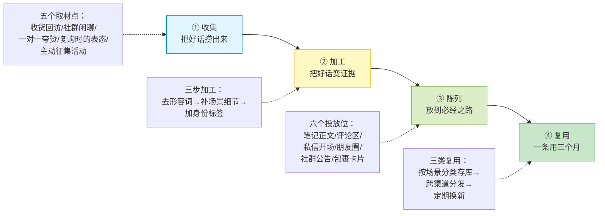
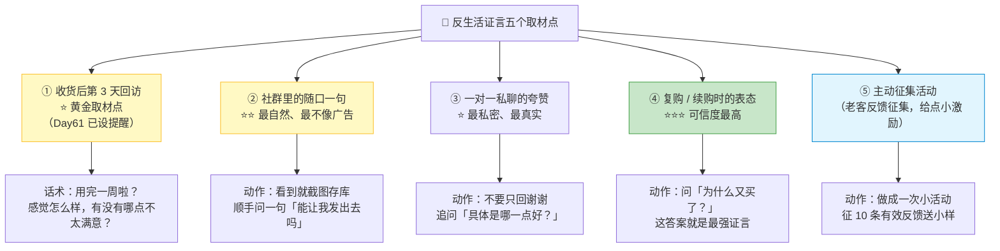
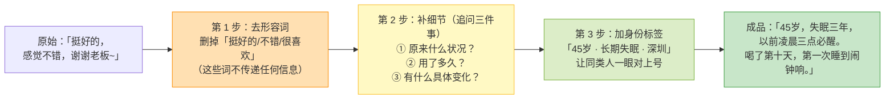
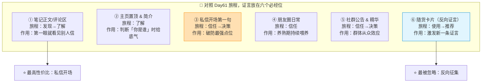

# Day62: 用户证言与社交证明体系——把「老客户说的一句话」变成能持续带货的资产，从征集、加工、陈列到复用，给「反生活」建一套让新客自己说服自己的证据链

> 📅 学习日期：2026-09-24
> 🔗 关联笔记：[[00-目录]] | 上一篇：[[Day61-用户旅程地图与全触点体验设计]] | 下一篇：Day63
> 🎯 适用场景：Day61 把「反生活」的用户旅程画成了六阶段地图，也把「推荐」这一段（第六阶段）第一次标了出来——**但老黄画完发现，那个格子里写的是「靠用户自觉」**。用户满意是有的，一句「东西不错」也是有的，**可这些「好话」全都散在聊天记录里、散在收货后的闲聊里、散在群里的随口一句里，从来没被当成资产收集起来过**。于是老黄陷入最憋屈的局面：**产品明明有人认，可每一个新客进来时，看到的依然只有老黄自己说「我家的东西好」——而「自己说自己好」几乎等于没说。** 这一篇装的就是那把「把别人的嘴借过来」的武器——**用户证言（Testimonial）+ 社交证明（Social Proof）体系**：**① 知道去哪征集（五个取材点）；② 知道怎么加工（把「挺好的」变成「能戳中新客的具体场景」）；③ 知道怎么陈列（六个投放位，从笔记到私信到包裹）；④ 知道怎么复用（一条证言用三个月、跨三个渠道）**。关键词：**你不是缺好话，你是缺一条把好话加工成证据的流水线。**

> 📚 学习来源：Day61 用户旅程（推荐段就是证言段）× Day19 用户心理（从众效应/社会认同）× Day45 复购唤醒（老客户是最佳取材源）× Day46 社群精细化运营（群里是天然素材矿）× Day27 转化文案（证言是最好的文案）× Day55 合规风控（证言不能碰疗效红线）× Day56 客户分层（不同层的证言可信度不同）× Day60 内容资产化（证言是一种可复利的内容资产）× Day52 导流话术（私信里用证言破防）× Day24 数据分析（哪条证言带来转化）

---

## 1. 一句话总结

**「用户证言体系」的本质，是老黄第一次意识到：自己说一百句「我家好」，不如一个陌生客户说一句「我用了三个月，睡眠确实稳了」。** 老黄现在的资产结构是**「我有产品、我有内容、我有几百个微信好友」**——**但这些都是「自说自话」的资产**；用户证言恰恰是**唯一一种「不是你说、是别人说」的资产**，而人天生不信卖家、只信买家（Day19 社会认同）。核心逻辑三步：**① 把「好话」从聊天记录里捞出来（收集）；② 把「挺好的」加工成「我是什么情况、用了多久、具体有什么变化」（加工）；③ 把它放到新客一定会经过的位置上，反复出现（陈列与复用）。** 一句最狠的总结：**好产品 + 零证言 = 一个陌生人的自证清白；好产品 + 成套证言 = 一群真实的人替你说话。中间隔的不是产品力，是一条「证言流水线」。**

**核心认知：** 大多数人把「客户好评」当成**「售后附属品」**——客户夸了就回个「谢谢亲爱的，爱你哟」，然后聊完就忘了。**证言体系恰好把它重新定义为「营销原材料」**——就像厨师不会把食材当剩菜倒掉，而是收进冷库、按需加工。背后是三条硬心理规律（Day19）：

**① 人信「和自己像的人」说的话，而不是信权威或卖家。** 一个 45 岁睡不好的女性说「我喝了两周睡得沉了」，比老黄写十篇成分科普都管用——**因为那不是「说服」，那是「共鸣」**。所以证言收集的第一原则是：**优先收集和「目标客户同画像」的人的证言**，而不是收集最会说话的人的证言。

**② 具体细节 = 可信度。** 「效果不错」的可信度是 1 分；「我原来凌晨三点必醒，喝完第十天第一次睡到闹钟响」的可信度是 8 分。**细节是可信度的货币**——时间、剂量、原来的具体状况、变化的具体场景，这些细节无法编造得很自然，所以大脑默认它是真的。**加工证言的核心动作，就是把「形容词」换成「场景」。**

**③ 证言的「数量感」也要被看见。** 一条证言只是「有人这么说」；「累计服务 800 位客户」「本周 37 条反馈」是**「很多人这么说」**——后者触发的是从众效应。**所以除了收集「质」（单条深度证言），还要收集「量」（累计反馈数、复购数、满意率），两条腿走路。**

**核心公式：** **证言说服力 = 相似度 × 具体度 × 数量感 ÷ 商业感。** **相似度**看证言里的人和看的人像不像（同年龄、同困扰、同城市最好）；**具体度**看有没有时间/场景/前后对比；**数量感**看有没有累计数字支撑；**商业感**是分母——**任何一处「像打广告」都会让证言瞬间失效**（过度修饰、整齐划一的句式、配图过于精修、附加了购买链接）。**老黄要做的不是「找好评」，是「把好评加工得不像广告、像闲话」。**

---

## 2. 核心框架

### 2.1 证言体系的「一条流水线」——从取材到复用的四个车间

证言不是一个动作，是一条流水线。**大多数人的问题不是「没材料」，是「四个车间只开了第一个（客户夸了看一眼）」**：

| 车间 | 老黄的现状（Day61 之前） | 应该怎么做 | 投入 |
|:----:|:----|:----|:----:|
| ① 收集 | 客户夸了，回个「谢谢」就没了 | 建「证言库」表格，随手存进飞书/Notion | 每天 3 分钟 |
| ② 加工 | 直接把原话截图发出去（还带聊天框） | 三改：去形容词、补细节、加身份 | 每条 5 分钟 |
| ③ 陈列 | 几乎不陈列，最多发一次朋友圈 | 六个位置轮着放，尤其是私信开场 | 一次性布局 |
| ④ 复用 | 发一次就沉了 | 分类入库、跨渠道重复用、季度更新 | 每周 10 分钟 |

> **【反生活可直接用】这条流水线的关键是「①收集」要变成肌肉记忆**——老黄每天都要跟客户聊天，**只要把「每次聊天结束前顺手复制一句好话存进表格」变成习惯，一个月就自动攒下 30 条原料**。原料够了，后面三个车间不愁没得做。

### 2.2 五个取材点——好话都在哪，为什么老黄一个都没捞

证言不是「等客户主动夸」，而是**在五个固定节点主动出击**。老黄现在的问题是五个点**一个都没设**：

| 取材点 | 为什么它有效 | 老黄现在的问题 | 一句话话术 |
|:----|:----|:----|:----|
| ① 收货 3 天回访 | 用户刚用上，体感最新鲜、最有话想说 | 没有这个动作，货发出去就断联 | 「用了几天啦？有哪个地方觉得不太顺？」 |
| ② 社群随口一句 | 群聊语境下说得最放松，像朋友聊天 | 群里有好话，没人截下来 | 「这句我能记下来吗？想给后面的人看看」 |
| ③ 一对一夸赞 | 私聊环境最真诚，没有表演成分 | 只回「谢谢」，错过深挖机会 | 「具体是哪一点最打动你？」 |
| ④ 复购表态 | **复购是「用脚投票」，可信度最高** | 复购了就当正常订单处理 | 「怎么又想到再买一份呀？」 |
| ⑤ 主动征集 | 一次活动批量产出 10+ 条原料 | 从没做过征集 | 「征集反馈，选 10 条送小样」 |

> **给「反生活」的关键：** **复购客户的证言是黄金，因为它同时包含「效果验证」和「再次选择」两重证据。** 一个客户说「我又买了一份」，本身就是最强的说服——**这句话比任何「效果好」都硬。所以每次有复购，第一件事不是打包发货，是问一句「怎么又想到再买一份呀？」** 这七个字的回答，就是下一篇笔记的正文素材。

### 2.3 三步加工法——把「挺好的」变成「能戳中人」的证言

**原始证言 90% 都不能直接用**（「挺好的」「不错」「很喜欢」= 零信息量）。加工不是编造，是**把客户没说出来的细节问出来、把顺序理顺、把商业痕迹去掉**：

**加工的四个「不能」（碰了证言就失效）：**

| 不能做的事 | 为什么 | 正确做法 |
|:----|:----|:----|
| ❌ 加疗效承诺 | 养生赛道红线（Day55） | 只说「感受/体感」，不说「治愈/根治」 |
| ❌ 编造细节 | 一旦被发现，全盘信任崩塌 | 细节一律追问真实客户补，采访出来的 |
| ❌ 让所有证言句式一样 | 「像广告」的最大特征就是整齐 | 保留口语、错别字、语气词（真实感来源） |
| ❌ 配精修图 + 购买链接 | 商业感拉满，说服力归零 | 用素人感的聊天截图 / 生活照 |

> **【反生活可直接用】** **最好用的证言形态是「聊天截图打码版」**——它天然带「素人感」，比任何精修海报都可信。**唯一的加工程序是：打马赛克头像昵称 + 用红框圈出关键词。** 不要抠图、不要加边框、不要配文案——**越像随手截的，越可信。**

### 2.4 六个投放位——证言该出现在哪，新客才会「恰好」看到

**证言收集了一堆不用，等于没收集。** 关键是**放在用户旅程中「他会犹豫」的那些位置**（Day61 的情绪低谷处）：

| 投放位 | 具体怎么放 | 优先级 |
|:----|:----|:----:|
| ① 笔记正文/评论区 | 正文里「很多姐妹反馈…（附截图）」；评论区自己补一条证言 | ⭐⭐⭐ |
| ② 主页置顶 | 置顶一篇「用户反馈合集」笔记 | ⭐⭐ |
| ③ **私信开场** | 加微第一句：「前几天有个和我情况差不多的姐姐说…」 | ⭐⭐⭐ |
| ④ 朋友圈 | 每周 1-2 条「客户反馈」内容，配聊天截图 | ⭐⭐⭐ |
| ⑤ 社群 | 定期把好评整理成「本周反馈」发群 + 存精华 | ⭐⭐ |
| ⑥ **随货卡片** | 卡片上写「用得好记得告诉我」，反向收集 | ⭐⭐⭐ |

> **【反生活可直接用】最高性价比的是「私信开场第三句」**——老黄加微后的黄金 5 分钟（Day61）里，**中间插入一条「相似情况客户的真实反馈」截图，比任何自我介绍都有效**。用户的犹豫是「会不会没用」，**而一条同龄同困扰的证言，就是对这个犹豫最直接的回答。**

---

## 3. 可落地方法

### 3.1 建立「反生活证言库 v1」（今天 40 分钟建好，之后每天 3 分钟）

用飞书/Notion 建一张表，6 列：

| 列名 | 填写说明 |
|:----|:----|
| 客户标签 | 年龄 + 困扰 + 城市（如「45岁·失眠·深圳」） |
| 原始证言 | 客户原话（一字不改，保留语气词） |
| 加工后证言 | 三步加工后的成品 |
| 可用位置 | 笔记/私信/朋友圈/社群/卡片（可多选） |
| 是否有截图 | ✅/❌（有截图的优先级更高） |
| 已用日期 | 记录每次投放时间，避免重复撞车 |

**操作顺序：** ① 先花 20 分钟翻一遍最近 30 天的聊天记录，能捞多少捞多少（今天的目标是先攒 10 条）；② 再花 20 分钟把其中 3 条做「三步加工」，做出 3 个成品；③ **之后每天聊天结束时，顺手复制一句好话丢进表里，3 分钟。** 一个月后，表里会有 40-50 条原料——**这就是老黄的第一份「别人替我说话」的资产。**

### 3.2 「复购 + 收货 3 天」双节点话术模板（直接抄）

**节点 A：收货后第 3 天（配合 Day61 的自动提醒）**
> 「姐姐，用了两三天啦？**有哪个地方觉得不太顺、或者没达到预期，你直接说哈**，我这边好调整～」

**为什么这句有效：** 它先问「不满意的地方」——**这是一个「反常规」的开场，会让人放松警惕，说出更真实的评价。** 而真实评价里，90% 会包含「但是其实挺好的」+ 具体好在哪里——**这就拿到了证言素材**（不是靠索取，是靠「允许他吐槽」换来的）。

**节点 B：客户复购时（下单后立刻发）**
> 「呀，又买了一份～**好好奇，是之前那份快用完了，还是家里人一起喝？**」

**为什么这句有效：** 它不是在「要好评」，是在「好奇他的生活」。**客户的回答里往往包含「上次那盒喝完确实睡得沉了些，这次给我妈也带一份」——这句话同时是证言 + 转介绍信号，一条顶三条。**

### 3.3 「证言投放」的每周节奏（每周 30 分钟，写进 SOP）

| 时间 | 动作 | 用时 |
|:----|:----|:----:|
| 每周一 | 从证言库挑 2 条，发朋友圈（配聊天截图） | 10 分钟 |
| 每周三 | 挑 1 条，整理成「本周客户反馈」发社群 + 存精华 | 10 分钟 |
| 每周五 | 更新私信开场话术里的证言截图（换一条新的） | 5 分钟 |
| 每周日 | 检查证言库：本周新增几条？哪些还没用？ | 5 分钟 |

> **记住原则：证言不是「发一次就完」的消耗品，是「可以重复用」的资产——但重复用要换人对、换场景。** 同一条证言，对「失眠困扰」的新客说一次、在朋友圈发一次、在群里发一次，**是三次不同的触达，不是三次骚扰**。

### 3.4 工具清单（全部零成本或极低成本）

| 用途 | 工具 | 成本 |
|:----|:----|:----|
| 证言库 | 飞书多维表格 / Notion | 免费 |
| 截图打码 | 微信自带马赛克 / 手机相册标记 | 免费 |
| 私信开场模板 | 微信「收藏」置顶 | 免费 |
| 随货卡片 | 空白卡片 + 手写（Day61 已备） | 约 0.2 元/张 |
| 定时提醒 | 手机日历循环提醒 | 免费 |
| 反馈征集活动 | 微信群公告 + 小样 | 一次性小样成本 |

---

## 4. 变现路径

### 4.1 证言体系怎么变成钱——四个直接杠杆

**杠杆① 私信开场转化率提升（最直接）**：现在加微后 30 天内首单率 10-20%（Day61）；**私信开场插入一条相似客户证言截图，首单率可提到 25-35%**——因为犹豫的点被直接回答了。按每天 10 人加微算，**月增首单 15-45 单，月增收 +1500-4000 元**。

**杠杆② 新客客单价与小单转化（犹豫期的放大器）**：证言最能撬动的是「第一次只敢买小份」的客户——**看到别人用了三个月有变化，会直接从体验装升级到季度装**。客单价提升 20-30%，**月增收 +800-2000 元**。

**杠杆③ 内容转化率提升（笔记端）**：带真实反馈的笔记比纯科普笔记转化率**高 1.5-3 倍**（用户在自己找「还有人买吗」的答案）。把证言素材做成笔记，**每月多 3-5 篇高转化内容**，月增收 +1000-2500 元。

**杠杆④ 转介绍（Day61 最后一格，现在还是 0）**：证言征集活动本身就在「制造转介绍氛围」——**参与过反馈的客户，被公开感谢过，转介绍意愿显著提高**（5-10% → 8-15%）。月增收 +500-1500 元。

| 优化项 | 投入 | 增收估算 | 见效周期 |
|:----|:----|:----|:----:|
| 私信开场加证言截图 | 一次性改话术 + 每次 1 分钟 | +1500-4000 元/月 | **1-2 周** |
| 收货 3 天 + 复购双节点征集 | 每天 5 分钟 | +800-2000 元/月 | 2-4 周 |
| 证言素材做成笔记 | 每周 1 小时 | +1000-2500 元/月 | 1-2 个月 |
| 反馈征集活动 | 一次性 + 小样成本 | +500-1500 元/月 | 1-2 个月 |
| **合计（3 个月后）** | **每天约 10 分钟** | **+3800-10000 元/月** | — |

### 4.2 收入结构对比（承接 Day61 的账本）

| 项目 | 现状（无证言体系） | 6 个月后（证言体系跑起来） |
|:----|:----|:----|
| 月加微人数 | 150-300（不变） | 150-300（不变） |
| 首单率（30天） | 10-20% | 25-35% |
| 月首单数 | 15-60 | 40-100 |
| 客单价（假设） | 80-150 元 | 100-190 元（小单升大单） |
| 复购率（90天） | 15-25% | 25-35% |
| 转介绍率 | ≈0 | 8-15% |
| **月收入估算** | **8000-14000 元**（Day61 优化后） | **12000-22000 元** |

> 给「反生活」的一句话账本：**证言体系最反常识的地方是——它几乎不产生新流量，却能把已有流量的转化率翻一倍。** Day59 解决了「流量入口变多」，Day61 解决了「路上别漏人」，**而这一篇解决的是「拦住每一个犹豫的人」——犹豫是所有客户共有的动作，而证言是唯一能直接回答犹豫的东西。** 每天 10 分钟（回访 + 存库），换来的是「同样一批人进来，成交人数多一倍」。**这是全链路里投入产出比最高的动作之一。**

---

## 5. 行动清单

### ✅ 行动①：建「反生活证言库 v1」并捞满 10 条原料（今天做，40 分钟）

**步骤1(20分钟):** 飞书/Notion 建 6 列表（见 3.1），命名「反生活 · 客户证言库」。
**步骤2(15分钟):** 翻最近 30 天聊天记录，复制 10 条客户原话（一字不改，包括「挺好的」这种），按客户标签分类填进表里。
**步骤3(5分钟):** 把表格链接收藏到微信「收藏」置顶，方便随时打开。

> **产出：** ✅ 一张有 10 条原料的证言库 + 一个随手可开的位置 —— **这 10 条里大概率有 6-7 条是「挺好的」这种零信息量的，但没关系——它们是「待加工的矿石」，不是废料。**

### ✅ 行动②：把 3 条原料加工成成品，并改掉私信开场话术（今天做，40 分钟）

**步骤1(20分钟):** 从库里挑 3 个最有代表性的客户（最好涵盖 3 类不同困扰），按 2.3 三步加工法做出 3 条成品证言；给有聊天记录的做打码截图。
**步骤2(10分钟):** 打开微信「收藏」，改写加微开场话术——**在自我介绍后插入一条相似客户证言截图**（用 3.2 的模板）。
**步骤3(10分钟):** 把「收货后第 3 天回访话术」和「复购时追问话术」（3.2 的两个模板）分别存进微信收藏 + 设置好 Day61 已建的日历提醒。

> **产出：** ✅ 3 条成品证言 + 一条已升级的私信开场话术 + 两个征集话术模板 —— **私信开场这一步今天就生效：下一个加微的人，看到的第三句话就是「别人已经验证过这件事」了。**

### ✅ 行动③：设计一次「老客反馈征集」活动 + 建立每周投放节奏（今天做，30 分钟 + 每周做）

**步骤1(15分钟):** 写一条征集活动公告（参考：「最近想整理一份真实反馈给新来的姐妹看，**认真用过的老客户帮我写两句真实的感受**，选 10 条送一份小样/一份小礼物」）——**注意：不能说「写好评」，要说「写真实感受」，允许吐槽的内容反而更真、更可信**。
**步骤2(10分钟):** 把 3.3 的每周投放节奏（周一朋友圈/周三社群/周五私信/周日检查）写进每周 SOP（接 Day49/Day58），并设日历循环提醒。
**步骤3(5分钟):** 微信群 + 朋友圈各发一次征集公告，开始收原料。

> **产出：** ✅ 一次已启动的征集活动 + 写进 SOP 的每周投放节奏 + 收原料的通道 —— **从今天起，「帮助客户说出好话」变成一件被设计过的、每周都在自动发生的事。** 记住核心：**产品好是「你自己知道」，证言体系是「让还没买的人也知道」——两者之间差的不是运气，是一条流水线。**

---

## 📊 今日学习总结

| 维度 | 内容 |
|:----:|------|
| 核心认知 | 自说自话≈没说，只有「别人说」才构成证据；人信「和自己像的人」说的话；具体细节是可信度的货币；「数量感」触发从众效应；证言是最典型的「可复利内容资产」；商业感是说服力的分母，越像广告越失效；复购客户的证言可信度最高（同时验证效果与再选择） |
| 核心框架 | 证言流水线四车间（收集→加工→陈列→复用）× 五个取材点（收货3天/社群/私聊/复购/征集）× 三步加工法（去形容词→补细节→加身份）× 六个投放位（笔记/主页/私信/朋友圈/社群/包裹卡片）× 每周投放节奏 |
| 关键技能 | 建证言库（6列 飞书/Notion）、聊天里捞原料、三步加工把「挺好的」变成「凌晨三点必醒→第十天睡到闹钟响」、打码截图保持素人感、私信开场第三句插证言、复购时追问「怎么又想到再买一份」、征集活动允许吐槽换真实 |
| 变现路径 | 私信开场转化率 10-20%→25-35%（+1500-4000元/月，1-2周见效）、客单价 +20-30%（+800-2000元/月）、证言笔记转化率 1.5-3倍（+1000-2500元/月）、转介绍 0→8-15%（+500-1500元/月）；合计每天 10 分钟；6 个月后 8000-14000 → **12000-22000 元** |
| 今日行动 | ① 40 分钟建证言库 + 捞 10 条原料 ② 40 分钟加工 3 条成品 + 改私信开场话术 + 存两个征集模板 ③ 30 分钟发起老客反馈征集活动 + 每周投放节奏写进 SOP |

> 下一篇预告：**Day63: 客户共创与产品迭代——把老客户的反馈从「营销素材」再往前推一步，变成「产品改进的依据」，让客户从「买你的人」升级成「一起做产品的人」。**（承接 Day62 的证言库——证言库不只是文案素材库，更是「用户需求的公开数据库」；把里面的抱怨与期待翻译成产品迭代方向，既做出更对的产品，也做出更深的拥护者。）

---

## 📌 关联笔记一览

| 关联主题 | 笔记链接 |
|:----|:----|
| 目录/进度 | [[00-目录]] |
| 上一篇(用户旅程地图与全触点体验设计) | [[Day61-用户旅程地图与全触点体验设计]] |
| 用户心理与行为设计(社会认同/从众效应来源) | [[Day19-用户心理与行为设计]] |
| 私域成交后客户关系经营与复购唤醒(证言最佳取材源) | [[Day45-私域成交后客户关系经营与复购唤醒]] |
| 私域社群精细化运营(群里是天然素材矿) | [[Day46-私域社群精细化运营]] |
| 自媒体转化文案写作(证言是最好的文案) | [[Day27-自媒体转化文案写作]] |
| 私域内容合规与信任风险防控(证言不能碰疗效红线) | [[Day55-私域内容合规与信任风险防控]] |
| 私域客户分层与精细化运营(不同层证言可信度不同) | [[Day56-私域客户分层与精细化运营]] |
| 内容资产化与复利经营(证言是可复利资产) | [[Day60-内容资产化与复利经营]] |
| 小红书私域导流话术全栈实战(私信里用证言破防) | [[Day52-小红书私域导流话术全栈实战]] |
| 内容数据分析与迭代优化(哪条证言带转化) | [[Day24-内容数据分析与迭代优化]] |
| 私域成交标准作业流程(SOP)(投放节奏写进SOP) | [[Day49-私域成交标准作业流程SOP]] |
| 私域精细化运营的自动化与工具化(提醒与批量工具) | [[Day58-私域精细化运营的自动化与工具化]] |

> 🔗 反生活适用标注：本篇整套「证言流水线 + 五个取材点 + 三步加工 + 六个投放位」围绕「反生活」**养生垂类「效果靠体感、说服靠同类、复购靠信任」的属性**设计——养生品的效果是「感受型」而非「数据型」，**所以同类人的一句体感描述，比任何检测报告都更能打动人**；同时严格遵守 Day55 合规红线（只说感受、不说疗效，不碰「治愈/根治/绝对化」）。可直接套用，**优先启动「私信开场第三句 + 收货 3 天回访」这两个点位**，因为它们同时踩在旅程的两个低谷上，投入最小、见效最快。
