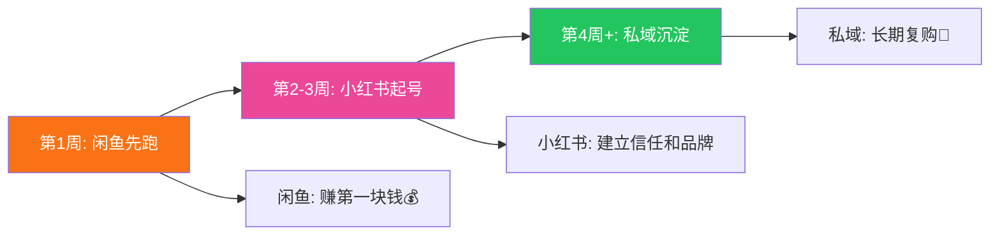
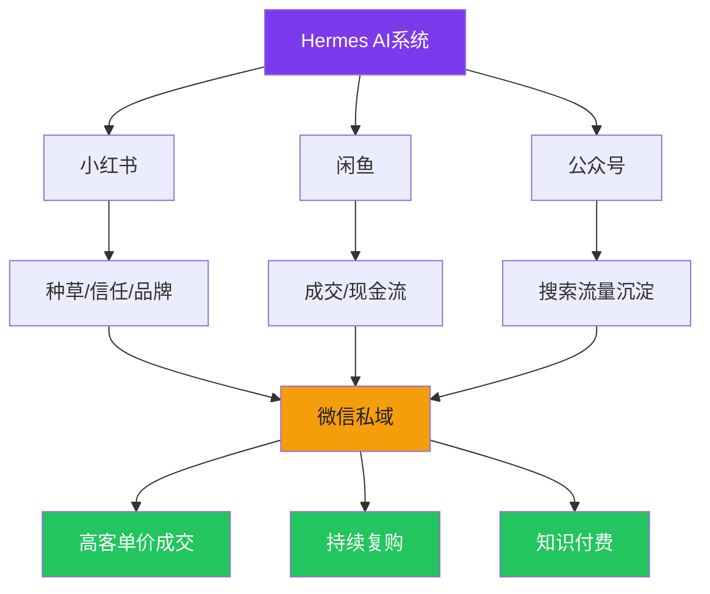

# 📕 Day9: 闲鱼+小红书联动变现闭环

> **核心：打通小红书种草→闲鱼成交→私域复购的完整赚钱系统**
> 来源：前面8天知识的整合应用

---

## 一、为什么是闲鱼+小红书？

```
小红书 = 信任+种草+品牌（慢但值钱）
闲鱼   = 成交+现金流+测试（快但便宜）
私域   = 复购+高客单+长期价值
```

### 三个平台的时间线



---

## 二、老黄的完整赚钱路线图

### 阶段1：闲鱼先跑（前2周）

```
目标：赚到第一块钱，验证选品

Day 1-3：
  □ 开通闲鱼+养号
  □ 选品（推荐：虚拟资料+充电器）
  □ 上架3-5个商品
  
Day 4-7：
  □ 每天擦亮+上1-2个新品
  □ 优化标题和图片
  □ 目标：出第1单
  
Week 2：
  □ 确定1-2个爆品
  □ 每天出2-3单
  □ 月入500-1000元
```

### 阶段2：小红书种草（2-4周）

```
目标：反生活账号稳定出内容，同时做闲鱼引流

  □ 反生活每周3-5篇（已经建立了）
  □ 在内容里自然植入"好物推荐"
    例："这个水质检测笔才29块钱，自己测比听人忽悠强"
  □ 在闲鱼挂同款商品
  □ 小红书→闲鱼→成交
```

### 阶段3：私域沉淀（1-2月）

```
目标：把闲鱼客户变成微信好友

  □ 每个包裹放卡片引导加微信
  □ 微信发"避坑小技巧"（价值输出）
  □ 定期团购/福利
  □ 客单价从30元→300元
```

---

## 三、反生活爆款→闲鱼商品转化表

| 小红书选题 | 闲鱼商品 | 进货价 | 售价 | 利润 |
|:----------|:---------|:------:|:----:|:----:|
| 净水器是智商税？ | 水质检测笔 | 15元 | 29元 | 14元 |
| XX养生茶骗局 | 反生活辟谣手册（电子） | 0元 | 9.9元 | 9.9元 |
| 充电器伤电池？ | 20W快充头 | 12元 | 35元 | 23元 |
| 面膜成分揭秘 | 化妆品成分速查表（电子） | 0元 | 4.9元 | 4.9元 |
| 空气炸锅致癌？ | 空气炸锅专用纸 | 5元 | 19.9元 | 14.9元 |

---

## 四、从0到月入5000的具体操作

### Week 1-2：闲鱼冷启动
```
投入时间：30分钟/天
操作：
  - 选品+上架（5-10个品）
  - 每天擦亮
  - 回复咨询
  
收入：0-500元
```

### Week 3-4：小红书+闲鱼联动
```
投入时间：1小时/天（内容30分+闲鱼30分）
操作：
  - 小红书正常发内容
  - 在合适的内容中植入商品
  - 闲鱼同步上架相关商品
  
收入：500-2000元
```

### Month 2：私域启动
```
投入时间：1.5小时/天
操作：
  - 包裹卡引导加微信
  - 微信朋友圈运营
  - 闲鱼+小红书持续运营
  
收入：2000-5000元
```

---

## 五、老黄的最大优势

### 自动化能力 = 碾压普通人

| 能力 | 普通人 | 老黄 |
|:----:|:------:|:----:|
| 内容生成 | 手动写 | **AI原创+自动化** |
| 上架商品 | 一个个手动 | **可以批量** |
| 数据分析 | 凭感觉 | **数据驱动** |
| 多平台运营 | 忙不过来 | **Cron自动调度** |

### 老黄可以自动化的环节
```
1. 内容生成 → 文案+配图（已有）
2. 闲鱼上架 → 可以写脚本批量上架
3. 闲鱼回复 → 自动回复模板
4. 发货通知 → 自动发送
5. 数据统计 → 自动汇总
```

---

## 六、汇总：老黄的赚钱系统



---

## 七、行动清单

```
□ 1. 开通闲鱼+养号（今天就能做）
□ 2. 选1个品上架（建议：充电器或虚拟资料）
□ 3. 第1单后→包裹卡引导加微信
□ 4. 小红书内容里自然植入商品
□ 5. 30天后复盘：哪个平台赚了多少
```

### 提醒
> **OPC极简创业原则：1闭环>点子，手工阶段不能跳**
> 先手工跑通闲鱼1单→再自动化
> 先手工跑通小红书→闲鱼引流→再自动化

---

> **关联**：所有Day1-8笔记 → 这是整合应用篇
